# 075：phpMyAdmin安装与安全配置 🛠️

在本节课中，我们将学习如何安装和配置phpMyAdmin，这是一个广泛使用的MySQL/MariaDB数据库Web管理工具。我们还将探讨如何增强其安全性，以保护你的数据库服务器免受未经授权的访问。

## 概述

phpMyAdmin是一个基于Web的服务器端工具，用于管理MySQL或MariaDB数据库。与MySQL Workbench这类桌面应用不同，它通过浏览器提供图形化管理界面。由于其运行在服务器上并通过网络访问，因此安全性配置至关重要。

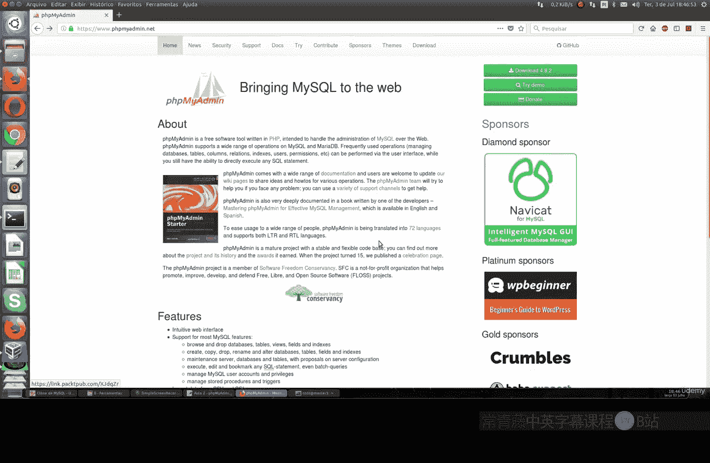

## 安装phpMyAdmin

上一节我们介绍了命令行工具，本节中我们来看看如何通过包管理器安装phpMyAdmin。以下是在Ubuntu系统上的安装步骤。

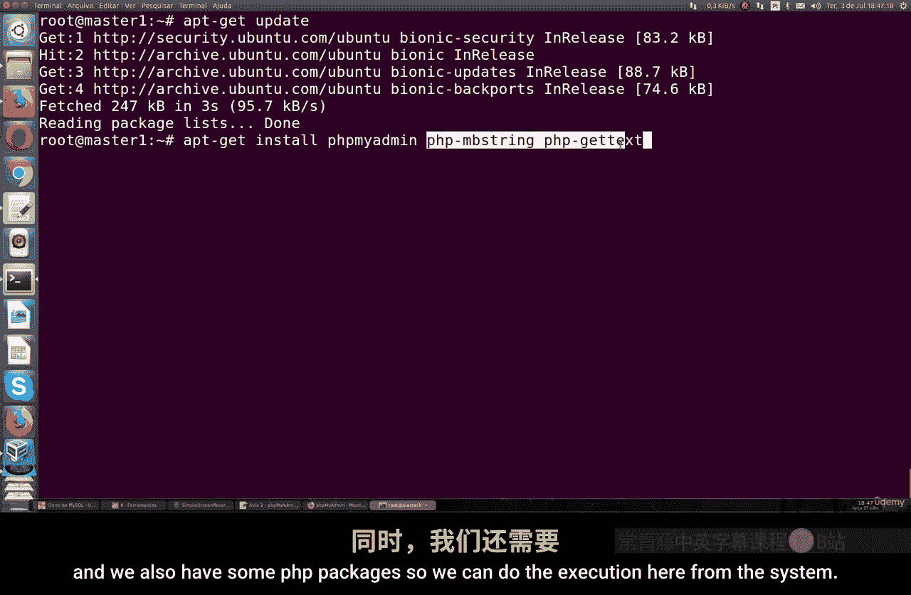

首先，更新你的系统包列表：

```bash
sudo apt update
```

然后，安装phpMyAdmin及其所需的PHP包：

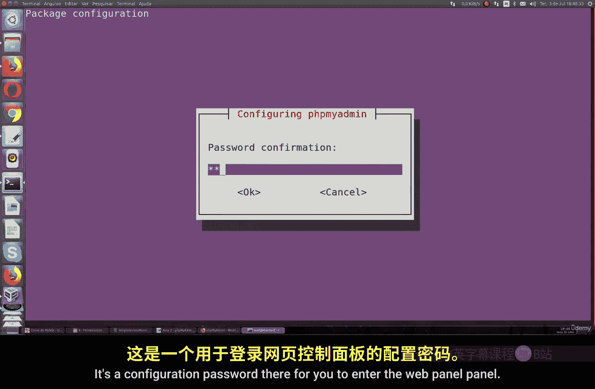

```bash
sudo apt install phpmyadmin
```

安装过程中，系统会提示你选择Web服务器。请选择 **Apache**（按空格键选中，然后按回车确认）。

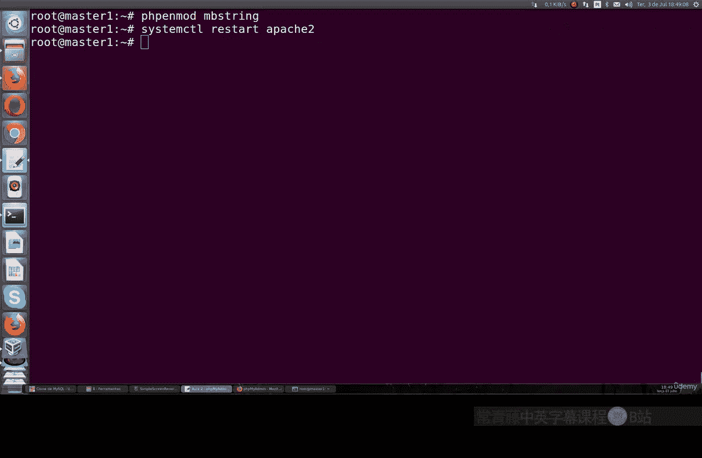

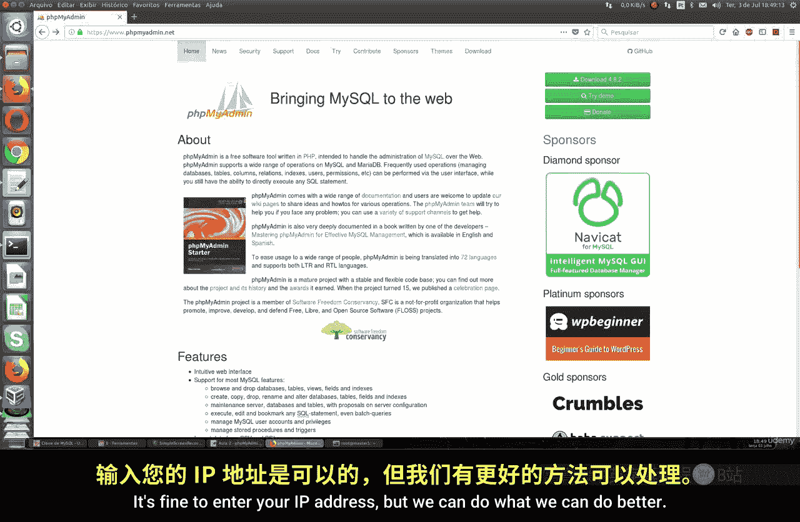

接下来，系统会询问是否要使用`dbconfig-common`来配置数据库。选择 **是**。

随后，你需要为phpMyAdmin设置一个管理员密码。请记住这个密码，它用于登录Web管理面板。

安装完成后，需要启用必要的PHP扩展并重启Apache服务：

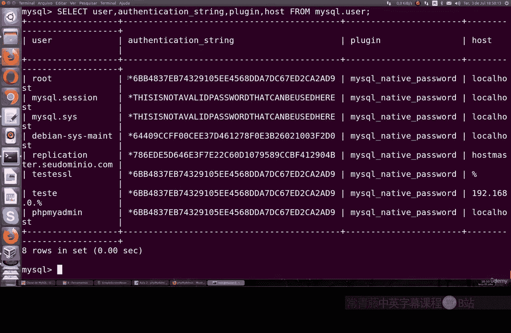

```bash
sudo phpenmod mbstring
sudo systemctl restart apache2
```

## 配置MySQL用户认证

默认情况下，MySQL的root用户可能没有设置密码认证。为了安全地使用phpMyAdmin，我们需要配置它。

首先，登录MySQL命令行：

```bash
sudo mysql
```

在MySQL提示符下，为root用户设置密码（请将`your_password`替换为你自己的强密码）：

```sql
ALTER USER 'root'@'localhost' IDENTIFIED WITH mysql_native_password BY 'your_password';
FLUSH PRIVILEGES;
```

然后，你可以验证用户认证字符串是否已更新：

```sql
SELECT user, authentication_string, plugin, host FROM mysql.user;
```

完成后，输入 `exit;` 退出MySQL命令行。

## 访问phpMyAdmin面板

现在，你可以在浏览器中访问phpMyAdmin。在地址栏输入你的服务器IP地址，后跟 `/phpmyadmin`。

例如：
```
http://你的服务器IP地址/phpmyadmin
```

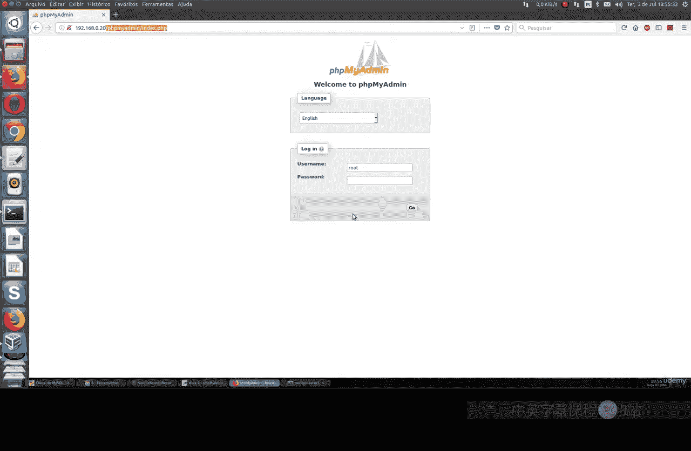

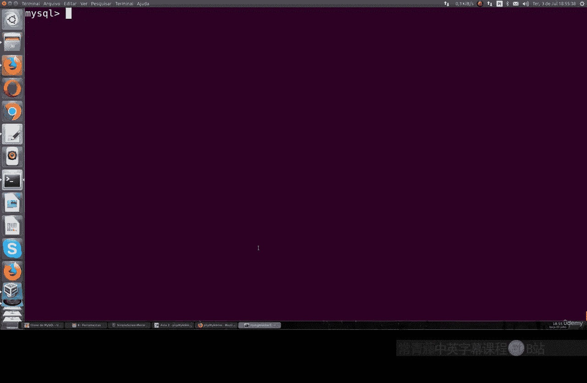

使用你刚刚设置的 **root** 用户名和密码登录。

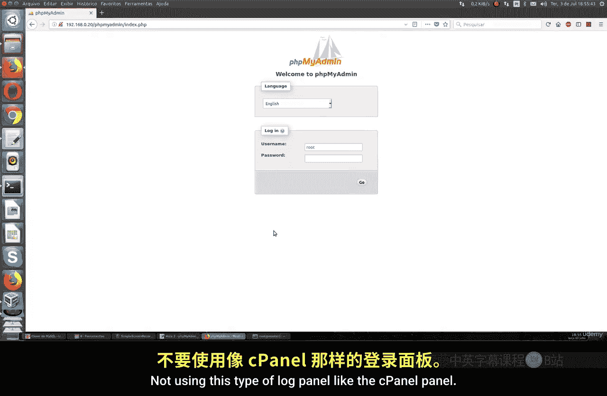

登录后，你将看到phpMyAdmin的Web管理面板。这里你可以：
*   查看和管理数据库。
*   执行SQL查询。
*   监控服务器状态（连接数、流量等）。
*   管理用户账户和权限。
*   导入和导出数据。

## 增强phpMyAdmin安全性 🔒

由于phpMyAdmin是一个公开的Web入口，它常常成为攻击目标。仅依赖其自身的登录页面并不安全。我们可以通过配置Apache的认证层来增加一道安全防线，实现双重认证。

以下是增强安全性的步骤：

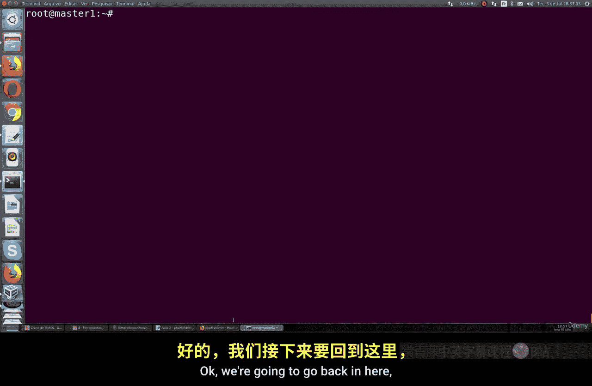

1.  启用Apache的`.htaccess`文件覆盖功能。编辑Apache配置文件（通常是`/etc/apache2/apache2.conf`或相关站点配置文件），找到对应phpMyAdmin目录的`<Directory>`区块，确保包含以下指令：
    ```
    AllowOverride All
    ```
2.  保存文件并重启Apache服务：
    ```bash
    sudo systemctl restart apache2
    ```
3.  在phpMyAdmin的安装目录（例如`/usr/share/phpmyadmin`）下，创建或编辑一个名为`.htaccess`的文件。
4.  在`.htaccess`文件中添加以下内容，要求进行HTTP基本认证：
    ```
    AuthType Basic
    AuthName "Restricted Access"
    AuthUserFile /etc/phpmyadmin/.htpasswd
    Require valid-user
    ```
5.  使用`htpasswd`工具创建认证文件并添加用户（将`username`替换为你想要的用户名）：
    ```bash
    sudo htpasswd -c /etc/phpmyadmin/.htpasswd username
    ```
    系统会提示你输入并确认该用户的密码。
6.  现在，当你再次访问phpMyAdmin的URL时，浏览器会首先弹出一个HTTP基本认证对话框。只有输入了正确的`.htpasswd`文件中的用户名和密码后，才会显示phpMyAdmin自身的登录页面。

通过这种方式，你为phpMyAdmin增加了**双重认证**：第一层是Apache的HTTP认证，第二层是phpMyAdmin的数据库用户认证，这极大地提升了安全性。

## 总结

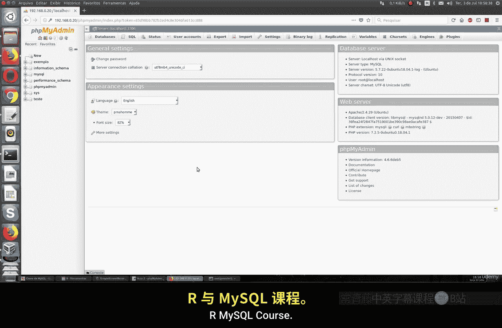

本节课中我们一起学习了phpMyAdmin的安装、基本配置以及至关重要的安全加固步骤。你学会了如何在Ubuntu上安装phpMyAdmin，配置MySQL用户密码，并通过Apache的`.htaccess`和`.htpasswd`机制为其添加额外的认证层，以有效保护你的数据库管理界面。请务必保持phpMyAdmin及其运行环境（如PHP、Apache）的更新，并遵循最小权限原则来管理用户账户。