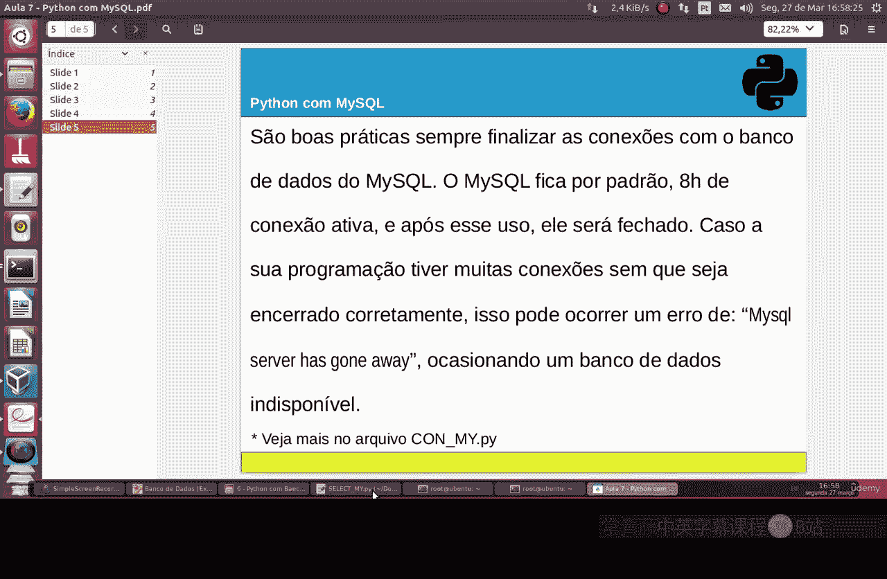
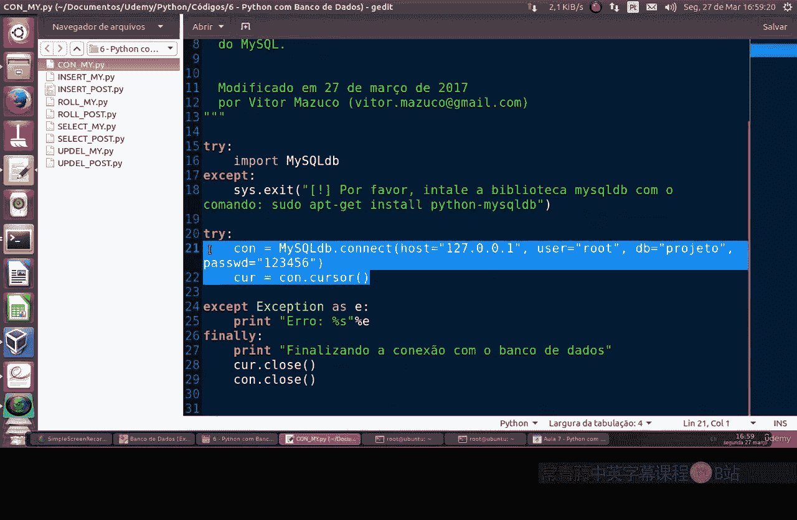
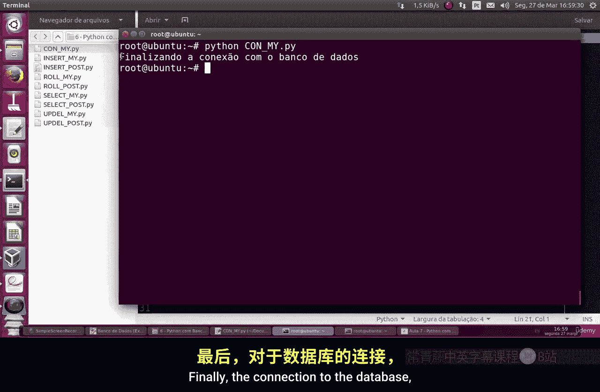
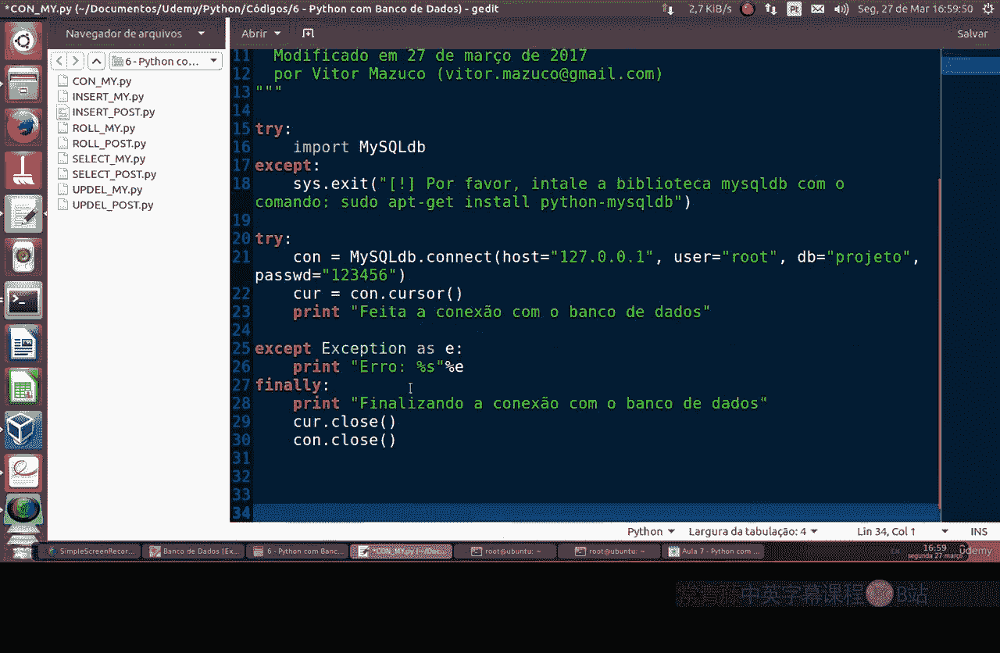

# 076：Python与MySQL连接 🐍🔗🗄️

在本节课中，我们将学习如何在Python中安装并使用`MySQLdb`模块来连接和操作MySQL数据库。我们将从模块的安装开始，逐步讲解如何建立数据库连接、执行测试，并养成良好的连接管理习惯。

## 概述
我们将首先介绍如何安装必要的Python模块，然后详细说明建立数据库连接的步骤，并通过一个简单的测试脚本来验证连接是否成功。最后，我们会强调正确关闭数据库连接的重要性。

---

## 安装MySQLdb模块

上一节我们介绍了命令行基础，本节中我们来看看如何为Python安装MySQL支持模块。

首先，你需要使用系统包管理器来安装`python-mysqldb`模块。这是一个外部库，默认并未包含在Python的标准库中。

**核心概念：安装命令**
```bash
sudo apt-get install python-mysqldb
```
请注意，不推荐使用`pip`直接安装此模块，因为它依赖于一些系统级的库和依赖项，使用包管理器可以确保这些依赖被正确安装。

---

## 建立数据库连接

成功安装模块后，下一步就是在Python脚本中建立与MySQL数据库的连接。

其基本流程与连接PostgreSQL类似：首先导入模块，然后提供数据库的主机IP、数据库名称、用户名和密码等信息来创建连接。

以下是建立连接的基本代码结构：
```python
import MySQLdb

connection = MySQLdb.connect(
    host='localhost',
    user='root',
    passwd='your_password',
    db='database_name'
)
```



---

## 重要实践：管理数据库连接

在编写Python脚本时，一个良好的实践是每次操作后都显式地终止与MySQL数据库的连接。

**原因如下：**
默认情况下，MySQL服务器会保持连接一段时间（如8小时）。如果脚本结束后不主动关闭连接，或者有大量连接未正确关闭，可能会导致MySQL服务出错，从而使数据库变得不稳定。

因此，我们应在脚本中确保连接被正确关闭。

---

## 创建连接测试脚本



为了确保一切配置正确，我们先创建一个简单的测试脚本。

让我们使用`nano`编辑器创建一个新文件，并将其命名为`connection_test.py`，以便明确这是一个连接测试。

以下是测试脚本的内容：
```python
import MySQLdb



try:
    # 尝试建立数据库连接
    connection = MySQLdb.connect(
        host='localhost',
        user='root',
        passwd='your_password',
        db='your_database'
    )
    print("数据库连接成功！")
    
    # 可以在这里执行一些简单的查询，例如：
    cursor = connection.cursor()
    cursor.execute("SELECT VERSION()")
    data = cursor.fetchone()
    print(f"数据库版本: {data[0]}")
    
    cursor.close()
    
except MySQLdb.Error as e:
    print(f"连接数据库时发生错误: {e}")
    
finally:
    # 确保连接被关闭
    if connection:
        connection.close()
        print("数据库连接已关闭。")
```

运行此脚本以测试连接：
```bash
python connection_test.py
```
如果看到“数据库连接成功！”和数据库版本信息，则说明连接参数配置正确。



---

## 总结

本节课中我们一起学习了如何在Python环境中连接MySQL数据库。

1.  **安装模块**：我们使用系统包管理器安装了`MySQLdb`模块。
2.  **建立连接**：我们学习了导入模块并使用正确的参数（主机、用户、密码、数据库名）来建立连接。
3.  **良好实践**：我们强调了在脚本结束时主动关闭数据库连接的重要性，以避免服务不稳定。
4.  **连接测试**：我们编写并运行了一个测试脚本，以验证数据库连接是否成功建立。


现在，你已经掌握了使用Python连接MySQL数据库的基础。在接下来的学习中，我们将在此基础上，学习如何执行查询、插入、更新和删除等数据库操作。