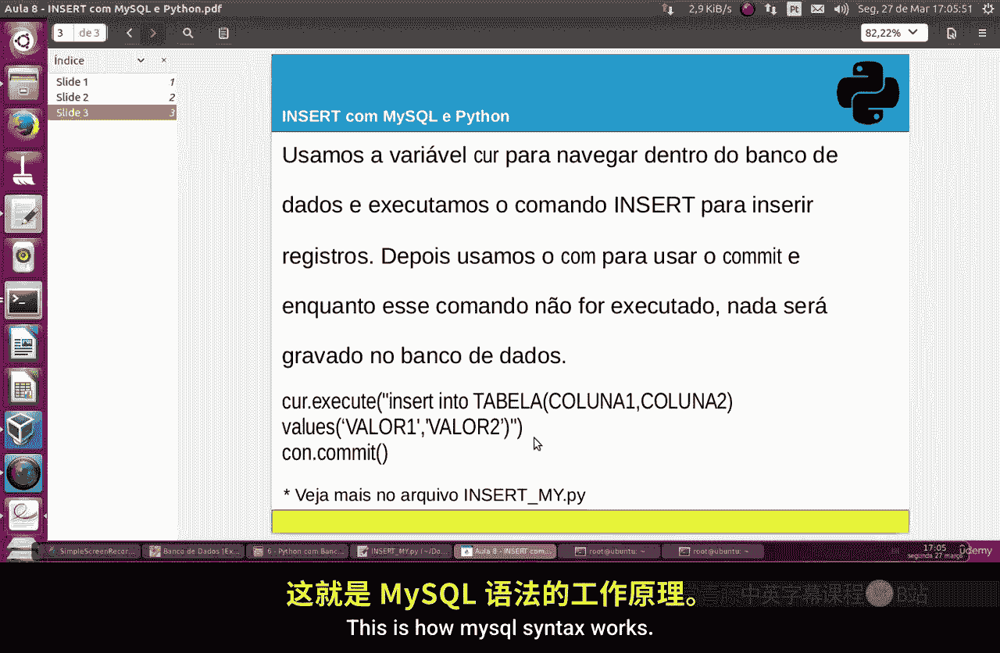
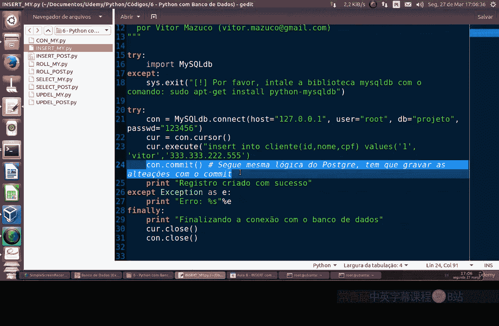
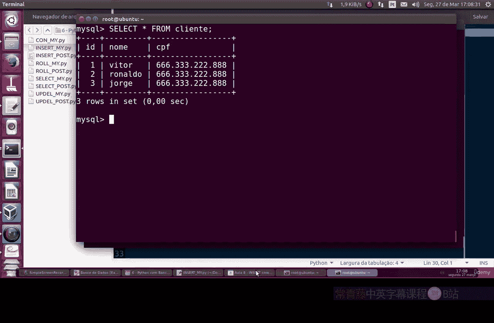

# 077：使用Python向MySQL数据库插入数据

在本节课中，我们将学习如何使用Python编程语言向MySQL数据库执行`INSERT`操作，以添加新的数据记录。我们将重点介绍执行插入操作的关键步骤，特别是提交更改的重要性。

## 概述

上一节我们介绍了数据库连接的基础知识，本节中我们来看看如何向已连接的MySQL数据库表中插入新的数据行。核心操作是使用`INSERT` SQL语句，并通过Python的数据库连接对象执行它。

## 插入数据的基本语法

在MySQL中，向表中插入数据的基本语法与PostgreSQL类似。其通用格式如下：

```sql
INSERT INTO table_name (column1, column2, column3, ...)
VALUES (value1, value2, value3, ...);
```



你需要指定目标表名、要插入数据的列名，以及对应列的值。

## 使用Python执行插入操作

以下是使用Python执行插入操作的完整流程和关键步骤。整个过程涉及建立连接、执行SQL命令、提交更改以及关闭连接。

### 关键步骤详解

以下是执行插入操作时必须遵循的几个关键步骤：

1.  **建立数据库连接**：首先，使用合适的库（如`mysql-connector-python`或`pymysql`）创建与MySQL数据库的连接。
2.  **创建游标对象**：通过连接对象创建一个游标，用于执行SQL语句。
3.  **编写并执行INSERT语句**：使用游标的`.execute()`方法运行你的`INSERT INTO ... VALUES ...` SQL命令。
4.  **提交更改**：这是至关重要的一步。执行插入命令后，必须调用连接对象的`.commit()`方法。**如果不提交，所有更改都不会被永久保存到数据库中。**
5.  **关闭连接**：操作完成后，依次关闭游标和数据库连接以释放资源。



### 代码示例分析

让我们通过一个具体的代码文件（例如 `insert_mysql.py`）来理解这个过程。假设我们有一个名为 `client` 的表，包含 `id`（主键）、`name` 和 `cpf` 三个字段。

```python
# 示例代码结构
import mysql.connector

# 1. 建立连接
connection = mysql.connector.connect(host='localhost', database='your_database', user='your_user', password='your_password')
cursor = connection.cursor()

# 2. 编写并执行INSERT语句
insert_query = "INSERT INTO client (id, name, cpf) VALUES (%s, %s, %s)"
record_to_insert = (1, 'João', '123.456.789-00')
cursor.execute(insert_query, record_to_insert)

# 3. 提交更改
connection.commit()
print("记录插入成功。")

# 4. 关闭连接
cursor.close()
connection.close()
```

在这段代码中，我们插入了ID为1、姓名为“João”、CPF为“123.456.789-00”的客户记录。执行`connection.commit()`后，这条记录就被永久保存了。

## 验证插入结果

为了确认数据是否成功插入，我们可以在MySQL命令行客户端或另一个Python脚本中执行查询。

1.  插入前，查询`client`表是空的。
2.  运行上述Python插入脚本。
3.  插入后，再次执行`SELECT * FROM client;`查询。此时，你应该能看到新插入的记录（例如，ID: 1, Name: João）。
4.  你可以重复执行插入操作（使用不同的ID和值，如ID: 2, Name: Maria），每次提交后，数据都会被保存，并通过`SELECT`查询得到验证。

## 总结



本节课中我们一起学习了如何使用Python向MySQL数据库插入数据。核心要点是：首先掌握`INSERT INTO`语句的基本语法；其次，在Python程序中，执行插入操作后**必须调用`connection.commit()`**来提交事务，否则数据不会保存；最后，通过`SELECT`查询可以验证插入操作的成功与否。这个过程与操作PostgreSQL数据库的逻辑是一致的，掌握了它就掌握了向数据库添加数据的基础方法。