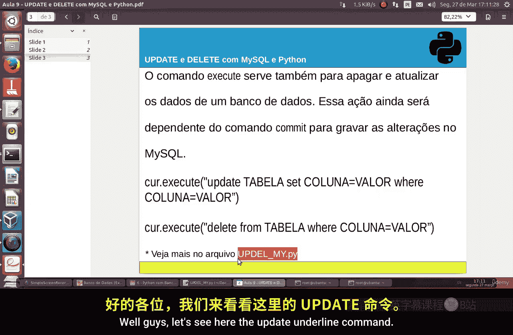
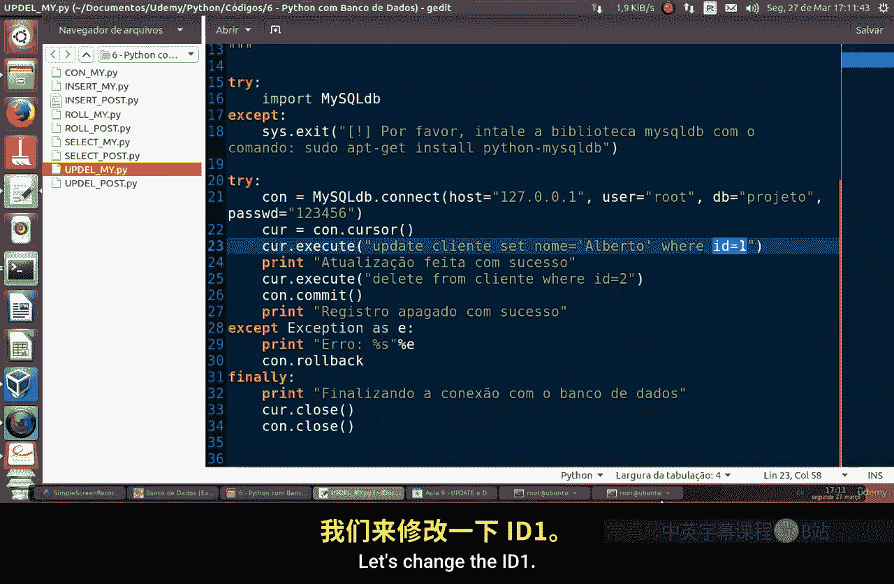
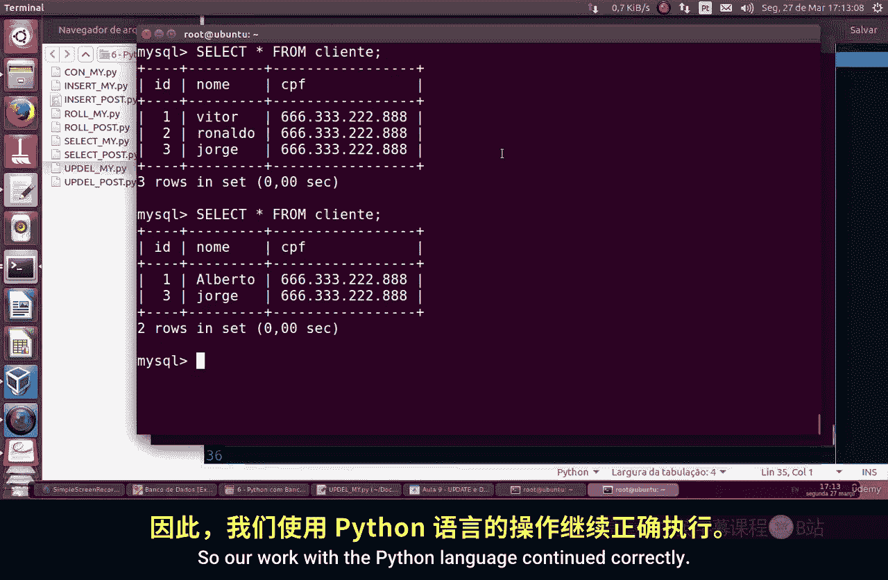
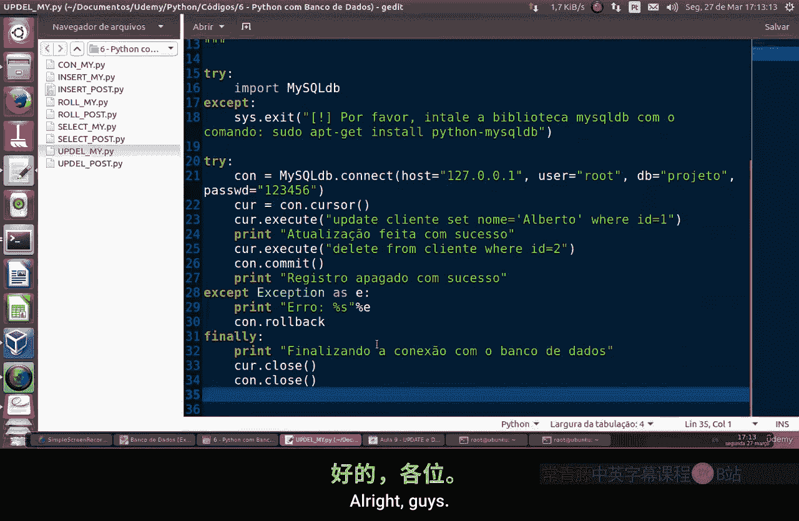

Linux命令行基础：Part2：使用MySQL与Python进行UPDATE与DELETE操作 🛠️

在本节课中，我们将学习如何使用MySQL的UPDATE和DELETE命令，并通过Python脚本执行这些操作来修改和删除数据库中的数据。

上一节我们介绍了如何连接数据库并执行查询。本节中，我们来看看如何更新和删除数据记录。

### UPDATE命令

UPDATE命令用于修改表中现有的记录。其基本语法结构如下：

```sql
UPDATE table_name
SET column1 = value1, column2 = value2, ...
WHERE condition;
```

以下是使用UPDATE命令的关键步骤：
1.  指定要更新的表名。
2.  使用`SET`子句设定要修改的列及其新值。
3.  使用`WHERE`子句精确指定要更新哪些行。通常通过主键（如ID）来定位。

### DELETE命令

DELETE命令用于从表中删除记录。其基本语法结构如下：

```sql
DELETE FROM table_name WHERE condition;
```

以下是使用DELETE命令的要点：
1.  指定要从哪个表删除数据。
2.  使用`WHERE`子句指定删除条件。如果不使用`WHERE`，将删除表中的所有行。



### 通过Python执行操作

我们将通过一个Python脚本演示上述操作。假设我们有一个名为`customers`的表，包含`ID`和`Name`两列。

首先，我们需要建立数据库连接。



```python
import mysql.connector

# 建立数据库连接
mydb = mysql.connector.connect(
  host="localhost",
  user="yourusername",
  password="yourpassword",
  database="mydatabase"
)
mycursor = mydb.cursor()
```

**1. 执行UPDATE操作**

我们的目标是：将`ID`为1的客户姓名从“Vitor”更新为“Alberto”。

```python
# SQL更新语句
sql = "UPDATE customers SET name = 'Alberto' WHERE id = 1"
mycursor.execute(sql)
mydb.commit()
print(mycursor.rowcount, "条记录被更新。")
```

**2. 执行DELETE操作**

我们的目标是：删除`ID`为2的客户记录（假设其姓名为“Rinaldo”）。

```python
# SQL删除语句
sql = "DELETE FROM customers WHERE id = 2"
mycursor.execute(sql)
mydb.commit()
print(mycursor.rowcount, "条记录被删除。")
```

操作执行后，我们可以查询表来验证更改。

```python
# 验证更改
mycursor.execute("SELECT * FROM customers")
myresult = mycursor.fetchall()
for row in myresult:
  print(row)
```

查询结果将显示，`ID`为1的客户姓名已变为“Alberto”，而`ID`为2的记录已不存在。

### 操作验证与总结



执行脚本后，终端会输出更新和删除成功的提示。通过最后的查询，可以直观地确认`ID`为1的记录姓名已更改，`ID`为2的记录已被删除。



本节课中我们一起学习了MySQL中两个重要的数据操作命令：UPDATE和DELETE。我们掌握了它们的基本语法，并通过Python脚本实践了如何连接数据库、执行更新与删除操作，最后验证了操作结果。记住，在执行UPDATE和DELETE时，务必谨慎使用`WHERE`条件，以确保只修改或删除目标数据。