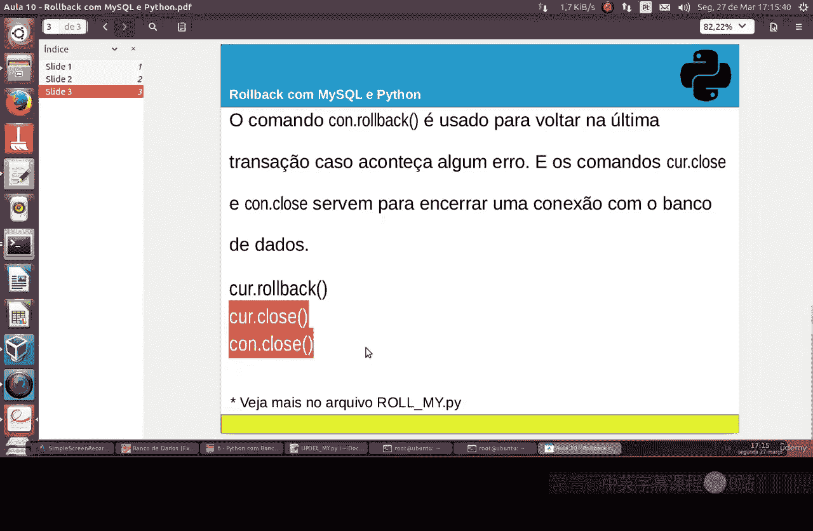
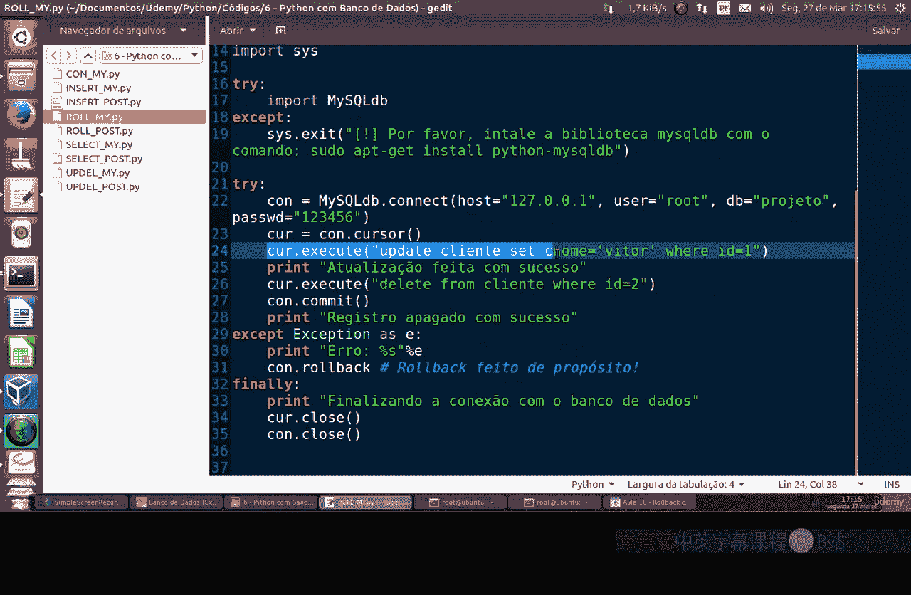
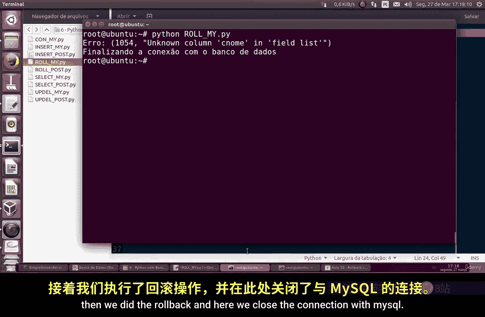

# 079：使用MySQL与Python进行回滚 🔄

在本节课中，我们将学习MySQL数据库操作中的一个重要概念——**回滚**。我们将通过一个Python脚本示例，演示如何在数据库操作出错时，使用`ROLLBACK`命令撤销所有未提交的更改，从而保证数据的一致性。

上一节我们介绍了基本的数据库连接与操作，本节中我们来看看如何安全地处理操作中的错误。

---

## 什么是回滚命令？

`ROLLBACK`命令类似于我们在之前课程中使用的`COMMIT`命令。在MySQL中，强烈建议你在数据库事务中使用它。

如果在最后一次数据库事务中发生错误，无论是删除、移除还是更改数据，使用回滚命令都至关重要。**回滚**意味着“返回”，它会取消所有尝试在数据库上执行的操作。



因此，你可以在错误处理中使用`ROLLBACK`，然后关闭数据库连接。

---



## 示例脚本解析

以下是我们的Python脚本示例，它故意引发一个错误来演示回滚的用途。

```python
# 假设这是脚本的一部分，我们尝试执行一个更新操作
try:
    # 这里我们故意写错列名
    cursor.execute("UPDATE table_name SET surname = 'NewName' WHERE id = 1;")
    connection.commit()
except Exception as e:
    print(f"发生错误: {e}")
    connection.rollback()  # 执行回滚
finally:
    connection.close()  # 关闭连接
```

在这个脚本中，我们故意在`UPDATE`语句中使用了一个不存在的列名`surname`（正确的列名是`name`）。这将导致MySQL抛出一个错误。

我们的目的就是让这个错误发生，从而触发`rollback`命令的执行。我们希望这些因错误而无法成功执行的更改不被应用到数据库。

当错误被捕获后，脚本会打印出具体的错误信息，然后有目的地执行`rollback`命令。最后，脚本结束与数据库的连接。

---

## 运行脚本与结果

让我们运行这个脚本。使用命令`python script_name.py`执行后，会看到类似以下的错误输出：

```
发生错误: (1054, "Unknown column 'surname' in 'field list'")
```

错误明确指出“未知的列'surname'”，因为它不存在。这是一个我们故意制造的错误。

由于执行了回滚，那个错误的`UPDATE`操作所做的任何更改都不会被保存到数据库中。最后，脚本关闭了数据库连接。

---

## 核心要点总结



以下是使用回滚时的关键实践：

*   **始终使用异常处理**：当操作数据库时，总是将你的代码包裹在`try...except`块中。
*   **在异常中执行回滚**：一旦捕获到错误，立即调用`connection.rollback()`来撤销当前事务中的所有操作。
*   **明确错误来源**：打印或记录错误信息，这能帮助你快速定位和修复问题。

---

本节课中我们一起学习了`ROLLBACK`命令在MySQL事务中的重要性。通过一个故意制造错误的Python示例，我们看到了当数据库操作失败时，回滚如何保护数据不被部分或错误的更改所破坏。记住，在处理数据库时，结合使用事务、提交和回滚，是确保数据完整性和操作安全性的最佳实践。