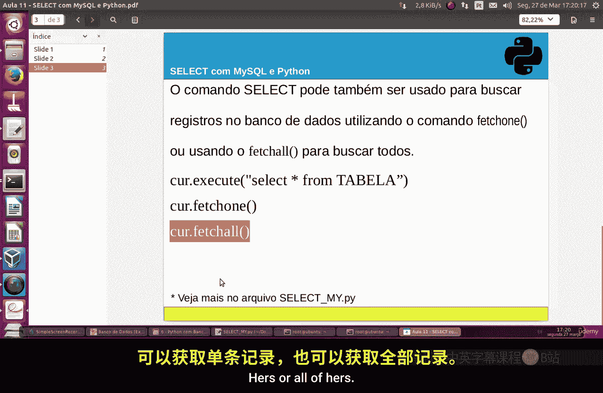
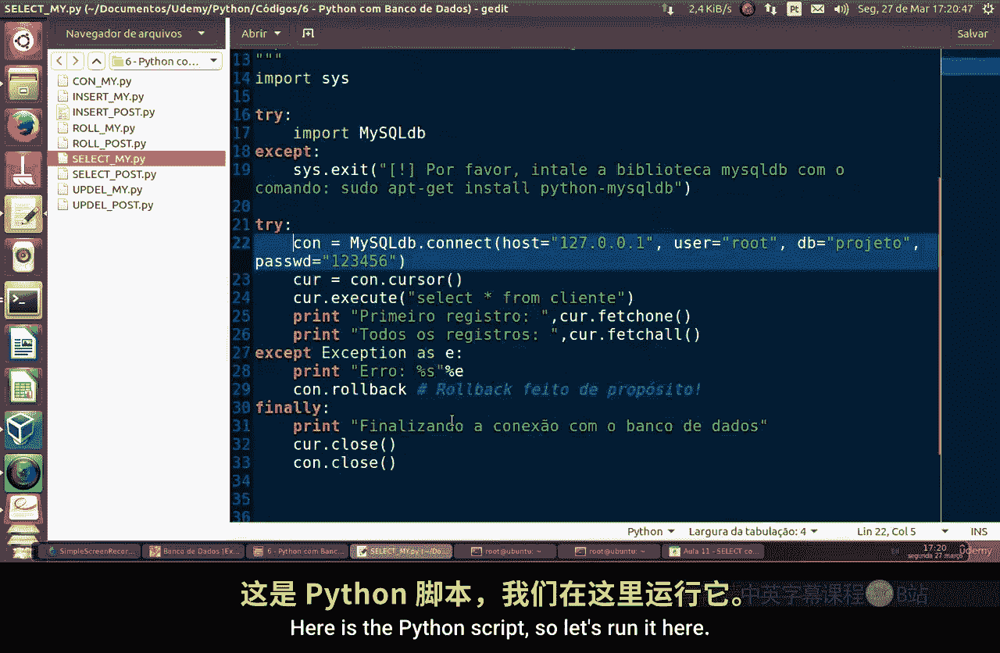
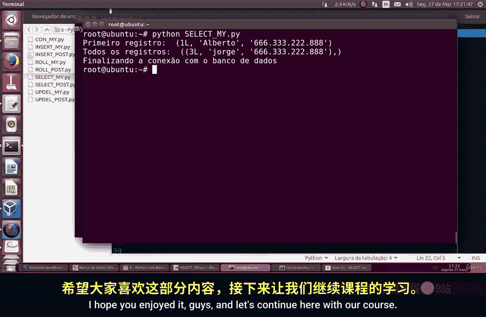

# 080：使用Python与MySQL进行SELECT查询

在本节课中，我们将学习如何使用Python连接MySQL数据库，并执行`SELECT`命令来检索数据。我们将重点介绍`fetchone()`和`fetchall()`这两个方法，它们分别用于获取查询结果中的第一条记录和所有记录。

上一节我们介绍了数据库连接的基础知识，本节中我们来看看如何执行查询并获取数据。

## 核心概念与命令

在Python中，与MySQL数据库交互主要使用`mysql-connector-python`库。执行`SELECT`查询后，我们可以通过游标（cursor）对象的两个方法来获取结果：

*   **`fetchone()`**：获取结果集中的**下一行**记录，通常用于获取第一条记录或逐行处理。
*   **`fetchall()`**：获取结果集中的**所有**行记录。

以下是查询的基本代码结构：
```python
import mysql.connector

# 1. 建立数据库连接
connection = mysql.connector.connect(
    host="your_host",
    user="your_user",
    password="your_password",
    database="your_database"
)



# 2. 创建游标对象
cursor = connection.cursor()

# 3. 执行SELECT查询
cursor.execute("SELECT * FROM Cliente")

# 4. 使用fetchone()获取第一条记录
first_record = cursor.fetchone()
print("第一条记录:", first_record)

# 5. 使用fetchall()获取所有记录
all_records = cursor.fetchall()
print("所有记录:")
for record in all_records:
    print(record)

# 6. 关闭游标和连接
cursor.close()
connection.close()
```



## 操作步骤详解

以下是使用Python脚本执行SELECT查询的具体步骤。

1.  **编写Python脚本**：创建一个名为`select.py`的文件，并写入上述代码。请确保将连接参数（主机、用户名、密码、数据库名）替换为你自己的数据库信息。
2.  **执行脚本**：在命令行中，导航到脚本所在目录，并运行命令`python select.py`。
3.  **查看结果**：脚本将首先打印出查询结果中的第一条记录，然后打印出表中的所有记录。


运行脚本后，你将在终端看到类似的输出。它会先显示`fetchone()`获取的单条记录，然后显示`fetchall()`获取的全部记录列表。


为了验证Python脚本的输出，我们可以直接在MySQL命令行客户端中执行相同的SQL查询。运行命令`SELECT * FROM Cliente;`，你将看到与Python脚本中`fetchall()`方法返回结果一致的所有数据记录。




本节课中我们一起学习了如何使用Python对MySQL数据库执行`SELECT`查询。我们掌握了`fetchone()`和`fetchall()`这两个关键方法的使用场景与区别，这是每一位开发者（Dev）都需要了解的数据库操作基础。理解如何连接数据库、执行查询并处理结果是进行更高级数据操作的前提。在未来的课程中，我们将在此基础上探讨更复杂的数据操作和管理主题。