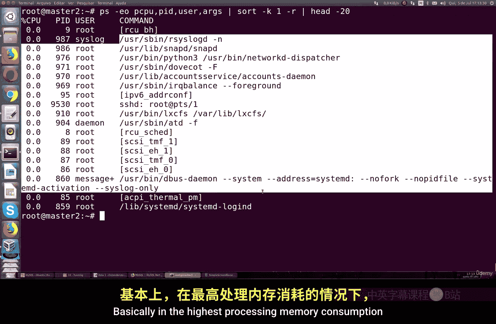
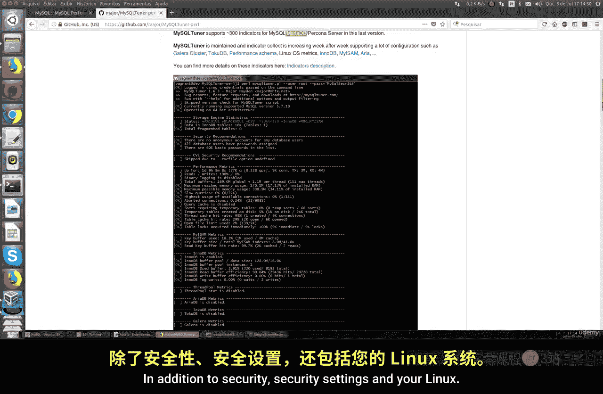
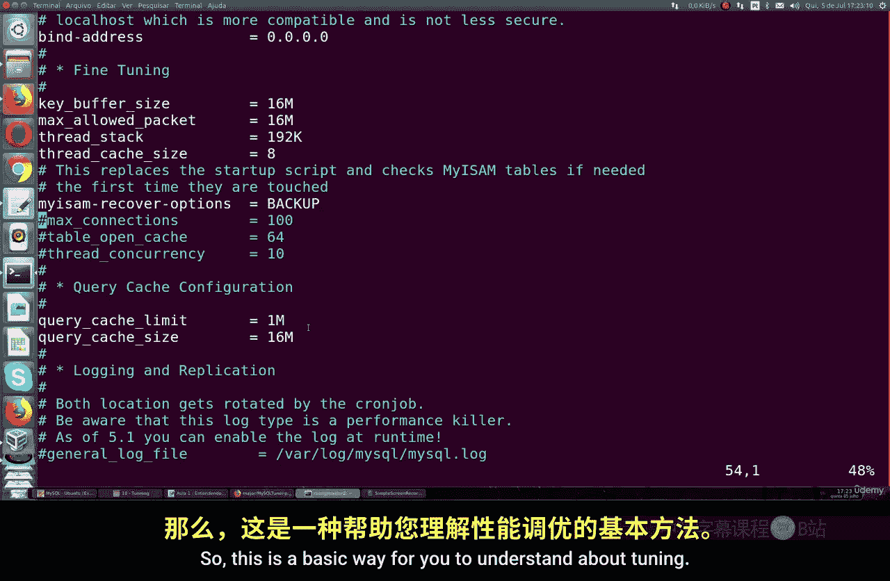
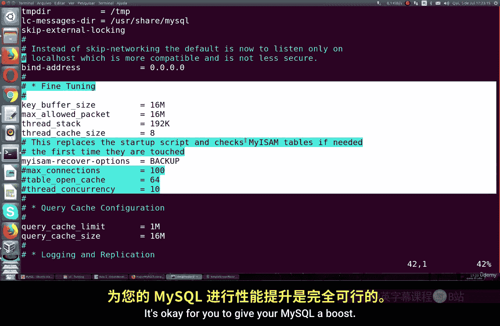
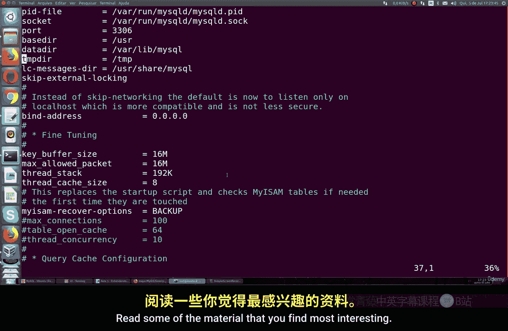

# 081：理解MySQL调优最佳实践 🚀

在本节课中，我们将要学习MySQL数据库的性能调优。调优的目的是提升数据库性能，避免在高负载应用场景下出现速度减慢的问题。这通常需要对MySQL的配置进行调整，例如增加连接数等。这些调整主要取决于服务器的内存、处理能力，以及该服务器是专用于数据库还是与其他进程共享资源。因此，你需要根据所使用的机器来决定是否需要对数据库进行重新配置。

## 调优前的资源检查 🔍

在开始进行任何更新之前，最好先检查当前系统的运行资源。一个非常简单的方法是使用`echo`命令来查看处理器的类型。接着，我们可以从内存类型开始，即检查MySQL消耗的处理能力和内存。




以下是检查MySQL内存消耗的命令示例：
```bash
echo "检查MySQL内存消耗的命令"
```
运行后，你可能会看到类似“20%内存消耗”的输出。这表明MySQL当前消耗了20%的内存。我们还可以查看其他系统进程，如Apache，但通常MySQL是消耗资源最多的。

同样，我们也需要检查处理能力。以下是查看MySQL处理能力消耗的命令：
```bash
echo "检查MySQL处理能力消耗的命令"
```
如果结果显示消耗不高，甚至没有出现在高处理内存消耗的列表中，那说明问题可能更多地与RAM内存消耗有关。

## 使用调优工具进行诊断 🛠️



在进行调优之前，我们可以使用一些工具来辅助诊断。例如，MySQL官方网站提供了多种关于调优的案例和链接，特别是MySQL 8版本在性能和调优方面有许多改进。

另一个非常有趣的工具是**MySQL Tner Pier**，这是一个在GitHub上的系统。它是一个优秀的工具，可以快速诊断你的数据库，并且同样适用于MariaDB。此外，它还能检测Linux的性能和数据库的安全性。

如果你想测试这个工具，可以在Linux上运行以下命令：
```bash
curl -s https://raw.githubusercontent.com/major/MySQLTuner-perl/master/mysqltuner.pl | perl
```
该工具会执行一个完整的检查，包括你的所有设置、运行的系统类型、MySQL版本、日志文件状态以及引擎的内存状态等。例如，它可能会显示InnoDB表的大小、是否存在碎片表，以及安全建议。

工具还会提供性能指标测试，如物理内存、MySQL最大内存、处理类型、缓冲区缓存等。如果发现任何警告，比如缓冲区使用率接近上限，你就需要根据建议进行调整。

## 调整MySQL配置文件 ⚙️

要更改或查看你的调优设置，需要访问MySQL的配置文件（通常是`my.cnf`或`my.ini`）。在安装MySQL后，你可以在默认文件中找到这些设置。在MySQL 8中，有一个专门的调优部分。

以下是一些关键参数及其作用：

1.  **缓冲区大小（Buffer Size）**：这决定了MySQL使用的内存量。增加此值可以显著提升数据库速度，前提是你有足够的空闲内存。例如，如果你的机器有2GB内存，最多可以使用其中的70%进行配置。
    ```ini
    innodb_buffer_pool_size = 1G
    ```

2.  **最大数据包大小（Max Packet Size）**：这定义了可以处理的单个SQL语句的最大大小。如果你在日志中看到数据包大小超限的错误，就需要增加这个值。
    ```ini
    max_allowed_packet = 64M
    ```

3.  **线程堆栈大小（Thread Stack）**：这是每个线程的堆栈大小。通常默认值足够，但如果日志中出现相关错误，则需要增加。
    ```ini
    thread_stack = 256K
    ```

4.  **线程缓存大小（Thread Cache Size）**：这影响了处理新连接的能力。如果数据库每分钟要处理成百上千的连接，就需要增加这个值。你可以通过以下命令查看当前连接数：
    ```sql
    SHOW STATUS LIKE 'Threads_connected';
    ```
    然后在配置文件中调整：
    ```ini
    thread_cache_size = 100
    ```

5.  **最大连接数（Max Connections）**：这设置了允许的同时连接数（注意，不是网站的同时在线用户数，而是同时发起请求的数量）。你需要根据预期的并发请求量来调整。
    ```ini
    max_connections = 200
    ```

6.  **表打开缓存（Table Open Cache）**：这个值需要根据当前使用情况来维持。你可以通过以下命令查看当前状态：
    ```sql
    SHOW STATUS LIKE 'Open_tables';
    ```
    如果需要，在配置文件中增加：
    ```ini
    table_open_cache = 2000
    ```

## 调优的基本原则与总结 📝





MySQL调优的基本方式是理解这些参数并根据你的服务器资源进行调整。一个重要的原则是，最多可以将约70%的RAM分配给MySQL。超过这个比例，可能会开始影响Linux系统上的其他进程，即使这台服务器是专用于数据库的。

本节课中我们一起学习了MySQL性能调优的基础知识。我们首先了解了为何需要进行调优以及调优前如何检查系统资源。接着，我们介绍了一个实用的诊断工具MySQL Tner Pier来快速评估数据库状态。最后，我们详细讲解了几个关键的MySQL配置参数，如缓冲区大小、连接设置等，并学会了如何根据实际情况调整它们。




我建议你阅读MySQL官方网站上关于调优的更多资料，特别是针对你所使用的版本。通过合理的配置，你可以有效地提升数据库的性能，确保应用在高负载下依然运行流畅。