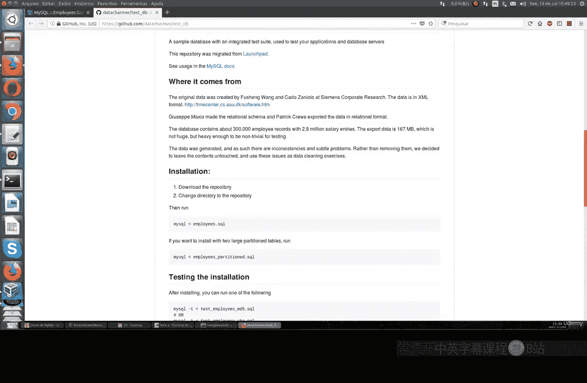
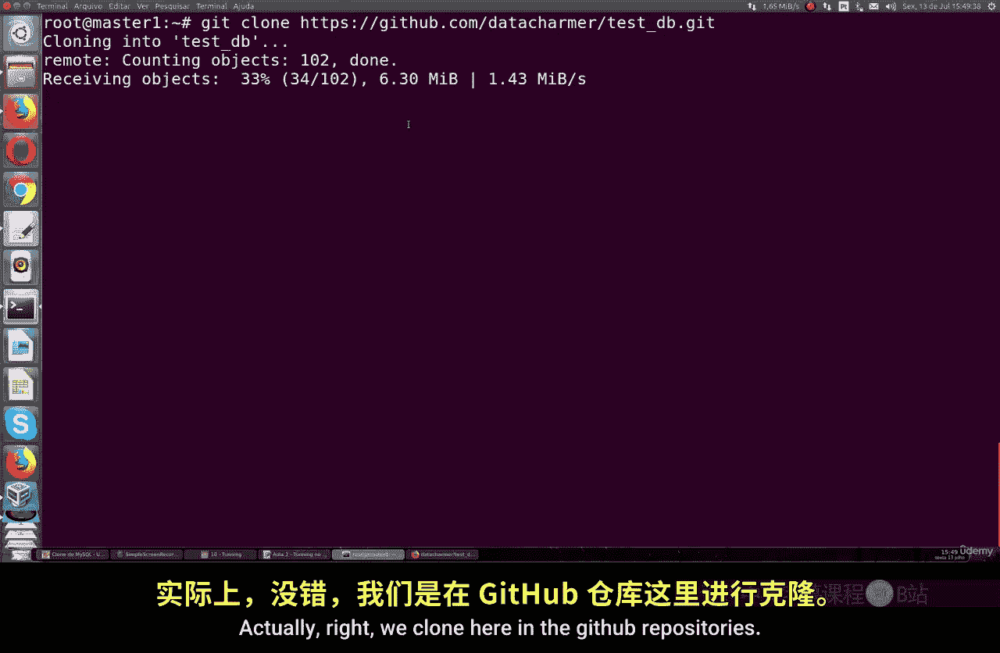
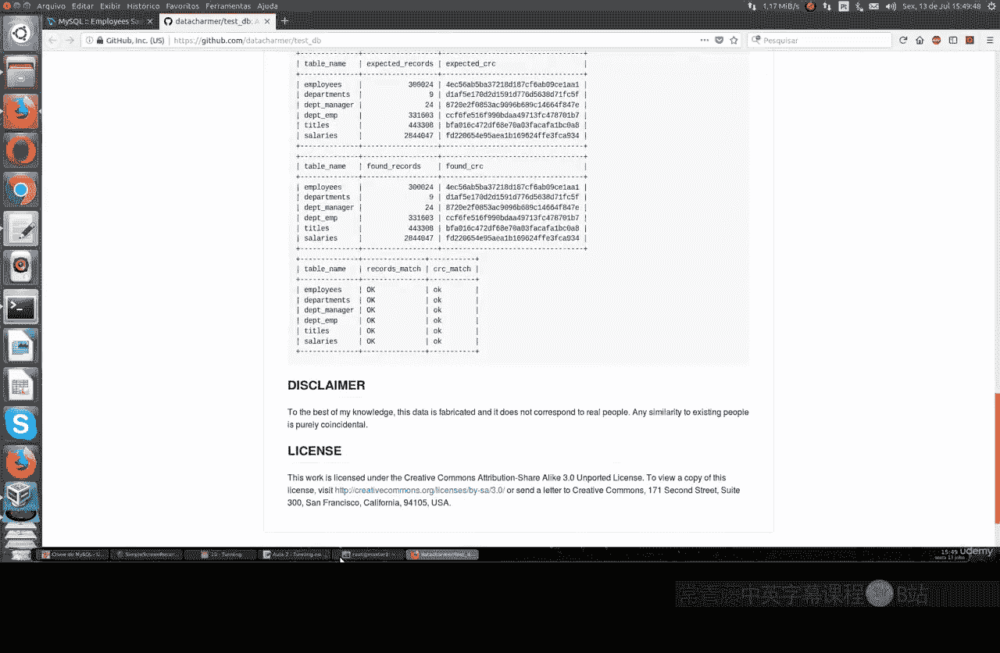
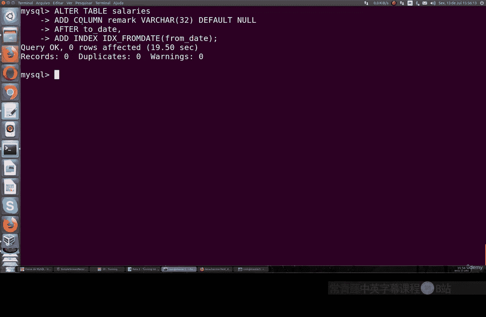

# 082：ALTER TABLE操作调优指南 🚀

## 概述

在本节课中，我们将学习如何对包含海量数据（数百万行）的InnoDB表执行`ALTER TABLE`操作，同时避免因I/O过载导致的系统缓慢甚至崩溃问题。我们将通过一个具体的示例，演示如何通过合并多个修改操作到单条SQL语句中来提升性能。


## 准备工作：获取示例数据库

上一节我们介绍了ALTER TABLE可能带来的性能风险，本节中我们来看看如何在一个真实的场景中进行优化。首先，我们需要一个用于测试的大型数据库。





MySQL官方网站提供了一些示例数据库。我们将使用名为“Employees”的数据库。你可以通过GitHub克隆仓库或直接下载ZIP文件来获取它。



以下是获取数据库的步骤：

1.  访问MySQL官方示例数据库页面或其在GitHub上的仓库。
2.  找到名为“Employees”的数据库。
3.  使用`git clone`命令克隆仓库，或通过提供的链接下载ZIP压缩包。
4.  解压后，找到主要的`.sql`文件。

## 导入与查看数据

获取数据库文件后，需要将其导入到MySQL服务器中。

首先，创建一个同名数据库并导入数据：
```sql
CREATE DATABASE employees;
USE employees;
SOURCE /path/to/your/employees.sql;
```
此过程将为InnoDB引擎创建所有表结构并载入数据。完成后，我们可以查看数据库中的表。
```sql
SHOW TABLES;
```
其中，“employees”表是主要的数据表，大小约为100MB，包含大量记录，非常适合演示大规模数据操作。

## 传统ALTER TABLE的问题

现在，我们准备执行表结构修改。假设我们需要修改一个大型表。

传统的`ALTER TABLE`工作流程如下：
1.  创建一个具有新定义的空表。
2.  将原表的所有数据复制到新表。
3.  删除原表，并将新表重命名为原表名。

这个过程存在两个主要问题：
*   **需要双倍磁盘空间**：在复制数据期间，同一份数据会存在两个副本。
*   **产生大量I/O操作**：复制数百万行数据会严重占用磁盘I/O，导致系统性能下降，甚至影响其他关联应用。

## 优化策略：合并ALTER操作

对于InnoDB引擎，一个有效的优化策略是**将多个表修改操作合并到单条`ALTER TABLE`语句中执行**。

例如，假设我们需要完成两项修改：
1.  添加一个新列。
2.  为某个字段添加一个新索引。

低效的做法是分两次执行：
```sql
ALTER TABLE employees ADD COLUMN new_column VARCHAR(255);
ALTER TABLE employees ADD INDEX idx_new_column (new_column);
```
高效的做法是合并为一条语句：
```sql
ALTER TABLE employees
ADD COLUMN new_column VARCHAR(255),
ADD INDEX idx_new_column (new_column);
```

## 性能对比演示

为了观察效果，我们可以在一个MySQL会话中执行合并后的ALTER命令，同时在另一个会话中监控进程状态。
```sql
-- 在会话A中执行优化后的修改
ALTER TABLE employees
ADD COLUMN test_column INT,
ADD INDEX idx_test (test_column);
```
```sql
-- 在会话B中监控进程
SHOW PROCESSLIST;
```
通过`SHOW PROCESSLIST`命令，你可以看到`ALTER TABLE`命令的状态和执行时间。合并操作让数据库引擎只需对表重组一次，从而显著减少了总的I/O负载和锁表时间。

## 总结



本节课中我们一起学习了针对InnoDB大表的`ALTER TABLE`性能调优方法。核心要点是：**尽可能将多个表结构修改（如添加列、删除列、添加索引、修改索引等）合并到单条`ALTER TABLE`语句中**。这样做可以让MySQL引擎一次性完成所有变更，避免多次表重建和全表数据复制，从而极大节省时间、减少磁盘I/O压力，并提升数据库的整体性能。在处理生产环境的大型数据表时，这是一个非常实用且重要的技巧。