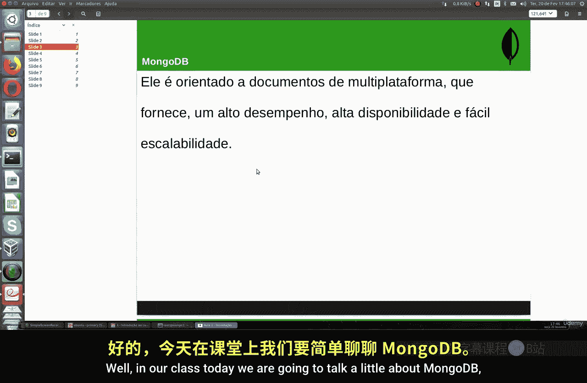
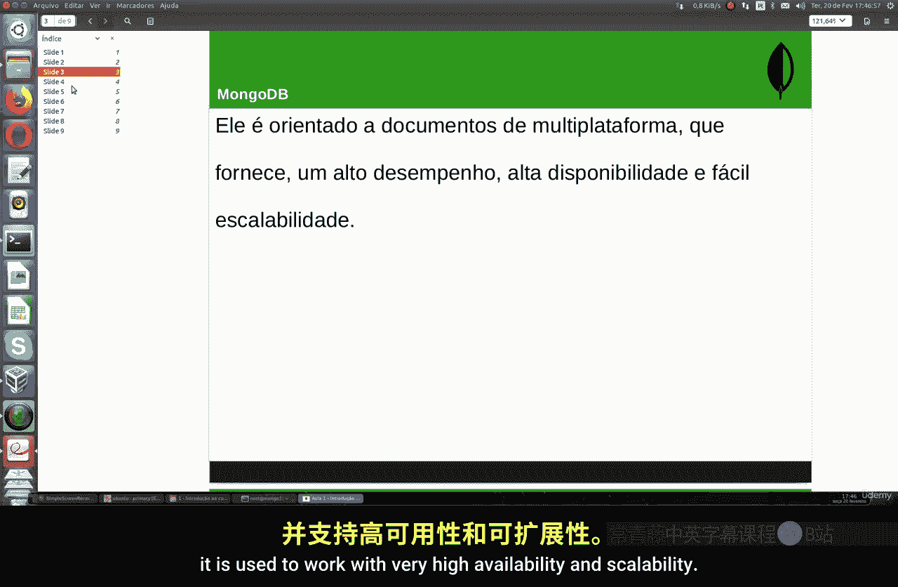
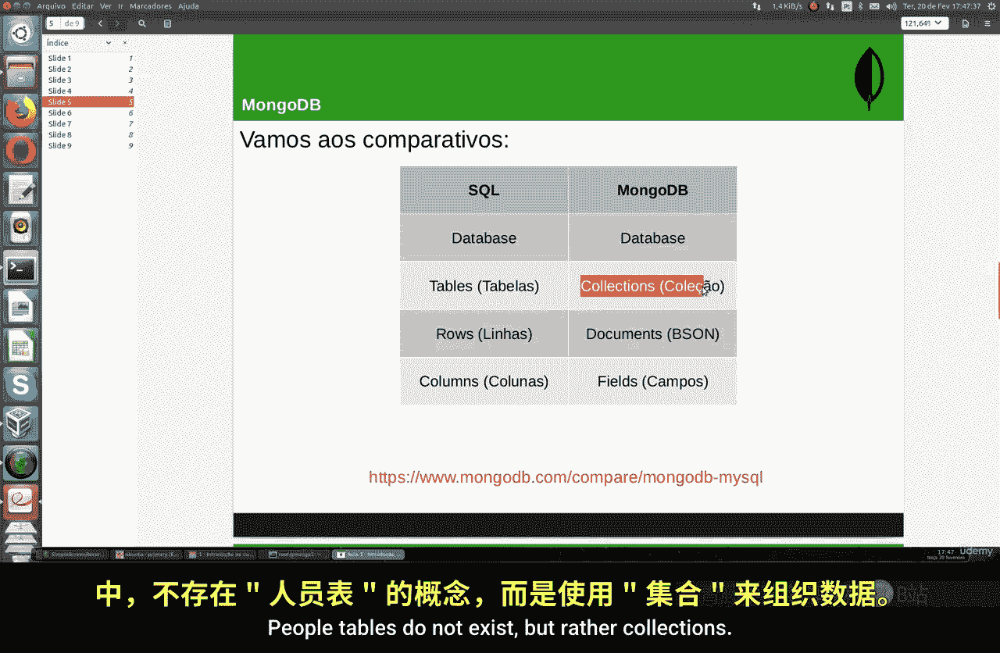
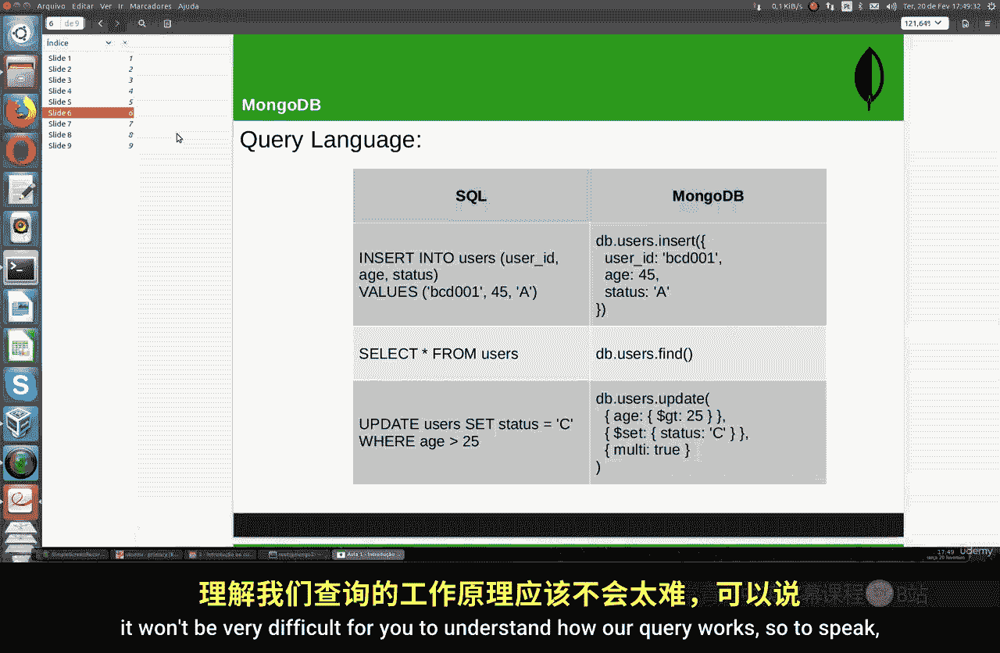
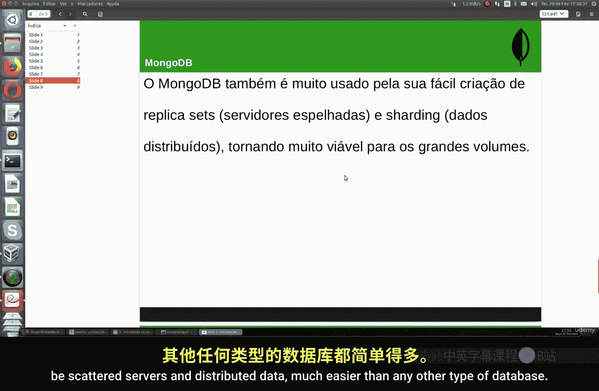
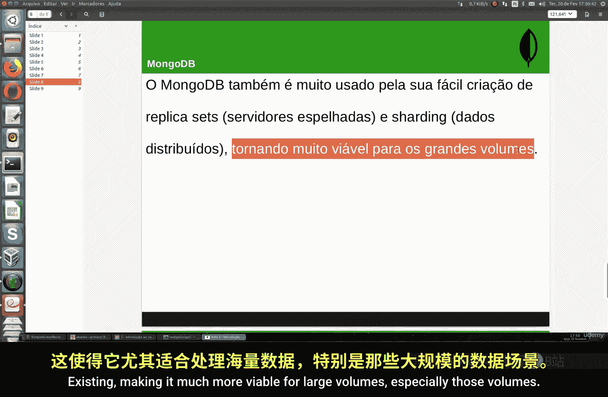
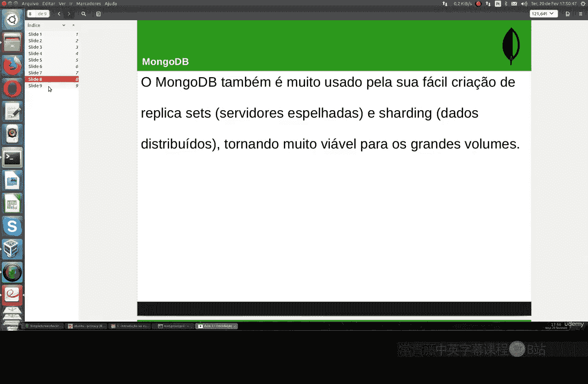
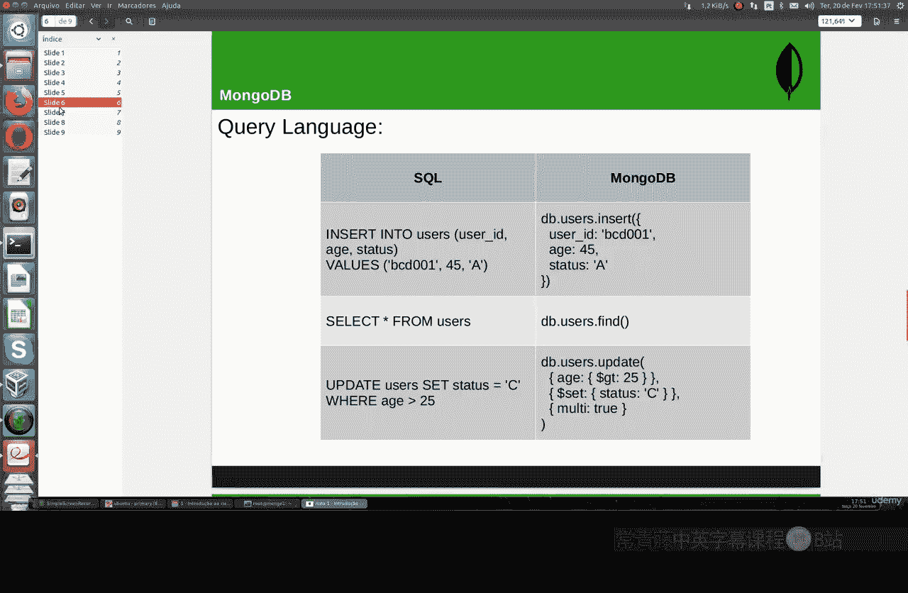
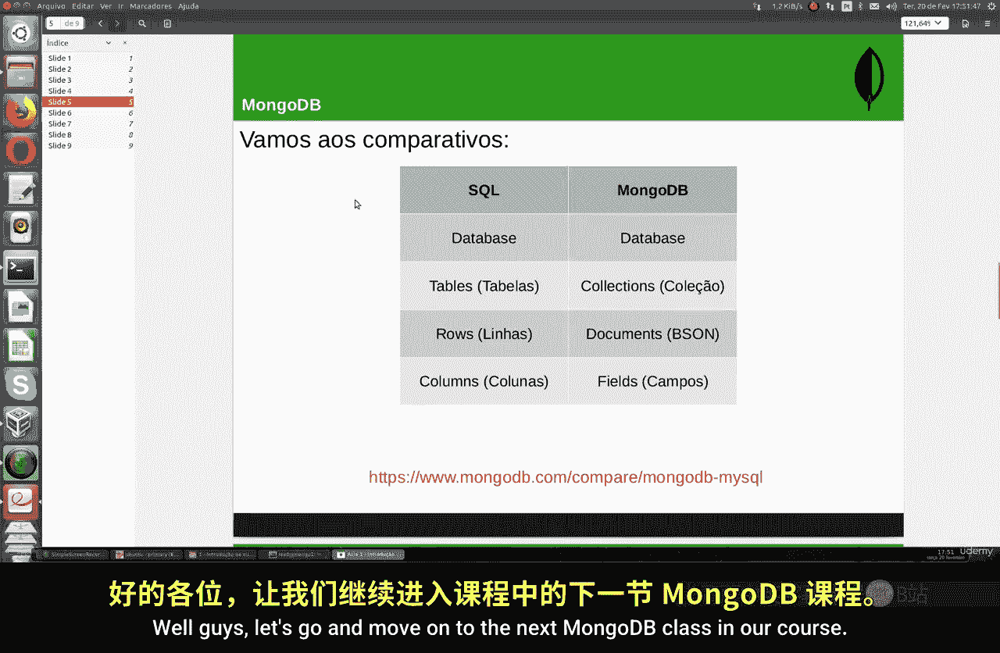

# 083：MongoDB介绍 🗄️


在本节课中，我们将学习MongoDB的基础知识。MongoDB是一种流行的非关系型数据库，我们将了解它的基本概念、特点以及与SQL数据库的主要区别。



## 概述


MongoDB是一个于2009年发布的免费开源数据库程序。它向世界引入了文档型数据库的概念。在SQL领域，MongoDB如今是全球最重要、使用最广泛的非关系型数据库之一。

## MongoDB的核心概念



MongoDB使用类似于JSON的文档来工作，但它具有模式。它是一个完全免费的多平台程序，可以在Linux、Mac OS和Windows系统上安装。MongoDB性能非常高，适用于需要高可用性和可扩展性的场景。

我们将在后续课程中深入探讨这一点。全球许多公司和软件开发人员都在使用MongoDB，因为它能显著加快程序开发速度，并且更容易进行后续修改。


## 与SQL数据库的对比



为了理解MongoDB与SQL数据库的区别，我们可以进行一个简单的比较。

在SQL数据库中，如MySQL、SQL Server、PostgreSQL，数据存储在**表**中。而在MongoDB中，对应的概念是**集合**。

以下是SQL数据库系统与MongoDB在术语上的主要映射关系：

*   **行** 在SQL中称为记录，在MongoDB中称为**文档**。
*   **列** 在SQL中称为字段，在MongoDB中称为**字段**。

## 操作语法对比

让我们通过一个插入和查询的例子来直观感受两者的区别。

在SQL中，插入数据的命令可能如下：
```sql
INSERT INTO users (user_id, status) VALUES (45, 'A');
```
对应的查询命令是：
```sql
SELECT * FROM users;
```

在MongoDB中，插入操作使用类似JSON的文档格式，其核心是**键值对**。例如，`user_id`是键，`45`是值。一个基础的查询命令如下：
```javascript
db.users.find({})
```
这里的`db`代表当前连接的数据库，`users`是集合名，`find({})`相当于SQL中的`SELECT *`。



更新操作的对比也很明显。SQL中的更新：
```sql
UPDATE users SET status = 'active' WHERE age > 25;
```
在MongoDB中可能表示为：
```javascript
db.users.updateMany( { age: { $gt: 25 } }, { $set: { status: "active" } } )
```
对于已经熟悉其他类型数据库的学习者来说，理解MongoDB的查询逻辑不会太困难，这是最重要的部分。

## MongoDB的应用场景

MongoDB是一种单视图物联网数据库类型。它在以下场景中非常有用：


*   移动应用与物联网
*   内容管理系统
*   实时分析
*   个性化推荐
*   产品目录

当然，它创建的主要目的是处理**大数据**。大数据已成为现实，而MongoDB在执行此类应用，特别是处理每秒数百万次事务方面，处于领先地位。




MongoDB被广泛使用的另一个原因是，它可以更容易地创建副本集和分片集（即分布式服务器和数据），这比其他类型的数据库更适合处理大规模、尤其是非结构化的海量数据。





## 相关工具

了解MongoDB时，认识以下工具名称会很有帮助：

*   **mongod**：MongoDB服务器进程。
*   **mongo**：MongoDB命令行客户端。
*   **mongodump** / **mongorestore**：用于二进制备份和恢复。
*   **mongoimport** / **mongoexport**：用于导入/导出JSON或CSV格式的文档。

MongoDB也能够与Excel电子表格协同工作。




## 总结



本节课我们一起学习了MongoDB的入门知识。这只是一节介绍性的课程，我们没有深入讨论MongoDB的理论细节。我们了解了MongoDB作为一种文档型数据库的基本特点、它与传统SQL数据库在结构和操作上的主要区别，以及它的核心应用领域。理解这些基础概念，有助于我们在后续课程中更好地学习和使用MongoDB。