# 084：在Ubuntu Server上安装MongoDB 4.x 🛠️

在本节课中，我们将学习如何在Ubuntu Server上安装MongoDB 4.x版本。我们将从添加官方软件源开始，逐步完成安装、启动服务并进行简单的连接测试。

## 概述

MongoDB是一个流行的NoSQL数据库。本节教程将指导你完成在Ubuntu Server系统上安装MongoDB 4.x的完整过程，包括配置软件源、安装软件包、管理服务以及进行初步验证。

## 添加MongoDB软件源密钥

首先，我们需要添加MongoDB的官方GPG密钥，以确保下载软件包的安全性。

运行以下命令下载并导入密钥：
```bash
wget -qO - https://www.mongodb.org/static/pgp/server-4.2.asc | sudo apt-key add -
```
请注意，命令中的版本号 `4.2` 可以根据你的需求进行修改，例如改为 `4.4` 或 `4.6`。

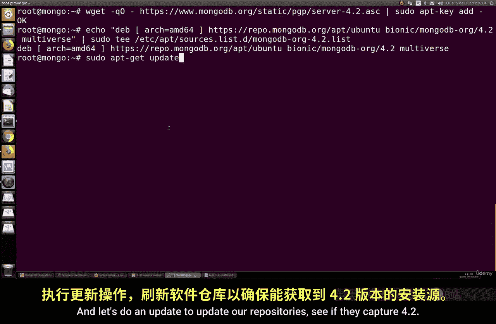

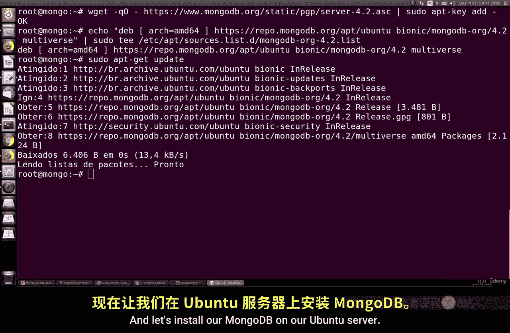

## 配置MongoDB软件源列表

接下来，我们需要将MongoDB的软件源添加到系统的源列表中。

以下是添加软件源的命令。你需要根据你的Ubuntu版本代号（如 `bionic` 对应18.04 LTS）来调整命令中的参数：
```bash
echo "deb [ arch=amd64 ] https://repo.mongodb.org/apt/ubuntu bionic/mongodb-org/4.2 multiverse" | sudo tee /etc/apt/sources.list.d/mongodb-org-4.2.list
```
请将 `bionic` 替换为你实际使用的Ubuntu版本代号，并将 `4.2` 替换为你希望安装的MongoDB主版本号。

## 更新软件包列表并安装MongoDB

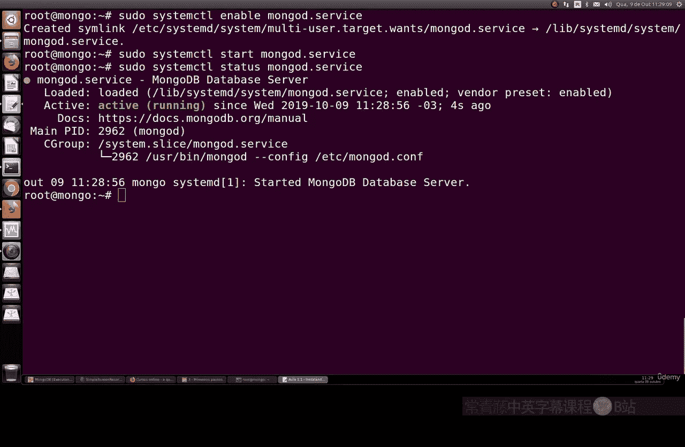

在添加新的软件源后，需要更新本地的软件包列表，然后执行安装。

运行以下命令来更新软件包列表并安装MongoDB：
```bash
sudo apt update
sudo apt install -y mongodb-org
```
安装过程会下载大约270MB的软件包，其中包括MongoDB服务器、客户端和Shell工具。

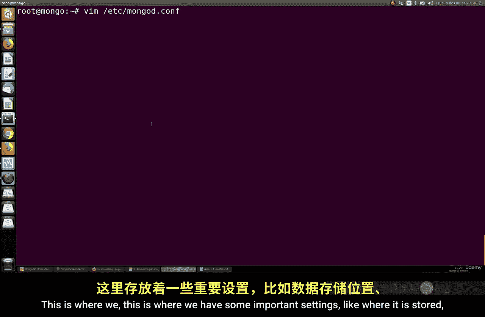

## 启动并启用MongoDB服务

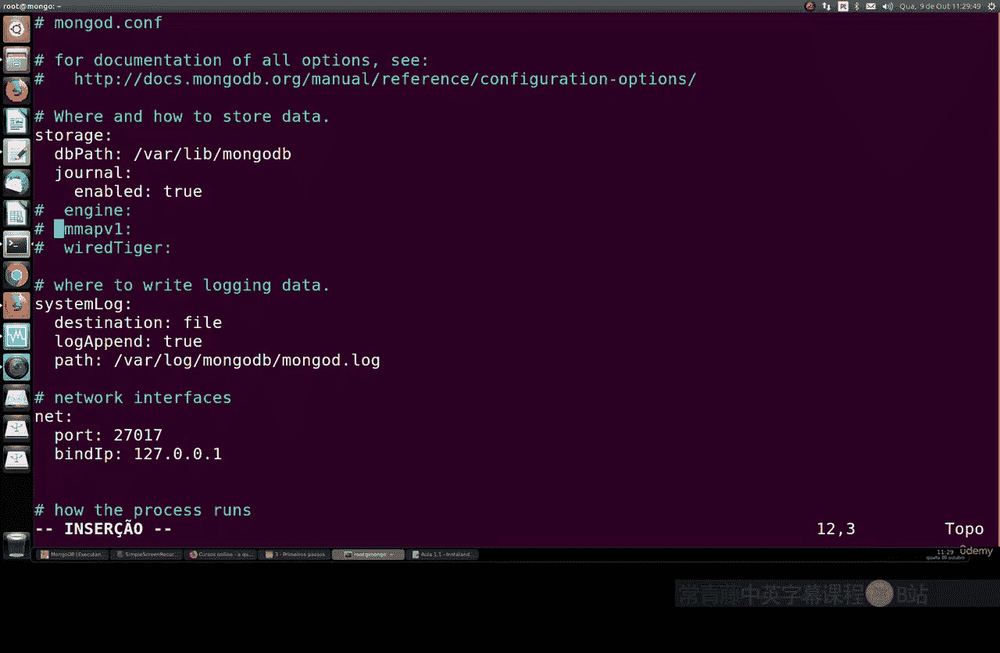

安装完成后，我们需要启动MongoDB服务，并设置为开机自动启动。

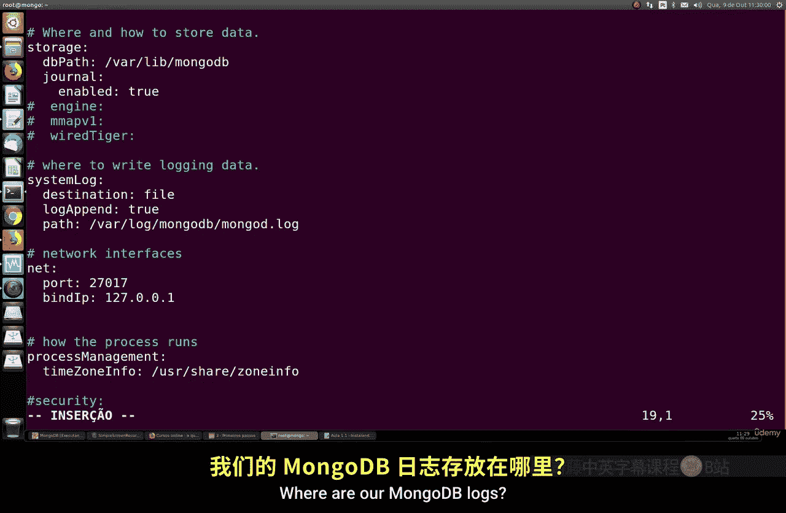

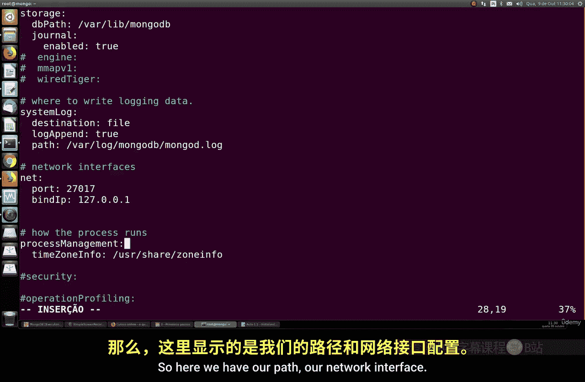

以下是管理MongoDB服务的命令：
```bash
sudo systemctl enable mongod
sudo systemctl start mongod
```
你可以使用以下命令来检查服务的运行状态：
```bash
sudo systemctl status mongod
```

## 验证安装与基本配置

现在，让我们验证MongoDB是否安装成功，并查看其默认配置。

运行以下命令检查MongoDB的版本：
```bash
mongod --version
```
MongoDB的主要配置文件位于 `/etc/mongod.conf`。该文件定义了数据存储目录、日志文件路径、网络绑定接口和端口等关键设置。默认情况下，MongoDB监听在 `127.0.0.1:27017`。

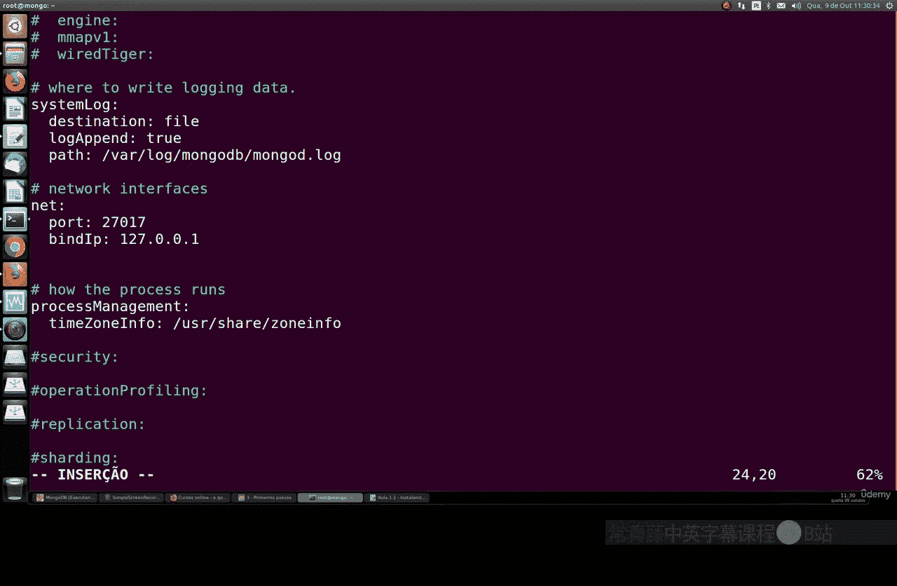

## 连接MongoDB Shell进行测试

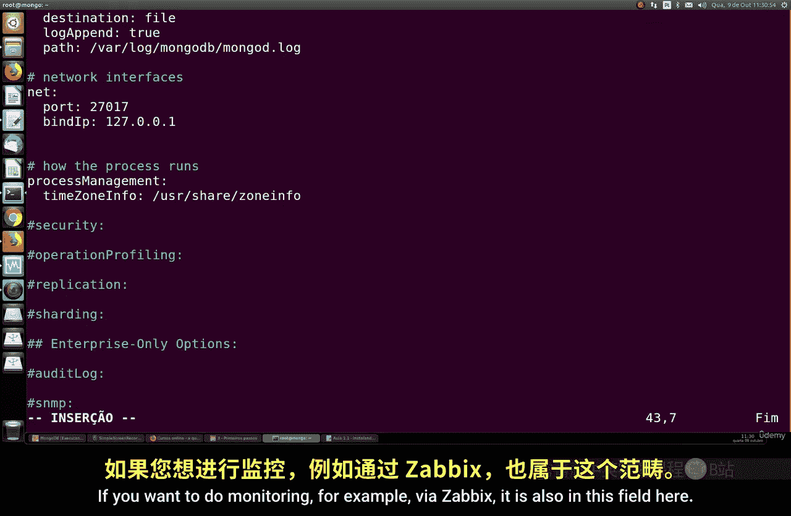

最后，我们可以连接到MongoDB Shell，进行简单的数据库操作测试。

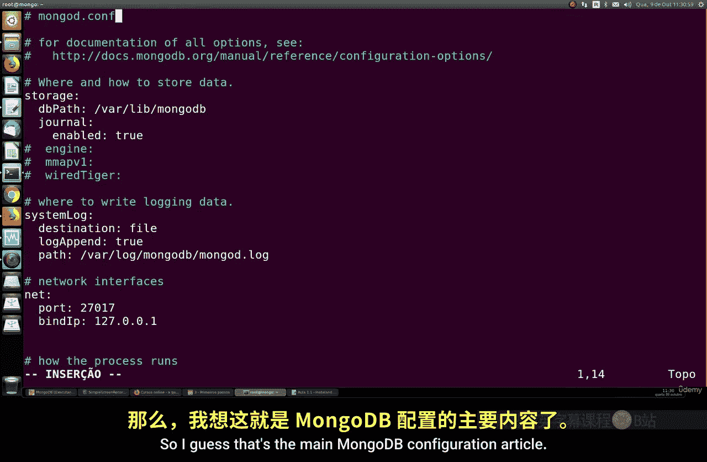

输入以下命令启动MongoDB Shell：
```bash
mongo
```
在Shell中，你可以执行一些基本命令：
- 查看所有数据库：`show dbs`
- 切换或创建数据库：`use mydb`
- 插入一条测试数据：`db.test.insertOne({ name: “test” })`
- 退出Shell：按 `Ctrl+D` 或输入 `exit`

## 关于Ubuntu 18.04的网络配置

如果你使用的是Ubuntu Server 18.04，请注意系统默认启用的 `netplan` 网络配置工具。虽然它与MongoDB安装无直接冲突，但在进行服务器网络配置（例如为MongoDB开放端口）时可能需要额外处理。

## 总结

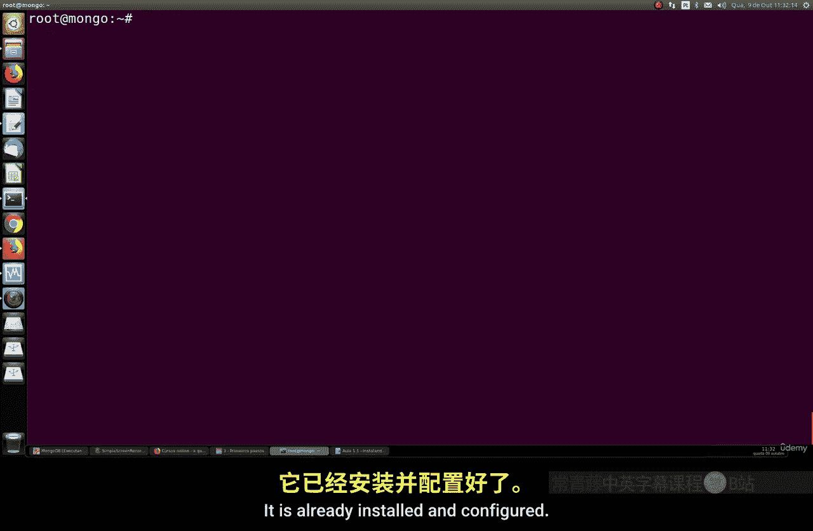

本节课我们一起学习了在Ubuntu Server上安装MongoDB 4.x的完整流程。我们完成了从添加官方软件源、安装软件包、启动服务到使用Shell进行基本测试的所有步骤。你现在已经拥有了一个可以运行的MongoDB环境，为后续深入学习数据库操作和安全配置打下了基础。