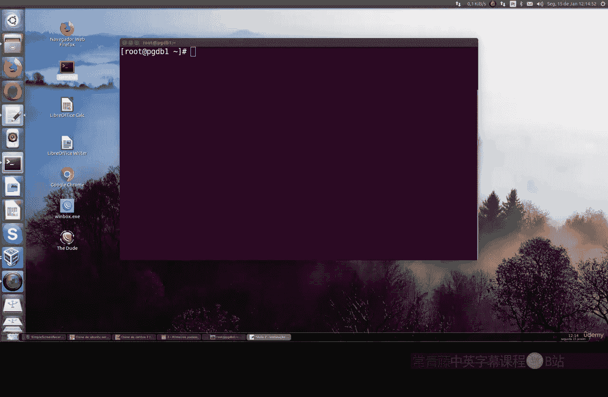
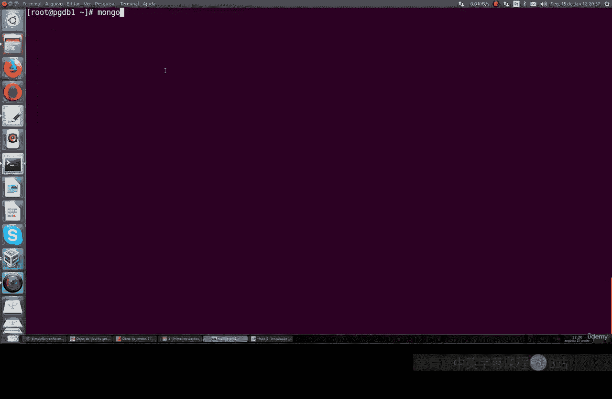
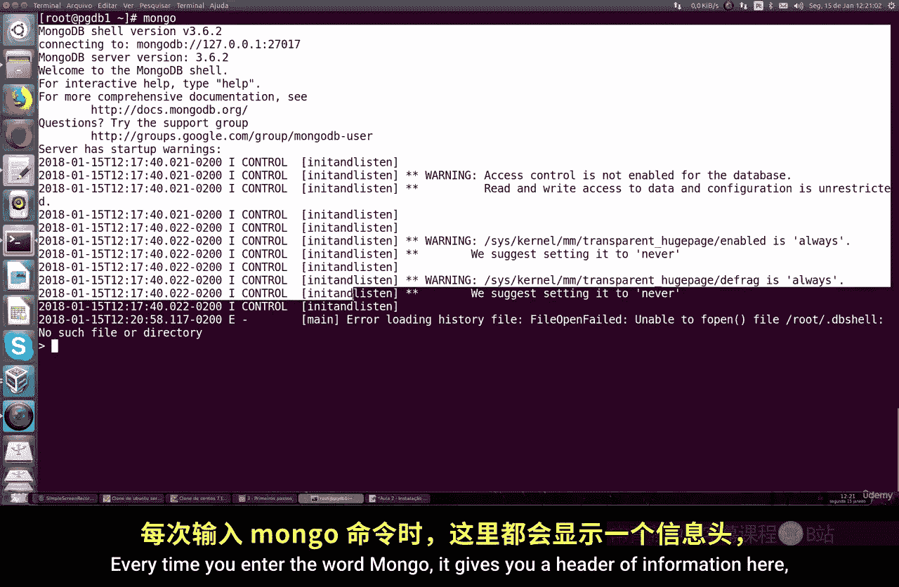
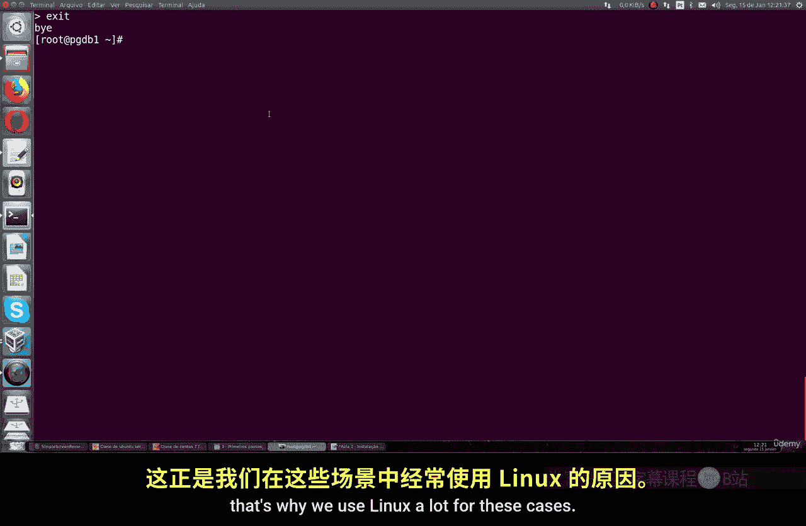

# 085：在CentOS上安装MongoDB 🛠️

在本节课中，我们将学习如何在CentOS 7操作系统上安装MongoDB数据库。整个过程将分为几个清晰的步骤，包括配置软件仓库、安装软件包以及进行基本的服务配置。

## 概述

MongoDB是一个流行的NoSQL数据库。在CentOS系统上，其默认软件仓库中不包含MongoDB，因此我们需要先添加官方的MongoDB仓库，然后进行安装和初始配置。本节教程将引导你完成这些步骤。

## 安装步骤



### 1. 添加MongoDB软件仓库

首先，我们需要为系统添加MongoDB的官方软件仓库。这里我们选择安装版本3.6，这是一个稳定且实用的版本。当然，你也可以根据需要修改命令，安装其他版本。

以下是具体操作命令。我们将在 `/etc/yum.repos.d/` 目录下创建一个新的仓库配置文件。

```bash
sudo vi /etc/yum.repos.d/mongodb-org-3.6.repo
```

将以下内容复制到该文件中并保存。这段配置指定了MongoDB 3.6版本的仓库地址。

```
[mongodb-org-3.6]
name=MongoDB Repository
baseurl=https://repo.mongodb.org/yum/redhat/$releasever/mongodb-org/3.6/x86_64/
gpgcheck=1
enabled=1
gpgkey=https://www.mongodb.org/static/pgp/server-3.6.asc
```

### 2. 更新系统仓库缓存

创建仓库文件后，需要更新系统的软件包缓存，以便识别新添加的MongoDB仓库。这个命令同样适用于Fedora或Red Hat系统。

```bash
sudo yum makecache
```

命令执行后，系统会更新仓库列表，并能够找到MongoDB的安装包。

### 3. 安装MongoDB

现在，我们可以开始安装MongoDB了。执行以下命令，系统会提示你确认安装，输入 `y` 即可。

```bash
sudo yum install -y mongodb-org
```

这个命令会安装MongoDB服务器和客户端软件包，这是数据库软件的常见做法。安装过程会自动处理所有依赖项。

### 4. 启动MongoDB服务

安装完成后，我们需要启动MongoDB服务，并设置其开机自启。

```bash
sudo systemctl start mongod
sudo systemctl enable mongod
```

如果需要重新加载服务配置（例如在更新后），可以使用 `sudo systemctl reload mongod` 命令。

### 5. 查看MongoDB配置

了解MongoDB的配置文件位置很重要，这有助于后续的维护和故障排查。主要配置文件位于：

```bash
/etc/mongod.conf
```

在这个文件中，你可以查看和修改多项设置：
*   **存储路径**：数据库文件的存储位置。
*   **日志文件**：MongoDB运行日志的写入路径。
*   **网络接口**：数据库监听的IP地址和端口（默认为27017）。
*   **安全与复制**：更高级的安全认证和复制集配置（我们将在后续课程深入讲解）。

例如，要实时查看日志文件的尾部内容，可以使用：

```bash
sudo tail -f /var/log/mongodb/mongod.log
```

### 6. 连接MongoDB数据库



最后，你可以通过MongoDB客户端连接到数据库服务器进行测试。只需在终端输入 `mongo` 命令。



```bash
mongo
```

成功连接后，你会进入MongoDB的交互式Shell界面，并可能看到一些系统或安全警告信息。要退出Shell，输入 `exit` 命令即可。

## 总结



本节课我们一起学习了在CentOS 7上安装MongoDB 3.6的完整流程。我们首先**添加了官方的MongoDB软件仓库**，然后**更新缓存并安装**了软件包。安装完成后，我们**启动了MongoDB服务**，并简要介绍了**配置文件的位置和重要参数**。最后，我们使用 `mongo` 命令**成功连接到了数据库**，验证了安装结果。掌握这些基础步骤是后续深入学习MongoDB管理、安全与开发的前提。