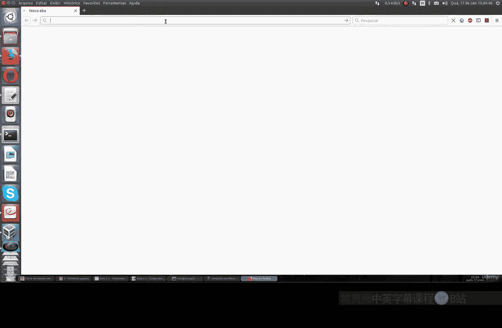
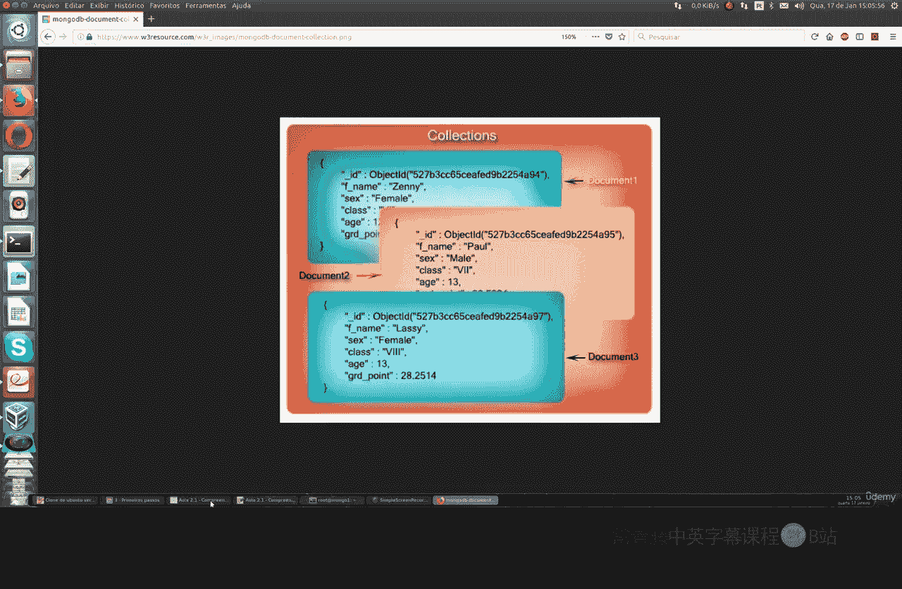
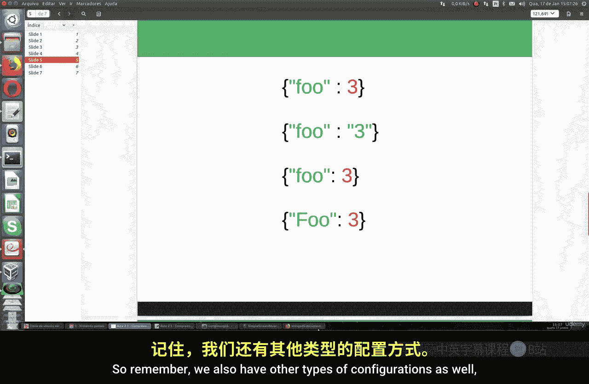
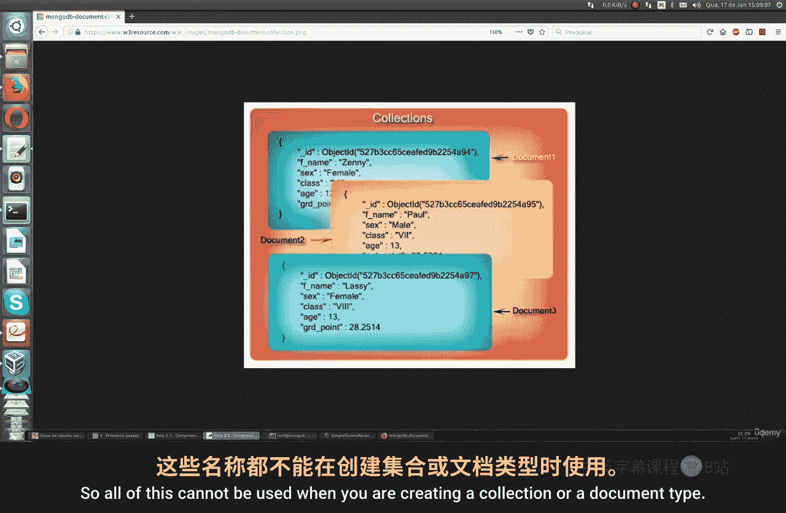

MongoDB基础：第1章：核心概念与语法详解 🗂️

在本节课中，我们将要学习MongoDB的基础语法和核心概念，包括文档、集合和数据库的定义与关系，以及MongoDB在语法上的重要特性。

上一节我们介绍了课程主题，本节中我们来看看MongoDB的基本构成单元——文档。



文档是MongoDB中的基本数据单元，它是一个有序的键值对集合。例如：
```json
{"name": "Hello World"}
```
在这个例子中，`name`是键，`"Hello World"`是值。这是一个只包含单个键值对的简单文档。

文档也可以包含多个键值对，各对之间用逗号分隔。例如：
```json
{"name": "Hello World", "count": 3}
```
这个文档包含了`name`和`count`两个键及其对应的值，是一个更完整的文档类型。



以下是关于文档的几个关键点：
*   每个文档都有一个唯一的 `_id` 字段，用于在集合中唯一标识该文档。这类似于关系型数据库（如MySQL、PostgreSQL）中的主键。
*   MongoDB的语法是**大小写敏感**的。例如，`{"count": 3}`、`{"Count": 3}` 和 `{"COUNT": 3}` 会被视为三个不同的文档。
*   MongoDB的语法是**类型敏感**的。例如，`{"count": 3}`（数字3）和 `{"count": "3"}`（字符串“3”）也是不同的文档。
*   文档中的键必须是唯一的，不允许重复。例如，`{"name": "a", "name": "b"}` 这种语法是错误的。

上一节我们了解了文档，本节中我们来看看文档的组织形式——集合。

集合可以被看作是一组文档的容器，类似于关系型数据库中的“表”，但它具有动态模式，意味着集合内的文档结构可以不同。



以下是关于集合的几个关键点：
*   集合通过其名称进行标识。
*   集合名称可以是任何UTF-8字符串，但有一些限制，例如不能为空字符串，不能包含某些保留字符。
*   一个集合可以包含零个、一个或多个文档。

现在，我们了解了文档和集合，最后来看看它们的容器——数据库。

一个MongoDB实例可以承载多个独立的数据库。每个数据库可以包含零个或多个集合，而每个集合又可以包含成千上万个唯一的文档。



以下是关于数据库的最佳实践：
*   一种良好的做法是将一个特定应用或客户的所有数据集合都保存在同一个数据库中，这有助于保持数据基础设施的条理性。
*   在命名集合或数据库时，应避免使用MongoDB的保留字，例如 `admin`、`local`、`config`。


本节课中我们一起学习了MongoDB的核心概念。我们了解了**文档**作为基本数据单元的结构，认识了**集合**作为文档容器的角色，以及**数据库**作为最高层级组织单位的功能。同时，我们重点掌握了MongoDB语法在大小写、类型和键唯一性方面的敏感性。理解这些基础理论，将为我们后续的实践操作打下坚实的基础。