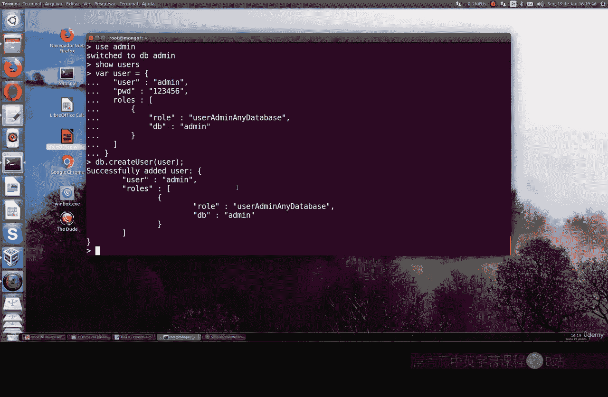

# 091：在MongoDB中创建管理员超级用户 🔐


在本节课中，我们将学习如何为MongoDB数据库启用安全认证，并创建一个拥有最高权限的管理员用户。默认情况下，MongoDB没有任何安全限制，任何连接者都可以访问所有数据。我们将改变这一状况，为数据库设置基础安全。

## 概述

默认情况下，MongoDB安装后不启用任何安全认证或授权机制。这意味着任何能够连接到MongoDB实例的用户都可以无限制地访问所有数据库、集合和文档。本节课的目标是启用安全机制，并创建一个管理员超级用户，为后续设置更细粒度的用户权限打下基础。

## 启用MongoDB安全认证

在开始创建用户之前，必须先启用MongoDB的安全功能。默认配置中，安全功能是关闭的。

以下是启用安全认证的步骤：

1.  **编辑MongoDB配置文件**：通常配置文件位于 `/etc/mongod.conf`。
2.  **注释安全部分**：在配置文件中找到 `security` 部分。初始状态下，它可能被注释或设置为 `security: disabled`。你需要取消注释或修改它。
3.  **启用授权**：在 `security` 部分下，添加或确保存在 `authorization: enabled` 这一行。

修改后的配置文件 `security` 部分应类似如下：

```yaml
security:
  authorization: enabled
```

4.  **保存并重启MongoDB服务**：保存对配置文件的修改，然后重启MongoDB服务以使更改生效。

```bash
sudo systemctl restart mongod
```

重启服务后，MongoDB将开始要求身份验证。

## 连接MongoDB并查看现有数据库

服务重启后，我们可以连接到MongoDB实例。由于尚未创建任何用户，我们暂时以无认证模式连接（如果配置允许）或使用本地主机例外。连接后，首先查看一下系统内已有的数据库。

使用以下命令连接并列出数据库：

```bash
mongo
show dbs
```

你会看到一些默认创建的数据库，例如 `admin`、`config` 和 `local`。`admin` 数据库是存放系统级用户和角色的特殊数据库。

## 创建管理员超级用户

我们将首先在 `admin` 数据库中创建一个超级用户。这个用户将拥有管理整个MongoDB实例的最高权限。

以下是创建管理员用户的步骤：

1.  **切换到admin数据库**：管理员用户通常在 `admin` 数据库中创建。
    ```javascript
    use admin
    ```
2.  **定义用户变量**：我们可以创建一个变量来存储用户信息，使命令更清晰。
    ```javascript
    var adminUser = {
      user: “admin”,
      pwd: “123456”,
      roles: [ { role: “userAdminAnyDatabase”, db: “admin” } ]
    }
    ```
    **代码解释**：
    *   `user`: 指定用户名，此处为 “admin”。
    *   `pwd`: 指定用户密码，示例为 “123456”。**在实际环境中，务必使用强密码**。
    *   `roles`: 指定用户角色数组。这里赋予 `userAdminAnyDatabase` 角色，该角色允许用户在**任何**数据库上管理用户（创建、修改、删除用户），但其权限范围仅限于用户管理，不能直接读写业务数据。
    *   `db`: 指定角色所属的数据库，对于内置角色，通常是 `admin`。

3.  **执行创建用户命令**：使用 `db.createUser()` 方法并传入定义好的变量来创建用户。
    ```javascript
    db.createUser(adminUser)
    ```
    如果成功，命令行将返回 `Successfully added user` 的确认信息。

现在，我们已经成功创建了一个管理员用户。这个用户目前可以管理MongoDB中的所有其他用户账户。

## 关于角色和权限的说明

上一节我们创建了拥有 `userAdminAnyDatabase` 角色的管理员。MongoDB通过**角色**来定义权限。角色是一组权限的集合，可以分配给用户。

*   **`userAdminAnyDatabase`**：提供在所有数据库上管理用户的权限。这是一个强大的管理角色，但主要专注于账户控制。
*   其他常见内置角色包括：
    *   `readWriteAnyDatabase`：可以在所有数据库上读写数据。
    *   `dbAdminAnyDatabase`：可以在所有数据库上执行管理操作。
    *   `root`：**超级用户角色**，拥有所有权限，是 `userAdminAnyDatabase`、`dbAdminAnyDatabase` 和 `readWriteAnyDatabase` 等角色的超集。

在接下来的课程中，我们将学习如何组合这些角色，或创建自定义角色，来为不同应用或用户分配精确的权限。例如，为一个电商网站创建只能读写其特定数据库的用户。

## 总结



本节课中，我们一起学习了MongoDB安全基础。我们首先启用了MongoDB的认证授权功能，然后连接数据库，并在 `admin` 数据库中创建了一个管理员超级用户。这个用户被赋予了 `userAdminAnyDatabase` 角色，能够管理整个MongoDB实例中的所有用户。

这是构建安全MongoDB环境的第一步。在下一节课中，我们将为此管理员用户添加更全面的数据操作权限，并开始创建用于具体应用程序的、权限受限的普通用户。

---
**附：本节课核心命令回顾**
1.  编辑配置后重启服务：`sudo systemctl restart mongod`
2.  连接MongoDB Shell：`mongo`
3.  查看数据库列表：`show dbs`
4.  切换到admin数据库：`use admin`
5.  创建用户（变量方式）：
    ```javascript
    var adminUser = {
      user: “admin”,
      pwd: “123456”,
      roles: [ { role: “userAdminAnyDatabase”, db: “admin” } ]
    };
    db.createUser(adminUser);
    ```