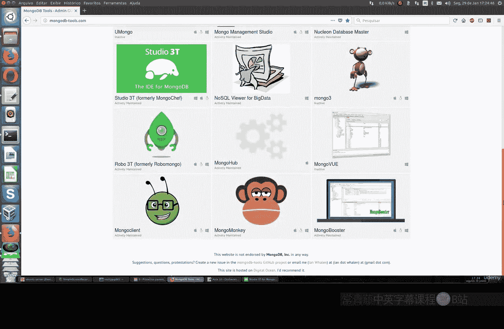

# 093：了解 MongoDB 的图形界面工具 🖥️

在本节课中，我们将要学习 MongoDB 提供的额外工具，特别是图形用户界面工具。这些工具可以帮助我们更直观、更高效地管理和操作 MongoDB 数据库。

## 概述

MongoDB 提供了多种类型的工具来辅助开发和管理工作。本节课我们将重点介绍其中的 GUI 工具，它们为数据库操作提供了可视化的界面，尤其适合初学者和日常开发使用。

## MongoDB 工具生态

MongoDB 官网汇集了适用于不同目标和场景的主要工具。这些工具涵盖了数据库分析、商业智能、自动化部署、驱动调优、REST 接口、监控以及 Shell 界面等多个方面。本节课我们将专注于一款 GUI 工具，它为 MongoDB 提供了图形化的操作界面，能极大地方便我们的日常工作。

## 可用的 GUI 工具

以下是 MongoDB 官网上列出的一些主要 GUI 工具项目。你可以根据需求进行测试和选择。

*   **跨平台支持**：大多数工具都支持 Windows、Mac OS 和 Linux 系统。
*   **项目状态**：列表中包含活跃开发和已停止维护的项目。
*   **语言与许可**：工具支持多种语言和不同类型的许可证。

我们不会在课程中展示所有工具，但会介绍一个非常有趣且功能全面的选择：Studio 3T。

## 深入 Studio 3T

Studio 3T 是一款专门为 MongoDB 设计的、非常完整的图形界面工具。它支持包括 3.6 版在内的所有 MongoDB 版本，并持续更新。

### 版本与许可

Studio 3T 提供免费版和付费版。
*   **免费版**：适用于非商业用途。
*   **付费版**：提供更多高级功能，如开发界面支持。

许多公司都使用这类工具，它对于从其他数据库（如 MySQL、PostgreSQL）转来的用户尤其友好，因为其界面布局相似，降低了学习成本。

### 安装与跨平台

Studio 3T 完全支持跨平台。安装过程非常简单：
*   **Windows 和 Mac**：提供标准的可执行安装文件。
*   **Linux**：提供一个 Shell 脚本文件（`.sh`），在终端中执行 `bash` 命令即可自动安装。

这是一款客户端工具，意味着你可以在 Windows、Mac 或 Linux 机器上安装它，并连接至任何地方的 MongoDB 服务器。

### 连接数据库

上一节我们介绍了工具的获取，本节中我们来看看如何连接数据库。以下是建立连接的基本步骤：

1.  启动 Studio 3T（免费版需注册，提供姓名、邮箱和密码即可）。
2.  在“连接”选项卡中创建新连接。
3.  选择连接类型（默认为直接连接）。
4.  填写服务器信息：
    *   **主机名/IP地址**：你的 MongoDB 服务器地址。
    *   **端口**：MongoDB 服务端口（默认 27017）。
5.  配置认证信息（如果服务器启用了认证，我们将在后续课程详细讲解）：
    *   **认证类型**：如 `SCRAM-SHA-1` 或 `X.509`。
    *   **用户名**、**密码**和**认证数据库**（如 `admin`）。
6.  为连接命名，然后点击“测试连接”以验证配置是否正确。
7.  测试成功后，保存并连接。

连接成功后，你将能看到服务器上所有的数据库和集合。

### 界面与功能

连接建立后，主界面会清晰展示所有数据库及其包含的集合。即使数据量达到百万级，也能在此进行浏览和管理。Studio 3T 的功能非常全面：

*   **数据浏览**：查看每个集合中的所有文档。
*   **用户与角色管理**：管理数据库用户和权限。
*   **模式分析**：分析集合的数据结构。
*   **导入/导出**：方便地进行数据迁移。
*   **SQL 查询**：支持使用 SQL 语法查询 MongoDB（通过内置转换）。
*   **智能 Shell**：提供命令自动补全的 MongoDB Shell 环境。
*   **数据对比**：可以比较不同连接或集合之间的数据差异。

你可以直接在此界面中执行查询命令，也可以使用其他可选命令进行操作。

## 总结

本节课我们一起学习了 MongoDB 的图形界面工具。我们了解到：
1.  MongoDB 拥有丰富的工具生态来满足不同需求。
2.  GUI 工具，如 Studio 3T，能通过可视化界面极大地简化数据库的管理和操作。
3.  Studio 3T 功能全面、支持跨平台，并且对初学者和其他数据库用户友好。
4.  你可以根据个人喜好和需求，从众多工具中选择最适合的一款来辅助你的 MongoDB 开发工作。

希望这节课能让你对如何使用图形化工具操作 MongoDB 有一个清晰的认识。