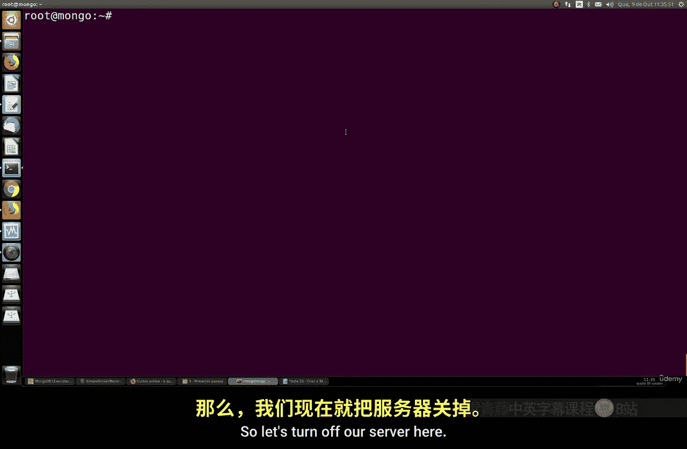
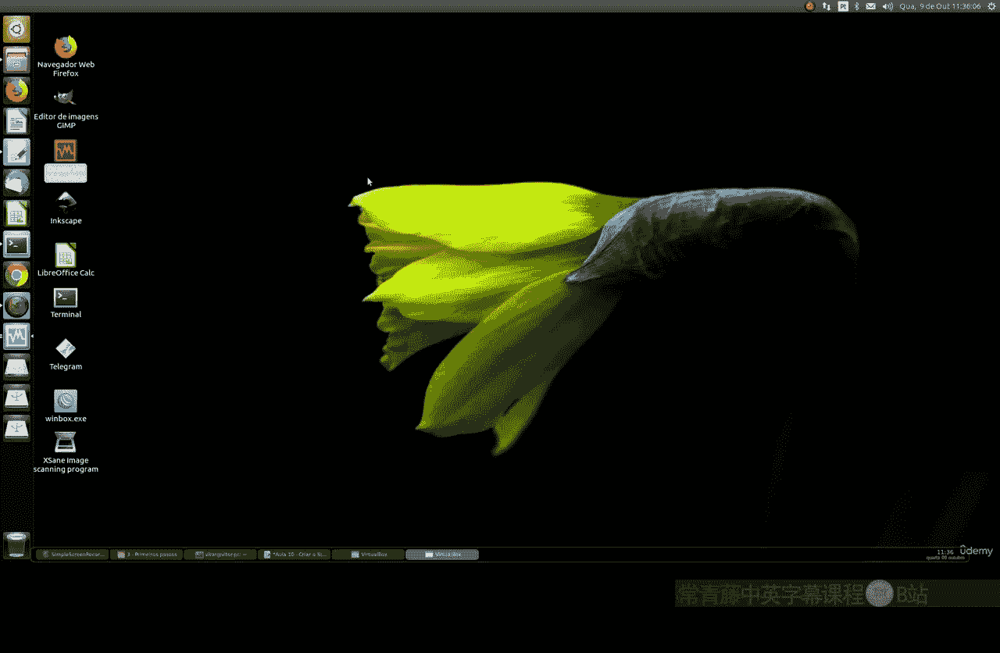
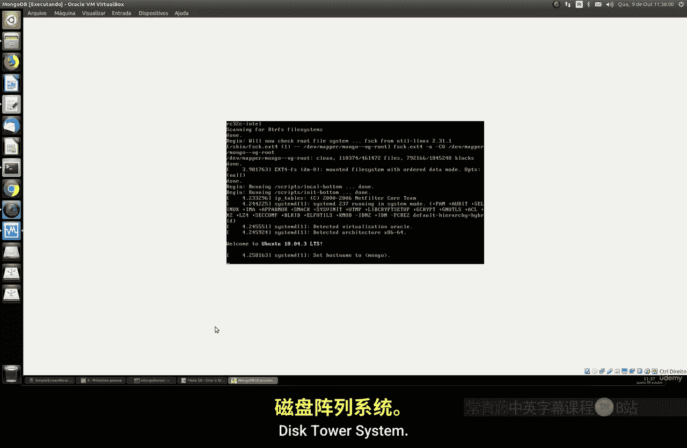
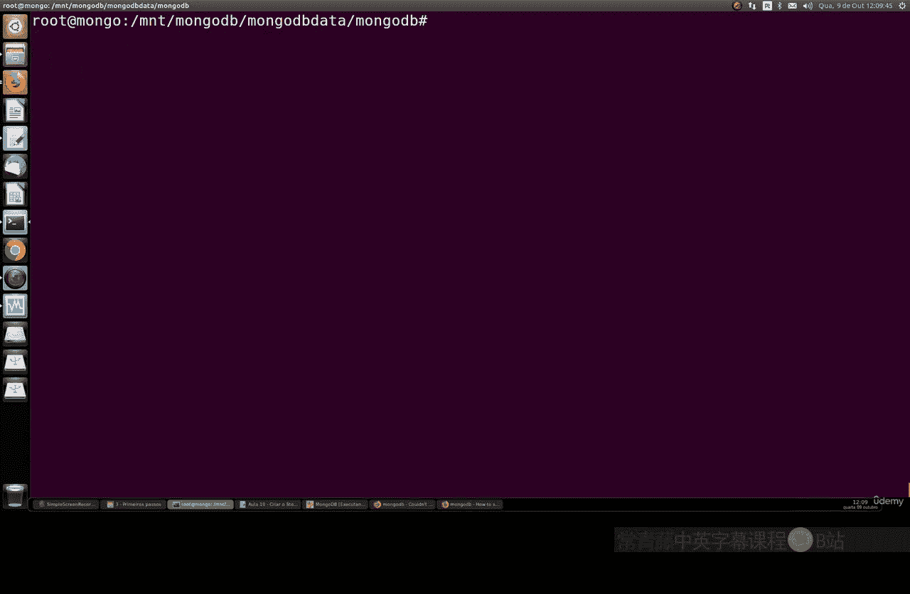

# 094：使用WiredTiger与XFS创建MongoDB存储引擎 🚀

## 概述
在本节课中，我们将学习如何为MongoDB配置符合最佳实践的存储方案。具体内容包括：将文件系统类型更改为XFS，并将存储引擎切换为WiredTiger。这些配置从MongoDB 4.0版本开始是推荐的做法，能提升数据安全性和数据库性能。



## 准备工作
上一节我们介绍了MongoDB的基本操作，本节中我们来看看如何优化其存储配置。首先，需要检查你的机器或服务器是否有可用的分区。可以使用`fdisk`命令查看。如果没有，也无需担心，特别是在VirtualBox环境中，我们可以创建一个新的虚拟磁盘。



## 创建并附加虚拟磁盘
以下是创建和附加新虚拟磁盘的步骤：

1.  关闭你的Ubuntu服务器。
2.  打开VirtualBox，选择你的Ubuntu虚拟机。
3.  进入“设置” -> “存储” -> “控制器：SATA”。
4.  点击“添加硬盘”图标，选择“创建新磁盘”。
5.  选择“VHD”格式，类型为“动态分配”，并设置所需大小（例如20GB）。
6.  创建完成后，确保新磁盘已附加到控制器上。
7.  启动你的Ubuntu服务器。



启动后，使用以下命令确认新磁盘已被系统识别：
```bash
sudo fdisk -l
```
你应该能看到一个名为`sdb`的新磁盘设备。

## 在新磁盘上创建分区并格式化为XFS
现在，我们将在新磁盘上创建一个Linux分区，并将其格式化为XFS文件系统。

1.  使用`fdisk`对`sdb`磁盘进行分区：
    ```bash
    sudo fdisk /dev/sdb
    ```
2.  在`fdisk`交互界面中，依次输入：
    -   `n` (创建新分区)
    -   `p` (选择主分区)
    -   `1` (分区号)
    -   按回车键两次（使用默认的起始和结束扇区）
    -   `w` (写入分区表并退出)
3.  再次使用`sudo fdisk -l`命令，确认新分区`/dev/sdb1`已创建。
4.  将新分区格式化为XFS文件系统：
    ```bash
    sudo mkfs.xfs /dev/sdb1
    ```

## 挂载新分区并设置为持久化
接下来，我们需要创建一个挂载点，将新分区挂载上去，并配置为开机自动挂载。

1.  创建挂载点目录：
    ```bash
    sudo mkdir /mnt/mongodb
    ```
2.  临时挂载分区：
    ```bash
    sudo mount -t xfs /dev/sdb1 /mnt/mongodb
    ```
3.  获取分区的唯一标识符（UUID），用于持久化配置：
    ```bash
    sudo blkid
    ```
    找到`/dev/sdb1`对应的`UUID`值并复制。
4.  编辑`/etc/fstab`文件，在末尾添加一行以实现开机自动挂载：
    ```bash
    sudo nano /etc/fstab
    ```
    添加以下内容（将`<你的UUID>`替换为刚才复制的实际值）：
    ```
    UUID=<你的UUID> /mnt/mongodb xfs defaults 1 2
    ```
5.  保存并退出编辑器。

## 配置MongoDB使用新目录
现在，我们需要让MongoDB将其数据存储到新挂载的分区上。

1.  在新分区上为MongoDB创建数据目录并设置权限：
    ```bash
    sudo mkdir /mnt/mongodb/data
    sudo chown -R mongodb:mongodb /mnt/mongodb
    ```
2.  停止MongoDB服务：
    ```bash
    sudo systemctl stop mongod
    ```
3.  编辑MongoDB的配置文件，更改数据目录路径：
    ```bash
    sudo nano /etc/mongod.conf
    ```
    找到`storage.dbPath`这一行，将其值修改为：
    ```yaml
    storage:
      dbPath: /mnt/mongodb/data
    ```
4.  如果原数据目录（通常是`/var/lib/mongodb`）中有数据，需要将其迁移到新目录：
    ```bash
    sudo cp -R /var/lib/mongodb/* /mnt/mongodb/data/
    ```
5.  启动MongoDB服务并检查状态：
    ```bash
    sudo systemctl start mongod
    sudo systemctl status mongod
    ```
6.  如果启动失败，请检查日志文件（如`/var/log/mongodb/mongod.log`）中的错误信息。常见问题包括权限不足，请确保`/mnt/mongodb/data`目录的所有者和组正确设置为`mongodb`。

## 验证配置
最后，连接到MongoDB Shell，验证数据库运行正常，并且之前的数据库仍然存在：
```bash
mongosh
```
在MongoDB Shell中，运行：
```javascript
show dbs
```
你应该能看到之前创建的数据库列表，这证明数据迁移成功，且新配置已生效。



## 总结
本节课中我们一起学习了如何为MongoDB配置优化的存储环境。我们完成了以下关键步骤：在VirtualBox中创建并附加虚拟磁盘、在新磁盘上创建XFS格式的分区、将分区挂载并设置为持久化、修改MongoDB配置以使用新的数据目录，并迁移了原有数据。通过将文件系统改为XFS并使用WiredTiger引擎，你的MongoDB实例现在遵循了最佳实践，能够获得更好的性能和安全性。