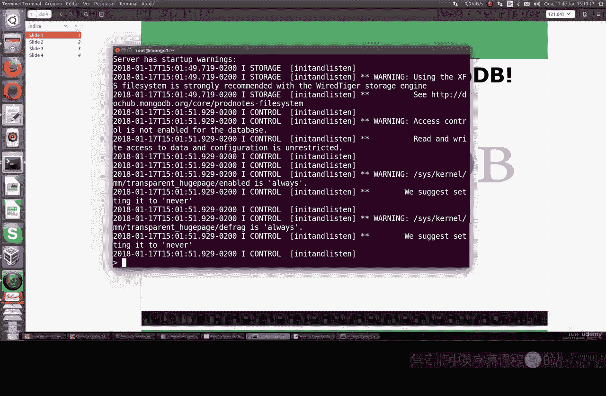
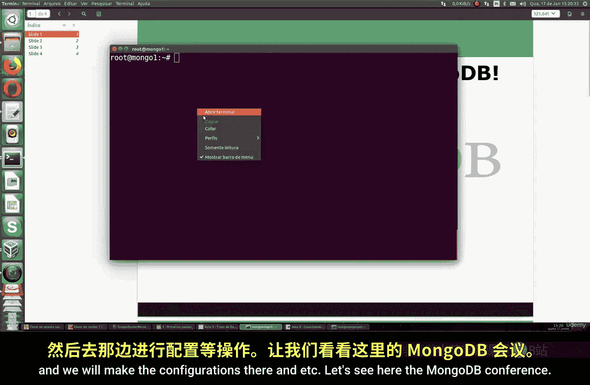
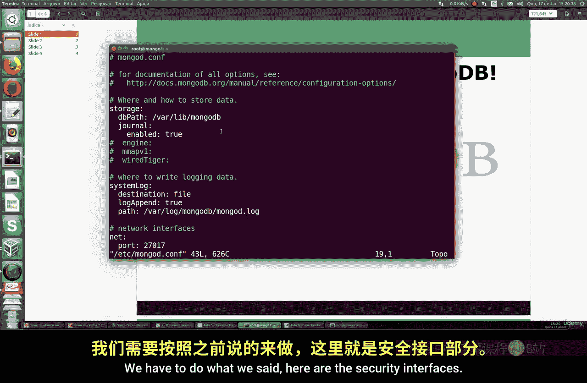
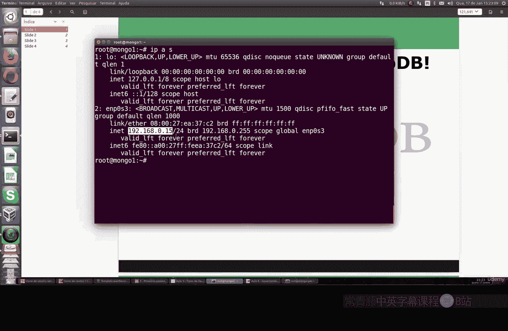
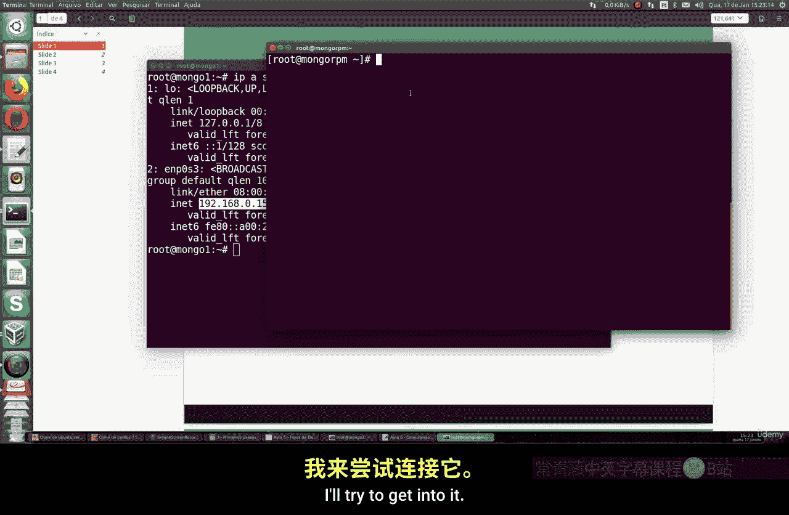
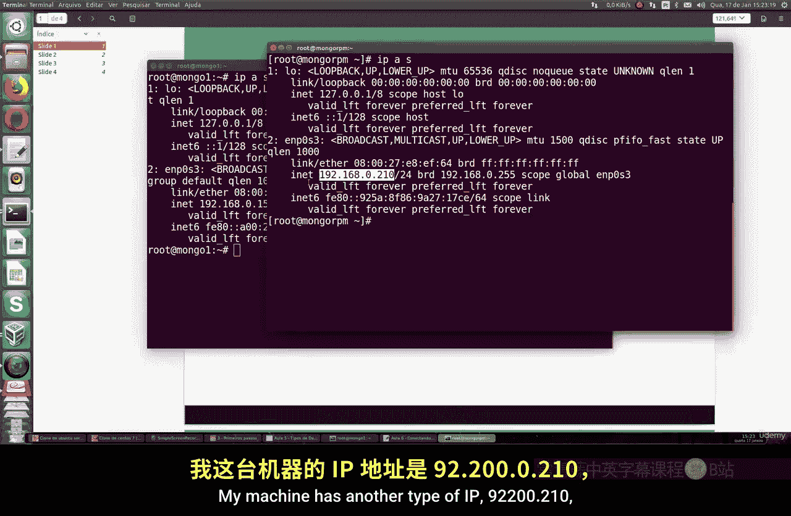
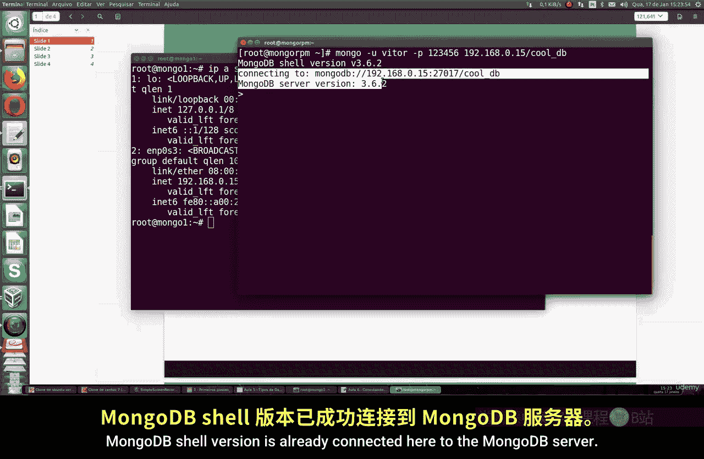
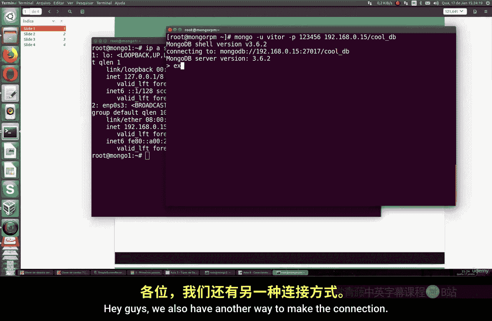
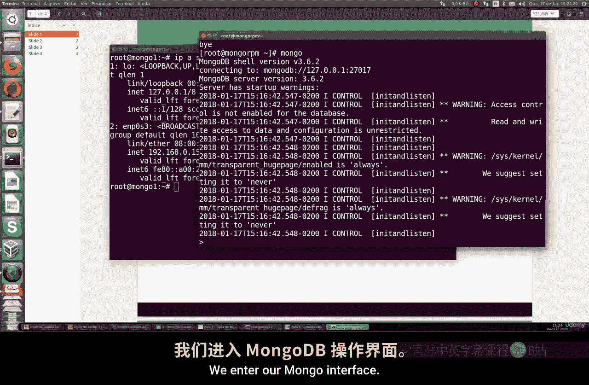
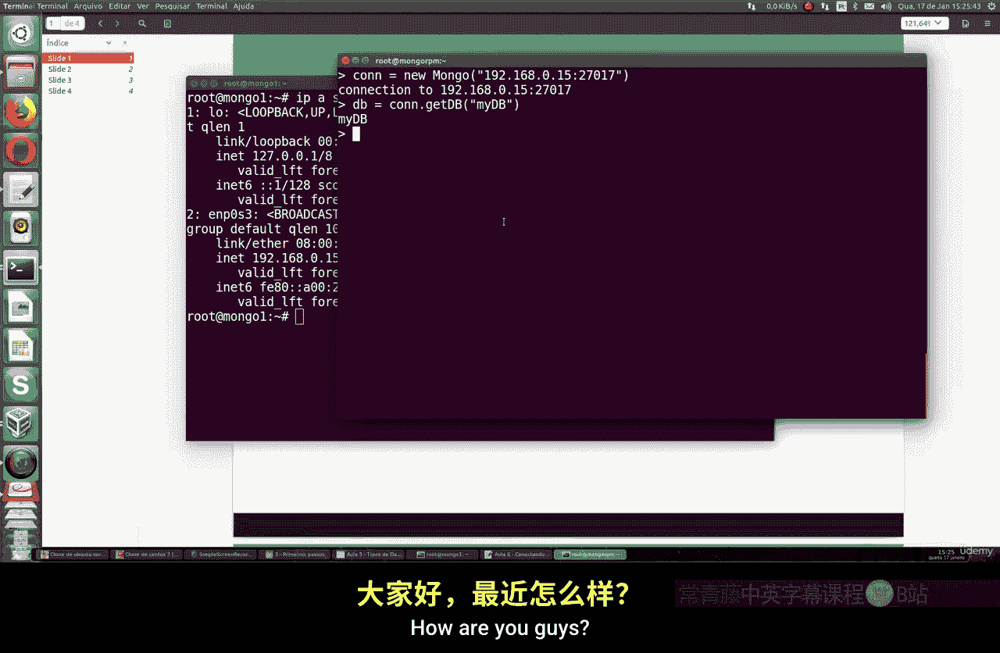

# 095：配置MongoDB远程连接 🔌

在本节课中，我们将学习如何配置MongoDB以允许远程服务器连接。默认情况下，MongoDB会阻止所有远程连接，但我们可以通过修改配置来启用它，从而实现服务器间的数据访问。




上一节我们介绍了MongoDB的基本操作，本节中我们来看看如何安全地配置远程连接。

## 创建用户账户

首先，我们需要在MongoDB中创建一个具有访问权限的用户。以下是具体步骤：



1.  连接到本地MongoDB服务。
2.  切换到 `admin` 数据库，该数据库用于管理用户账户和权限。
3.  使用 `db.createUser` 命令创建新用户。



以下是创建用户的代码示例：
```javascript
use admin
db.createUser({
  user: "vitor",
  pwd: "your_password_here",
  roles: [{ role: "readWrite", db: "testDB" }]
})
```
此命令创建了一个名为 `vitor` 的用户，密码由你指定，并授予其对 `testDB` 数据库的读写权限。成功执行后，系统会返回确认信息。

## 修改MongoDB配置

创建用户后，我们需要修改MongoDB的配置文件以允许远程连接并启用身份验证。

以下是需要完成的配置步骤：

1.  打开MongoDB的配置文件，通常位于 `/etc/mongod.conf`。
2.  找到 `net` 部分，配置 `bindIp` 参数。将其设置为 `0.0.0.0` 将允许所有IP连接（仅用于测试，生产环境应指定具体IP）。
3.  找到 `security` 部分，取消注释并添加 `authorization: enabled` 这一行，以启用连接授权。





配置文件修改后的关键部分应类似如下：
```yaml
net:
  port: 27017
  bindIp: 0.0.0.0



security:
  authorization: enabled
```
保存配置文件后，需要重启MongoDB服务以使更改生效。可以使用以下命令：
```bash
sudo systemctl restart mongod
```
重启后，使用 `sudo systemctl status mongod` 检查服务状态，确认其正在运行。



## 进行远程连接测试

配置完成后，我们可以从另一台机器测试远程连接。假设MongoDB服务器的IP地址是 `192.168.1.100`。





以下是两种连接方法：

**方法一：通过 `mongo` Shell命令直接连接**
在远程机器的命令行中，使用以下格式进行连接：
```bash
mongo -u vitor -p your_password_here 192.168.1.100:27017/testDB
```
连接成功后，会显示MongoDB Shell的版本信息，并进入指定的数据库。

**方法二：在已打开的MongoDB Shell内连接**
如果你已经在一个MongoDB Shell中，可以使用 `Mongo()` 构造函数建立到新服务器的连接：
```javascript
conn = new Mongo("192.168.1.100:27017")
db = conn.getDB("testDB")
```
这样，你就通过变量 `db` 连接到了远程的 `testDB` 数据库。



本节课中我们一起学习了如何为MongoDB配置远程访问。关键步骤包括：在MongoDB中创建授权用户、修改配置文件以允许远程绑定并启用安全授权，以及最后使用两种方法从客户端进行连接测试。请记住，在生产环境中，将 `bindIp` 设置为 `0.0.0.0` 存在安全风险，应将其替换为具体的、受信任的IP地址。