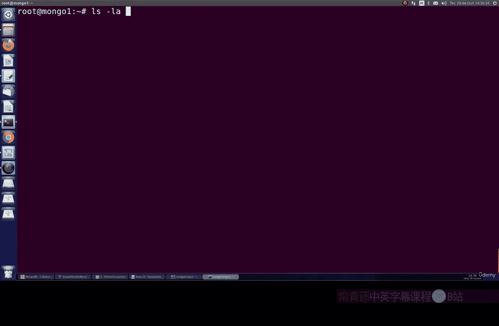
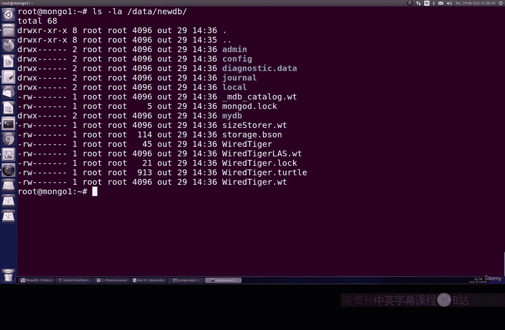
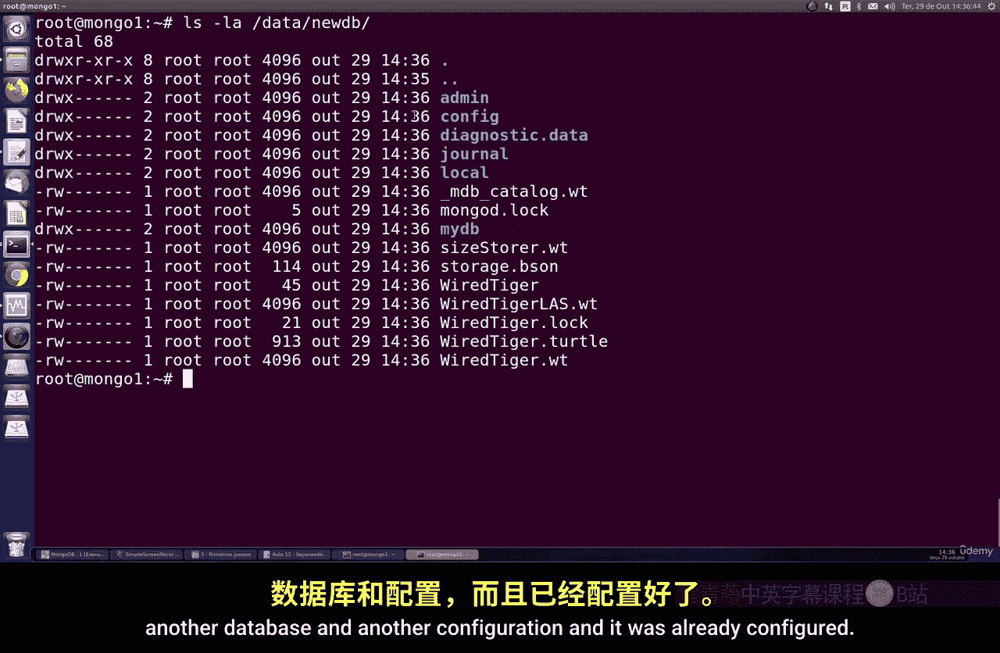
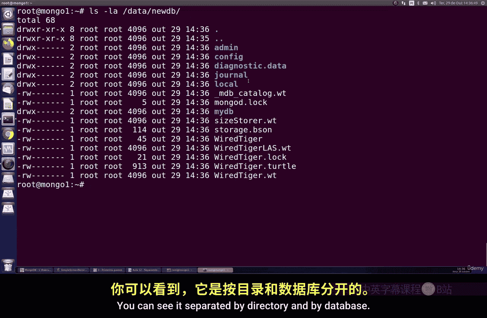
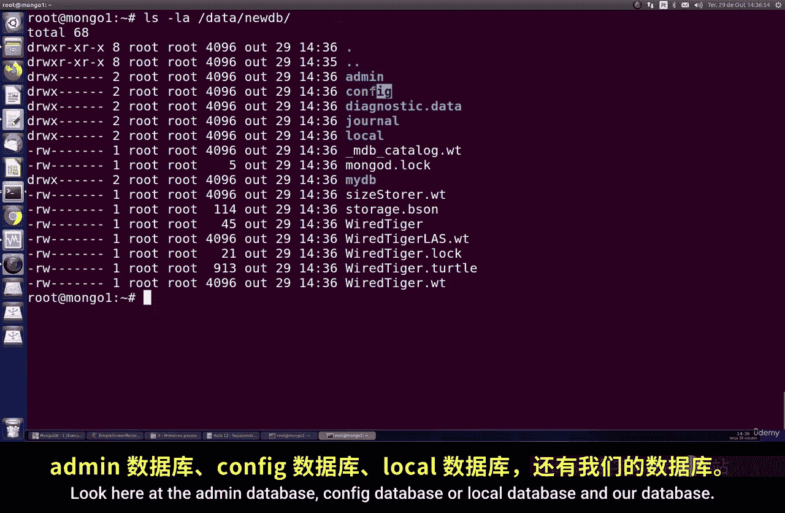
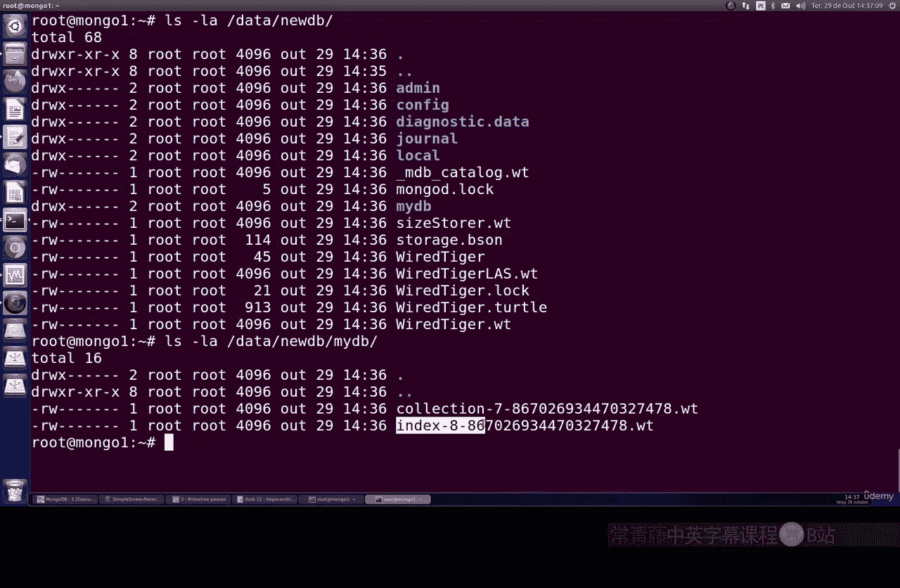
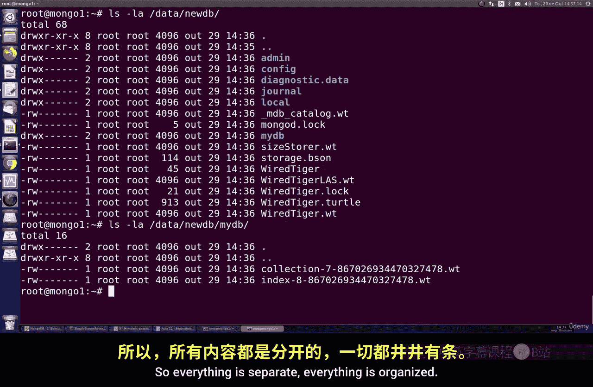
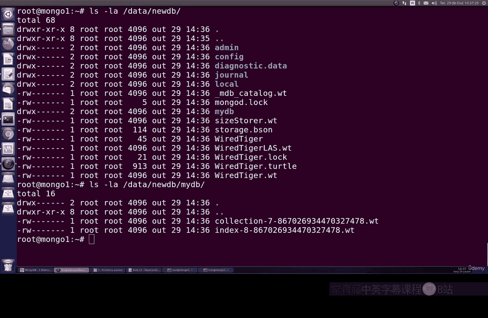
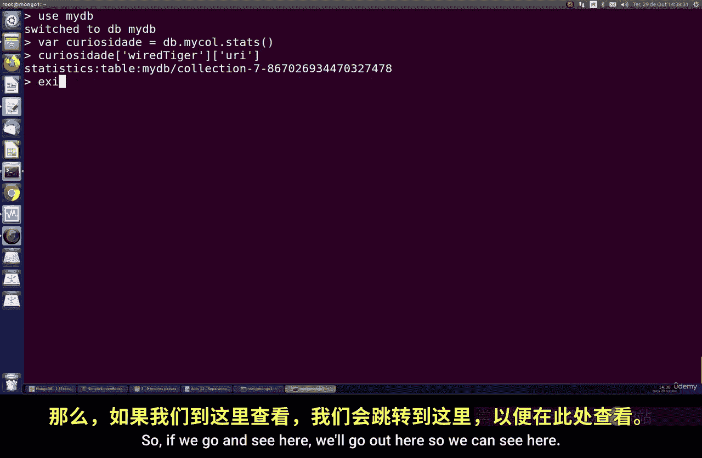
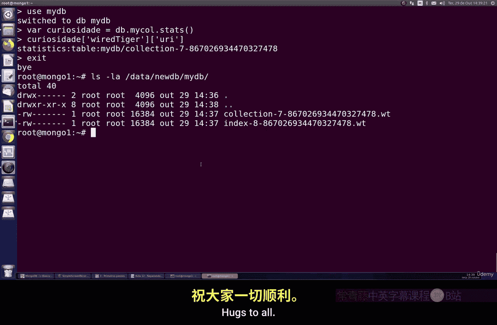

# 096：按数据库分离目录 📂

在本节课中，我们将学习如何在MongoDB中配置按目录分离数据库。这是一种用于管理高负载数据库、提升I/O性能并增强系统容错能力的技术。

## 概述

在某些系统和应用场景中，如果数据库的数据负载过高，可以考虑将数据存储在不同的数据库或磁盘卷上。理想的做法是将其物理分离或通过RAID技术，存储在不同的磁盘上。这样做可以保证或显著提升磁盘的输入输出性能，避免磁盘过载。这是一种冗余技术，也是一种避免磁盘拥塞的方法。即使只是在磁盘间进行分离，也能避免读写过载。此外，它还有助于隔离故障域，因此将数据库按目录分离是非常有益的做法。每个数据库或每个目录被分割后，可以在你的服务器磁盘间实现更均衡的负载分配。这也是一个非常重要的技巧。

## 配置分离目录

上一节我们介绍了分离目录的概念，本节中我们来看看具体的配置步骤。

假设你打算像之前的课程配置那样，在磁盘间创建分离的目录。例如，我们将为特定的数据库创建一个专门的目录。

以下是创建和配置分离目录的步骤：

1.  **创建数据库目录**：首先，我们创建一个名为 `McDurDataDB` 的目录，它将作为我们为单一特定数据库配置的磁盘路径。
    ```bash
    mkdir /path/to/McDurDataDB
    ```

2.  **启动MongoDB实例**：接着，我们创建一个MongoDB实例，并连接到这个实例。
    ```bash
    mongod --dbpath /path/to/McDurDataDB --port 27017
    ```

3.  **创建数据库并插入数据**：在连接到的实例中，创建一个数据库并进行简单的数据插入操作。
    ```javascript
    use myDB
    db.myCollection.insert({name: "example"})
    ```

4.  **查看配置**：使用 `ls -l` 命令可以查看MongoDB的所有配置。这里包含了索引、集合数据等所有内容，包括日志文件。

## 配置另一个数据库目录



现在，我们来为另一个特定的数据库创建另一个目录。



以下是配置另一个数据库目录的步骤：





1.  **创建新目录**：我们创建另一个目录，例如 `newDBdata`。
    ```bash
    mkdir /path/to/newDBdata
    ```





2.  **启动新的MongoDB实例**：使用新的目录路径启动另一个MongoDB实例。注意，如果使用相同端口，需要先停止之前的实例。
    ```bash
    # 先停止之前的实例
    # 然后启动新实例
    mongod --dbpath /path/to/newDBdata --port 27017
    ```



3.  **验证分离**：连接到新实例，创建并使用另一个数据库，然后检查数据目录。你会发现每个数据库的数据都存储在其独立的目录中，实现了按数据库和目录的分离与组织。



## 查看文件与数据库的关联

如果你好奇并想查看文件与数据库之间的具体关联，可以执行以下操作。

以下是查看文件与数据库关联的步骤：



1.  **进入数据库并查看状态**：在MongoDB shell中，进入你的数据库，使用 `db.stats()` 命令。
    ```javascript
    use myDB
    var dbStats = db.stats()
    printjson(dbStats)
    ```
    输出结果中的部分信息（如集合标识）对应着数据目录中的具体文件。

2.  **对比目录文件**：你可以退出MongoDB shell，到对应的数据目录下查看文件。你会发现，数据库状态中标识的文件名与数据目录中的物理文件是匹配的，这验证了数据库与存储文件的直接关联。

## 总结



本节课中我们一起学习了如何在MongoDB中配置按目录分离数据库。我们了解了这种技术对于管理高负载、提升I/O性能和实现故障隔离的好处。通过逐步实践，我们掌握了创建分离目录、启动独立实例以及验证分离效果的方法。最后，我们还学习了如何查看数据库状态与物理存储文件之间的关联。这是一个简单但非常有效的配置技巧，尤其适用于需要处理大型数据库、必须尽可能分散负载以保持高效运行的场景。