# 098：数据库操作 🗄️

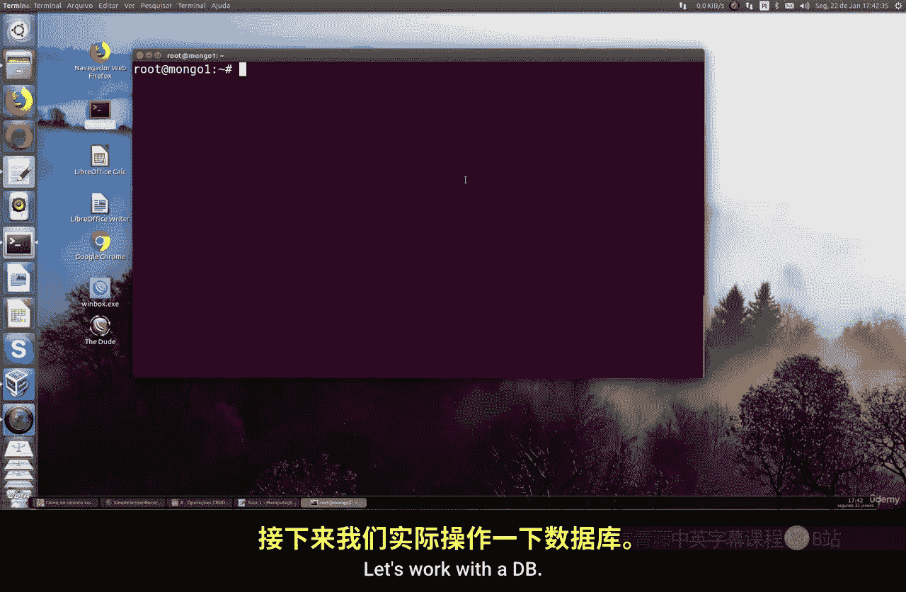

在本节课中，我们将学习如何在MongoDB中进行数据库操作，包括查询、更改、数据移除和文档命令。我们还将为管理员用户授予更广泛的权限，使其能够管理任何类型的数据库。

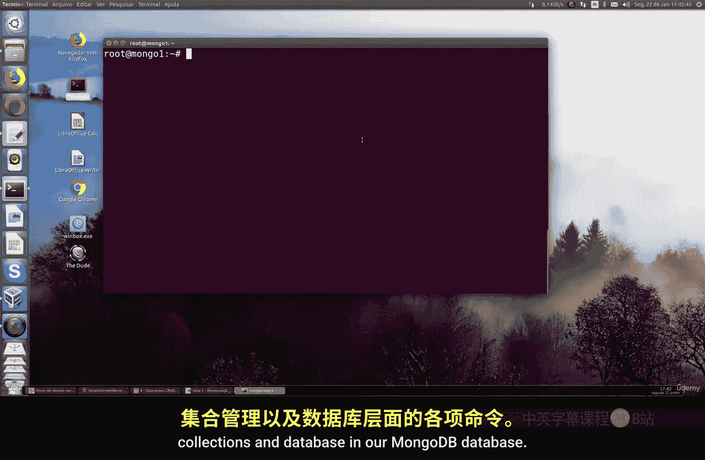

上一节我们介绍了MongoDB的基本概念，本节中我们来看看如何配置用户权限并进行数据库操作。

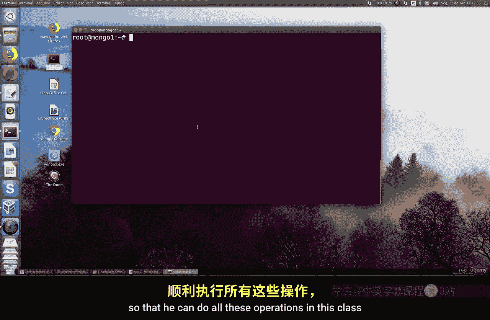

## 配置管理员用户权限

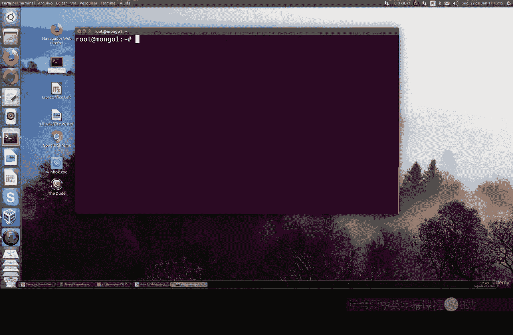

首先，我们需要为现有的管理员用户授予更多权限，使其能够操作任何类型的数据库，并拥有集群、备份和恢复的权限。


以下是配置步骤：

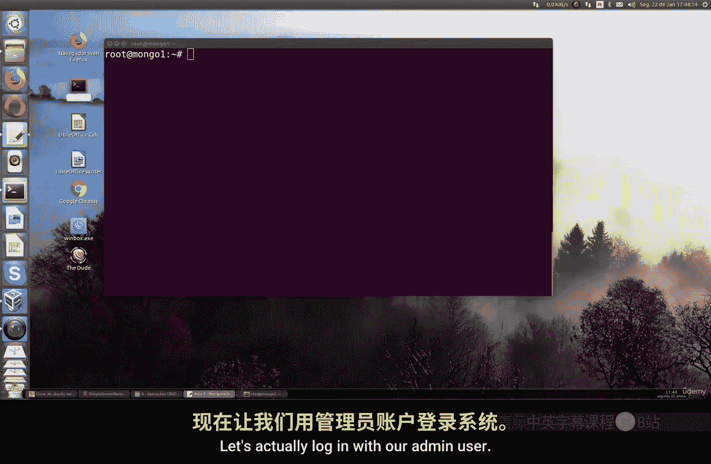

1.  使用管理员账户登录MongoDB。
    ```bash
    mongo -u admin -p 123456
    ```

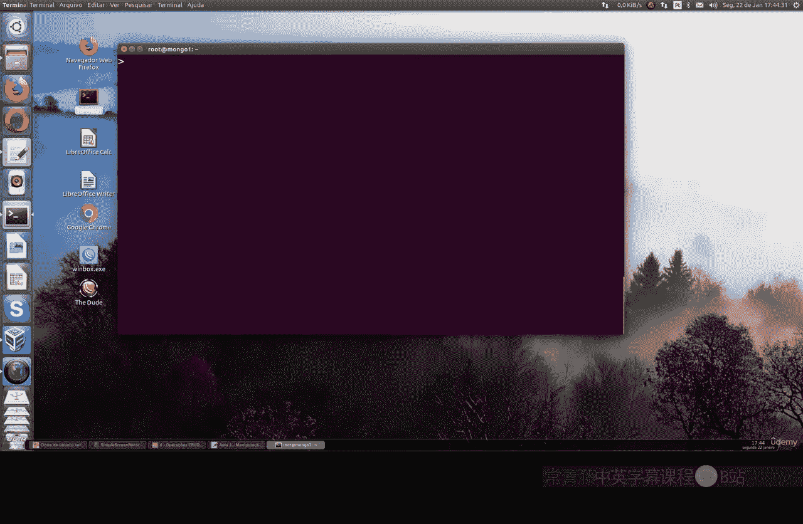

2.  切换到 `admin` 数据库。
    ```javascript
    use admin
    ```

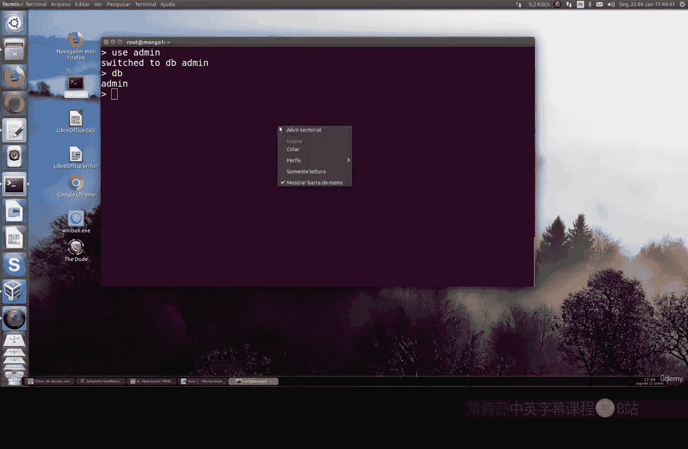

3.  查看当前管理员用户的权限。
    ```javascript
    db.getUser("admin")
    ```

4.  为用户添加额外的角色，包括数据库管理、集群管理和备份恢复权限。
    ```javascript
    db.grantRolesToUser("admin", [
        "dbAdminAnyDatabase",
        "clusterAdmin",
        "restore",
        "backup"
    ])
    ```

5.  再次查看用户权限，确认新角色已添加成功。
    ```javascript
    db.getUser("admin")
    ```

现在，管理员用户除了原有的读写和用户管理权限外，还拥有了管理任何数据库、集群以及执行备份和恢复操作的超级权限。

## 数据库的创建与删除

在MongoDB中，数据库的创建和删除操作非常直观。下面我们来看看具体如何操作。

### 创建数据库

使用 `use` 命令可以切换到一个数据库。如果该数据库不存在，MongoDB会为其创建上下文，但只有在其中插入文档后，数据库才会被持久化保存。

```javascript
use MyNewDB
```

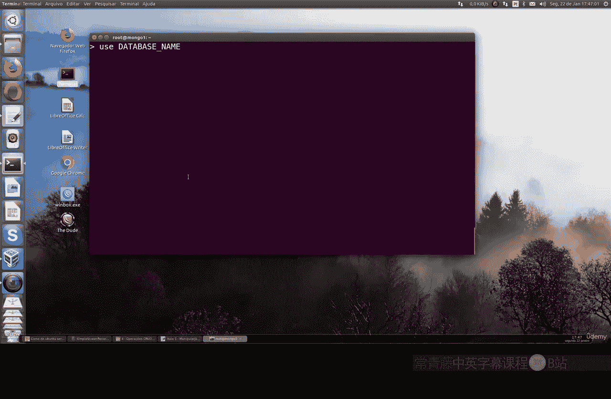

执行此命令后，虽然当前上下文切换到了 `MyNewDB`，但使用 `show dbs` 命令查看时，它并不会立即出现。

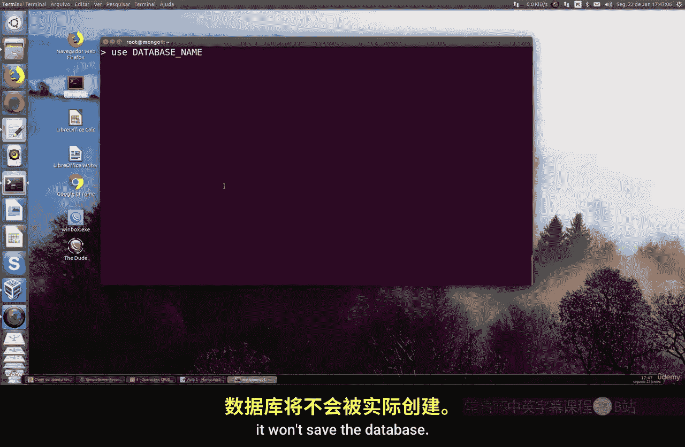

### 持久化数据库

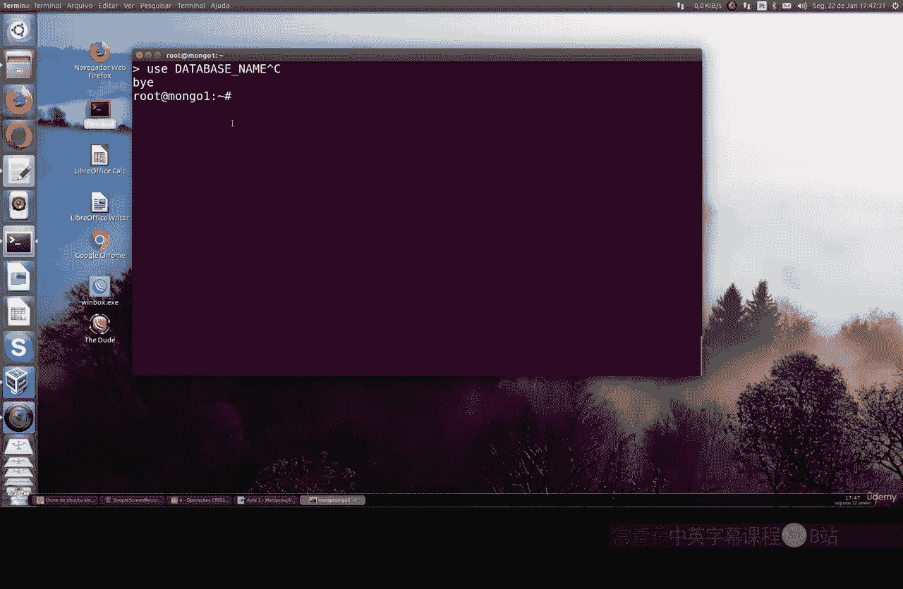

要使新数据库真正被创建并保存，需要向其中的某个集合插入至少一个文档。

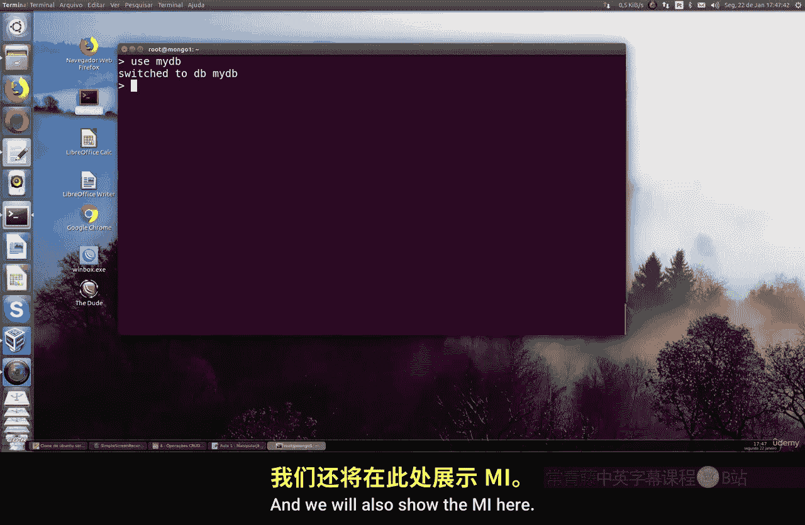

```javascript
db.myCollection.insertOne({ name: "test" })
```


执行插入操作后，再次运行 `show dbs`，就可以看到 `MyNewDB` 数据库了。

### 删除数据库

删除数据库是一个需要谨慎执行的高权限操作。使用 `db.dropDatabase()` 命令可以删除当前所在的数据库。

```javascript
use MyNewDB
db.dropDatabase()
```

执行此命令后，`MyNewDB` 数据库及其所有数据将被永久删除。使用 `show dbs` 命令可以确认它已消失。

**请注意**：数据库操作权限非常强大，赋予用户此类权限时需要格外小心，尤其是在生产环境中。

## 总结

本节课中我们一起学习了MongoDB的数据库管理操作。我们首先为管理员用户配置了包括 `dbAdminAnyDatabase`、`clusterAdmin` 在内的扩展权限。然后，我们实践了数据库的创建与删除，了解到数据库只有在插入数据后才会被真正创建，而 `db.dropDatabase()` 命令可以彻底删除数据库及其所有内容。掌握这些基础操作是进行更复杂数据管理的第一步。