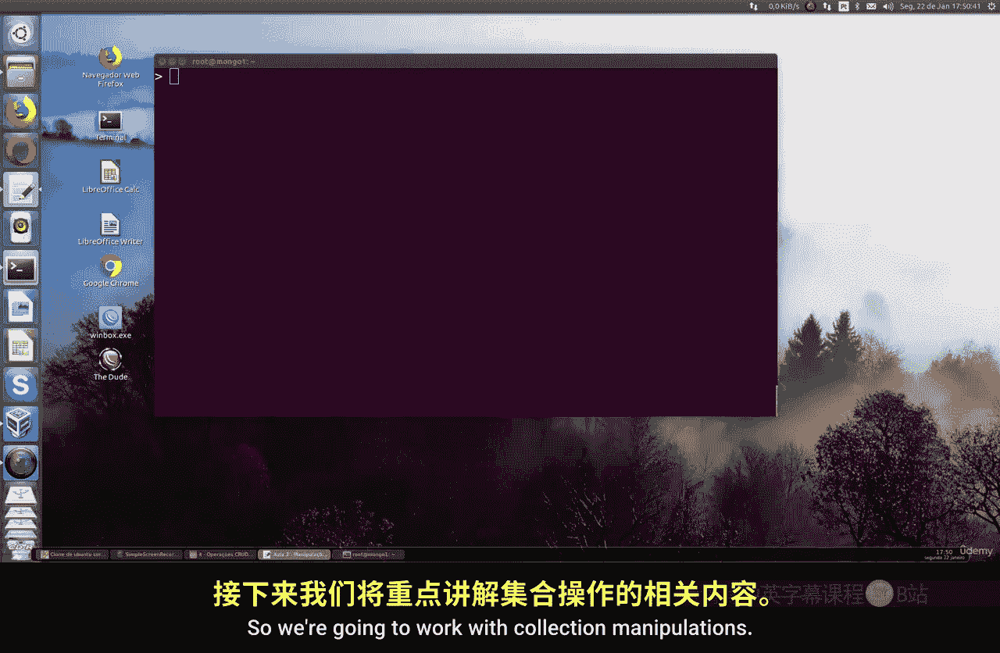
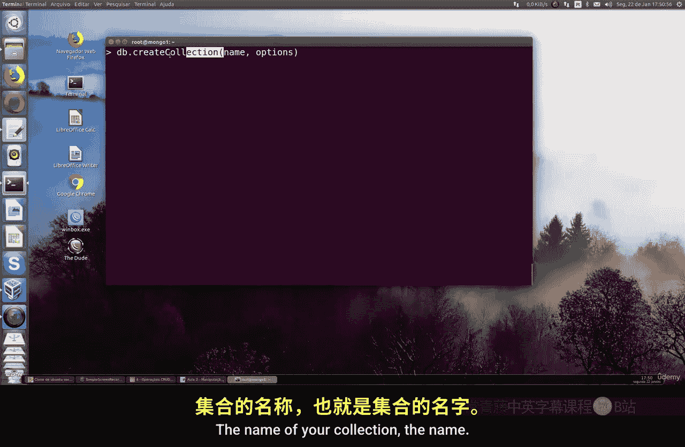
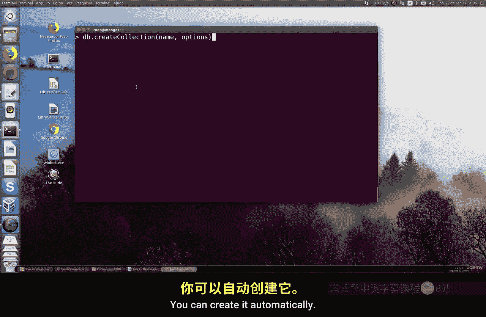
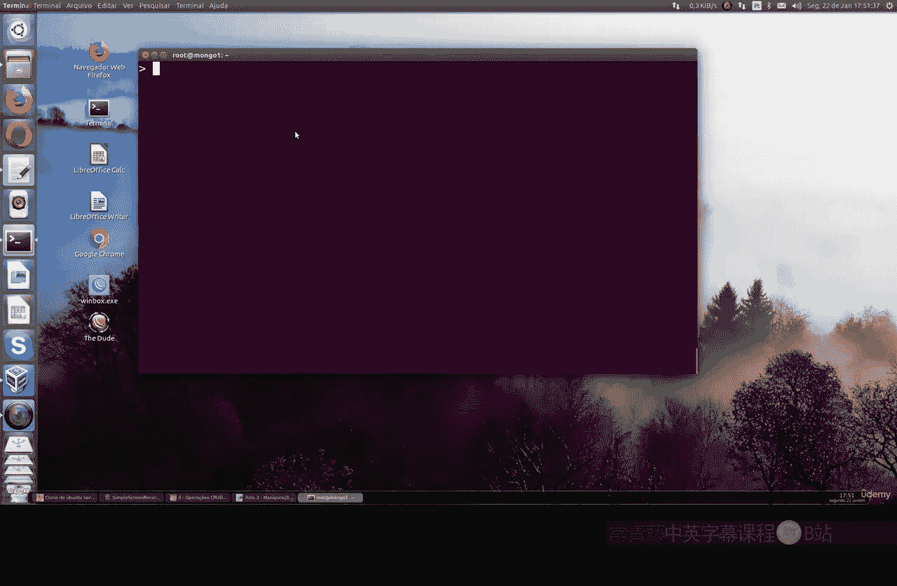
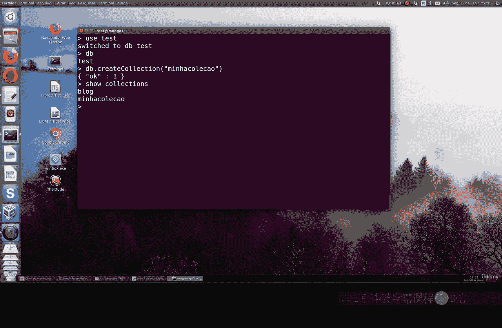
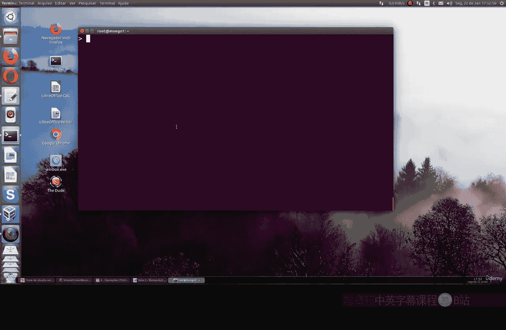
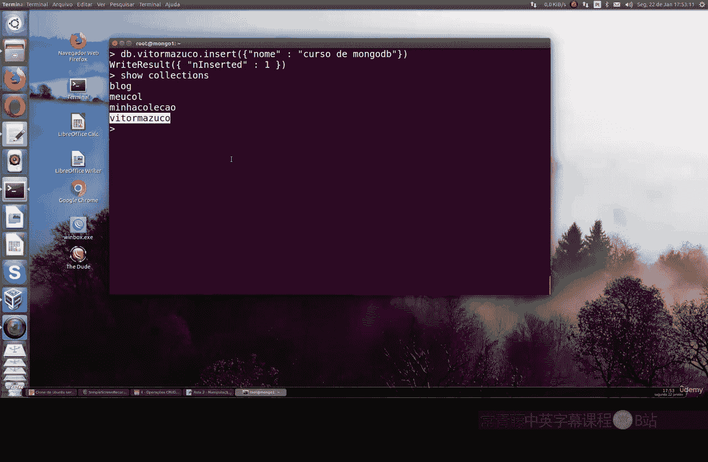
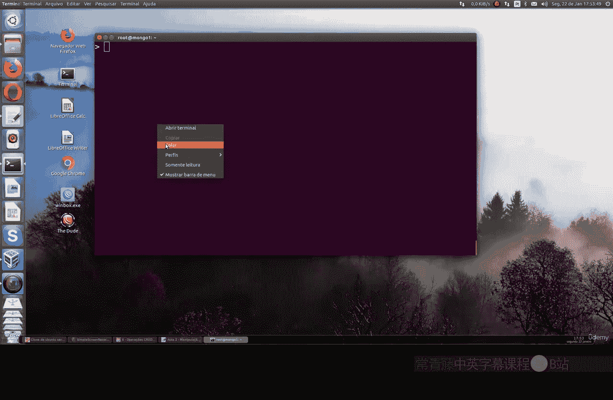

MongoDB基础：P99：集合操作 🗂️



在本节课中，我们将学习如何在MongoDB中操作集合。集合是数据库中的一种结构，文档则存放在集合内部。我们将涵盖集合的创建、查看和删除等基本操作。



---

### 集合的创建



集合的创建语法非常简单。你可以使用 `db.createCollection()` 命令来显式创建一个集合。



**基本语法**：
```javascript
db.createCollection("集合名称", 选项)
```
其中，“选项”参数不是必须的，你可以选择不使用它。

实际上，你并非必须使用上述命令来创建集合。MongoDB提供了一种更便捷的自动创建方式。



### 自动创建集合

当你向一个不存在的集合中插入文档时，MongoDB会自动创建该集合。这是一种非常方便的方法。

让我们通过一个例子来实践。首先，我们使用 `test` 数据库。
```javascript
use test
```
使用 `db` 命令可以确认我们当前正在使用哪个数据库。

现在，我们显式创建一个名为 `myCollection` 的集合。
```javascript
db.createCollection("myCollection")
```
要查看当前数据库中的所有集合，可以使用 `show collections` 命令。
```javascript
show collections
```
执行后，你会看到之前课程中创建的 `blog` 集合，以及我们刚刚创建的 `myCollection`。



接下来，我们演示自动创建集合。直接向一个名为 `vitor` 的新集合中插入一个文档。
```javascript
db.vitor.insertOne({name: "MongoDB Course"})
```
这样，我们就自动创建了一个名为 `vitor` 的集合，并向其中插入了一个文档。这种方式无需预先执行创建集合的命令。



### 集合的删除

要删除一个集合，可以使用 `db.集合名.drop()` 命令。



让我们先创建一个用于演示的集合。
```javascript
db.createCollection("demoCollection")
show collections // 确认集合已创建
```
现在，我们删除这个 `demoCollection` 集合。
```javascript
db.demoCollection.drop()
```
再次执行 `show collections`，你会发现 `demoCollection` 集合已被完全删除。

**重要提醒**：删除操作是不可逆的。一旦使用 `drop()` 命令删除了集合，其中的所有数据都将永久丢失，无法恢复。因此，在执行删除操作前请务必谨慎确认。

---

本节课中，我们一起学习了MongoDB集合的基本操作。我们掌握了如何使用 `db.createCollection()` 显式创建集合，也了解了通过插入文档来自动创建集合的便捷方法。最后，我们学习了如何使用 `drop()` 命令删除集合，并强调了该操作的不可逆性。