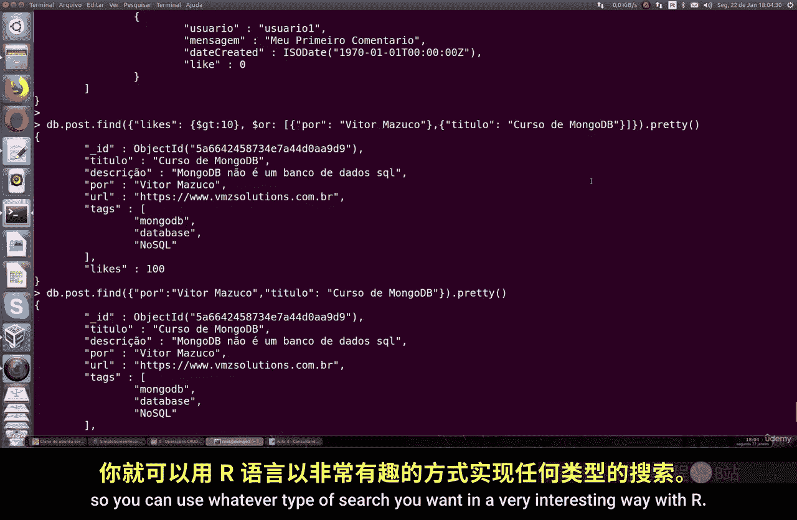

# 101：文档查询

## 概述
在本节课中，我们将学习如何在 MongoDB 中查询文档。我们将详细介绍查询的基本语法、如何美化查询结果的显示，以及如何使用逻辑运算符 `$or` 和 `$and` 进行更复杂的条件查询。


## 基本查询与美化显示
上一节我们介绍了 MongoDB 的基本操作，本节中我们来看看如何进行文档查询。

在 MongoDB 中查询文档的语法非常简单。你可以使用 `find` 命令，并指定要查询的集合名称。


以下是使用 `find` 命令的基本方式：
```javascript
db.collectionName.find()
```

为了使查询结果更易于阅读，我们可以使用 `pretty` 命令。例如，假设我们有一个名为 `posts` 的集合，使用 `pretty` 命令可以使输出格式更清晰、更美观。


```javascript
db.posts.find().pretty()
```

如果不使用 `pretty` 命令，查询结果会紧密地堆叠在一起，难以阅读。使用 `pretty` 命令后，文档内容会以更结构化的格式显示，方便查看每个字段和值。


## 使用 `$or` 运算符进行查询
接下来，我们学习如何使用逻辑运算符进行条件查询。首先介绍 `$or` 运算符。

`$or` 运算符允许你查找满足多个条件中至少一个的文档。其基本语法是在 `find` 命令中使用 `$or` 操作符。


以下是 `$or` 查询的语法结构：
```javascript
db.collection.find({
  $or: [
    { condition1 },
    { condition2 }
  ]
})
```

例如，我们可以在 `posts` 集合中查询作者是 “Victor Hugo” 或者标题是 “MongoDB title” 的文档。只要满足其中一个条件，查询就会返回结果。


```javascript
db.posts.find({
  $or: [
    { author: "Victor Hugo" },
    { title: "MongoDB title" }
  ]
}).pretty()
```

如果两个条件都满足，查询会返回所有匹配的文档内容。如果没有任何文档满足条件，查询结果将为空。


## 使用 `$and` 运算符进行查询
现在，我们来看看 `$and` 运算符的用法。


`$and` 运算符要求文档必须同时满足所有指定的条件。如果其中任何一个条件不满足，文档就不会被包含在结果中。


以下是 `$and` 查询的语法示例：
```javascript
db.posts.find({
  $and: [
    { condition1 },
    { condition2 }
  ]
}).pretty()
```

在 MongoDB 中，当你使用逗号分隔多个条件时，默认就是 `$and` 操作。因此，你通常不需要显式地写出 `$and`。


例如，以下查询会查找 `likes` 数量大于 10 **并且** 小于 100 的文档：
```javascript
db.posts.find({
  likes: { $gt: 10 },
  likes: { $lt: 100 }
}).pretty()
```

在这个例子中，只有同时满足这两个条件的文档才会被返回。如果集合中有一个文档有 100 个赞，另一个有 0 个赞，那么它们都不会出现在结果中，因为 100 不小于 100，而 0 不大于 10。


## 组合使用 `$and` 与 `$or`
最后，我们可以将 `$and` 和 `$or` 组合起来，构建更复杂的查询逻辑。

你可以根据需求，灵活地组合这些运算符来精确地定位你需要的文档。


例如，查询作者为 “Victor Hugo” **并且**（标题为 “Intro” **或者** `likes` 大于 50）的文档：
```javascript
db.posts.find({
  author: "Victor Hugo",
  $or: [
    { title: "Intro" },
    { likes: { $gt: 50 } }
  ]
}).pretty()
```

通过这种方式，你可以使用 `$or` 和 `$and` 进行各种类型的搜索，操作起来非常直观和简单。




## 总结
本节课中我们一起学习了 MongoDB 的文档查询。我们掌握了使用 `find` 命令进行基本查询，使用 `pretty` 命令美化输出。重点学习了 `$or` 和 `$and` 逻辑运算符的语法和应用场景，它们能帮助我们构建从简单到复杂的查询条件。通过组合这些运算符，你可以高效地在 MongoDB 集合中检索所需的数据。