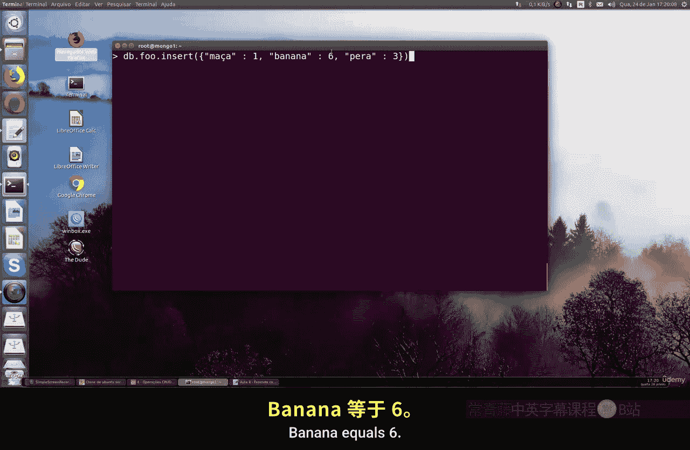
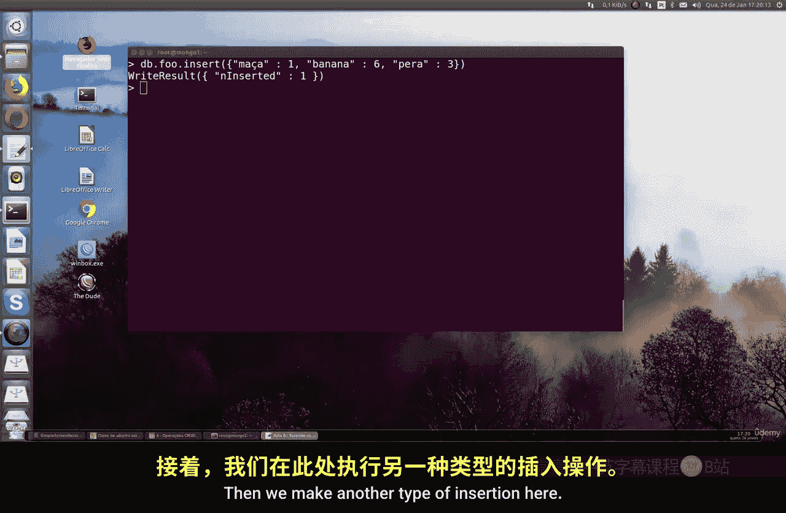
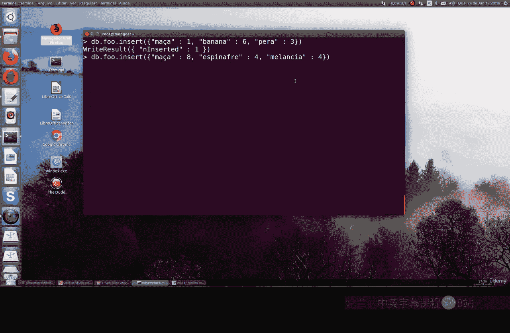

# 105：使用 `$where` 进行查询 🔍


在本节课中，我们将要学习 MongoDB 中 `$where` 查询操作符的使用。这是一种基于 JavaScript 表达式的查询方式，虽然功能强大，但在实际应用中需要谨慎使用。


## 概述


`$where` 操作符允许在查询中执行 JavaScript 函数，从而进行更复杂的条件判断。然而，这种查询方式通常不被推荐，因为它会显著降低查询性能。


上一节我们介绍了基础的查询操作，本节中我们来看看如何使用 `$where` 进行高级查询。


## `$where` 查询的基本概念


`$where` 子句可以在查询中使用 JavaScript 函数。其核心逻辑是：如果函数返回 `true`，则该文档会被包含在结果集中；如果返回 `false`，则被排除。


**代码示例：**
```javascript
db.collection.find( { $where: function() { return this.apple > this.banana; } } )
```


## 为什么不推荐使用 `$where`？


主要有以下几个原因：


以下是使用 `$where` 的主要缺点：
*   **性能低下**：`$where` 查询无法利用数据库索引，必须为每个文档执行 JavaScript 函数，因此速度比常规查询慢得多。
*   **安全风险**：如果允许最终用户或普通用户执行包含 `$where` 的命令，可能会带来安全漏洞，因为它可以执行任意 JavaScript 代码。
*   **资源消耗大**：在高并发场景下（例如每秒数千次查询），使用 `$where` 会严重拖累 MongoDB 数据库的整体性能。


因此，`$where` 子句应非常谨慎地使用，或者完全避免使用。




## `$where` 的常见用途



尽管不推荐，但 `$where` 最常见的用途是比较同一文档中两个键的值。



假设我们有一些文档结构如下，并插入到 `food` 集合中：

**代码示例：**
```javascript
// 插入文档1
db.food.insertOne( { apple: 1, banana: 6, pear: 3 } )

// 插入文档2
db.food.insertOne( { apple: 8, spinach: 4, watermelon: 4 } )
```

现在，我们想找出 `apple` 值大于 `banana` 值的文档。由于这是对同一文档内字段的比较，可以使用 `$where`。

**查询示例：**
```javascript
db.food.find( { $where: function() { return this.apple > this.banana; } } )
```
这个查询会返回 `apple` 为 8 的文档（因为 8 > 6？注意：第二个文档没有 `banana` 字段，比较结果为 `false`。实际应返回 `apple: 8, spinach: 4, watermelon: 4` 的文档，因为 `this.banana` 为 `undefined`，`8 > undefined` 在 JavaScript 中为 `false`？此处原视频逻辑可能不严谨，旨在演示语法）。它展示了 `$where` 函数如何访问文档中的字段（通过 `this` 关键字）。

## 总结

本节课中我们一起学习了 MongoDB 的 `$where` 查询操作符。
*   我们了解了 `$where` 允许在查询中嵌入 JavaScript 函数。
*   我们认识到由于其**性能差**、**潜在安全风险**和**高资源消耗**，**在实际开发中应尽量避免使用**。
*   我们看到了它的一种可能用途——比较同一文档内的字段值。

请记住，对于绝大多数查询需求，MongoDB 提供的标准查询操作符（如 `$gt`, `$lt`, `$eq` 等）是更高效、更安全的选择。`$where` 更像是一个需要了解但应慎用的工具。