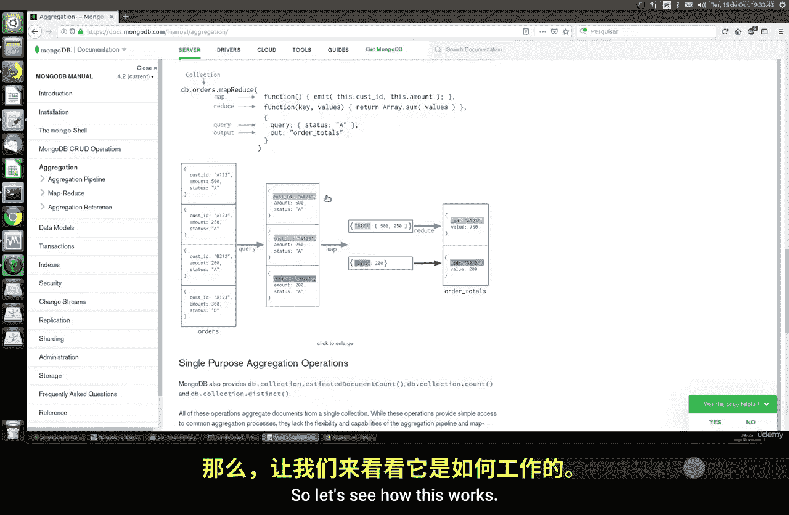
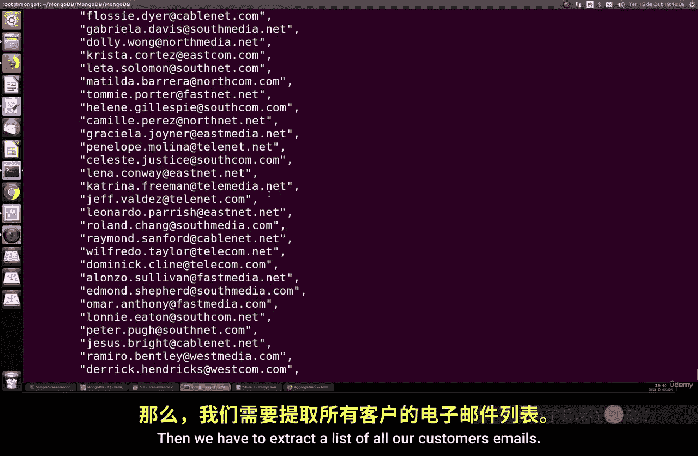

# 107：理解聚合框架 🧩

在本节课中，我们将要学习 MongoDB 中的聚合框架。聚合框架允许我们执行比简单查询更复杂的数据处理操作，例如对数据进行分组、排序、筛选和计算。

## 概述

聚合框架是 MongoDB 中一个强大的工具，它使数据库开发者能够返回经过分组、排序、筛选或转换的数据子集。其核心目标是通过组合来自不同文档的数据，并对其执行一种或多种操作（如求和、求平均值）来精炼查询结果。这种操作方式与 SQL 中的 `GROUP BY`、`ORDER BY`、`LIMIT` 以及 `AVG`、`SUM`、`COUNT` 等函数有相似之处。

## 准备工作

上一节我们介绍了聚合框架的基本概念，本节中我们来看看如何实际操作。首先，我们需要一个数据库来练习。我们将从 GitHub 克隆一个示例数据集并导入到 MongoDB 中。

以下是操作步骤：

1.  从 GitHub 克隆示例数据集仓库。
2.  使用 `mongorestore` 命令恢复数据库。在本例中，我们无需用户名和密码。
3.  恢复完成后，数据库中将包含三个集合：`customers`（客户）、`orders`（订单）和 `products`（产品）。



现在，让我们连接到 MongoDB 并查看数据库。使用 `show dbs` 命令可以列出所有数据库。接着，使用 `use` 命令切换到我们刚导入的数据库。

## 探索数据

在深入聚合操作之前，我们先简单查看一下数据，以便了解其结构。

以下是 `customers` 集合中的文档示例，它包含了客户的各种信息：

```json
{
  "_id": ObjectId("..."),
  "password": "...",
  "email": "customer@example.com",
  "phone": "...",
  "country": "Canada",
  "postcode": "..."
}
```

`orders` 集合包含了客户下的订单，其中记录了产品、日期、数量和金额。`products` 集合则存储了产品的详细信息，如标题、描述和价格。

## 执行简单查询

为了理解聚合的起点，我们先执行一些简单的查询。例如，我们可以查找来自特定国家的所有客户。

使用 `db.customers.find({"country": "Canada"})` 可以筛选出加拿大的客户。要计算数量，可以使用 `db.customers.find({"country": "Canada"}).count()`。

我们还可以获取数据库中所有不同的国家列表，使用 `db.customers.distinct("country")`。同样，要获取所有客户的邮箱列表，可以使用 `db.customers.distinct("email")`。

这些简单操作是数据筛选和提取的基础。

## 引入聚合管道

简单的 `find` 和 `distinct` 命令功能有限。当我们需要对数据进行分组、计算总和或平均值等更复杂的操作时，就需要使用聚合框架。

聚合框架通过一个称为“管道”的概念工作。数据像水流一样通过一系列阶段（stage），每个阶段对数据进行不同的处理（如 `$match` 筛选、`$group` 分组、`$sort` 排序），最终输出我们想要的结果。



接下来的章节中，我们将学习如何构建这样的聚合管道，对 `customers`、`orders` 和 `products` 数据进行连接和计算，例如计算每个国家的订单总金额、找出最畅销的产品等。


## 总结


本节课中我们一起学习了 MongoDB 聚合框架的基本概念和用途。我们准备了一个示例数据库，并查看了其中的数据结构。通过简单的查询操作，我们为后续更复杂的聚合管道学习打下了基础。聚合框架是进行高级数据分析和报告的关键工具，在接下来的课程中，我们将深入探讨其各个阶段和操作符。