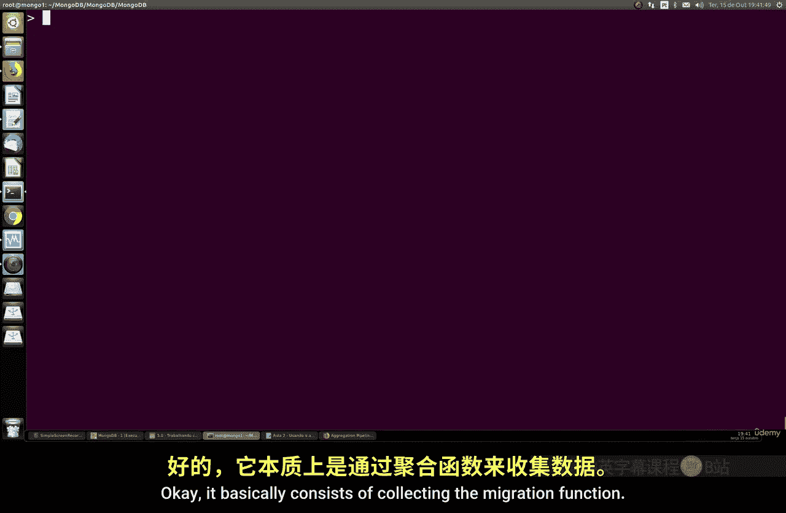
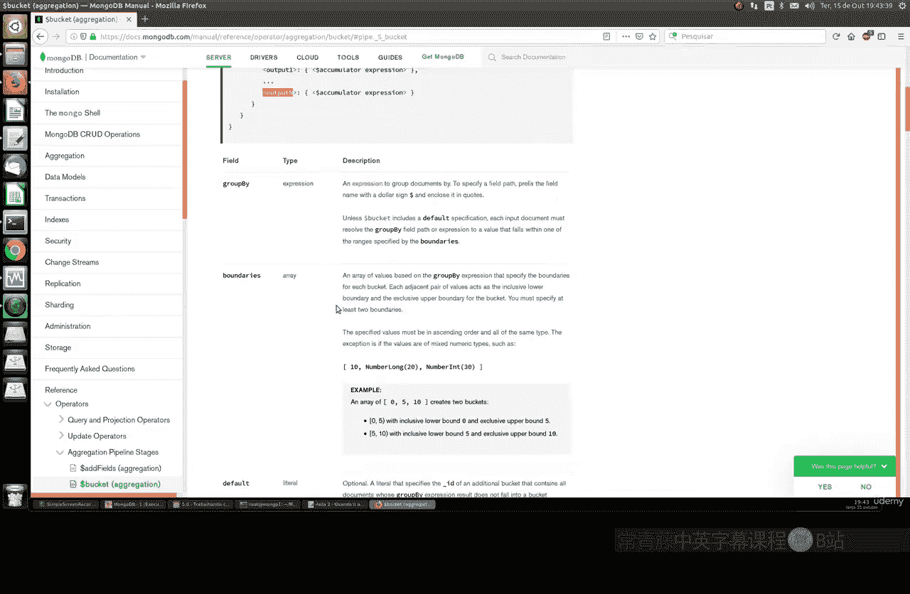
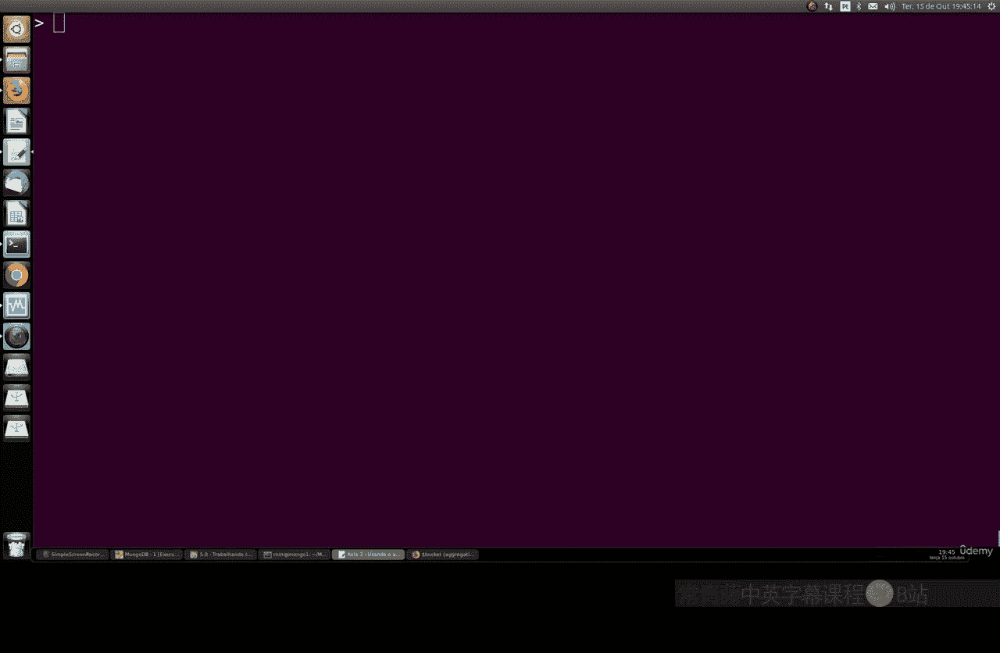
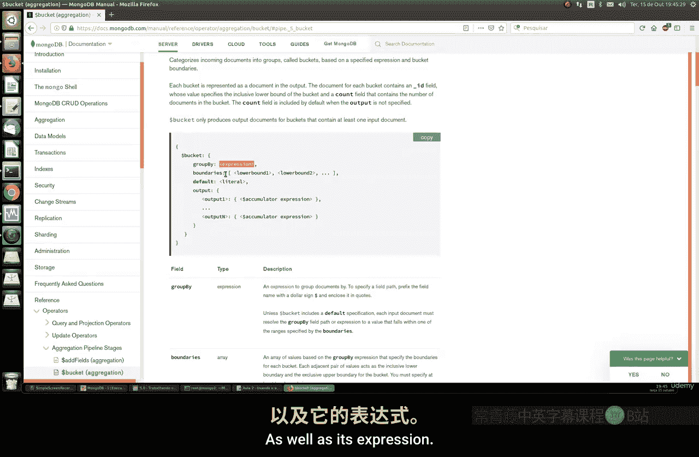
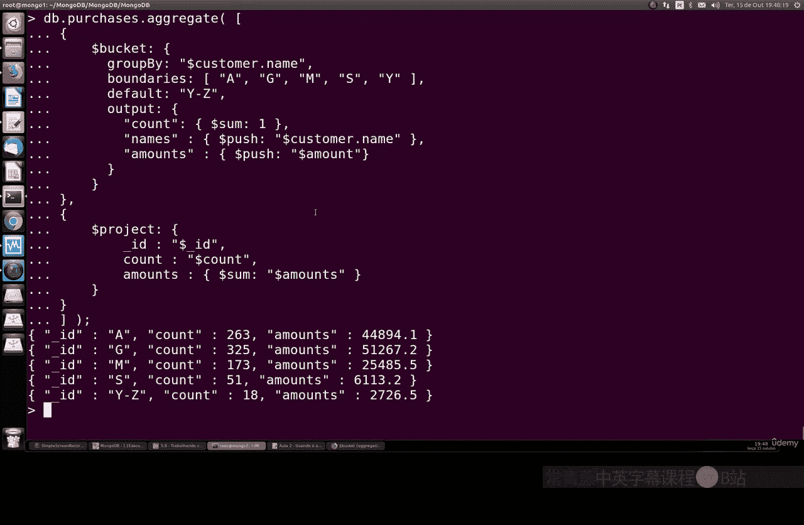

# 108：使用 $bucket 阶段进行分组统计 🪣



在本节课中，我们将学习 MongoDB 聚合框架中的一个重要阶段：`$bucket`。我们将了解如何使用它来将文档分组到指定的范围（桶）中，并进行统计计算。

上一节我们介绍了 MongoDB 聚合框架的基本概念，本节中我们来看看 `$bucket` 这个具体的聚合阶段操作符。

`$bucket` 是一个阶段操作符，它允许你将输出文档分割成一系列称为“桶”的组。每个桶对应一个指定的范围。其基本语法结构如下：

```javascript
{
  $bucket: {
    groupBy: <expression>, // 用于分组的字段或表达式
    boundaries: [ <lowerbound1>, <lowerbound2>, ... ], // 定义桶边界的数组
    default: <literal>, // 可选，指定不属于任何边界范围的文档的桶名
    output: { // 可选，定义每个桶的输出文档
      <output1>: { <$accumulator expression> },
      ...
    }
  }
}
```

*   `groupBy`：指定用于分组的字段或表达式。
*   `boundaries`：一个数组，定义了每个桶的边界值。例如 `[0, 10, 20, 30]` 会创建三个桶：`[0, 10)`， `[10, 20)`， `[20, 30)`。边界值必须是升序且连续的。
*   `default`：可选参数。指定一个桶的名称，用于存放所有 `groupBy` 表达式的值小于最低边界或大于等于最高边界的文档。
*   `output`：可选参数。指定每个桶输出文档的格式，可以包含使用累加器表达式（如 `$sum`， `$count`）计算的字段。



## 实战演练：按客户姓名首字母分组统计订单

现在，让我们通过一个具体的例子来理解 `$bucket` 的用法。假设我们有一个名为 `orders` 的集合，其中存储了客户订单信息，包含客户姓名、产品、日期、数量和总价等字段。

我们的目标是：根据客户姓名的首字母，将客户分组到不同的“桶”中，并统计每个桶内的订单总数和总金额。

以下是实现此目标的聚合管道步骤：



1.  **使用 `$bucket` 按姓名首字母分组**：我们将根据客户姓名的首字母创建几个桶，例如 A-G， G-M， M-Y， 以及一个默认桶 Y-Z。
2.  **在 `$bucket` 阶段内进行统计**：在定义桶的同时，我们使用 `output` 参数来计算每个桶的文档数量（即客户数）和订单总金额。
3.  **使用 `$project` 阶段调整输出格式**（可选）：为了使结果更清晰，我们可以使用 `$project` 阶段来重命名字段或调整输出结构。



具体的聚合查询代码如下：

```javascript
db.orders.aggregate([
  {
    $bucket: {
      groupBy: "$customerName", // 按客户姓名字段分组
      boundaries: [ "A", "G", "M", "Y" ], // 定义桶的边界： [A, G), [G, M), [M, Y)
      default: "Y-Z", // 首字母为 Y 及以后的客户放入名为 “Y-Z” 的桶
      output: {
        "customerCount": { $sum: 1 }, // 统计该桶内的客户数量
        "totalOrderValue": { $sum: "$totalValue" } // 累加该桶内所有订单的总金额
      }
    }
  },
  {
    $project: { // 调整输出格式，使结果更易读
      letterRange: "$_id", // 将桶的标识（_id）重命名为 letterRange
      numberOfCustomers: "$customerCount",
      totalRevenue: "$totalOrderValue",
      _id: 0 // 不显示默认的 _id 字段
    }
  }
])
```

执行上述聚合管道后，你可能会得到类似以下的结果：

```json
{ "letterRange": "A", "numberOfCustomers": 2003, "totalRevenue": 441000 }
{ "letterRange": "G", "numberOfCustomers": 325, "totalRevenue": 51000 }
{ "letterRange": "M", "numberOfCustomers": 73, "totalRevenue": 6000 }
{ "letterRange": "Y-Z", "numberOfCustomers": 18, "totalRevenue": 2700 }
```

结果解读：
*   首字母在 A 到 G 之前的客户最多（2003人），产生的总营收也最高（441，000）。
*   首字母在 G 到 M 之前的客户有325人，总营收为51，000。
*   以此类推。通常，以字母表靠前字母开头的姓名会更常见，因此对应的桶内文档数量和统计值也更高。

通过这个例子，我们完成了一次高级的数据聚合查询。我们首先使用 `$bucket` 根据客户姓名首字母进行了分组，然后在分组的同时，使用累加器表达式 `$sum` 对每个组进行了数量统计和金额汇总。



本节课中我们一起学习了 MongoDB 聚合框架中的 `$bucket` 阶段。我们了解了它的语法结构，并通过一个按客户姓名首字母分组统计订单的实例，掌握了如何定义桶的边界、处理默认值以及计算分组统计量。`$bucket` 是进行数据分区间统计的强有力工具，结合其他聚合阶段如 `$project`，可以构建出复杂而高效的数据分析管道。