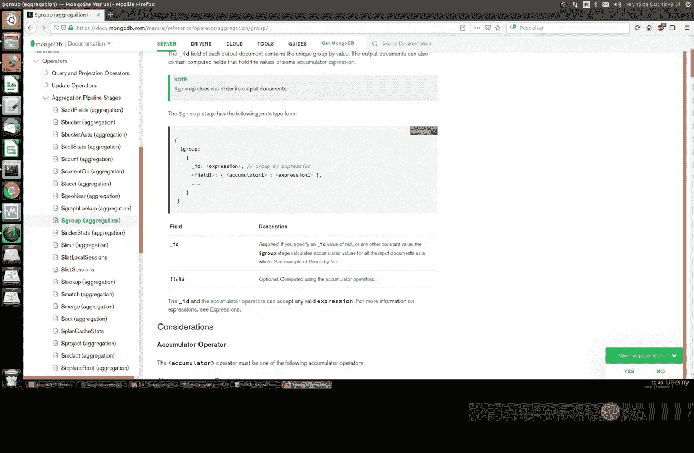
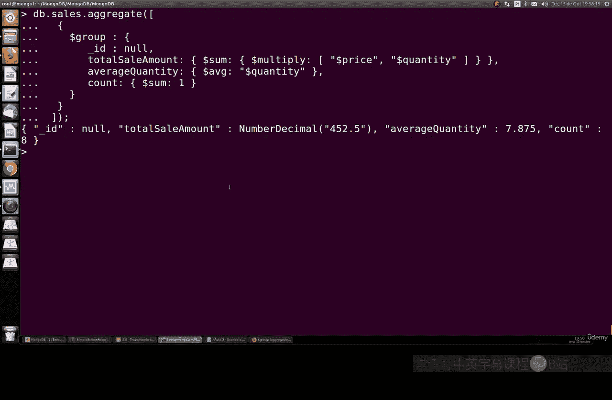

# 109：使用 `$group` 聚合阶段

在本节课中，我们将要学习 MongoDB 聚合管道中一个非常重要的阶段：`$group`。`$group` 阶段允许我们根据指定的字段对文档进行分组，并对每个分组内的文档执行计算，例如求和、求平均值或计数。



## 概述 `$group` 阶段

`$group` 阶段的基本功能是根据一个字段（即 `_id` 字段）对文档进行分组。在分组之后，我们可以使用累加器运算符（如 `$sum`、`$avg`）对组内的所有文档进行计算，生成汇总结果。

其基本语法结构如下：
```javascript
{
  $group: {
    _id: <expression>, // 分组依据的字段或表达式
    <field1>: { <accumulator1> : <expression1> },
    ...
  }
}
```
其中，`_id` 字段定义了如何分组。其他字段则是我们想要计算的汇总值，例如总销售额或平均数量。

## 分组计算示例

为了更好地理解，让我们通过一个具体的例子来演示 `$group` 的用法。假设我们有一个 `orders` 集合，记录了客户的订单信息。

以下是一个分组查询，它按客户姓名（`customerName`）分组，并计算每个客户的总消费金额、平均订单数量以及订单总数：
```javascript
db.orders.aggregate([
  {
    $group: {
      _id: "$customerName",
      totalSpent: { $sum: "$amount" },
      avgQuantity: { $avg: "$quantity" },
      orderCount: { $sum: 1 }
    }
  }
])
```
执行这个查询后，我们会得到类似以下的结果：
- 对于客户 “admin”，总消费为 300，平均订单数量为 50，共有 6 个订单。
- 对于其他客户，也会显示他们各自的总消费、平均订单数量和订单总数。

通过这个结果，我们可以分析出哪些客户消费金额高，哪些客户下单频率高，这对于商业分析非常有用。

## 创建测试数据并实践

上一节我们介绍了如何对现有数据进行分组。本节中，我们来看看如何从零开始创建数据并进行更深入的分析。

首先，我们创建一个新的数据库 `test` 和一个名为 `sales` 的集合，并插入一些模拟的销售数据：
```javascript
use test
db.sales.insertMany([
  { item: "ABC", price: 10, quantity: 2, saleDate: new Date() },
  { item: "XYZ", price: 20, quantity: 1, saleDate: new Date() },
  { item: "ABC", price: 10, quantity: 5, saleDate: new Date() },
  { item: "JKL", price: 15, quantity: 3, saleDate: new Date() },
  { item: "XYZ", price: 20, quantity: 2, saleDate: new Date() },
  { item: "DEF", price: 5, quantity: 10, saleDate: new Date() },
  { item: "JKL", price: 15, quantity: 2, saleDate: new Date() },
  { item: "ABC", price: 10, quantity: 1, saleDate: new Date() }
])
```

## 使用 `$group` 进行基础计数

现在，让我们使用 `$group` 来执行一些基础操作。首先，计算集合中文档的总数：
```javascript
db.sales.aggregate([
  {
    $group: {
      _id: null, // 不按特定字段分组，将所有文档视为一组
      totalDocuments: { $sum: 1 }
    }
  }
])
```
这个查询类似于 SQL 中的 `SELECT COUNT(*) FROM sales`，它会返回文档总数，在这个例子中是 8。

## 查找不同的值

接下来，我们看看如何找出集合中所有不同的商品（`item`）：
```javascript
db.sales.aggregate([
  {
    $group: {
      _id: "$item" // 按商品名称分组
    }
  }
])
```
执行后，我们会得到 `ABC`、`XYZ`、`JKL`、`DEF` 这四个不同的值。这有助于我们了解销售了哪些种类的商品。

## 执行复杂的汇总计算

最后，我们进行一个更复杂的计算，一次性获取总销售额、平均销售数量和总订单数：
```javascript
db.sales.aggregate([
  {
    $group: {
      _id: null,
      totalSales: {
        $sum: { $multiply: ["$price", "$quantity"] } // 计算每条记录的总价并求和
      },
      avgQuantity: { $avg: "$quantity" },
      itemCount: { $sum: 1 }
    }
  }
])
```
查询结果可能如下：
```json
{
  "_id": null,
  "totalSales": 425,
  "avgQuantity": 7,
  "itemCount": 8
}
```
这个结果告诉我们：在全部的 8 笔销售记录中，总销售额为 425，平均每笔销售的数量约为 7。这对于评估整体销售表现非常有用。

## 总结

本节课中我们一起学习了 MongoDB 聚合框架中的 `$group` 阶段。我们了解到：
1.  `$group` 通过 `_id` 字段定义分组依据。
2.  可以使用 `$sum`、`$avg` 等累加器对分组内的数据进行计算。
3.  它可以用于完成诸如计数、去重、计算总和与平均值等多种数据分析任务。



通过结合不同的分组字段和累加器，`$group` 是一个非常强大的工具，能够帮助我们从数据中提取有意义的汇总信息。