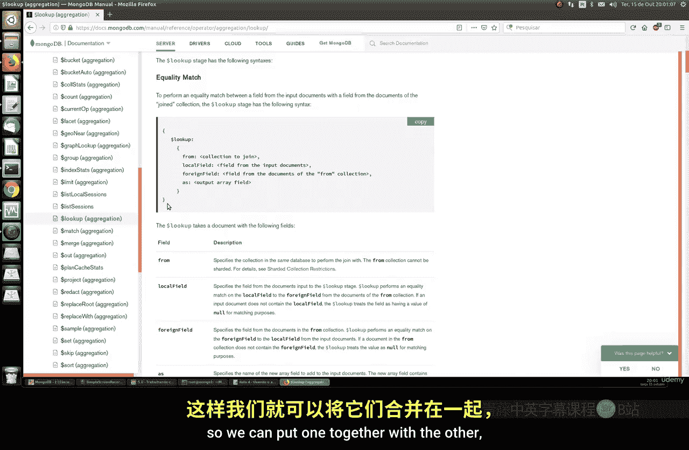
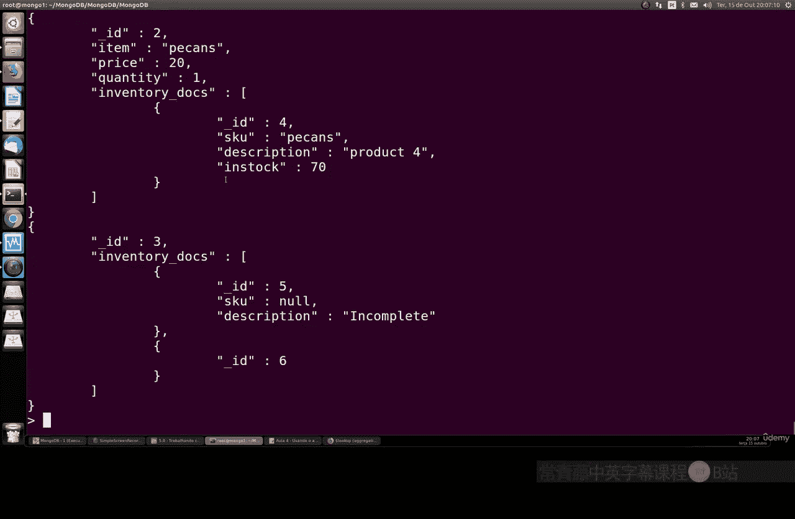

# 110：使用 $lookup 进行数据关联

在本节课中，我们将要学习 MongoDB 中一个非常重要的聚合功能：`$lookup`。它允许我们将来自不同集合的文档关联在一起，类似于 SQL 中的左外连接操作。

## 理解 $lookup 聚合

上一节我们介绍了聚合的基本概念，本节中我们来看看 `$lookup` 的具体作用。`$lookup` 聚合阶段用于执行一个“外连接”，从另一个集合中获取相关文档并合并到当前处理的文档流中。

这对于需要组合多个集合数据的场景非常有用。例如，我们可以将“客户”集合的文档与“订单”集合的文档关联起来，从而获得包含客户信息和其所有订单的完整视图。

## $lookup 语法解析

以下是 `$lookup` 阶段的基本语法结构：



```javascript
{
  $lookup: {
    from: "<要连接的目标集合名>",
    localField: "<输入文档中的字段名>",
    foreignField: "<目标集合文档中的字段名>",
    as: "<输出数组字段名>"
  }
}
```

*   **`from`**：指定要进行连接的另一个集合的名称。
*   **`localField`**：指定当前文档（来自输入集合）中用于匹配的字段。
*   **`foreignField`**：指定目标集合文档中用于匹配的字段。`localField` 的值将与 `foreignField` 的值进行相等匹配。
*   **`as`**：指定一个数组字段的名称，用于存放从目标集合中匹配到的所有文档。如果未匹配到任何文档，该字段将是一个空数组。

## 实战示例一：关联客户与订单

让我们通过一个具体的例子来理解其工作原理。假设我们有一个 `customers` 集合和一个 `orders` 集合，我们想查看每位客户及其所有订单的详细信息。

以下是执行此操作的聚合管道示例：

```javascript
db.customers.aggregate([
  {
    $lookup: {
      from: "orders",           // 从 orders 集合连接数据
      localField: "_id",        // 使用 customers 文档的 _id 字段
      foreignField: "customerId", // 匹配 orders 文档的 customerId 字段
      as: "customerOrders"      // 将匹配到的订单放入新字段 customerOrders
    }
  }
])
```

执行上述聚合后，每个客户文档都会新增一个 `customerOrders` 字段。这个字段是一个数组，包含了该客户的所有订单文档。这样，我们就能在一个结果集中同时看到客户的基本信息（如姓名、地址、余额）以及他们的订单详情（如产品、价格、日期）。

## 实战示例二：关联订单与库存

为了更清晰地展示，我们再使用另一个测试数据库。假设我们有两个集合：`orders`（订单）和 `inventory`（库存）。

首先，我们查看一下两个集合的现有数据：

```javascript
// 查看所有订单
db.orders.find().pretty()

// 查看所有库存物品
db.inventory.find().pretty()
```

现在，我们想要将订单与库存信息关联起来，查看每个订单项对应的产品描述和库存量。

以下是执行此操作的聚合管道：

```javascript
db.orders.aggregate([
  {
    $lookup: {
      from: "inventory",      // 从 inventory 集合连接数据
      localField: "item",     // 使用 orders 文档的 item 字段（例如产品SKU）
      foreignField: "sku",    // 匹配 inventory 文档的 sku 字段
      as: "stockDetails"      // 将匹配到的库存信息放入新字段 stockDetails
    }
  }
])
```

执行后，每个订单文档会包含一个 `stockDetails` 数组。例如，一个订购了 `item: "abc"` 的订单，会找到库存中 `sku: "abc"` 的文档，并将其详细信息（如描述、当前库存量）包含进来。如果某个订单项在库存中找不到对应产品，`stockDetails` 将是一个空数组。

这种关联非常实用。基于此，我们可以进一步处理数据，例如：检查库存是否充足，或在聚合管道中计算订单总金额时引用产品的单价。

## 总结




本节课中我们一起学习了 MongoDB 的 `$lookup` 聚合操作。我们了解到 `$lookup` 的核心功能是实现跨集合的文档关联，其语法包含 `from`、`localField`、`foreignField` 和 `as` 四个关键参数。通过两个实战示例，我们掌握了如何将客户与订单、订单与库存数据关联起来，从而获得更丰富、更具业务价值的数据视图。这为构建复杂的数据查询和报告（如电子商务系统中的订单处理）奠定了坚实基础。