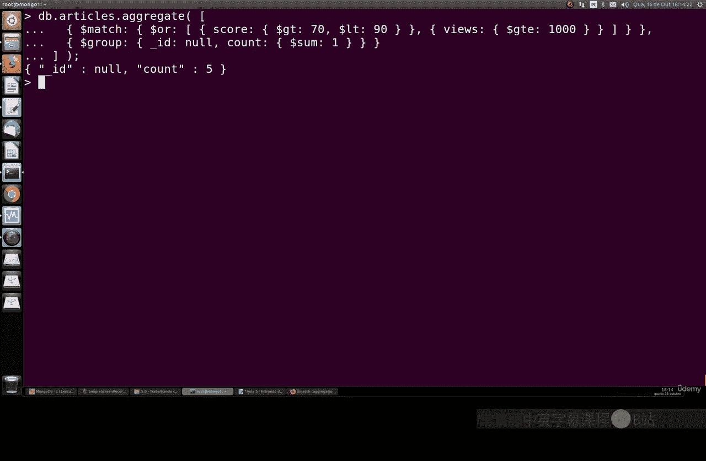

# 111：使用 `$match` 过滤数据 🎯

在本节课中，我们将要学习 MongoDB 聚合框架中的一个核心操作符：`$match`。`$match` 的作用是对数据进行筛选，类似于查询中的 `find` 命令，但它是聚合管道的一部分，可以与其他聚合阶段（如 `$group`）结合使用，以实现更复杂的数据处理。

上一节我们介绍了聚合的基本概念，本节中我们来看看如何使用 `$match` 进行精确的数据过滤。

## 理解 `$match` 操作符


`$match` 操作符用于筛选文档，只将符合条件的文档传递到聚合管道的下一个阶段。它非常强大，因为它允许我们使用查询表达式，包括正则表达式，来进行非常精确的过滤。掌握 `$match` 对于高效地分析数据至关重要。

其基本语法是一个包含查询条件的文档：
```json
{ $match: { <query> } }
```

## 实践案例一：筛选并分组数据

让我们通过一个实际的例子来理解。假设我们有一个 `purchases` 集合，记录了客户的购买信息。我们想找出所有来自“英国”的客户，并且他们购买的产品名称中包含“chocolate”这个词。最后，我们想按产品标题分组并计算总购买数量。

以下是实现此目标的聚合命令：

```javascript
db.purchases.aggregate([
  {
    $match: {
      country: "United Kingdom",
      product: /chocolate/i // 使用正则表达式匹配包含“chocolate”的产品名，不区分大小写
    }
  },
  {
    $group: {
      _id: "$product", // 按产品标题分组
      totalPurchases: { $sum: "$quantity" } // 对购买数量求和
    }
  }
])
```

执行这个命令后，我们会得到类似这样的结果：它列出了所有包含“chocolate”的产品及其对应的总购买数量（例如，total chocolate 3060， total chocolate 915）。这样，我们就完成了一次精确的过滤和汇总。

## 实践案例二：多条件筛选与计数

为了进一步掌握 `$match`，我们创建一个新的 `articles` 集合来演示。这个集合包含文章的作者、评分和浏览量。

首先，我们插入一些示例数据并查看：
```javascript
db.articles.insertMany([
  { author: "David", score: 85, views: 1200 },
  { author: "David", score: 92, views: 800 },
  { author: "Lee", score: 78, views: 1500 },
  { author: "Lee", score: 88, views: 950 }
])

db.articles.find().pretty()
```

现在，假设我们想找出评分大于70且小于90，**或者**浏览量大于等于1000的文章，并统计符合条件的文章总数。

我们可以这样构建聚合管道：

```javascript
db.articles.aggregate([
  {
    $match: {
      $or: [ // 使用 $or 操作符连接多个条件
        { score: { $gt: 70, $lt: 90 } },
        { views: { $gte: 1000 } }
      ]
    }
  },
  {
    $group: {
      _id: null, // 不按特定字段分组，将所有文档视为一组
      totalArticles: { $sum: 1 } // 对每一篇符合条件的文章计数加1
    }
  }
])
```

这个查询会返回一个结果，告诉我们有多少篇文章满足上述的高评分或高浏览量条件（例如，结果为5）。这展示了如何将 `$match` 与逻辑操作符以及 `$group` 阶段结合，实现复杂的过滤和统计。

## 总结

本节课中我们一起学习了 MongoDB 聚合框架中的 `$match` 操作符。我们了解到：

1.  `$match` 的核心功能是**过滤数据**，它位于聚合管道的早期阶段，可以显著减少后续阶段需要处理的数据量。
2.  它可以**使用丰富的查询表达式**，包括字段匹配、范围查询 (`$gt`, `$lt`) 和逻辑操作符 (`$or`)，甚至支持正则表达式进行模式匹配。
3.  `$match` 常与其他聚合阶段（如 `$group`）**结合使用**，先筛选出目标数据子集，再进行分组、求和、计数等计算。



通过本课的两个实例，你应该已经掌握了使用 `$match` 进行基础和多条件数据筛选的方法。记住，灵活运用 `$match` 是优化聚合查询、获取精确分析结果的关键。你可以尝试将其与其他聚合操作符组合，以应对更复杂的数据分析场景。