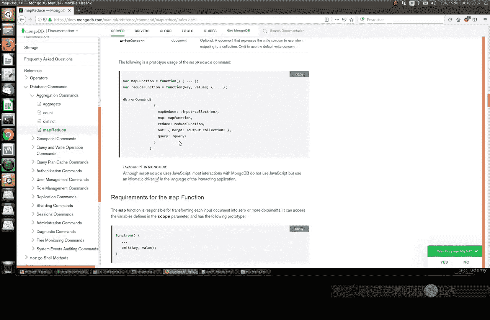
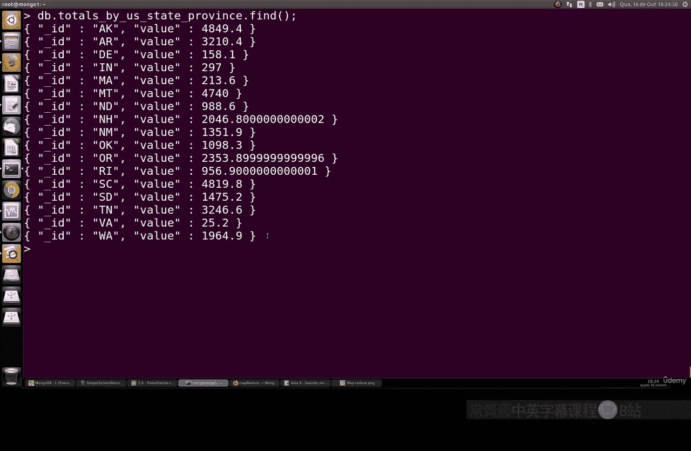
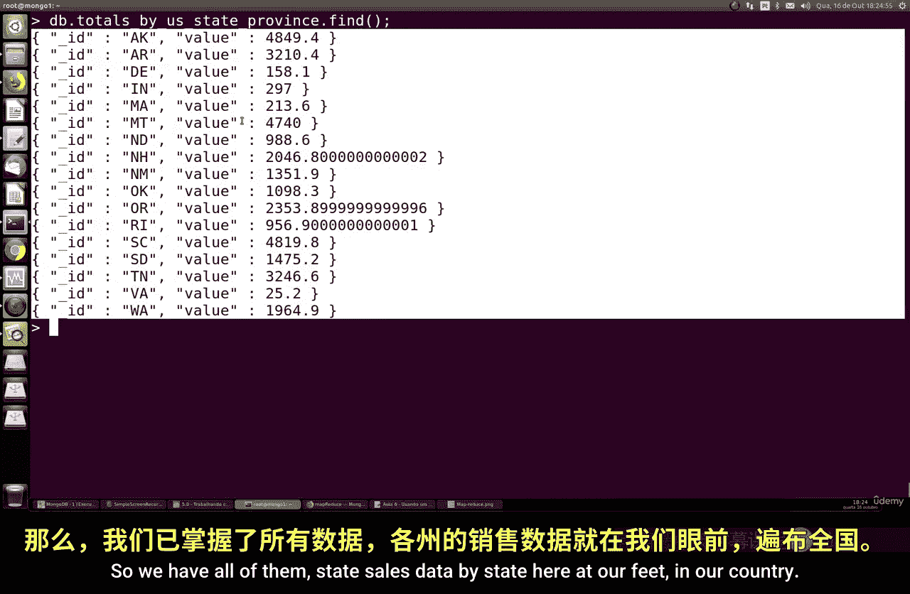
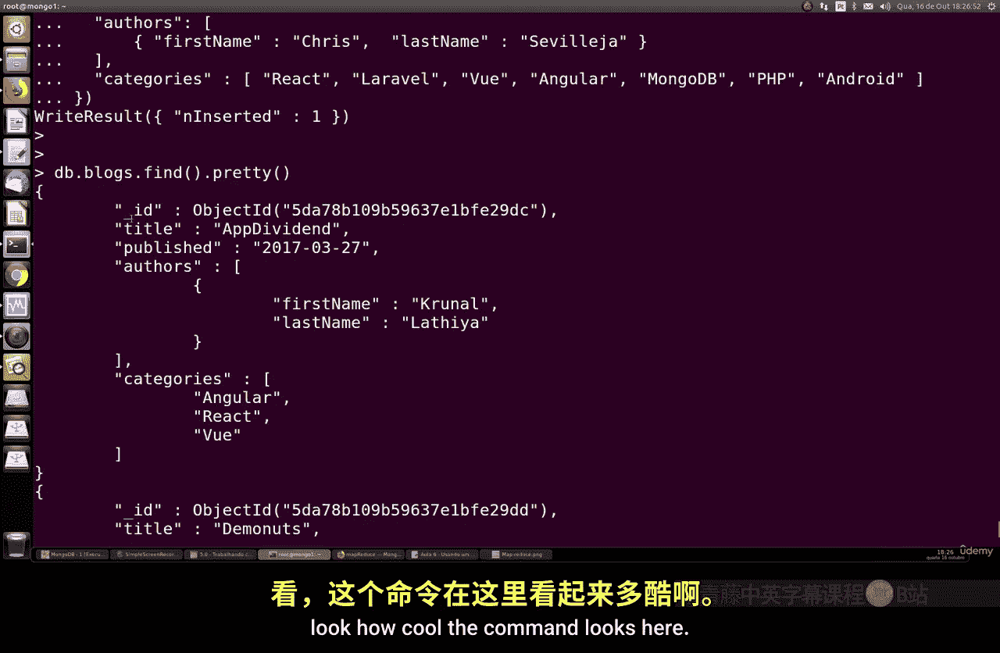
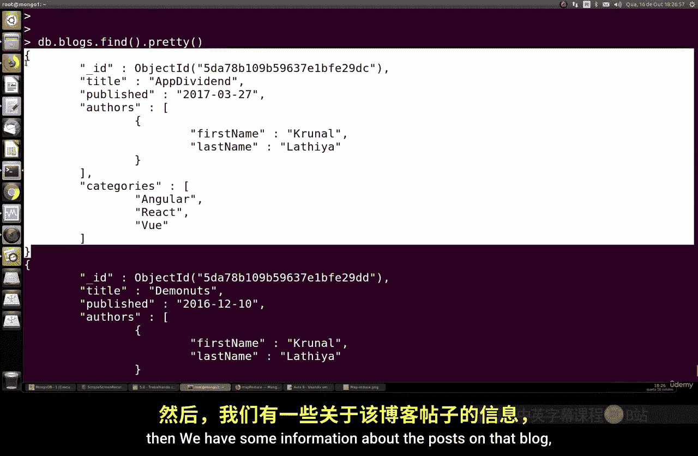
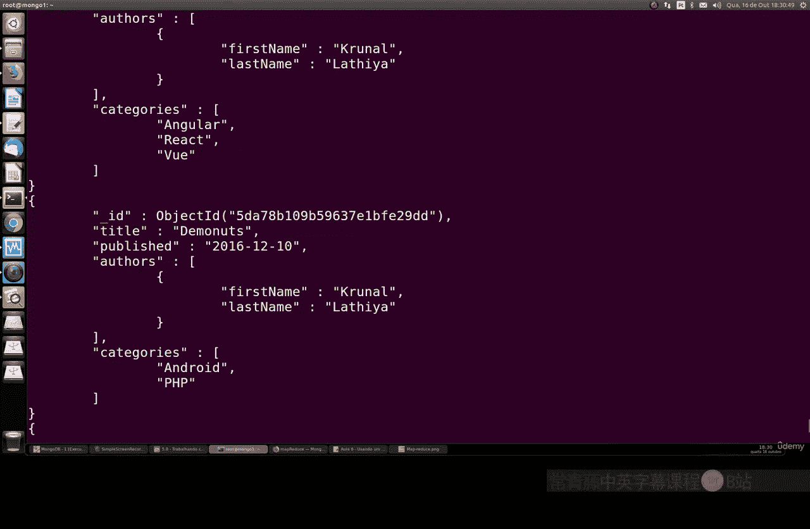
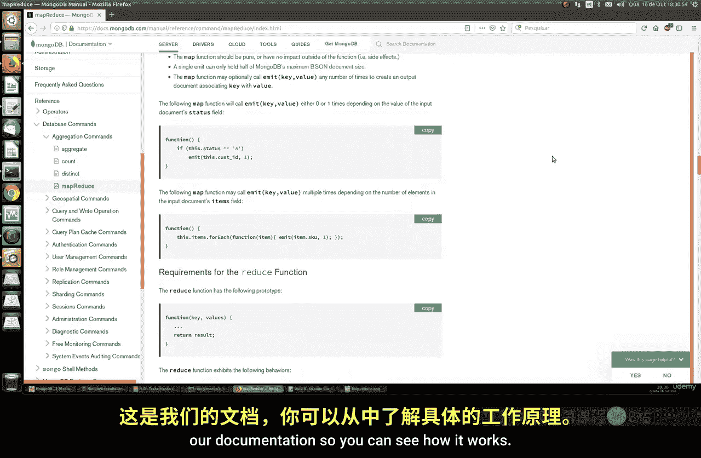

# 112：MapReduce数据处理 🗺️➡️🧮

在本节课中，我们将要学习MongoDB中一个非常有趣且重要的数据处理机制——MapReduce。这是一种用于处理和分析大规模数据集的功能。

MapReduce是一种数据处理机制。它能够将大量的信息和元数据压缩成对我们有用的聚合结果。它通过`mapReduce`命令来执行映射和规约操作。这个命令在处理大型数据集时非常有用。

简单来说，MapReduce命令主要使用两个输入：**Mapper函数**和**Reducer函数**。虽然还有其他可选部分，但这两个函数是必须的。它的结果与聚合操作非常相似。主要区别在于，MapReduce允许我们使用纯JavaScript函数来执行操作，这为我们提供了JavaScript的全部能力，使其功能更加强大。

MapReduce以聚合结构的形式运行，但其性能可能略逊于内置的聚合操作，因为它是在数据库外部执行的。然而，如果你的查询非常复杂，使用MapReduce可能是值得的。此外，这个命令非常适合在后台进程中运行，例如用于生成报告或缓存数据。

## MapReduce工作原理

上一节我们介绍了MapReduce的基本概念，本节中我们来看看它的具体工作原理。

MapReduce是一个框架，它允许我们在多个物理或虚拟服务器上并行处理大规模的数据查询。一个典型的MapReduce程序包含两个阶段：

1.  **Map阶段**：负责过滤和转换数据。
2.  **Reduce阶段**：负责对数据进行聚合，并输出最终结果。

以下是其工作流程的简化表示：

```javascript
// 概念性流程
输入数据 -> Map函数（映射、过滤） -> 中间键值对 -> Reduce函数（聚合） -> 输出结果
```

在Map阶段，函数会读取所有数据，并根据需要处理的字段构建一个映射。这会生成一系列的键值对。然后，这些键值对被送入Reduce阶段，Reduce函数将它们聚合成最终的值。最终结果的集合名称可以由我们指定。

## 实践示例：按州统计销售额



理论介绍完毕，现在让我们通过一个具体的例子来实践。我们将使用一个包含客户和销售数据的集合。

假设我们有一个`sales`集合，其中包含`country`、`state`和`amount`等字段。我们的目标是统计美国（United States）各个州的总销售额。

以下是实现此目标的MapReduce命令：

```javascript
db.sales.mapReduce(
    function() { // Map 函数
        if (this.country == "United States") {
            emit(this.state, this.amount);
        }
    },
    function(key, values) { // Reduce 函数
        return Array.sum(values);
    },
    {
        out: "total_sales_by_state" // 输出集合的名称
    }
)
```

**代码解释：**
*   **Map函数**：遍历集合中的每一条文档。如果文档的`country`字段是“United States”，则发出一个键值对，其中键（key）是`state`（州名），值（value）是`amount`（销售额）。
*   **Reduce函数**：接收Map阶段发出的、具有相同键（即同一个州）的所有值（销售额数组），然后使用`Array.sum`对这些值进行求和，得到该州的总销售额。
*   **out参数**：指定将结果输出到一个名为`total_sales_by_state`的新集合中。

命令执行后，我们可以查询这个新集合来查看结果：





```javascript
db.total_sales_by_state.find().sort({value: -1}) // 按销售额降序排列
```

这将显示美国每个州的总销售额，帮助我们快速了解哪些州的销售业绩最好。

## 另一个示例：统计博客作者发文数

为了加深理解，我们再看一个不同的例子。假设我们有一个`blogs`集合，存储博客文章，每篇文章包含`author`（作者）等信息。

我们的目标是统计每位作者发表的文章数量。





以下是操作步骤和命令：

1.  首先，确保你有一个`blogs`集合并插入了一些数据。
2.  执行以下MapReduce命令：

```javascript
db.blogs.mapReduce(
    function() { // Map 函数
        // 假设author是一个包含firstName和lastName的对象
        var authorName = this.author.firstName + " " + this.author.lastName;
        emit(authorName, 1); // 每篇文章为该作者计数1
    },
    function(key, values) { // Reduce 函数
        return Array.sum(values); // 对同一个作者的所有计数1进行求和
    },
    {
        out: "author_post_count"
    }
)
```

**代码解释：**
*   **Map函数**：为每篇博客文章发出一个键值对。键是作者的全名，值固定为1（代表一篇文章）。
*   **Reduce函数**：将同一个作者名对应的所有“1”加起来，得到该作者的总文章数。
3.  查看结果：

```javascript
db.author_post_count.find()
```

例如，结果可能显示 `{“_id”: “Chris Sevill”, “value”: 2}` 和 `{“_id”: “Now Lee”, “value”: 2}`，表示Chris Sevill有2篇文章，Now Lee也有2篇文章。

## 注意事项与总结

本节课中我们一起学习了MongoDB中的MapReduce功能。

MapReduce是一个强大的工具，特别适合处理复杂的、需要自定义JavaScript逻辑的数据聚合任务，也适用于在后台生成报告。然而，需要注意以下几点：

*   **性能**：对于超大规模数据集，MapReduce可能会比较慢，因为它需要更多的CPU和内存资源进行计算。
*   **适用场景**：在决定使用MapReduce还是内置聚合框架时，需要根据查询的复杂度和数据量来权衡。对于简单聚合，内置的`aggregate()`管道通常效率更高。





总之，MapReduce为MongoDB的数据处理提供了极高的灵活性。建议你根据课程中的示例进行更多练习，并查阅MongoDB官方文档以探索更多高级用法。