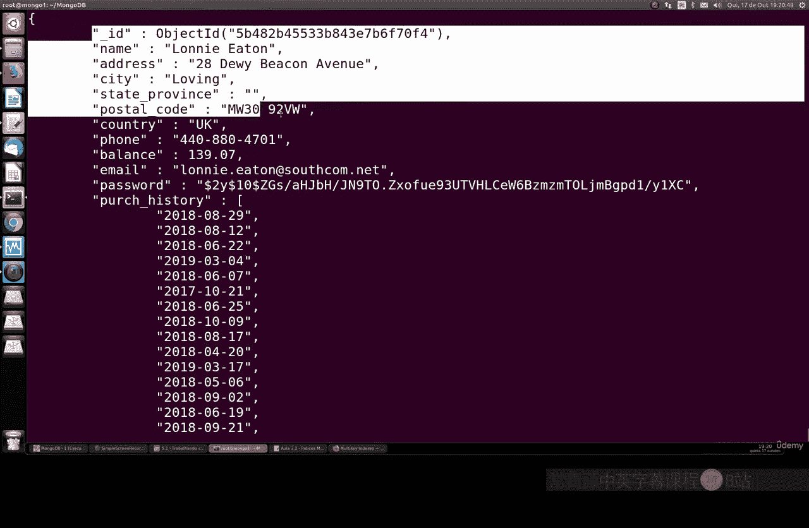
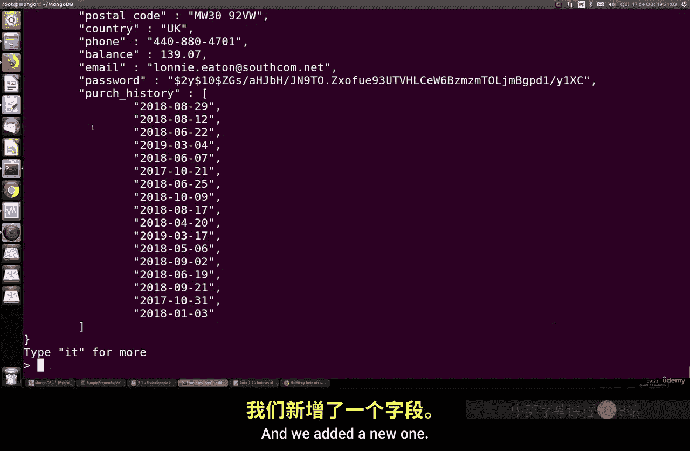
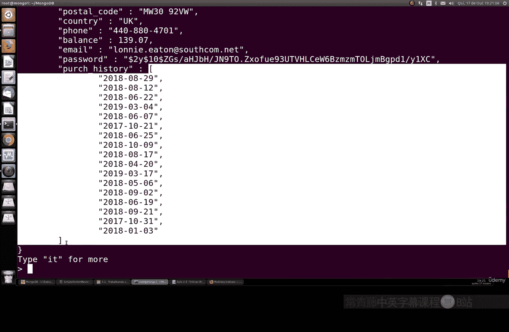
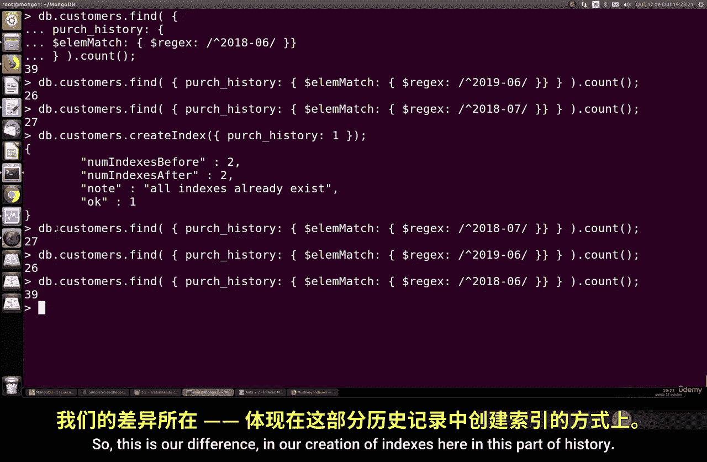

# 116：多键索引 🗂️

在本节课中，我们将要学习如何在MongoDB中为包含数组（矩阵）的文档创建和使用多键索引。多键索引是处理嵌套数组数据时提升查询性能的关键工具。

上一节我们介绍了单字段索引的基础知识，本节中我们来看看当文档结构包含数组时，索引的创建有何不同。

## 多键索引的应用场景

多键索引仅在您处理文档内包含数组（原文称为“matrix”）的项时才需要。它专门为数组数据设计。


为了理解多键索引的工作方式，我们需要一个包含数组字段的示例集合。以下是如何操作。

## 准备示例数据库

首先，我们创建一个新的数据库并导入包含数组数据的示例文档。

1.  查看现有数据库：
    ```bash
    show dbs
    ```

2.  从GitHub克隆并导入示例数据。该数据集包含813,830个文档，且最初没有任何索引。
    ```bash
    # 假设存在一个导入脚本
    ./import_sample_data.sh
    ```

3.  使用新创建的数据库：
    ```bash
    use sample_database
    ```

## 理解数据结构

导入的数据与上一课的类似，但增加了一个新字段：`purchase_history`。这个字段是一个数组，其中包含了每位顾客的多次购买记录，每条记录都有日期（日、月、年）。



核心概念在于，`purchase_history` 是一个**数组**，其结构可以用代码描述如下：
```json
{
  "customer_id": "12345",
  "purchase_history": [
    {"date": "2018-06-15", "item": "A"},
    {"date": "2019-07-20", "item": "B"}
  ]
}
```


## 执行数组查询



在创建索引前，我们先对数组字段进行查询。我们将使用 `$regex`（正则表达式）来匹配数组中的日期。



例如，查找2018年6月的所有订单：
```javascript
db.customers.find({
  "purchase_history.date": /2018-06/
}).count()
```
此查询返回了39个订单。


您可以尝试其他条件，例如查询2019年7月：
```javascript
db.customers.find({
  "purchase_history.date": /2019-07/
}).count()
```
此查询返回了26个订单。


## 创建多键索引

为了使这类对数组字段的查询更高效，我们需要创建多键索引。创建方法非常简单。

在数组字段上创建索引：
```javascript
db.customers.createIndex({
  "purchase_history.date": 1
})
```
命令执行成功后，系统会提示索引创建成功。

## 验证索引效果

索引创建后，再次执行相同的查询。虽然返回的结果数量相同，但MongoDB在后台会利用索引来加速查找过程，使得查询执行速度更快。

您可以通过数据库的查询分析工具或直接感受查询响应时间来体验性能差异。

---



本节课中我们一起学习了MongoDB的多键索引。我们了解到，当文档中包含数组字段时，需要为其创建多键索引以优化查询性能。关键步骤包括：识别数组结构、在数组字段上使用 `createIndex()` 命令，以及理解索引如何加速对数组内容的匹配查询。掌握多键索引能显著提升处理复杂嵌套数据时的数据库效率。