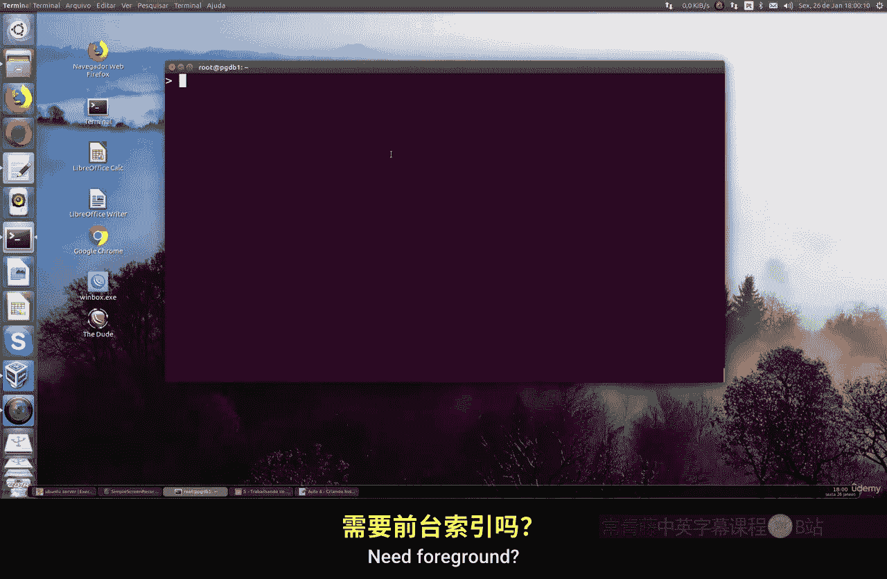
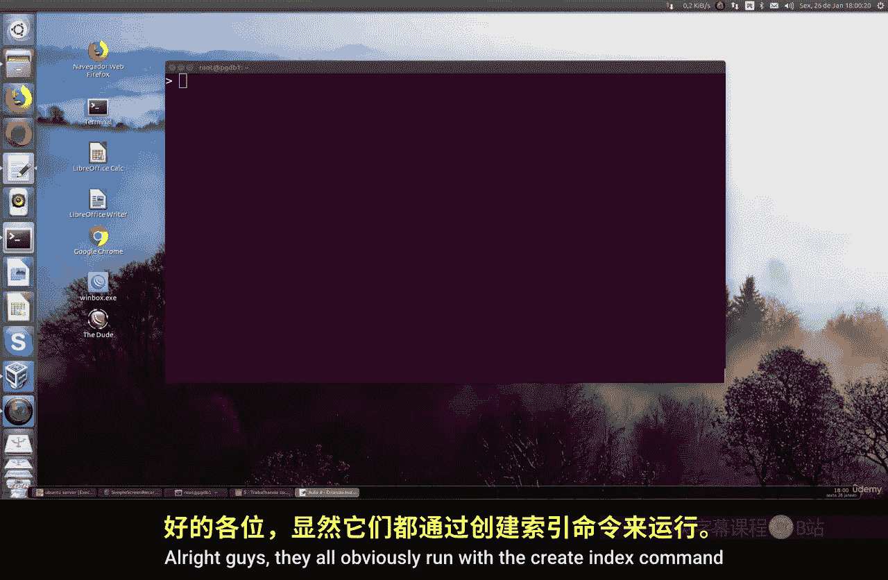
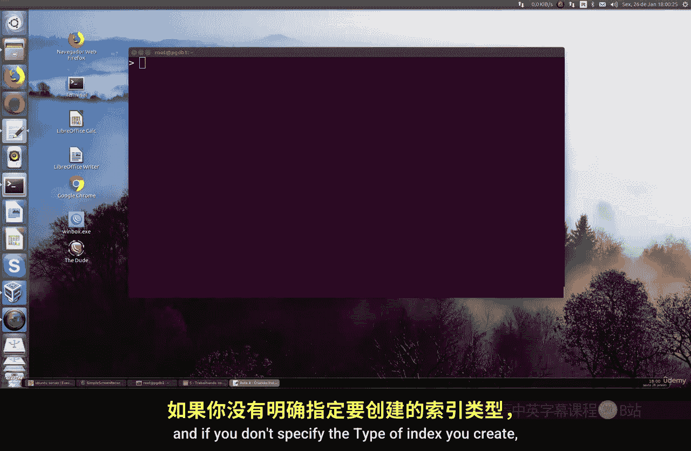
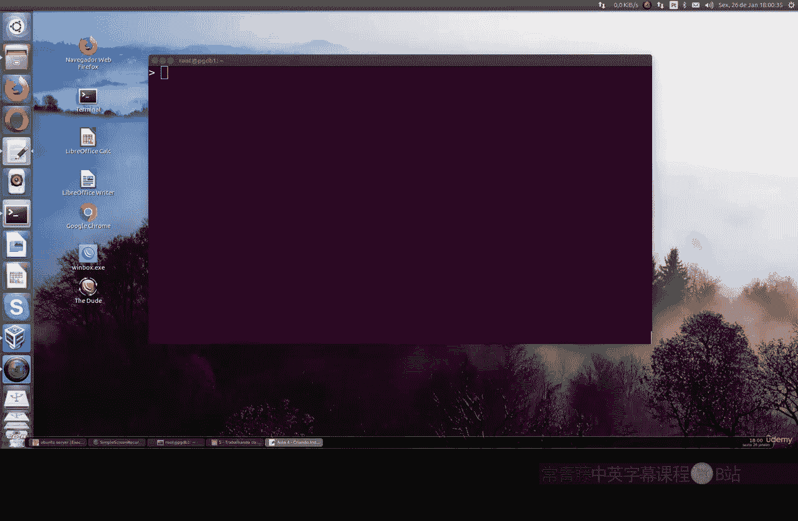
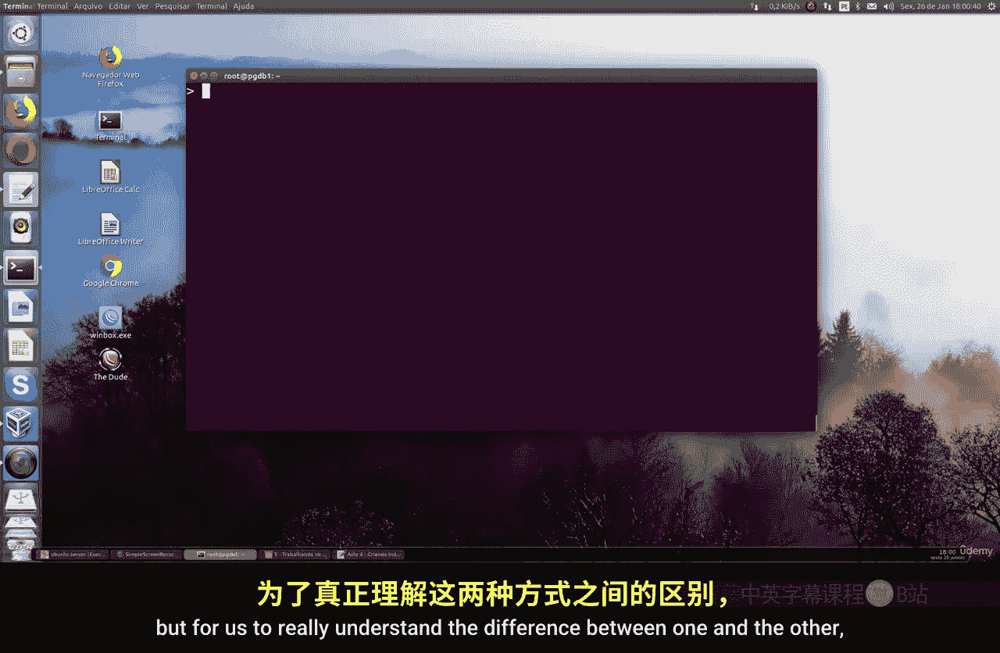
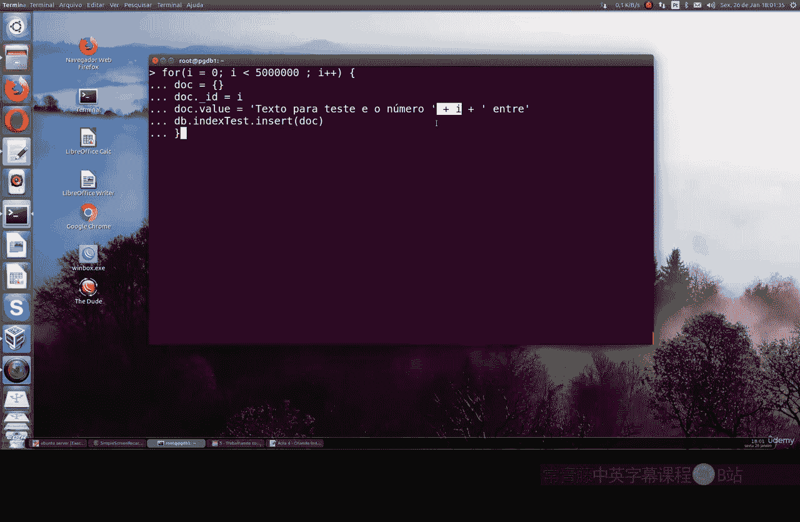
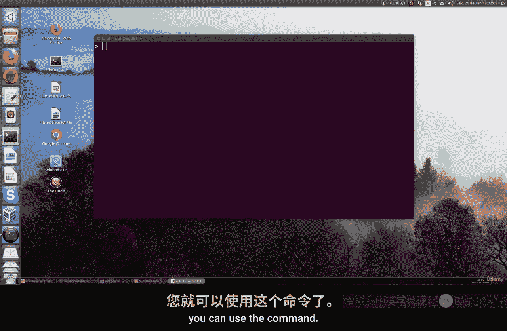
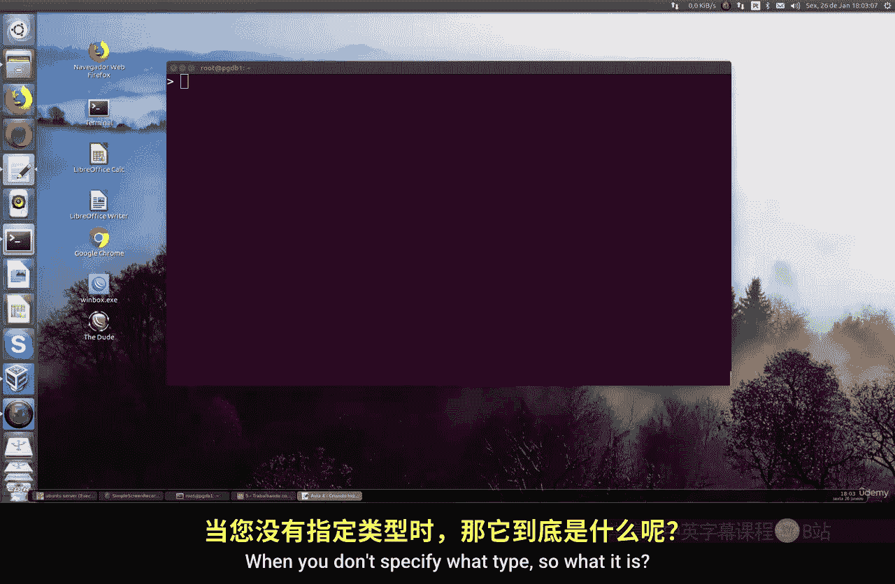

# 118：前台与后台索引创建 🚀

在本节课中，我们将学习MongoDB中两种创建索引的方式：前台索引和后台索引。我们将了解它们的区别、创建方法以及对数据库性能的影响。





## 概述

在MongoDB中，索引是提高查询性能的关键。创建索引有两种主要模式：前台模式和后台模式。默认情况下，如果不指定类型，MongoDB会使用前台模式创建索引。理解这两种模式的差异对于管理大型数据库的性能至关重要。





## 索引创建命令




所有索引都通过 `createIndex` 命令创建。如果不指定索引类型，系统默认使用前台模式。

**代码示例：默认创建索引**
```javascript
db.collection.createIndex({ field: 1 })
```

## 创建测试数据

为了更直观地理解两种索引创建方式的差异，我们需要创建一个包含大量文档的集合。以下是创建500万个文档的命令：

**代码示例：生成测试数据**
```javascript
for (var i = 0; i < 5000000; i++) {
    db.test.insert({ id: i, text: "sample value" })
}
```



请注意，在实际机器上执行此命令可能需要较长时间，具体取决于处理器的性能、内存和机器配置。

## 验证数据创建




创建文档后，可以使用以下命令验证索引是否已创建：

**代码示例：查看索引**
```javascript
db.test.getIndexes()
```

此命令将显示集合中的所有索引，包括默认的 `_id` 索引和我们自定义的索引。



## 前台索引与后台索引的区别

上一节我们介绍了如何创建测试数据，本节中我们来看看前台索引和后台索引的具体区别。

### 前台索引
- **创建方式**：默认模式。
- **速度**：创建速度快。
- **资源占用**：占用资源较少，更紧凑。
- **影响**：在创建期间会锁定集合，阻止所有读写操作。

**代码示例：创建前台索引**
```javascript
db.test.createIndex({ text: 1 })
```

### 后台索引
- **创建方式**：需要明确指定。
- **速度**：创建速度较慢。
- **资源占用**：占用更多内存和磁盘空间。
- **影响**：在后台创建，不锁定集合，允许正常的读写操作继续。

**代码示例：创建后台索引**
```javascript
db.test.createIndex({ text: 1 }, { background: true })
```

## 性能对比实验

为了展示两者的性能差异，我们可以进行一个简单的实验：

1.  首先，删除现有的索引。
2.  然后，分别用前台和后台模式创建索引，并观察所需时间。

**操作步骤：**
1.  删除索引：`db.test.dropIndex({ text: 1 })`
2.  创建前台索引并计时。
3.  再次删除索引。
4.  创建后台索引并计时。

您会发现，后台索引的创建时间明显长于前台索引。在处理数百万甚至数千万文档的大型集合时，这种差异会更加显著。

## 选择建议

以下是选择索引创建模式时需要考虑的因素：

- **对业务的影响**：如果数据库需要持续提供服务，不能接受写入中断，应选择后台索引。
- **创建速度**：如果需要在维护窗口快速完成索引创建，应选择前台索引。
- **系统资源**：后台索引创建期间会消耗更多的系统资源（CPU、内存、磁盘I/O）。

对于管理员来说，理解这种差异有助于制定更合理的数据库维护计划。对于最终用户而言，索引的创建模式不会影响日常的数据查询操作，它主要影响的是数据库服务器的处理性能。

## 总结

本节课中我们一起学习了MongoDB前台索引和后台索引的创建与区别。我们了解到前台索引是默认的快速创建模式，但会锁定集合；而后台索引允许在创建期间进行读写操作，但速度较慢且消耗更多资源。正确选择索引创建模式是数据库性能调优的重要环节。在后续课程中，我们将继续分享更多数据库管理的实用技巧。