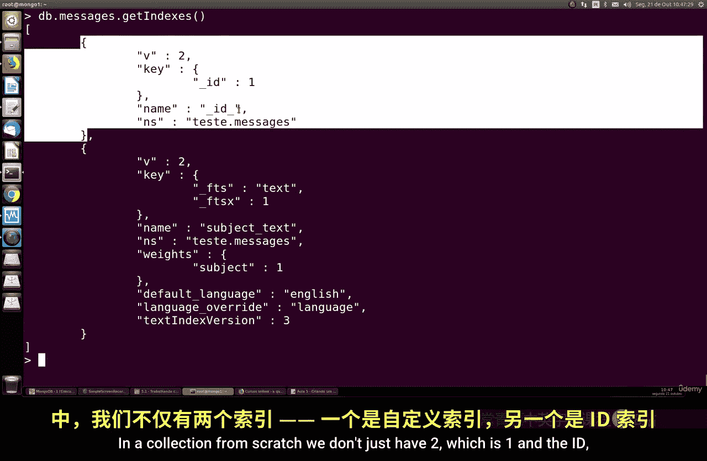
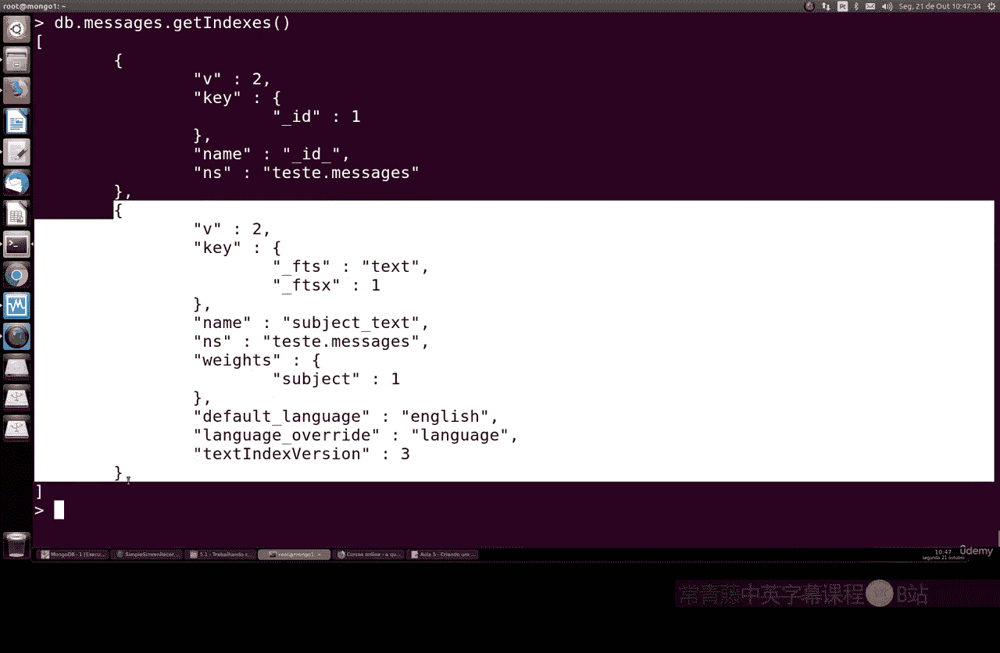
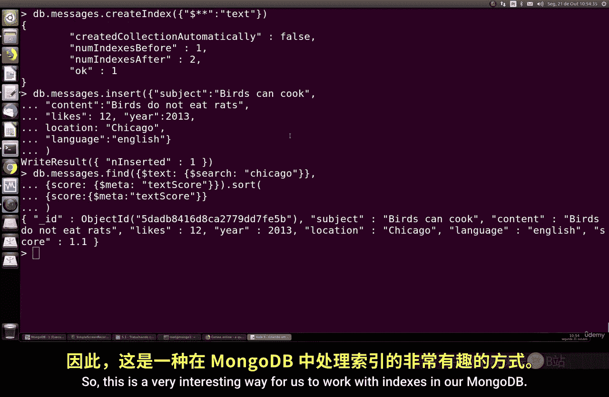

# 119：创建文本索引 📚

在本节课中，我们将学习如何在 MongoDB 中创建和使用文本索引。文本索引允许我们对文档中的字符串内容执行全文搜索，这对于构建搜索功能至关重要。

## 概述

文本索引与常规索引的工作方式非常相似，但有一个关键区别：我们需要使用 `text` 关键字来指定索引类型，而不是指定升序或降序。通过全文搜索，我们可以在任何值为字符串或字符串数组的文档字段上定义文本索引。

## 创建测试数据

首先，我们创建一个用于测试的集合并插入一些示例数据。以下是具体步骤：

1.  创建一个名为 `messages` 的集合。
2.  插入一些包含 `subject`（主题）和 `content`（内容）字段的文档，模拟博客文章。

```javascript
db.messages.insertMany([
    {
        subject: "Learning MongoDB",
        content: "Today we are learning about text indexes.",
        likes: 10,
        comments: ["Great!", "Thanks"]
    },
    {
        subject: "Dogs and Cats",
        content: "A story about pets.",
        likes: 25
    },
    {
        subject: "Programming",
        content: "Coding is fun with MongoDB.",
        likes: 15
    }
])
```

插入数据后，我们可以使用 `find` 命令查看文档结构。

```javascript
db.messages.find().pretty()
```

## 创建单字段文本索引

现在，让我们为 `subject` 字段创建一个文本索引。创建文本索引的语法是 `db.collection.createIndex({ field: "text" })`。

```javascript
db.messages.createIndex({ subject: "text" })
```

这个命令创建了一个文本索引，使我们能够在 `subject` 字段上进行全文搜索。

## 使用 `$text` 操作符进行搜索

创建索引后，我们可以使用 `$text` 操作符进行搜索。`$text` 操作符会返回一个相关性评分（`textScore`），该评分表示搜索结果与查询词的匹配程度。

以下是一个搜索示例，查找包含单词 “dog” 的文档：

```javascript
db.messages.find(
    { $text: { $search: "dog" } },
    { score: { $meta: "textScore" } }
).sort({ score: { $meta: "textScore" } })
```

在这个查询中：
*   `$search: "dog"` 指定了搜索词。
*   `$meta: "textScore"` 用于在结果中返回每个文档的相关性评分。
*   `.sort()` 方法按评分降序排列结果，最相关的文档排在最前面。



搜索结果会显示，完全匹配 “dog” 的文档评分较高（接近1），而包含类似词（如 “dogs”）的文档评分会低一些。



## 创建多字段文本索引

上一节我们介绍了单字段文本索引，本节中我们来看看如何为多个字段创建复合文本索引。

MongoDB 允许在一个文本索引中包含多个字段。语法是在 `createIndex` 命令中列出所有字段，用逗号分隔。

```javascript
db.messages.createIndex({ subject: "text", content: "text" })
```

**重要提示**：一个集合只能有一个文本索引。如果你尝试在已有文本索引的集合上创建另一个，会遇到冲突错误。在创建新的复合索引前，必须先删除旧的索引。

## 管理文本索引

在创建新的文本索引之前，我们需要先检查并移除现有的索引。以下是管理索引的步骤：

1.  查看集合中的所有索引：
    ```javascript
    db.messages.getIndexes()
    ```
    这个命令会列出所有索引，包括默认的 `_id` 索引和我们创建的文本索引。

2.  根据索引名称删除旧的文本索引：
    ```javascript
    db.messages.dropIndex("subject_text")
    ```
    请将 `"subject_text"` 替换为实际的索引名称。

3.  删除旧索引后，就可以创建新的复合文本索引了：
    ```javascript
    db.messages.createIndex({ subject: "text", content: "text" })
    ```

创建多字段索引后，再次执行搜索。例如，搜索单词 “cat”：
```javascript
db.messages.find(
    { $text: { $search: "cat" } },
    { score: { $meta: "textScore" } }
).sort({ score: { $meta: "textScore" } })
```
现在，搜索会同时在 `subject` 和 `content` 字段中进行。完全匹配的字段会获得更高的评分。

## 创建通配符文本索引

有时，我们可能希望文档中所有字符串字段的内容都可被搜索，而不是指定具体的字段。这时可以使用通配符文本索引。

通配符索引使用 `$**` 符号来索引文档中的所有字符串字段。这在像电子邮件这样的场景中很有用，因为发件人、收件人、主题和正文等所有字段都可能需要被搜索。

以下是创建通配符文本索引的步骤：

1.  首先，确保删除了之前的所有文本索引。
2.  创建通配符索引：
    ```javascript
    db.messages.createIndex({ "$**": "text" })
    ```

3.  为了测试，我们插入一个包含新字段 `location` 的文档：
    ```javascript
    db.messages.insertOne({ location: "Chicago" })
    ```

4.  现在，执行搜索。例如，搜索 “Chicago”：
    ```javascript
    db.messages.find({ $text: { $search: "Chicago" } })
    ```
    查询将返回包含 “Chicago” 的文档，无论这个词出现在哪个字段中。

**性能考虑**：虽然通配符索引非常强大和灵活，但它会索引文档中的每一个字符串字段。对于海量数据和高频查询，这可能会对数据库性能产生影响。因此，在使用此类索引时，需要仔细规划和评估。

## 总结

本节课中我们一起学习了 MongoDB 中文本索引的核心知识：
1.  **创建文本索引**：使用 `db.collection.createIndex({ field: "text" })` 语法。
2.  **执行全文搜索**：使用 `$text` 和 `$search` 操作符，并通过 `$meta: "textScore"` 获取相关性评分。
3.  **多字段索引**：一个集合只能有一个文本索引，创建新的前需删除旧的。复合索引允许在多个字段上搜索。
4.  **通配符索引**：使用 `{ "$**": "text" }` 可以索引文档所有字符串字段，提供了最大的搜索灵活性，但需注意性能开销。



合理使用文本索引可以极大地增强应用程序的搜索能力。在下一节课中，我们将继续深入探讨 MongoDB 的其他索引类型和优化技巧。