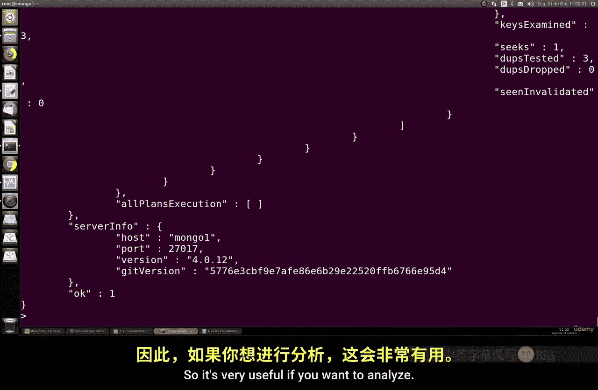
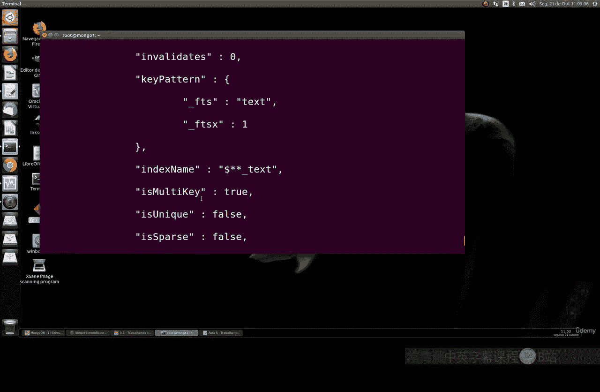
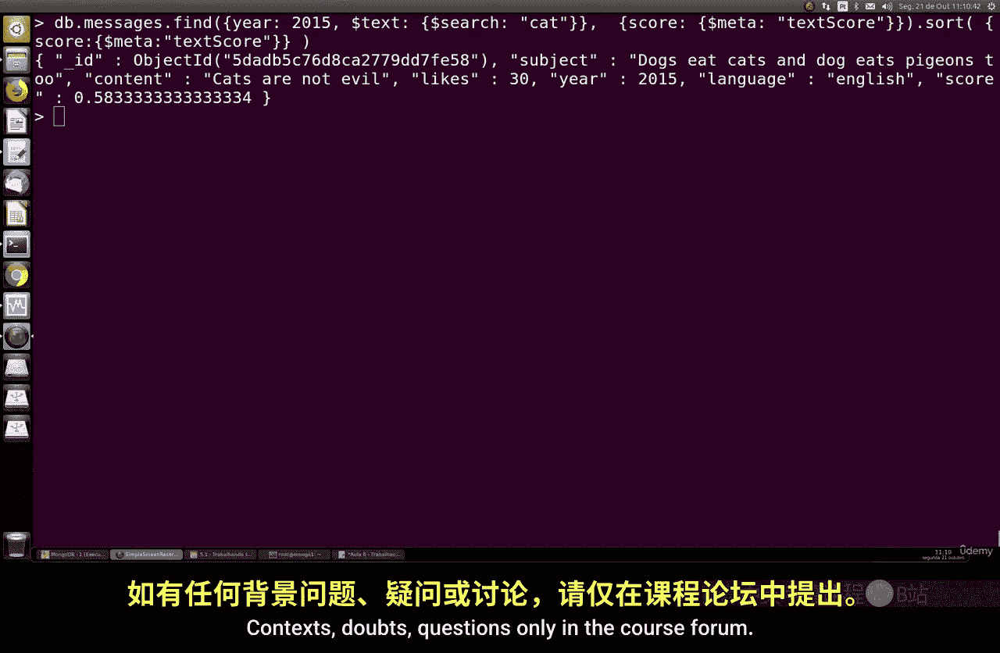

# 120：使用高级文本索引 🔍

在本节课中，我们将学习 MongoDB 中文本索引的高级搜索技术，包括短语搜索、排除特定词汇、查看查询执行详情、调整字段权重以及创建复合索引来优化性能。

---

## 概述

上一节我们介绍了文本索引的基础知识，本节中我们来看看如何使用更高级的搜索功能。我们将学习如何执行精确短语搜索、排除特定词汇、分析查询的执行统计信息、调整不同字段在搜索中的重要性，以及如何通过复合索引来提升大型数据集的搜索效率。

---

## 短语搜索

我们可以搜索文档中包含的完整短语，而不仅仅是单个词汇。

以下是执行短语搜索的命令示例。我们使用 `$text` 操作符和 `$search` 字段，并将要搜索的短语用双引号括起来。

```javascript
db.messages.find({ $text: { $search: "\"cookie food\"" } })
```

这个命令会查找 `subject` 或 `content` 字段中精确包含短语 “cookie food” 的文档。查询结果会返回匹配的文档，并附带一个相关性评分（`textScore`）。

---

## 排除特定词汇

在搜索时，我们可以使用减号 `-` 来排除包含特定词汇的文档。

以下是排除词汇的命令示例。我们在要排除的词汇前加上减号。

```javascript
db.messages.find({ $text: { $search: "rats -birds" } })
```

这个命令会搜索所有包含 “rats” 但不包含 “birds” 这个词的文档。这对于精确过滤搜索结果非常有用。



---

## 分析查询执行详情

为了深入了解查询是如何执行的以及其性能表现，我们可以使用 `explain()` 命令。



以下是使用 `explain()` 命令的示例。我们在 `find()` 命令后链式调用 `explain(“executionStats”)`。

```javascript
db.messages.find({ $text: { $search: "\"cookie food\" -friends" } }).explain("executionStats")
```

执行此命令会返回一个详细的 JSON 对象，其中包含：
*   **查询计划**：MongoDB 如何执行此次搜索。
*   **索引使用情况**：是否使用了文本索引，以及扫描的键数量。
*   **执行统计**：查询耗时、返回的文档数量、扫描的文档数量等。

分析这些信息有助于我们优化查询和索引策略。

---

## 调整字段权重

默认情况下，文本索引中所有字段的权重都是 1。但我们可以为不同字段分配不同的权重，使某些字段在相关性评分中更重要。

以下是创建带权重的文本索引的步骤：
1.  首先，删除现有的文本索引。
    ```javascript
    db.messages.dropIndex("subject_text_content_text")
    ```
2.  然后，使用 `weights` 选项创建一个新的文本索引。
    ```javascript
    db.messages.createIndex(
        { subject: "text", content: "text" },
        { weights: { subject: 3, content: 1 } }
    )
    ```

在这个例子中，`subject` 字段的权重被设置为 3，而 `content` 字段的权重为 1。这意味着，当搜索词汇出现在 `subject` 字段时，其对文档最终相关性评分（`textScore`）的贡献是出现在 `content` 字段时的三倍。

创建此索引后，执行相同的搜索命令，你会发现包含搜索词的文档的 `textScore` 会根据词汇出现的字段而显著变化。

---

## 创建复合索引以优化搜索

当数据量非常大时，纯文本索引可能会变得低效。一个常见的优化技巧是创建**复合索引**，将文本索引与其他条件字段（如日期、分类标签）结合起来。

例如，我们可以创建一个按年份分区的复合索引，这样搜索时就可以同时限定年份和文本内容，大幅缩小搜索范围。

以下是创建复合索引的步骤：
1.  删除旧的索引。
    ```javascript
    db.messages.dropIndex("subject_text_content_text")
    ```
2.  创建一个包含年份和文本字段的复合索引。
    ```javascript
    db.messages.createIndex({ year: 1, subject: "text", content: "text" })
    ```

创建此索引后，我们可以执行同时包含年份过滤和文本搜索的高效查询：

```javascript
db.messages.find({ year: 2015, $text: { $search: "cat" } })
```

这个查询只会搜索 `year` 字段为 2015 的文档，并在这些文档中执行针对 “cat” 的文本搜索。这比在全集合中进行文本搜索要快得多，尤其是在数据量庞大的情况下。

---

## 总结



本节课中我们一起学习了 MongoDB 文本索引的多种高级用法。我们掌握了如何进行精确的短语搜索，以及如何使用减号排除不需要的词汇。我们还学习了如何使用 `explain()` 命令来深入分析查询的执行细节和性能。通过调整字段的权重，我们可以控制不同字段对搜索结果相关性的影响程度。最后，为了应对大数据量场景，我们探讨了如何创建文本字段与其他字段（如年份）的复合索引，从而显著提升搜索效率。合理运用这些高级技巧，可以让你更高效地利用 MongoDB 的全文搜索功能。