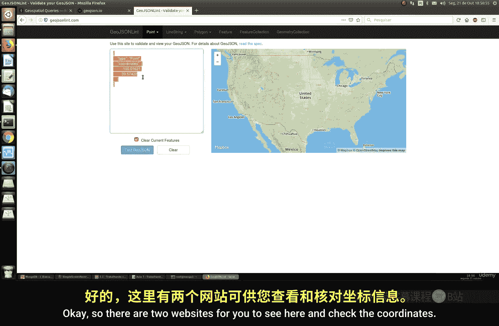
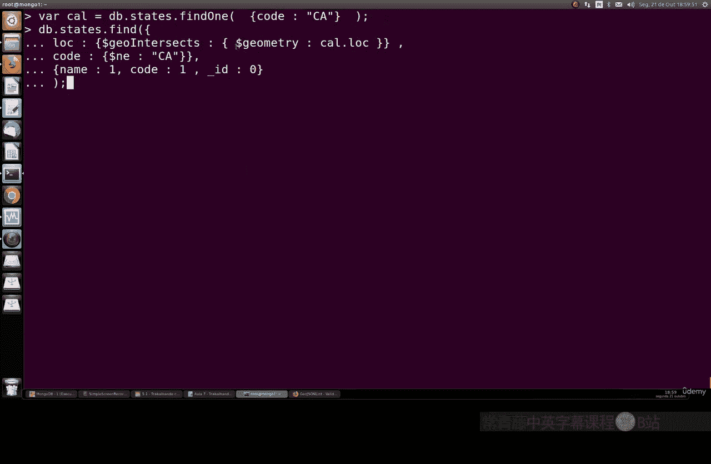
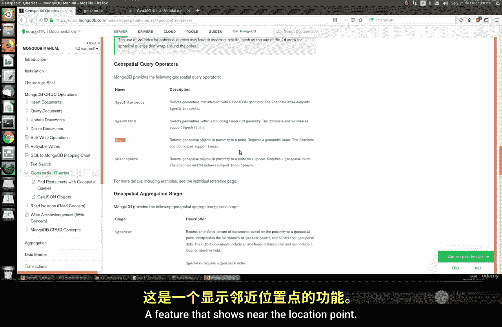
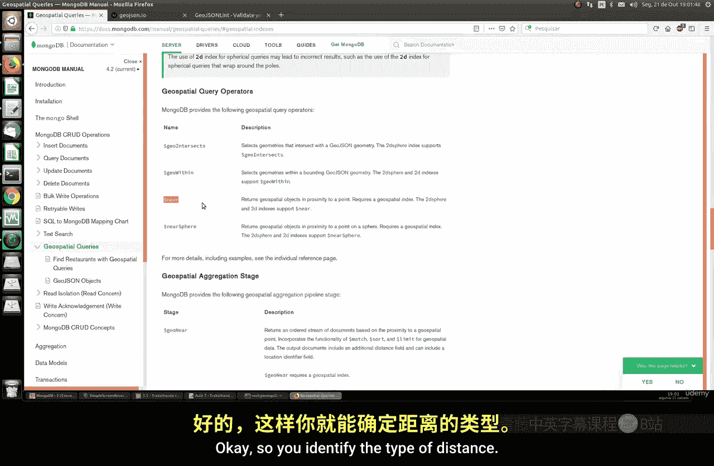
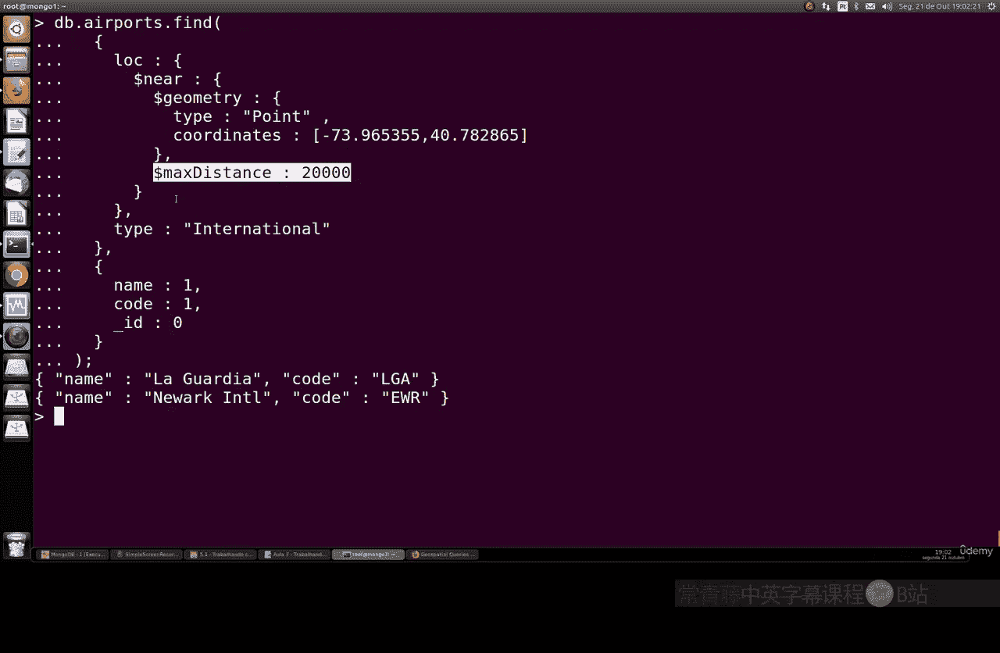
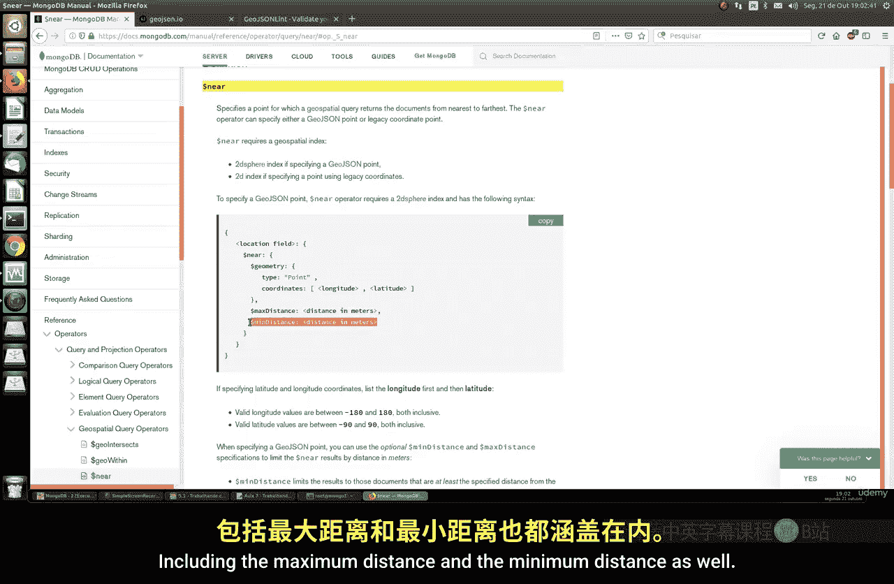
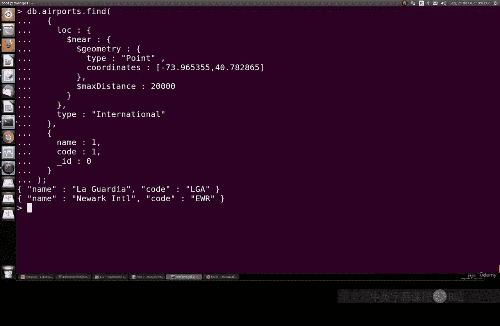
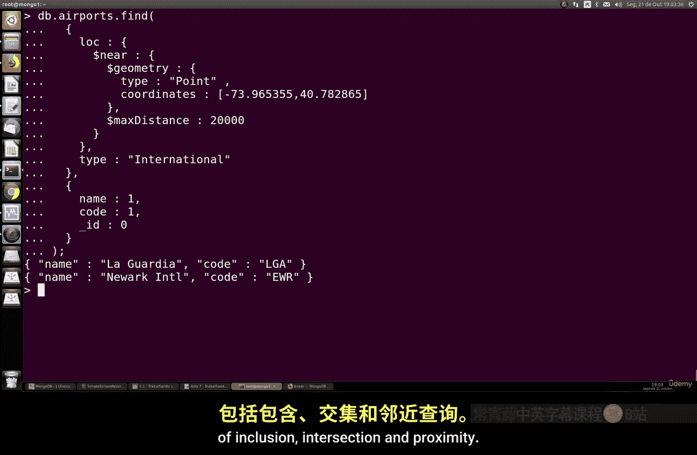

# 121：使用地理空间索引 🗺️

在本节课中，我们将学习如何在 MongoDB 中使用地理空间索引。我们将了解地理空间数据的基本概念，学习如何创建地理空间索引，并实践三种核心的地理空间查询：包含查询、相交查询和邻近查询。

## 概述

地理空间数据通常指包含地理位置信息的数据，例如经度和纬度。MongoDB 提供了强大的功能来存储和查询这类数据。为了高效地进行地理空间查询，我们需要在存储位置信息的字段上创建特定的索引。

官方文档介绍了三种主要的地理空间索引：
*   **2dsphere 索引**：用于查询地球球体上的几何图形。它支持 GeoJSON 格式的数据。
*   **2d 索引**：用于查询平面（二维）上存储为点的数据，使用简单的坐标（如经度、纬度）。
*   **GeoHaystack 索引**：一种用于小区域查询的桶式索引，使用较少。

在本教程中，我们将主要使用 **2dsphere 索引**。

## 准备示例数据

为了进行实践，我们需要一个包含地理空间信息的数据集。我们将使用一个包含美国机场和州边界信息的数据集。

首先，创建一个名为 `geo` 的数据库，并插入一个机场的示例文档：

```javascript
use geo
db.airports.insertOne({
    "name": "Sample Airport",
    "type": "International",
    "code": "SAM",
    "location": {
        "type": "Point",
        "coordinates": [-122.33, 47.61]
    }
})
```



接下来，我们从外部文件导入更完整的数据集。假设我们有两个 BSON 文件：`airports.bson`（机场数据）和 `states.bson`（州边界数据）。可以使用 `mongorestore` 命令来恢复数据：

```bash
mongorestore --db geo airports.bson states.bson
```

导入完成后，我们可以检查数据：
*   `db.states.countDocuments()` 将返回 50，代表美国的 50 个州。
*   `db.airports.countDocuments()` 将返回 880，代表数据库中注册的 880 个机场。

现在，我们的数据已经准备就绪，但还没有创建任何地理空间索引。

## 执行包含查询（$geoWithin）

上一节我们准备好了数据。本节中，我们来看看第一种查询：包含查询。这种查询用于查找完全位于某个指定地理区域（如一个多边形）内的所有点。

例如，我们想找出加利福尼亚州内的所有机场。这需要两个步骤：
1.  获取加利福尼亚州的边界几何图形（一个多边形）。
2.  查询所有位置点位于这个多边形内的机场。

以下是查询命令：

```javascript
var california = db.states.findOne({name: "California"});
db.airports.find({
    "location": {
        $geoWithin: {
            $geometry: california.loc
        }
    }
}, {name: 1, type: 1, _id: 0})
```

这个查询会返回位于加州边界内的所有机场的名称和类型。你可以进一步筛选，例如只查找国际机场：

```javascript
db.airports.find({
    "location": {
        $geoWithin: {
            $geometry: california.loc
        }
    },
    "type": "International"
}, {name: 1, _id: 0})
```

## 创建地理空间索引

在执行上述查询时，MongoDB 需要扫描所有文档来检查位置条件。虽然当前数据量下速度尚可，但随着数据增长，性能会下降。为了提高查询效率，我们需要创建地理空间索引。

在 `airports` 集合的 `location` 字段上创建一个 **2dsphere** 索引：

```javascript
db.airports.createIndex({ "location": "2dsphere" })
```

创建索引后，再次执行相同的查询，速度会显著提升。你可以使用 `explain()` 命令来验证查询是否使用了我们新建的索引：


```javascript
db.airports.find({
    "location": {
        $geoWithin: {
            $geometry: california.loc
        }
    }
}).explain("executionStats")
```

在输出结果中，查找 `stage` 字段，如果看到 `IXSCAN` 并且 `indexName` 包含 `2dsphere`，说明索引已生效。

## 执行相交查询（$geoIntersects）

创建索引优化了查询性能。接下来，我们看看第二种查询类型：相交查询。这种查询用于查找其几何图形与指定几何图形相交的文档，常用于查找相邻的区域。

例如，我们想找出所有与加利福尼亚州边界相交的州（即相邻的州）。

以下是查询命令：



```javascript
db.states.find({
    "loc": {
        $geoIntersects: {
            $geometry: california.loc
        }
    },
    "name": { $ne: "California" }
}, {name: 1, _id: 0})
```


这个查询会返回俄勒冈州、内华达州和亚利桑那州，因为它们是加利福尼亚州的邻州。同样，为了优化这个对 `states` 集合的查询，我们也应该在它的 `loc` 字段上创建 **2dsphere** 索引。

```javascript
db.states.createIndex({ "loc": "2dsphere" })
```

## 执行邻近查询（$near）




我们学习了包含查询和相交查询。最后，我们来学习第三种，也是非常有用的邻近查询。这种查询用于查找距离某个指定点最近的点，并按距离排序。


例如，我们想找出距离纽约中央公园（坐标 `[-73.97, 40.77]`）20公里范围内所有的国际机场。



以下是查询命令：



```javascript
db.airports.find({
    "location": {
        $near: {
            $geometry: {
                type: "Point",
                coordinates: [-73.97, 40.77]
            },
            $maxDistance: 20000 // 距离单位为米，20000米=20公里
        }
    },
    "type": "International"
}, {name: 1, _id: 0})
```

`$near` 操作符会自动按从近到远的顺序返回结果。你还可以使用 `$minDistance` 参数来设置最小距离。





## 总结


本节课中我们一起学习了 MongoDB 地理空间查询的基础知识。
1.  我们了解了地理空间数据的基本概念和 **2dsphere 索引** 的作用。
2.  我们准备了包含机场和州边界信息的示例数据集。
3.  我们实践了三种核心的地理空间查询：
    *   **包含查询 (`$geoWithin`)**：查找位于指定区域内的点。
    *   **相交查询 (`$geoIntersects`)**：查找与指定图形相交的图形。
    *   **邻近查询 (`$near`)**：查找距离指定点最近的点，并按距离排序。
4.  我们强调了为地理空间字段创建索引对提升查询性能的重要性。




通过掌握这些技能，你可以在应用程序中轻松实现基于位置的服务，如查找附近的场所、分析区域关系等。