# 122：稀疏索引与部分索引 🚀

在本节课中，我们将学习MongoDB中的部分索引。部分索引与上一节介绍的稀疏索引略有相似，但它提供了更强大的功能，允许使用查询表达式来定义索引条件，从而在特定场景下实现更优的性能。

## 概述

部分索引在MongoDB 3.2版本中引入。与稀疏索引类似，它允许只为集合中满足特定条件的文档创建索引。核心区别在于，部分索引可以使用`$eq`、`$gt`等查询运算符以及`$and`、`$or`、`$exists`等逻辑运算符来定义索引条件。这为处理大型数据集中的特定子集提供了高效的索引方案。

## 部分索引的优势

部分索引的主要优势在于其针对性。假设你有一个庞大的数据集，并且只想为其中包含特定字段（例如`language`）的文档创建索引。如果使用传统索引，整个集合都会被索引，这可能并非理想选择。而部分索引允许我们只为这个字段存在的文档子集创建索引，从而节省存储空间并提升查询效率。

## 实践操作：创建与测试部分索引

上一节我们操作了稀疏索引，本节我们将通过一个实例来演示部分索引的创建与性能对比。

首先，我们使用一个包含10万份文档的模拟数据库。我们需要检查集合中文档的总数，以及不包含`language`字段的文档数量。


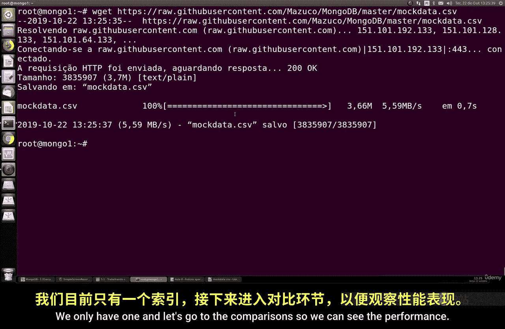

执行以下命令查看文档总数：
```javascript
db.collection.countDocuments({})
```
统计不包含`language`字段的文档数量：
```javascript
db.collection.countDocuments({ language: { $exists: false } })
```
结果显示，总文档数为100,000，其中约12,700份文档没有`language`字段。

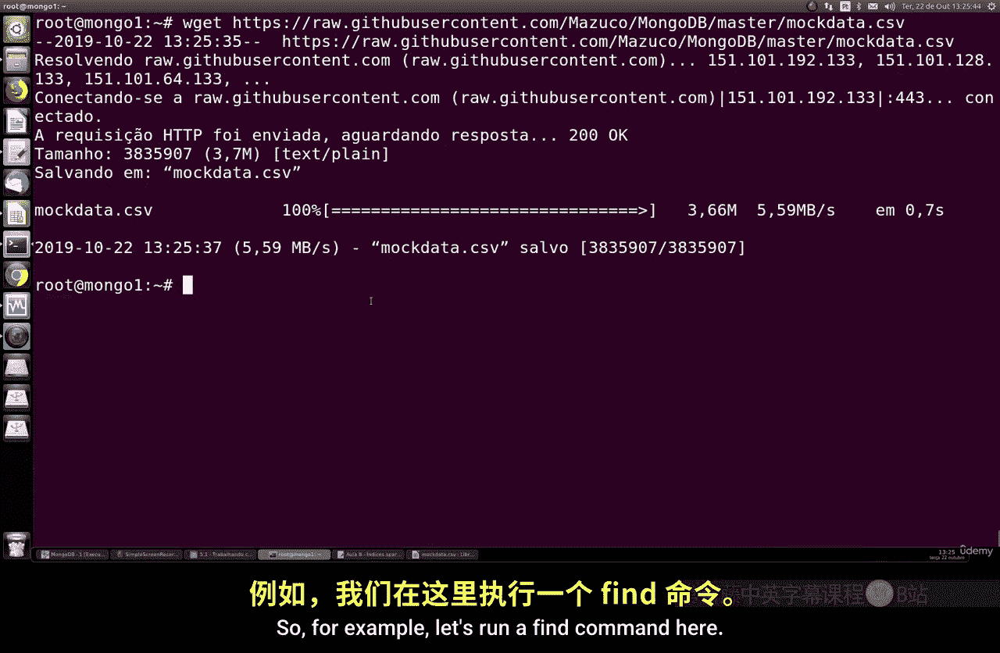

在创建新索引前，需要移除上一节可能创建的旧索引。使用以下命令删除指定名称的索引：
```javascript
db.collection.dropIndex("index_name")
```
确认索引已被成功移除。

## 性能对比测试

为了直观展示部分索引的性能优势，我们进行一个查询测试。

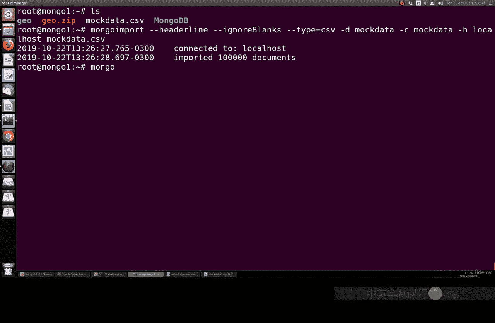

首先，在不使用索引的情况下，执行一个查询所有名字中包含“Sarah”的文档的命令：
```javascript
db.collection.find({ "name.first": /Sarah/ }).explain("executionStats")
```
记录查询的执行时间（例如57毫秒）和扫描的文档数量。

接下来，我们创建一个部分索引。该索引仅在文档包含`language`字段时，才对`name`字段建立索引：
```javascript
db.collection.createIndex(
  { "name.first": 1 },
  { partialFilterExpression: { language: { $exists: true } } }
)
```
索引创建完成后，再次执行相同的查询命令：
```javascript
db.collection.find({ "name.first": /Sarah/ }).explain("executionStats")
```
这次，查询的执行时间显著降低（例如降至29毫秒），并且扫描的文档数量也减少了。这清晰地证明了部分索引在优化特定查询时的有效性。

## 核心概念总结

部分索引与稀疏索引的核心思想相似，都是选择性索引。但部分索引功能更强大，它允许使用丰富的**查询表达式**来定义索引条件，例如：
*   `{ field: { $exists: true } }`
*   `{ field: { $gt: 100 } }`
*   `{ $and: [ { field1: { $exists: true } }, { field2: { $eq: "value" } } ] }`

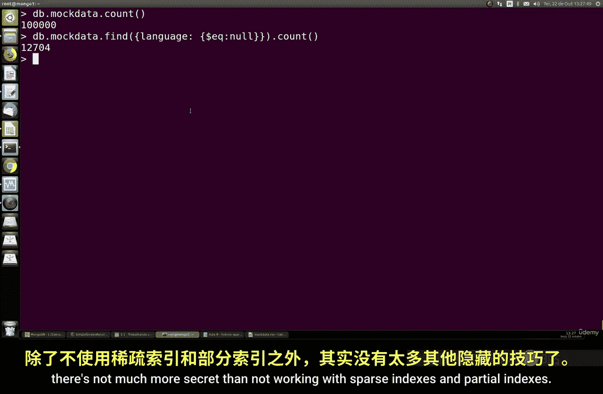

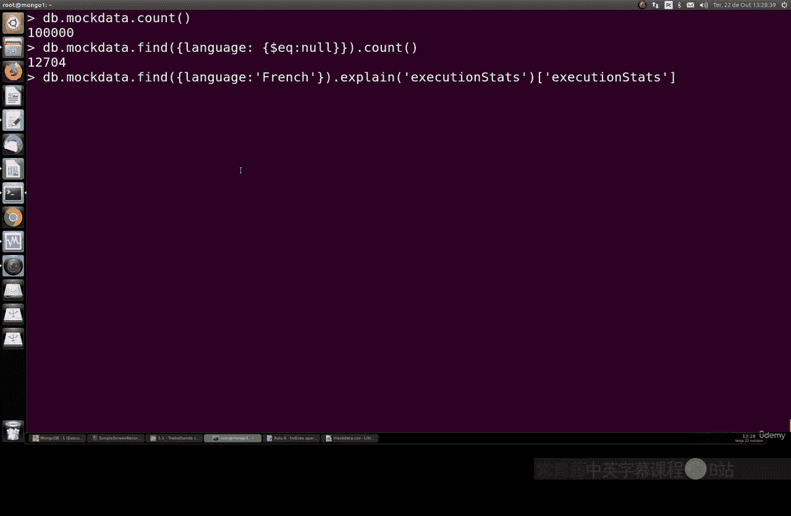

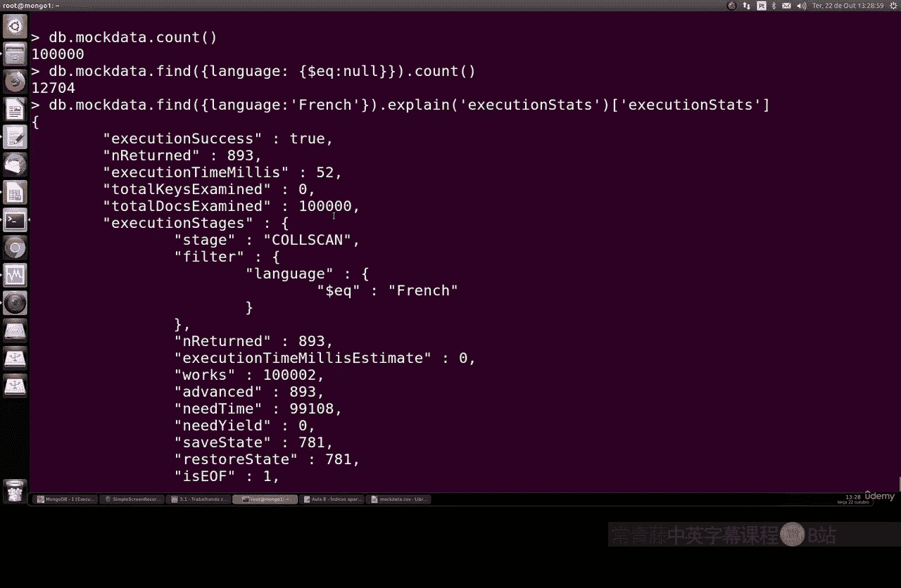

这使得开发者可以更精确地控制索引范围，针对高频或关键的查询路径建立索引，从而在复杂的数据场景中获得最佳性能。

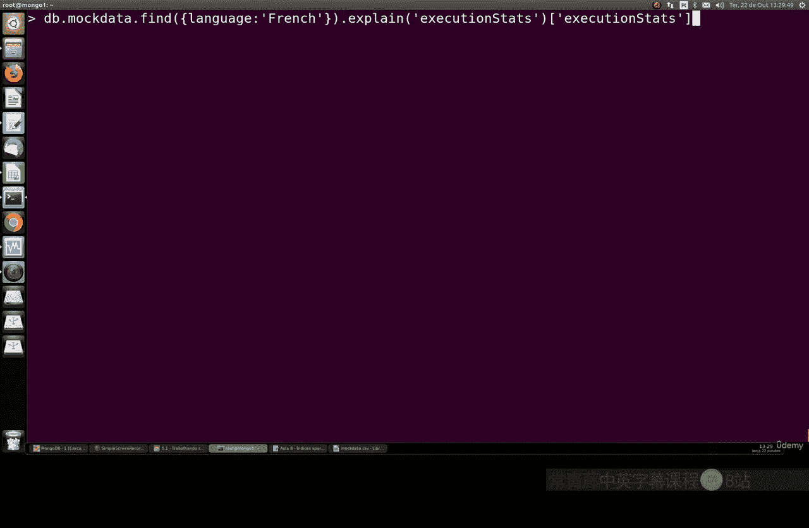

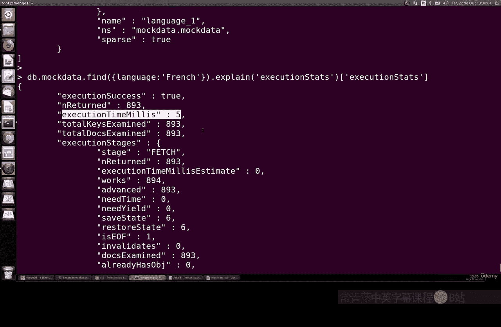

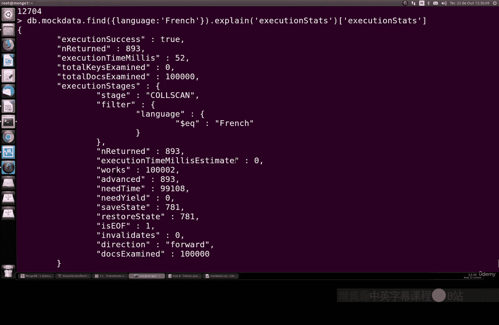

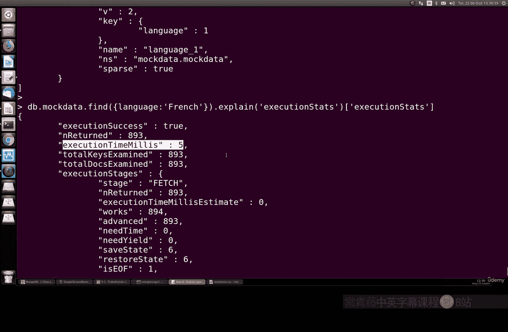

## 总结

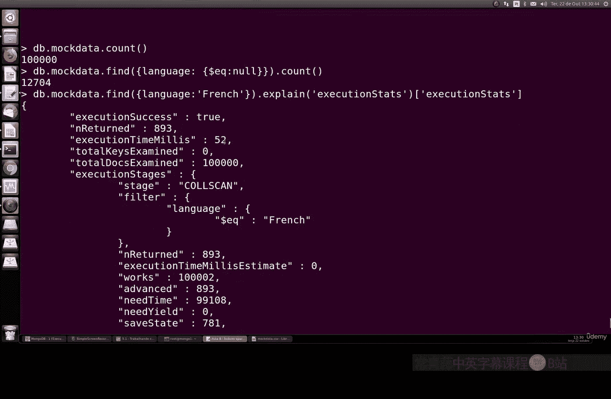

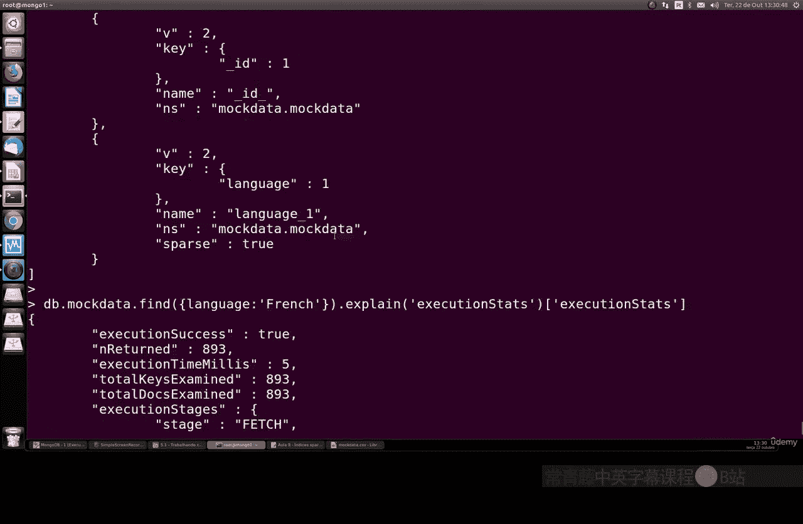

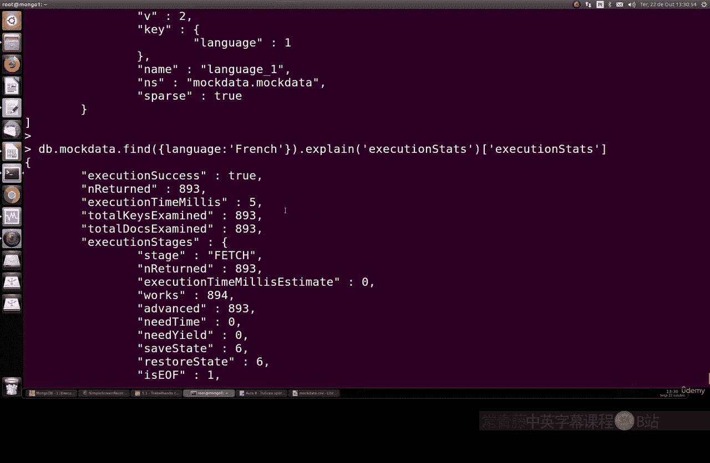

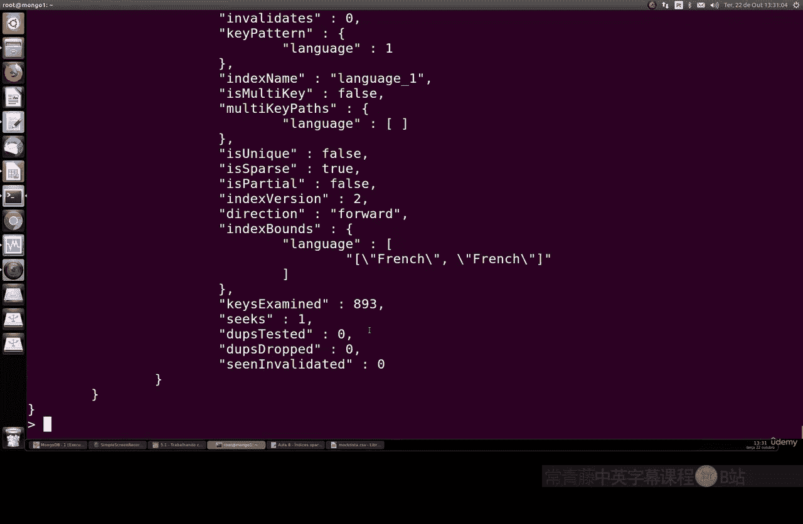

本节课我们一起学习了MongoDB中的部分索引。我们了解了部分索引的设计目的、它与稀疏索引的异同，并通过实践操作演示了如何创建部分索引以及如何验证其对查询性能的提升。关键在于，部分索引通过**条件表达式**实现了对文档子集的精准索引，是处理大型非均匀数据集的强大工具。掌握稀疏索引和部分索引，能帮助你在数据库优化中做出更合适的选择。