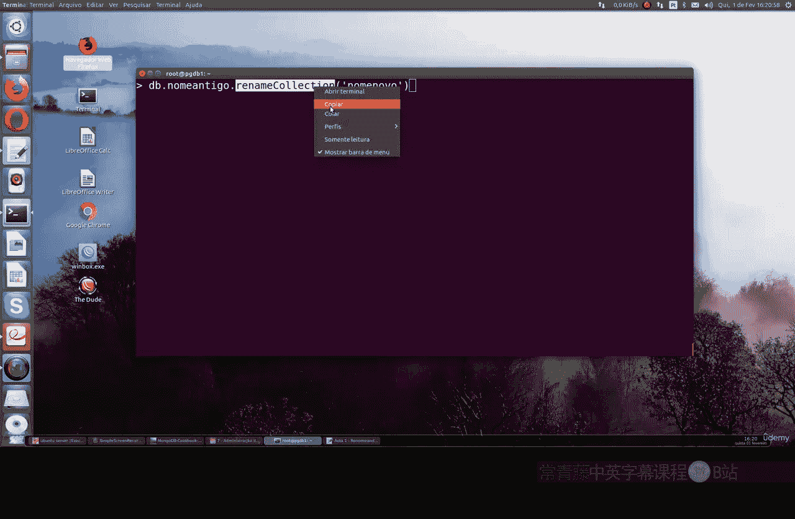
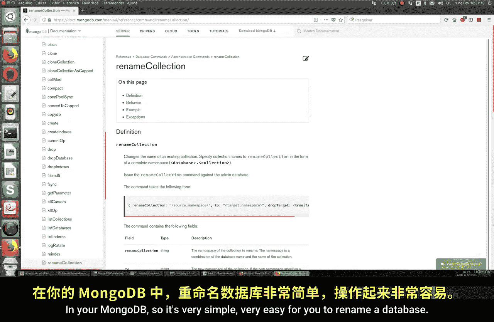
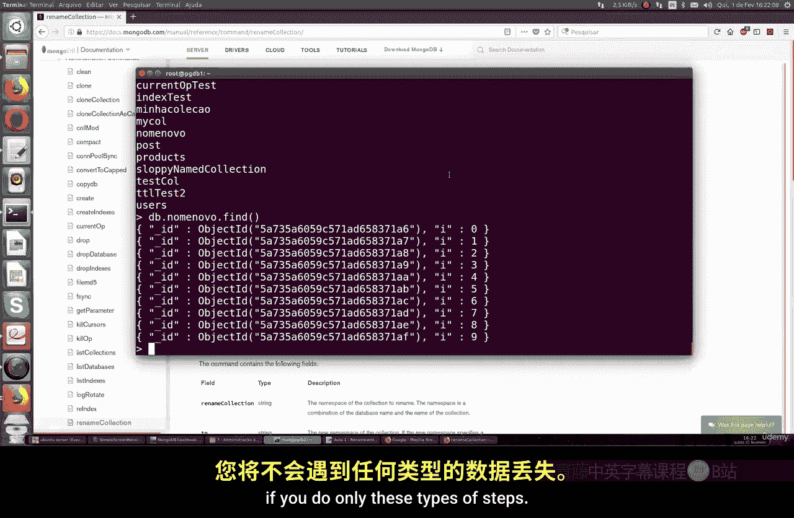

# 124：集合重命名操作 🗃️

在本节课中，我们将学习如何在 MongoDB 中重命名一个集合。这对于所有类型的数据库管理员都非常有用。我们将了解如何重命名数据库和集合，并理解执行此操作所需的权限。

## 概述

重命名集合是数据库管理中的一项常见操作。MongoDB 提供了专门的命令来完成这项任务。在执行操作前，必须确保你的用户账户拥有相应的权限，否则可能会遇到授权问题，导致操作被 MongoDB 阻止。

## 准备工作

首先，我们需要进入一个数据库并查看现有的集合。我们将使用 `test` 数据库作为示例。

```javascript
use test
show collections
```

执行上述命令后，你可以看到数据库中已有的集合列表。

## 创建示例集合

为了演示重命名操作，我们需要先创建一个集合。以下是创建名为 `oldName` 的集合并插入10个文档的步骤。

```javascript
db.oldName.insertMany([
  { "item": "document1" },
  { "item": "document2" },
  // ... 可以继续添加更多文档，总计10个
])
```

插入完成后，我们可以使用 `find()` 命令来验证文档是否已成功插入到集合中。

```javascript
db.oldName.find()
```

如果操作成功，你将看到插入的文档列表。

## 重命名集合

重命名集合的操作非常简单直接。你需要使用 `renameCollection` 命令。

上一节我们创建了示例集合，本节中我们来看看如何将其重命名。

核心命令格式如下：

```javascript
db.oldName.renameCollection("newName")
```

在这个命令中：
*   `db.oldName` 指定了需要重命名的原始集合。
*   `renameCollection` 是 MongoDB 的重命名函数。
*   `"newName"` 是你为集合设定的新名称，需要用引号括起来。



**重要提示**：执行此操作的用户必须在 MongoDB 中拥有重命名集合的权限。你可以查阅 MongoDB 官方手册以了解详细的权限配置。

## 验证重命名结果

重命名操作完成后，集合内的所有文档将保持不变，不会丢失任何数据。



现在，让我们验证一下重命名是否成功。你可以使用 `show collections` 命令来查看新的集合名称是否已出现在列表中。

```javascript
show collections
```

你应该能看到 `newName` 集合。为了进一步确认数据完整性，可以查询新集合。

```javascript
db.newName.find()
```

此命令将显示与之前 `oldName` 集合中完全相同的文档，证明重命名操作仅改变了集合的名称，而未影响其内容。

## 操作要点总结

以下是执行集合重命名时需要注意的关键点：

*   **权限要求**：执行操作的用户账户必须拥有 `renameCollection` 权限。
*   **命令语法**：使用 `db.[oldCollectionName].renameCollection("newCollectionName")`。
*   **数据安全**：该操作仅更改集合名称，集合内的所有文档和数据索引都将被保留，不会造成数据丢失。
*   **验证步骤**：操作后，建议使用 `show collections` 和 `db.[newCollectionName].find()` 进行验证。



## 总结

本节课中我们一起学习了 MongoDB 中重命名集合的完整流程。我们首先创建了一个示例集合并插入数据，然后使用 `renameCollection` 命令将其重命名，最后验证了操作结果和数据完整性。记住，确保拥有正确的权限是成功执行此操作的前提。通过这个简单的命令，你可以轻松地管理 MongoDB 中的集合结构。