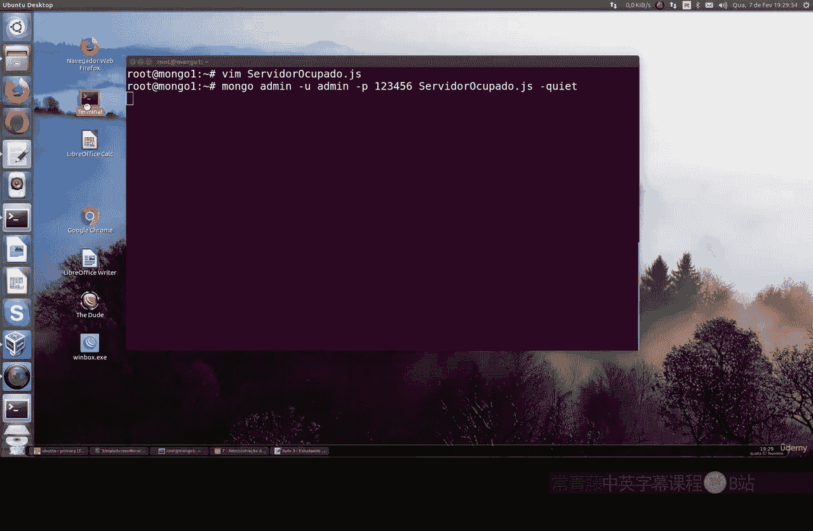
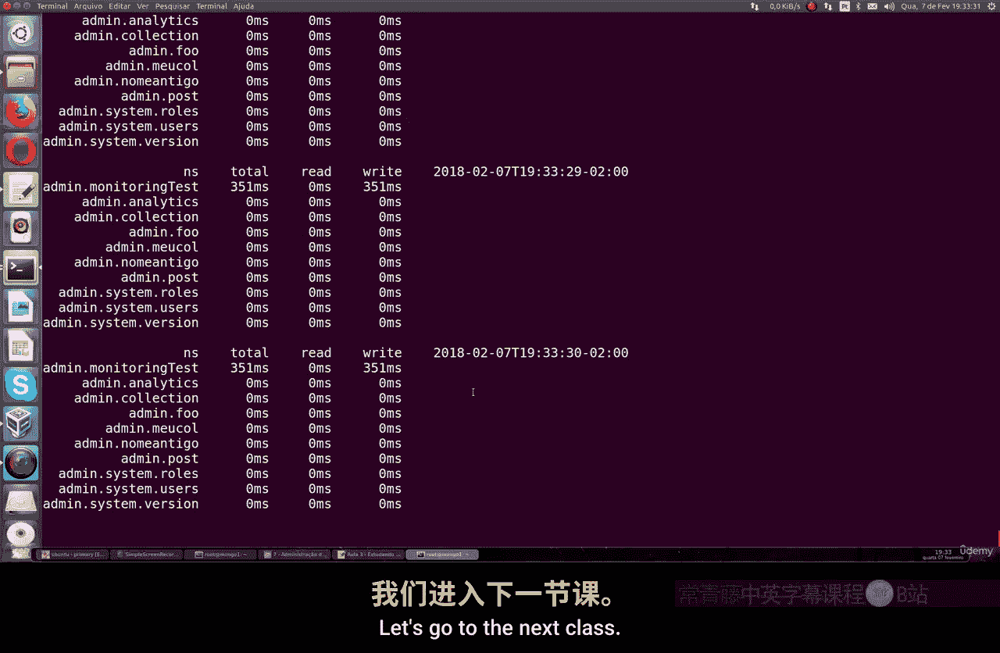

# 126：研究mongotop与mongostat 📊

在本节课中，我们将学习两个广泛使用的实用工具：`mongostat` 和 `mongotop`。它们的主要目标是可视化MongoDB服务器的各项统计数据。这对于监控数据库的运行状况至关重要，因为它能让我们了解CRUD操作的数量、内存和缓存的消耗情况以及用户连接数等信息。

## 概述

`mongostat` 和 `mongotop` 是类似于Linux系统 `top` 和 `stat` 命令的MongoDB监控工具。为了有效地观察这些工具输出的数据，我们需要让MongoDB服务器保持一定的活动负载。否则，直接运行命令可能只会看到零值，这没有太大帮助。

需要注意的是，**请勿在生产服务器上进行此类负载测试**，这可能会影响线上服务的稳定性。我们将通过创建一个JavaScript脚本来在测试环境中模拟数据库活动。

## 准备工作：创建负载脚本

为了让MongoDB服务器保持繁忙状态，我们需要运行一个能持续执行插入、更新和删除操作的脚本。以下是具体步骤：

我们将创建一个名为 `serverBusy.js` 的JavaScript脚本。这个脚本的基本逻辑是：循环创建超过1000个文档，然后执行插入、更新和删除操作，从而形成一个持续的负载。

脚本的核心是一个 `while(true)` 循环，它会不断地在MongoDB中执行操作。



以下是运行此脚本的命令：
```bash
mongo admin -u <你的用户名> -p <你的密码> --authenticationDatabase admin serverBusy.js --quiet
```
使用 `--quiet` 参数是为了让命令在终端中静默运行，不显示多余信息。

运行此命令后，脚本将在后台持续执行，使MongoDB服务器保持活跃状态。

## 使用 mongostat 监控实时统计

现在，让我们打开另一个终端窗口，连接到同一个MongoDB实例，并使用 `mongostat` 命令。

运行以下命令：
```bash
mongostat --uri="mongodb://<用户名>:<密码>@localhost:27017/admin"
```
`mongostat` 会持续更新并显示MongoDB的主要统计数据。

上一节我们介绍了如何让服务器产生负载，本节中我们来看看 `mongostat` 能提供哪些信息。

`mongostat` 的输出包含以下关键信息：
*   **CRUD操作**：实时显示每秒的插入（`insert`）、查询（`query`）、更新（`update`）、删除（`delete`）等操作数量。
*   **时间和日期**：当前监控的时间点。
*   **网络带宽**：输入（`net in`）和输出（`net out`）的网络流量。
*   **内存使用**：虚拟内存（`vsize`）和常驻内存（`res`）的使用情况。
*   **队列长度**：读写操作的队列情况。
*   **连接数**：当前连接的客户端数量（`conn`）。

这些数据对于了解数据库的实时负载和性能瓶颈非常有帮助。你可以查阅MongoDB官方文档以获取每个字段的详细说明。

## 使用 mongotop 监控集合级别活动

除了服务器整体的统计，我们还可以使用 `mongotop` 来查看更细粒度的信息，即各个数据库和集合的读写活动时间。

`mongotop` 命令的用法与 `mongostat` 类似：
```bash
mongotop --uri="mongodb://<用户名>:<密码>@localhost:27017/admin"
```

以下是 `mongotop` 输出的主要内容：
*   **数据库和集合名**：显示正在发生活动的具体数据库和集合。
*   **读写时间**：以毫秒为单位，显示每个集合在采样周期内花费在读取（`read`）和写入（`write`）操作上的总时间。
*   **总计**：读写时间的总和。

在我们的测试脚本中，由于只进行了写入操作（插入、更新、删除），你可能会看到写入时间占主导，而读取时间很少。这对于识别热点集合或分析特定操作的成本非常有用。

## 总结

本节课中我们一起学习了两个重要的MongoDB监控工具：
1.  **`mongostat`**：用于监控MongoDB实例的实时全局统计数据，如操作计数、网络、内存和连接情况。
2.  **`mongotop`**：用于监控数据库和集合级别的读写活动时间，帮助定位性能热点。



掌握这两个工具是任何数据库管理员或系统管理员进行性能监控和故障排查的重要技能。通过模拟负载并观察这些指标，你可以更好地理解数据库的行为并为优化做好准备。