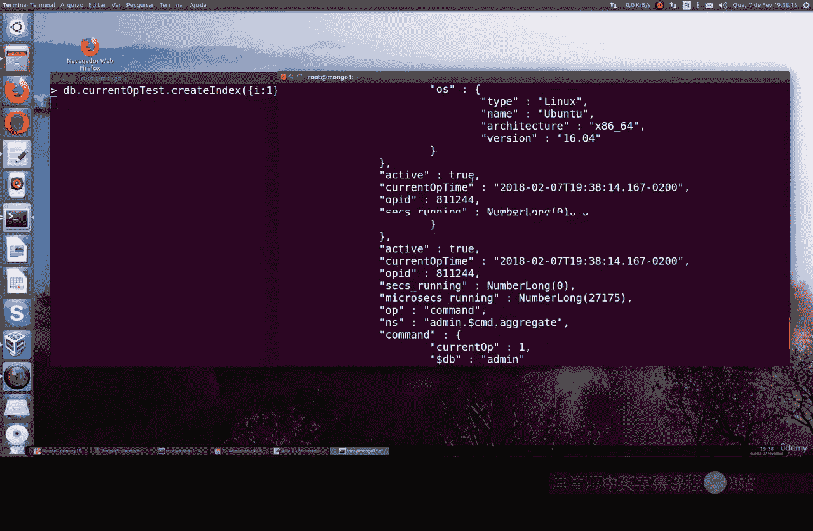
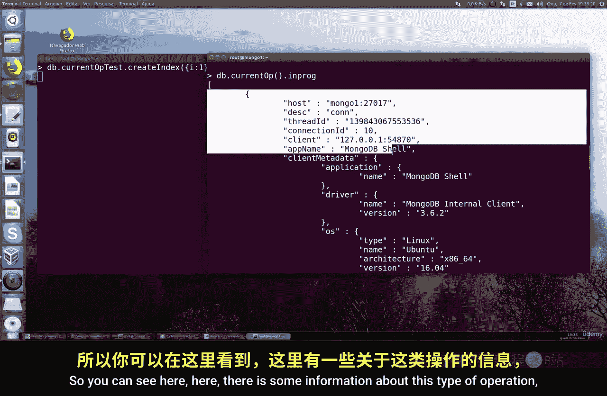
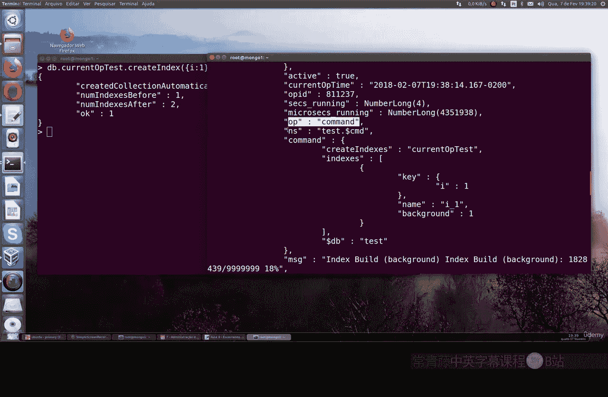
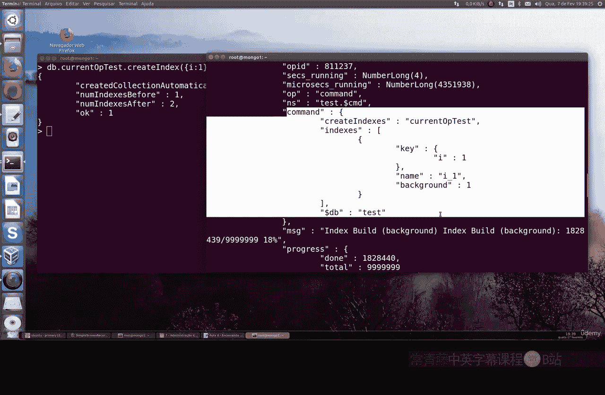
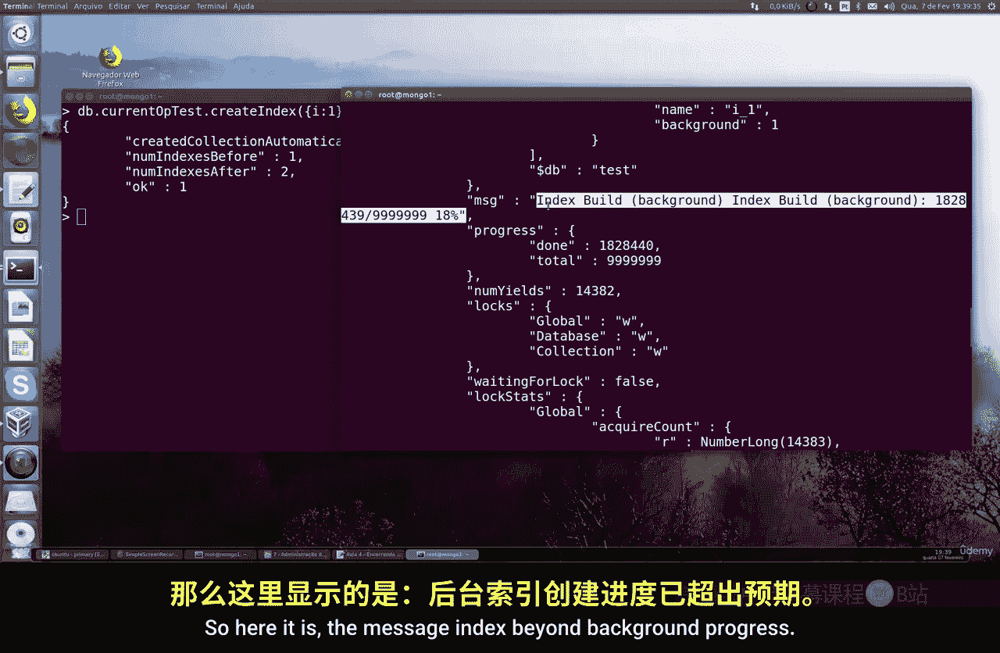
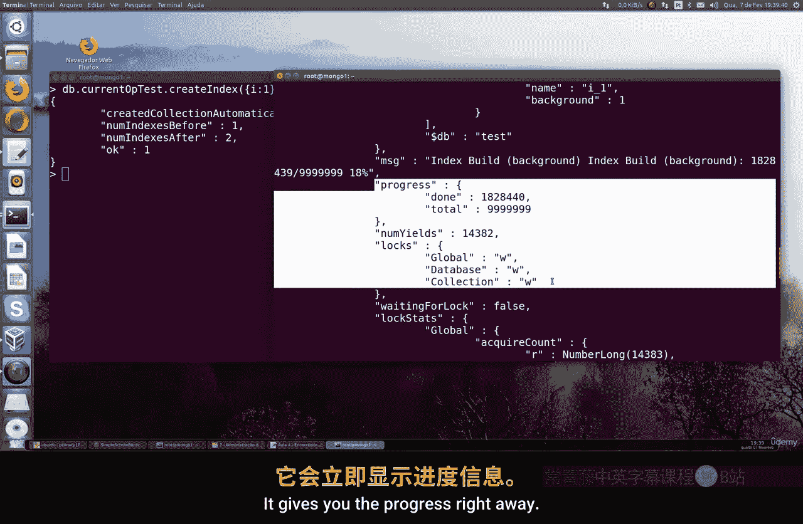
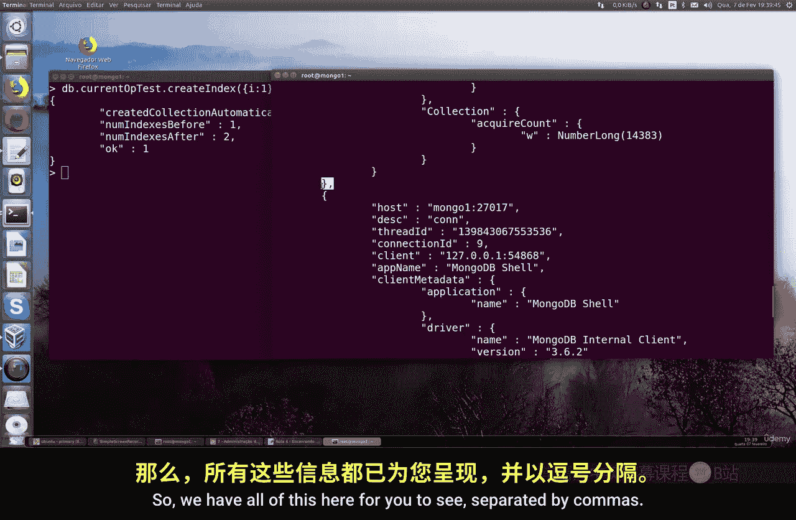
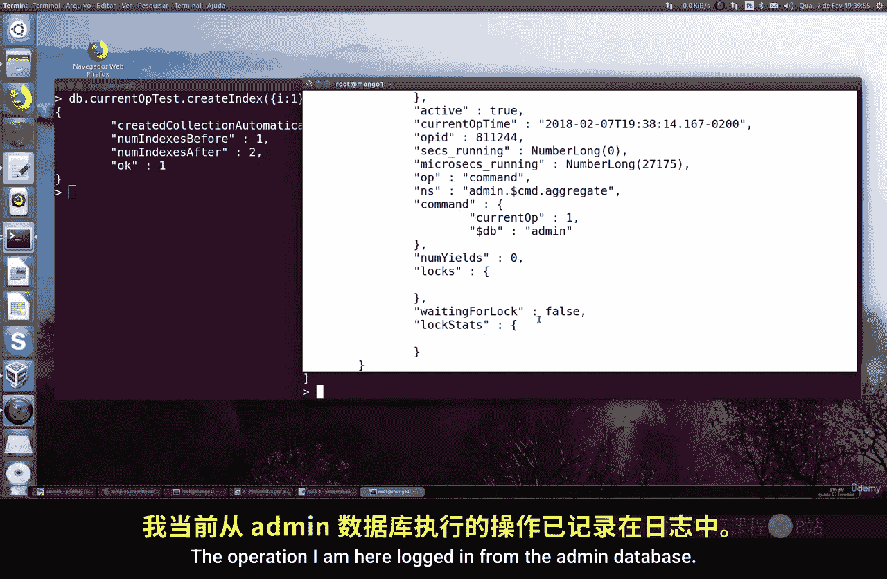
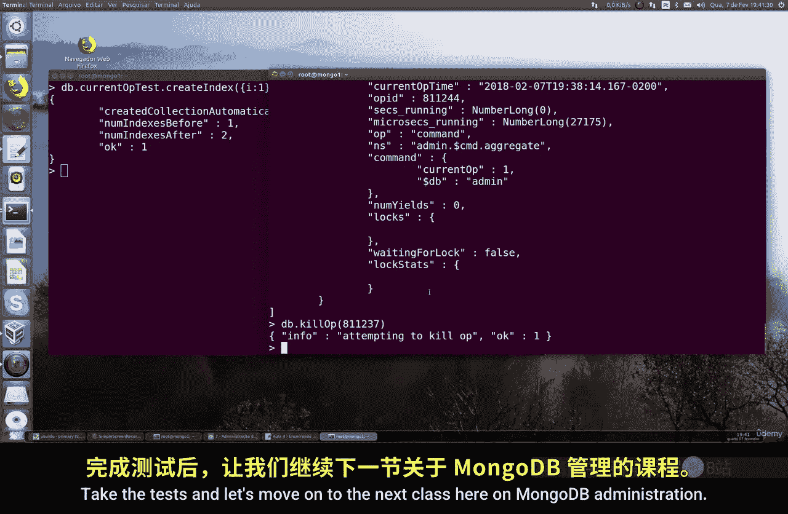

# 127：终止当前操作 🔪

在本节课中，我们将学习如何在 MongoDB 中查看和终止正在进行的操作。这对于管理数据库性能、解决阻塞问题或停止不需要的长时间运行任务非常有用。

上一节我们介绍了数据库的基本操作，本节中我们来看看如何管理这些操作本身。

## 准备测试环境

为了演示如何终止操作，我们首先需要创建一个可以长时间运行的操作。我们将使用一个包含大量数据的测试数据库。

以下是创建测试数据的步骤：
1.  使用 `use test` 命令切换到 `test` 数据库。
2.  执行一个插入一千万条文档的命令来模拟一个耗时操作。命令如下：
    ```javascript
    for (var i = 0; i < 10000000; i++) { db.test_collection.insert({ "value": i }) }
    ```
    请注意，这个操作会花费很长时间，具体取决于你的计算机性能。


操作完成后，我们可以使用 `db.test_collection.find().count()` 来验证是否已成功插入一千万条文档。

## 查看当前操作



现在，让我们创建一个新的、可以观察到的长时间运行操作：在大型集合上创建后台索引。



执行以下命令来创建索引：
```javascript
db.test_collection.createIndex({ "value": 1 }, { background: true })
```

当索引在后台创建时，我们可以使用 `db.currentOp()` 命令来查看 MongoDB 中所有正在进行的操作。

这个命令会返回一个包含多个操作详情的文档列表。每个操作都包含以下关键信息：
*   **`opid`**： 操作的唯一标识符。
*   **`op`**： 操作类型（例如：`insert`, `query`, `command`, `update`）。
*   **`ns`**： 操作所针对的命名空间（数据库和集合）。
*   **`command`**： 正在执行的具体命令详情。
*   **`msg`**： 操作进度或状态信息。
*   **`active`**： 表示操作是否正在活跃执行。



通过 `db.currentOp()`，你可以找到我们刚刚启动的索引创建操作，并记下它的 `opid`。



## 终止指定操作





当你发现某个操作消耗过多资源、意外卡住或需要停止时，可以使用 `db.killOp()` 命令来终止它。





该命令需要目标操作的 `opid` 作为参数。语法如下：
```javascript
db.killOp(<opid>)
```

例如，如果你从 `db.currentOp()` 的输出中看到索引创建的 `opid` 是 `81237`，那么终止该操作的命令就是：
```javascript
db.killOp(81237)
```

执行后，MongoDB 会尝试立即停止该操作。这对于解除因某个操作导致的数据库阻塞或客户端连接卡死非常有效。

## 注意事项

在使用 `db.killOp()` 时，需要注意以下几点：
*   确保你终止的是正确的操作，误杀关键操作可能影响数据库服务。
*   某些系统操作可能无法被立即终止。
*   终止操作后，最好再次使用 `db.currentOp()` 确认操作已停止。



本节课中我们一起学习了如何在 MongoDB 中查看当前运行的操作，并使用 `db.currentOp()` 和 `db.killOp()` 命令来管理和终止特定操作。这是数据库日常管理和故障排查中的一个重要技能。