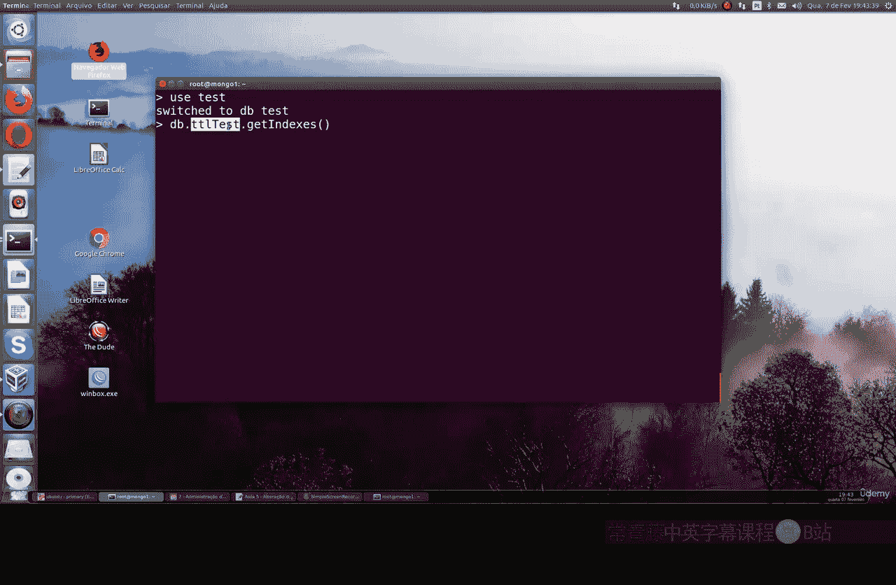

# 128：使用 collMod 修改集合索引 🛠️

在本节课中，我们将学习如何修改已创建的 MongoDB 索引。我们将使用 `collMod` 命令来改变索引的属性，而不是删除或重新创建它。

上一节我们介绍了如何创建索引，本节中我们来看看如何修改一个已经存在的索引。

## 准备工作

为了完成今天的课程，你必须已经学习过关于 TTL 索引的课程。该课程位于我们 MongoDB 课程的索引部分。我们将使用数据库中的那些集合和索引。


今天我们将使用这个数据库。


你可以自己测试，这正是我们要做的。让我们选择之前课程中创建的 `TL Test` 集合。




## 查看现有索引

首先，我们获取该集合拥有的所有索引。这里有一个 TTL 索引，它会在一定时间后使文档过期。当前，它设置为 **300 秒** 后使文档过期。

如果你想修改这个时间，或者改变索引的任何其他属性，你需要使用 `collMod` 命令。这是本节课的核心内容。

## 使用 collMod 修改索引

以下是修改索引的关键步骤。我们将把 TTL 索引的过期时间从 300 秒改为 800 秒。

**命令格式如下：**
```javascript
db.runCommand({
  collMod: "<collection_name>",
  index: {
    keyPattern: { <indexed_field>: 1 },
    expireAfterSeconds: <new_value>
  }
})
```

具体到我们的例子，操作如下：
1.  使用 `collMod` 命令。
2.  指定要修改的集合名称。
3.  在 `index` 参数中，指明要修改的索引字段和新的 `expireAfterSeconds` 值。

我们将执行以下命令：
```javascript
db.runCommand({
  collMod: "TL Test",
  index: {
    keyPattern: { createdAt: 1 },
    expireAfterSeconds: 800
  }
})
```

执行后，系统会返回确认信息。然后，我们可以再次运行 `getIndexes()` 命令来验证修改是否成功。你将看到 `expireAfterSeconds` 的值已从 300 变为 **800**。

## 总结

本节课中我们一起学习了如何使用 `collMod` 命令来修改 MongoDB 中已存在的索引属性。这是一个非常实用的技巧，允许你灵活调整索引行为（如 TTL 过期时间）而无需删除和重建索引，从而避免了可能的性能影响和数据操作中断。