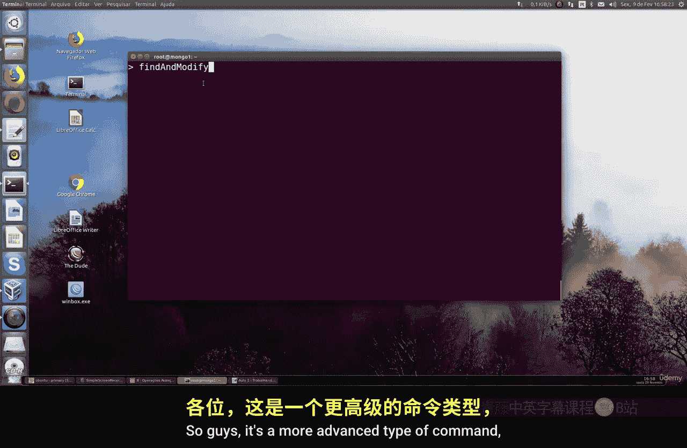

# 129：使用findAndModify命令 🛠️

在本节课中，我们将超越基本的CRUD操作（插入、更新、删除），学习MongoDB中更高级的命令。这些命令需要更多的关注，但并不复杂，是开发或日常工作中可能会用到的实用技能。

## 概述


本节课的核心是学习 `findAndModify` 命令。这是一个高级命令，它能在一个原子操作中自动查找文档并对其进行修改。它包含了所有必要的参数，可以执行查找、更新甚至删除操作，非常适合在并发环境下确保数据操作的一致性。


## 命令详解与步骤



以下是使用 `findAndModify` 命令的详细步骤和不同配置。


### 步骤1：基础更新操作

首先，我们向一个测试集合插入一个简单的文档，然后使用 `findAndModify` 命令来更新它。

```javascript
// 插入一个测试文档
db.test.insertOne({ _id: 1, text: "Atomic operations Test" })

// 使用 findAndModify 进行更新
db.test.findAndModify({
    query: { _id: 1 },
    update: { $set: { text: "Updated string test" } },
    new: true
})
```

在这个命令中：
*   **`query`**：用于查找目标文档的条件。
*   **`update`**：定义了要对文档进行的修改操作，这里使用了 `$set` 操作符。
*   **`new: true`**：指示MongoDB返回更新后的文档，而不是更新前的文档。

执行后，文档中的 `text` 字段将从 “Atomic operations Test” 更新为 “Updated string test”。

### 步骤2：使用 `upsert` 参数

`upsert` 是一个非常有用的参数。如果 `query` 没有找到匹配的文档，`upsert: true` 会创建一个新文档。


```javascript
db.test.findAndModify({
    query: { _id: 2 },
    update: { $set: { text: "Testing a string" } },
    upsert: true,
    new: true
})
```

在这个例子中，由于 `_id` 为2的文档不存在，MongoDB会根据 `query` 和 `update` 的内容创建一个新文档。`new: true` 确保了新创建的文档会被返回。

### 步骤3：删除文档操作

`findAndModify` 命令不仅可以更新，还可以删除文档。这是通过将 `remove` 字段设置为 `true` 来实现的。

```javascript
db.test.findAndModify({
    query: { _id: 1 },
    remove: true
})
```

执行此命令后，MongoDB会查找 `_id` 为1的文档并将其从集合中删除。与更新操作不同，删除操作通常不需要设置 `new` 参数。

## 为何使用 findAndModify？

上一节我们介绍了命令的具体用法，本节中我们来看看它的核心优势。在并发环境下，先执行查找再执行更新或删除的操作是分离的。这可能导致一个问题：当你查找到一个文档后，在你去更新它之前，另一个操作可能已经修改或删除了同一个文档。

`findAndModify` 命令将查找和修改（更新或删除）合并为一个**原子操作**。这意味着整个操作是不可分割的，要么全部成功，要么全部失败，有效避免了上述的并发冲突问题。因此，它被广泛用于需要高数据一致性的系统和应用程序中。

## 总结

本节课我们一起学习了MongoDB的 `findAndModify` 命令。我们掌握了它的三种主要用途：
1.  **查找并更新**文档，并可选择返回更新后的结果。
2.  通过 **`upsert`** 参数实现“不存在则创建”的逻辑。
3.  **查找并删除**指定的文档。

这个命令的强大之处在于其**原子性**，它能确保在并发操作中数据的一致性，是MongoDB开发中一个非常实用的高级工具。