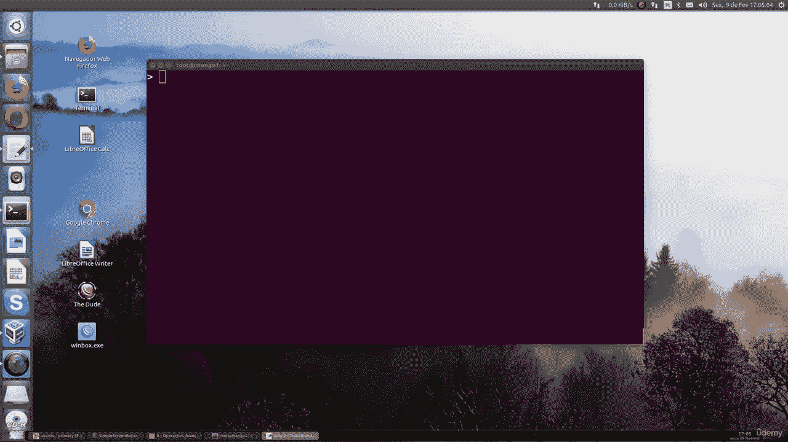

# 130：在MongoDB中使用原子计数器

在本节课中，我们将要学习如何在MongoDB数据库中实现和使用原子计数器。原子计数器是一种确保数值递增或递减操作在多用户并发环境下安全、准确执行的技术。

## 什么是原子计数器？

上一节我们介绍了MongoDB的基本操作，本节中我们来看看一个重要的概念：原子操作。在数据库操作中，原子性意味着一个操作要么完全执行，要么完全不执行，不会被其他操作打断。这对于计数器这类需要精确更新的场景至关重要。例如，统计网站访问量或生成唯一序列号时，必须确保每次计数都是准确的。

## 为什么需要原子计数器？

想象一下，如果两个用户同时触发了一个计数增加的操作，而数据库只是简单地读取当前值、加一、再写回，就可能导致计数错误。原子计数器通过数据库层面的特殊操作，将“读取-修改-写回”这个过程变成一个不可分割的步骤，从而避免这种并发问题。

## 如何在MongoDB中实现原子计数器？

MongoDB提供了`$inc`操作符来实现原子递增或递减。这个操作符直接在数据库服务器上修改字段值，保证了操作的原子性。

以下是使用`$inc`操作符的基本语法：

```javascript
db.collection.updateOne(
   { <query条件> },
   { $inc: { <字段名>: <增量值> } }
)
```

*   **`<query条件>`**：用于定位要更新的文档。
*   **`<字段名>`**：需要递增的字段。
*   **`<增量值>`**：要增加的数字。如果是负数，则表示递减。

## 实践示例：创建一个页面访问计数器

让我们通过一个具体的例子来理解其应用。假设我们有一个`pages`集合，用于存储网站页面的信息，我们想为每篇文章统计访问量。



首先，插入一篇初始文章：

```javascript
db.pages.insertOne({
   title: "MongoDB入门教程",
   url: "/intro-to-mongodb",
   viewCount: 0 // 初始化访问次数为0
})
```

当有用户访问这篇文章时，我们使用原子操作来增加`viewCount`：

```javascript
db.pages.updateOne(
   { url: "/intro-to-mongodb" }, // 找到对应文章
   { $inc: { viewCount: 1 } }    // 将其viewCount字段原子性地增加1
)
```

执行这个操作后，无论同时有多少请求，`viewCount`都会准确地增加相应的次数。你可以使用`find`命令来查看更新后的结果：

```javascript
db.pages.find({ url: "/intro-to-mongodb" })
```


## 其他应用场景

除了简单的访问计数，原子计数器还有更广泛的应用。

以下是几个常见的应用场景：

1.  **生成序列号**：为订单、用户ID等生成唯一且连续递增的编号。
2.  **库存管理**：在电商系统中，当商品被下单时，原子性地减少库存数量，防止超卖。
3.  **投票或评分系统**：确保每个投票或评分都能被准确计入总分。
4.  **限流器**：记录单位时间内的请求次数，用于API调用频率限制。

## 总结

本节课中我们一起学习了MongoDB中原子计数器的概念与用法。我们了解到，通过使用`$inc`操作符，可以安全、高效地实现字段的原子递增或递减，这对于处理并发环境下的计数需求至关重要。记住，在需要精确计数和避免数据竞争的任何场景，原子计数器都是你的得力工具。