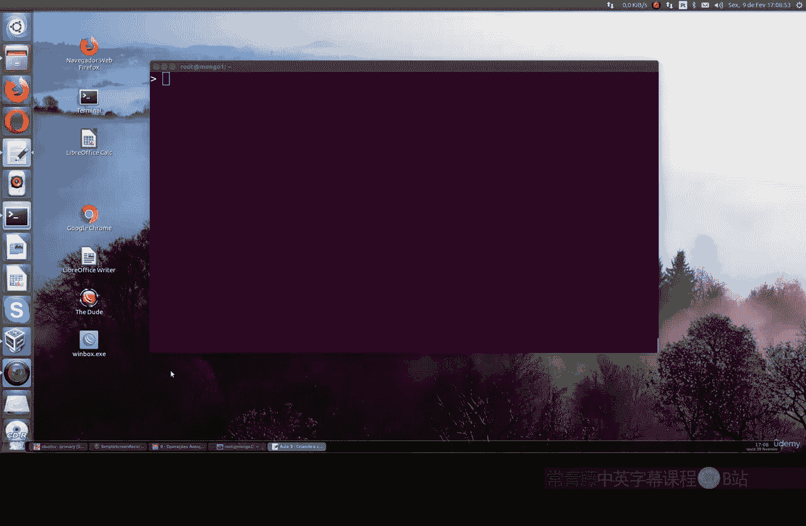
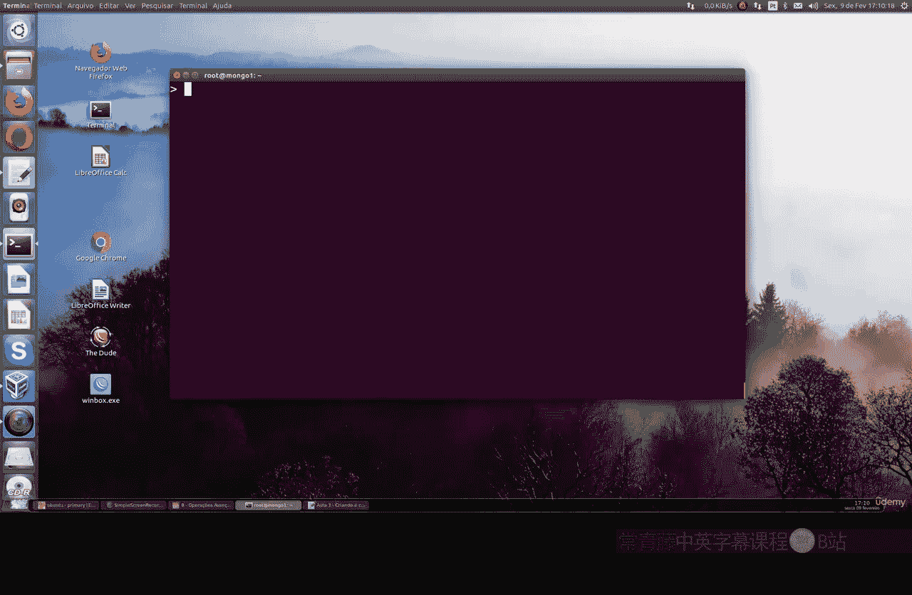
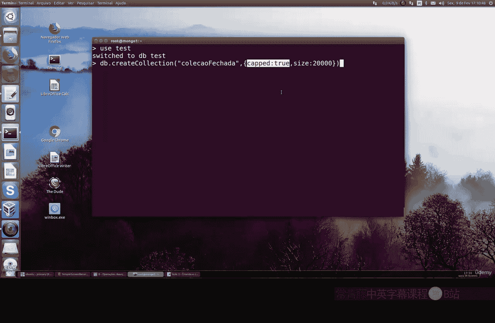
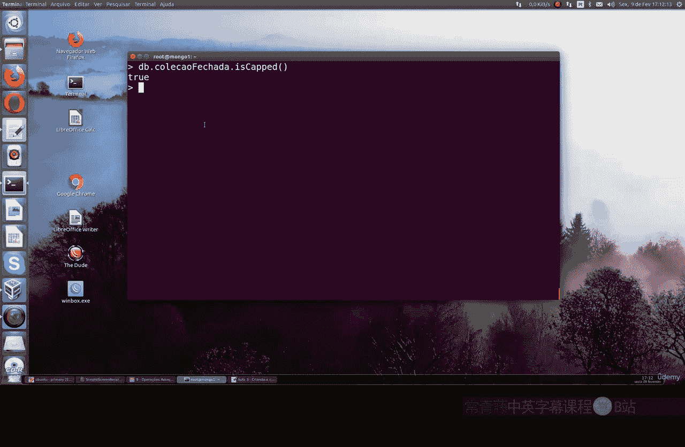
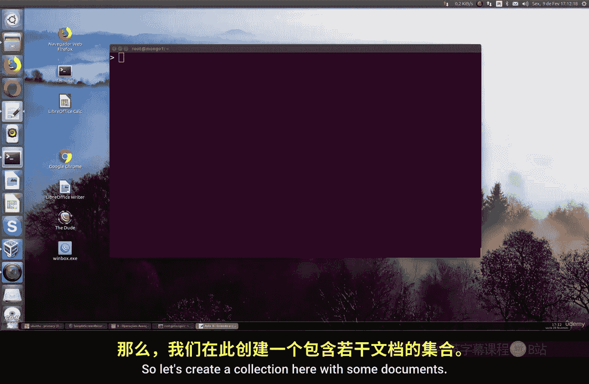

# 131：创建与转换封顶集合 🧾

在本节课中，我们将要学习MongoDB中一个重要的概念——封顶集合。我们将了解它的定义、作用、创建方法以及如何将普通集合转换为封顶集合。


## 理解封顶集合概念



首先，我们来理解什么是MongoDB中的封顶集合概念，以及它如何发挥作用。

当我们将文档插入到一个没有固定大小的MongoDB集合时，随着时间的推移，这可能会导致服务器性能问题。这些性能问题可能出现在创建、读取甚至删除操作中，原因是MongoDB中缺乏空间管理。

因此，当你设置一个使用封顶集合的MongoDB时，这将非常有用。封顶集合是一种固定大小的循环集合，它遵循插入顺序，能够为创建、读取和删除操作提供非常高的性能支持。

在你的MongoDB中，当封顶集合达到其固定的循环大小限制时，数据库本身将开始自动删除集合中最旧的文档。这意味着，当集合大小达到其上限时，你不需要在MongoDB中显式使用任何删除命令。

## 创建封顶集合

上一节我们介绍了封顶集合的概念，本节中我们来看看如何创建一个封顶集合。

我们将使用 `TestDB` 数据库作为示例。以下是创建封顶集合的步骤：

1.  使用 `db.createCollection()` 函数。
2.  为你的集合命名。
3.  通过 `capped: true` 标志将其指定为封顶集合。
4.  通过 `size: <字节数>` 参数设置其大小限制。

创建命令的基本格式如下：
```javascript
db.createCollection("集合名", { capped: true, size: 字节数 })
```



例如，创建一个名为 `cappedLogs`、大小限制为20000字节的封顶集合：
```javascript
use TestDB
db.createCollection("cappedLogs", { capped: true, size: 20000 })
```

请注意，`size` 参数始终以字节为单位工作，这将限制你的集合物理空间。

此外，你还可以通过 `max: <文档数>` 参数来设置集合可容纳的文档数量上限。例如，创建一个最多包含3000个文档的封顶集合：
```javascript
db.createCollection("cappedLogs", { capped: true, size: 20000, max: 3000 })
```



当你以此方式创建集合时，你将把集合限制在最多3000个文档。当插入新文档导致数量超过此限制时，最旧的文档将被自动移除。这是一种非常有趣的集合管理方式。

## 检查集合是否为封顶集合

创建集合后，你可能需要验证它是否确实是封顶集合。

你可以使用 `db.<集合名>.isCapped()` 命令来查询指定集合是否为封顶集合。该命令将返回一个布尔值。

例如，检查我们刚才创建的 `cappedLogs` 集合：
```javascript
db.cappedLogs.isCapped()
```

如果该函数返回 `true`，则意味着这个集合是封顶集合。

## 将普通集合转换为封顶集合

我们不仅可以创建新的封顶集合，还可以将现有的普通集合转换为封顶集合，这也是一个非常有趣的功能。

首先，让我们创建一个普通的集合并插入一些文档作为演示。

1.  创建一个名为 `normalCollection` 的普通集合并插入文档：
    ```javascript
    db.createCollection("normalCollection")
    db.normalCollection.insertMany([{data: "doc1"}, {data: "doc2"}, {data: "doc3"}])
    ```

2.  使用 `find()` 命令查看文档，并使用 `isCapped()` 命令验证其状态：
    ```javascript
    db.normalCollection.find()
    db.normalCollection.isCapped() // 此时应返回 false
    ```



现在，这个普通集合的 `isCapped()` 值为 `false`。接下来，我们将测试如何转换这种类型的集合。



我们将使用 `convertToCapped` 命令来将一个非封顶集合转换为封顶集合。命令格式如下：
```javascript
db.runCommand({ "convertToCapped": "集合名", size: 字节数 })
```

例如，将 `normalCollection` 转换为一个大小为10000字节的封顶集合：
```javascript
db.runCommand({ "convertToCapped": "normalCollection", size: 10000 })
```

执行成功后，命令会返回一个包含操作状态的文档（如 `{“ok”： 1}`）。现在，我们再次检查它是否为封顶集合：
```javascript
db.normalCollection.isCapped() // 此时应返回 true
```


之前它的值是 `false`，现在它等于 `true`。这非常实用，如果你希望将一个普通集合转换为封顶集合，并享受自动删除MongoDB中最旧文档的好处，就可以使用这个方法。

## 课程总结

本节课中我们一起学习了MongoDB封顶集合的核心知识。

我们首先了解了封顶集合是一个固定大小的循环集合，它在达到容量上限时会自动覆盖最旧的文档，从而无需手动执行删除操作，并能提升特定场景下的性能。

接着，我们学习了如何使用 `db.createCollection()` 命令并指定 `capped: true` 和 `size` 参数来创建一个新的封顶集合。

然后，我们掌握了使用 `db.<集合名>.isCapped()` 方法来检查一个集合是否为封顶集合。

最后，我们探索了如何使用 `convertToCapped` 命令将已存在的普通集合转换为封顶集合，这为灵活管理数据生命周期提供了另一种有效途径。

通过掌握创建、检查和转换封顶集合的方法，你可以更好地根据应用需求来设计和优化MongoDB的数据存储结构。