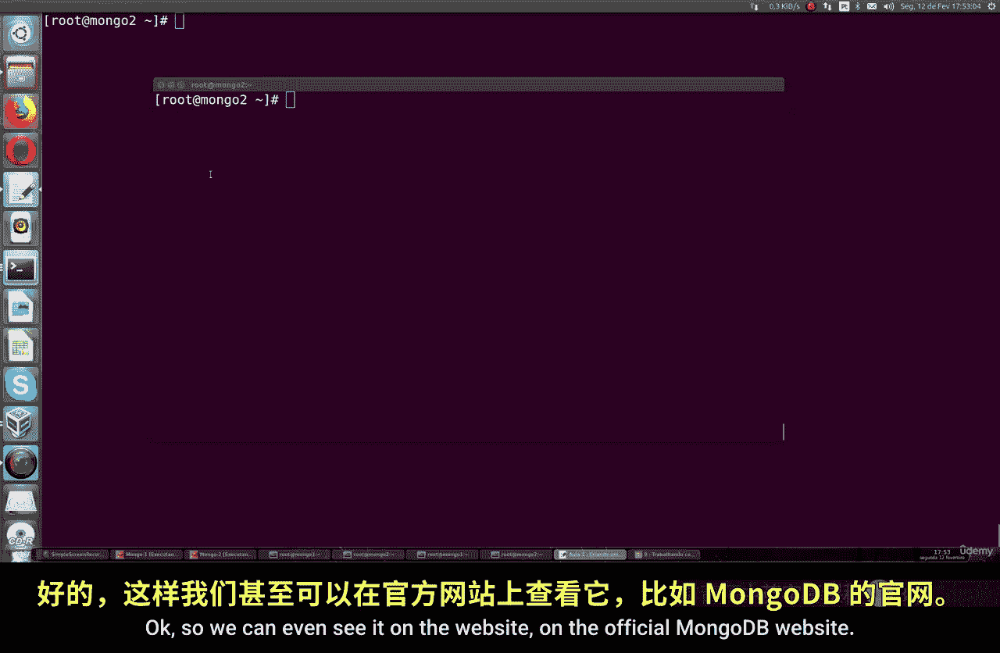
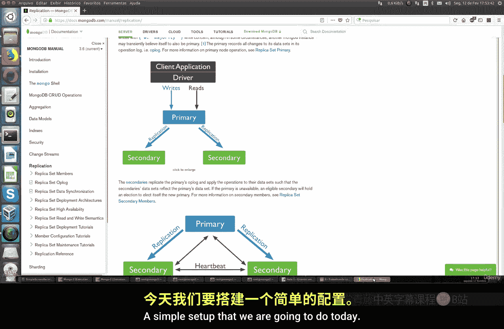
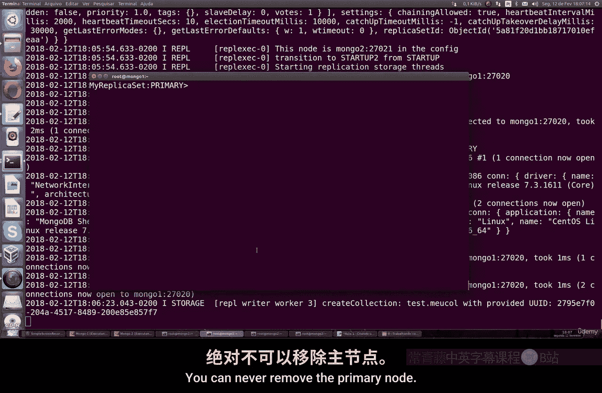

# 132：在MongoDB中创建数据复制 🔄

在本节课中，我们将学习如何在MongoDB中配置一个简单的数据复制集。数据复制是确保数据高可用性和可靠性的关键技术，它通过在多台服务器上维护相同的数据副本来实现。

## 环境准备 🛠️

上一节我们介绍了MongoDB的基本操作，本节中我们来看看如何搭建一个复制环境。首先，我们需要准备运行环境。

你需要至少两台虚拟机或物理机。它们可以是任何你喜欢的Linux发行版，例如CentOS、Fedora、Ubuntu或Debian。命令在不同发行版间基本没有差异。

以下是开始前必须满足的条件：
*   所有机器必须能够互相连接。
*   如果你使用的是CentOS、Red Hat或Fedora等系统，需要检查默认启用的防火墙是否会阻止连接。必要时，你需要配置防火墙规则以允许MongoDB实例间的通信。
*   你需要在每台机器的`/etc/hosts`文件中，为所有参与复制的MongoDB实例注册其IP地址和主机名。

例如，我们可以设定两台机器：
*   **MongoDB1**：作为主服务器（Primary）
*   **MongoDB2**：作为备份服务器，即从服务器（Secondary）

## 复制集架构概述 📊

我们将创建一个简单的复制集。如下图所示，一个复制集包含一个主服务器和若干个从服务器。




你可以根据需求创建多个从服务器节点。今天，我们将完成一个包含一主一从的基础配置。

## 配置主服务器（MongoDB1） 🖥️



在开始配置之前，请确保两台机器可以互相访问。你可以使用`mongo`命令测试从MongoDB1到MongoDB2的连接是否通畅。

```
mongo --host <MongoDB2的IP地址> --port 27017
```

接下来，我们需要为复制集创建独立的数据、配置和日志目录，而不是使用默认目录。

在**MongoDB1**上，执行以下命令创建目录结构：

```
mkdir -p /data/mongodb/{server1,server2,server3}/db
mkdir -p /data/mongodb/{server1,server2,server3}/config
mkdir -p /data/mongodb/{server1,server2,server3}/logs
```

> **注意**：你需要在所有MongoDB实例上执行相同的目录创建操作。

现在，启动MongoDB1作为主服务器实例。我们使用非标准端口以避免冲突。

```
mongod --bind_ip 0.0.0.0 --dbpath /data/mongodb/server1/db --replSet myReplicaSet --port 27020 --logpath /data/mongodb/server1/logs/mongod.log --fork
```

**命令参数说明**：
*   `--bind_ip 0.0.0.0`：允许所有IP连接。
*   `--dbpath`：指定数据库文件存储路径。
*   `--replSet`：定义复制集的名称（例如 `myReplicaSet`）。
*   `--port`：指定实例运行的端口。
*   `--logpath` 和 `--fork`：将日志输出到文件并在后台运行。

如果看到类似 `"waiting for connections on port 27020"` 的输出，说明启动成功。

打开另一个终端，连接到这个MongoDB实例：

```
mongo --port 27020
```

在MongoDB shell中，初始化复制集配置：

```
rs.initiate()
```

执行 `rs.status()` 命令查看状态。你会看到当前节点已被配置为 `primary`（主服务器），并且在 `members` 部分可以看到其信息。

## 配置从服务器（MongoDB2） 💾

现在，我们在第二台机器上配置从服务器。请确保已完成相同的环境准备步骤（防火墙、hosts文件、创建目录）。

在**MongoDB2**上，启动第二个MongoDB实例，使用不同的端口和数据路径：

```
mongod --bind_ip 0.0.0.0 --dbpath /data/mongodb/server2/db --replSet myReplicaSet --port 27021 --logpath /data/mongodb/server2/logs/mongod.log --fork
```

同样，使用另一个终端连接到这个实例：

```
mongo --port 27021
```

## 将节点加入复制集 🔗

配置好从服务器后，我们需要回到**主服务器（MongoDB1）**的shell中，将从服务器节点添加到复制集。

在主服务器的MongoDB shell（端口27020）中，执行：

```
rs.add("MongoDB2:27021")
```

> **注意**：请将 `MongoDB2` 替换为你的从服务器实际主机名或IP地址。

添加成功后，再次执行 `rs.status()`。现在，你可以在 `members` 列表中看到两个成员：一个是 `primary`，另一个是 `secondary`。

## 验证数据复制 ✅

复制集配置完成后，所有在主服务器上进行的操作（如创建数据库、集合、插入文档）都会自动同步到从服务器。

你可以在主服务器上创建一个测试集合：

```
use testDB
db.testCollection.insertOne({name: "Replication Test"})
```

然后，在从服务器的shell中，你需要先允许从节点进行读操作（默认从节点不可读）：

```
rs.secondaryOk()
```

接着，查询相同的集合：

```
use testDB
db.testCollection.find()
```

你将看到在主服务器插入的文档已经同步到了从服务器。

## 管理复制集节点 ⚙️

如果你需要从复制集中移除一个节点（例如MongoDB2），必须在**主服务器**的shell中执行以下命令：

```
rs.remove("MongoDB2:27021")
```

执行后，再次检查 `rs.status()`，你会发现该节点已从 `members` 列表中消失。

> **重要**：你只能移除 `secondary` 节点，不能直接移除 `primary` 节点。

## 故障恢复与重启 🔄

如果某台机器重启或连接丢失，你只需要使用相同的启动命令重新启动该机器上的MongoDB实例。它会自动以复制集中配置的角色（主或从）重新加入集群。

例如，重启MongoDB2（从服务器）：

```
mongod --bind_ip 0.0.0.0 --dbpath /data/mongodb/server2/db --replSet myReplicaSet --port 27021 --logpath /data/mongodb/server2/logs/mongod.log --fork
```

## 总结 📝



本节课中我们一起学习了MongoDB复制集的基础配置。我们完成了以下步骤：
1.  准备了两台互联的服务器环境。
2.  分别配置并启动了主服务器和从服务器实例。
3.  将从服务器节点添加到主服务器管理的复制集中。
4.  验证了数据的自动同步功能。
5.  学习了如何管理复制集中的节点。

通过这个简单的复制集，你实现了数据的高可用性。主服务器负责处理所有写操作，并从服务器自动同步数据，在主服务器发生故障时，可以从服务器中选举出新的主服务器，保障服务不中断。


