# 133：在主从服务器间切换 🔄

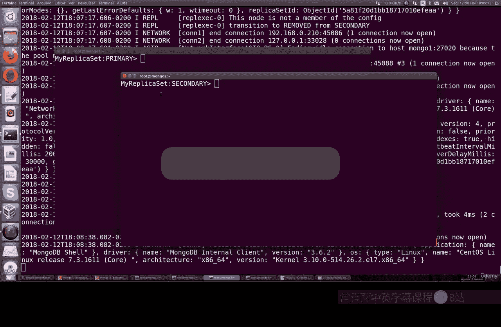

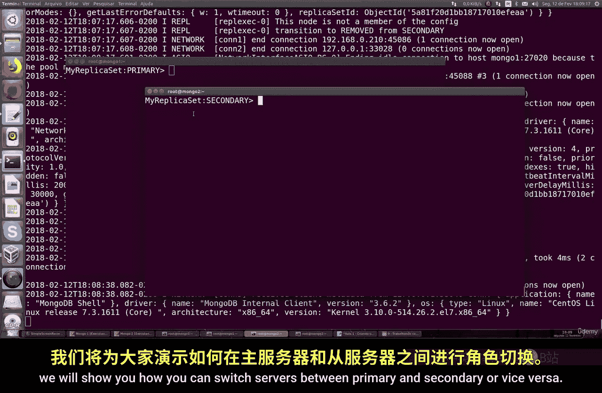

在本节课中，我们将学习如何在 MongoDB 的主服务器和从服务器之间进行角色切换。这是一个非常简单的操作，但需要你已完成之前关于创建 MongoDB 数据复制的课程，因为我们将不再重复那些基础步骤。

## 前提条件

假设你已经按照之前的课程，成功搭建了包含主服务器和从服务器的 MongoDB 复制集环境。我们的目标是交换这两个服务器的角色。

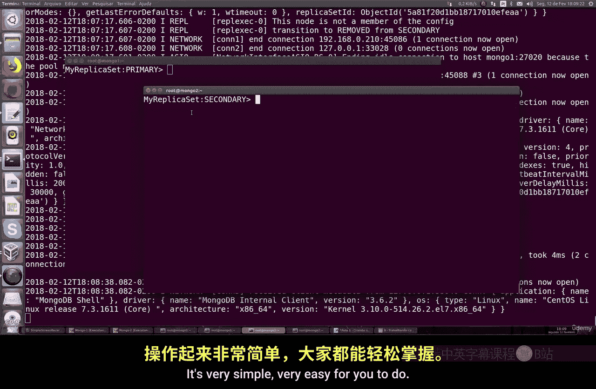

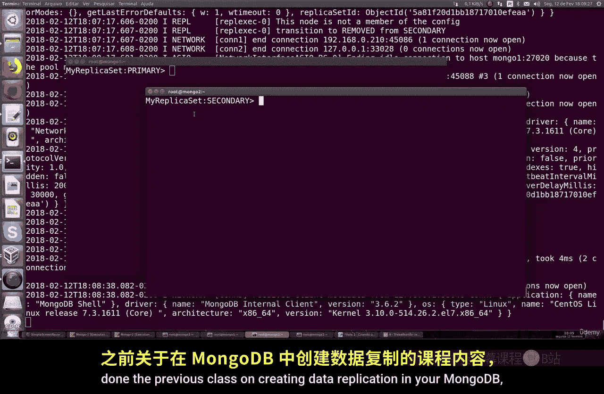

## 切换服务器角色

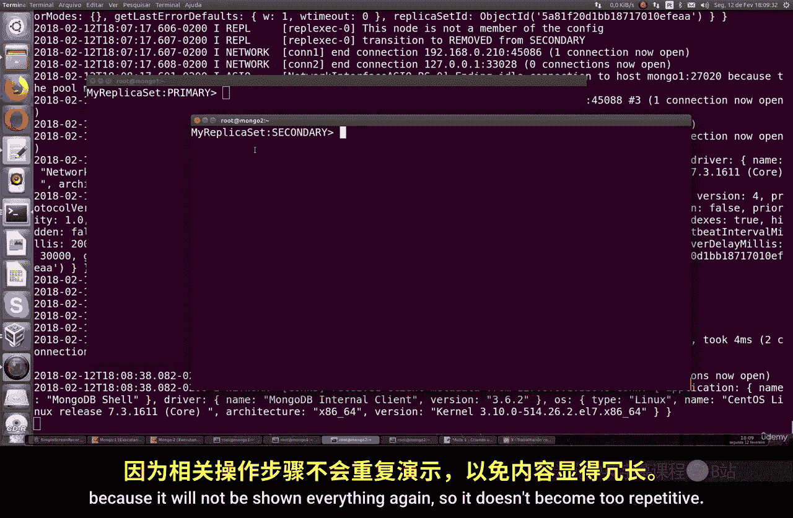

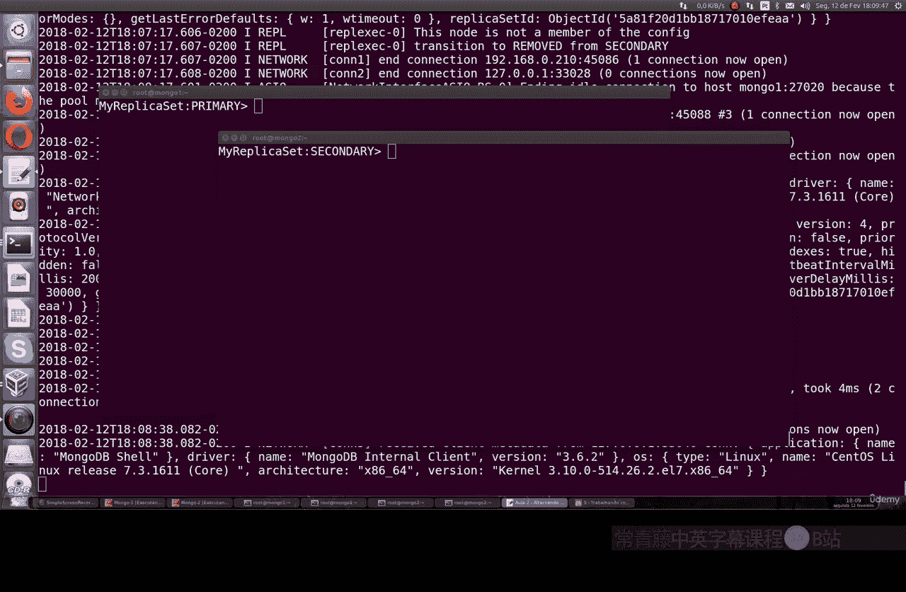

现在一切准备就绪，我们需要做什么？首先，我们需要确认当前的服务器状态。在我们的示例中，主服务器是 `1DBug`，从服务器是 `1DB2`。接下来，我们将交换它们的角色。

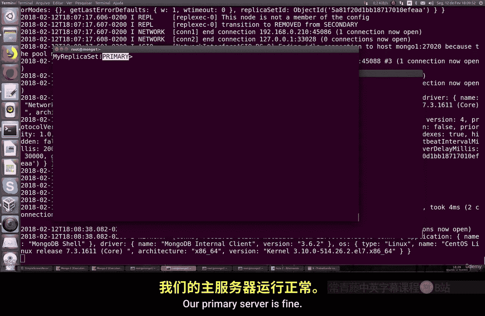

以下是切换角色的具体步骤：

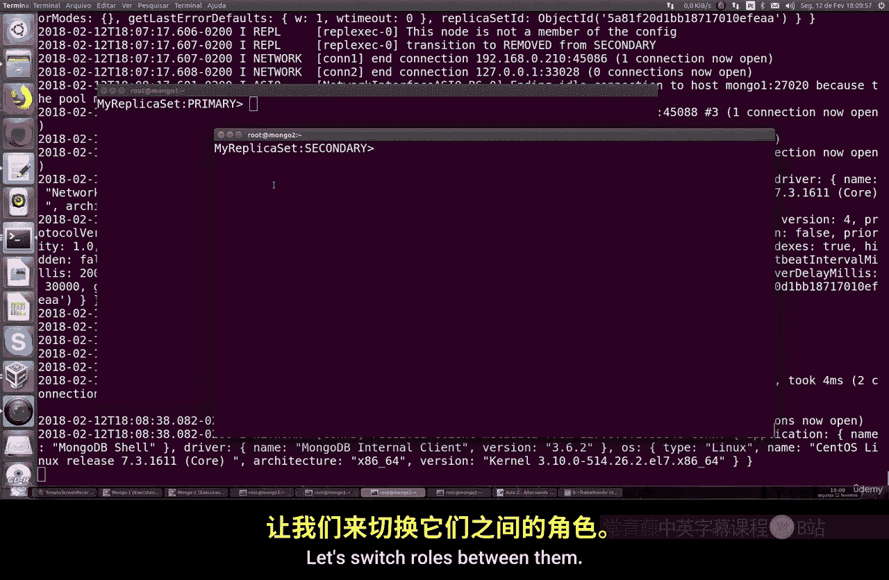

1.  **在主服务器上执行降级操作**：连接到当前的主服务器，并执行 `stepDown` 命令。这个命令会使主服务器主动放弃其主节点身份。
    ```bash
    rs.stepDown()
    ```
    执行后，该服务器将停止作为主服务器运行。

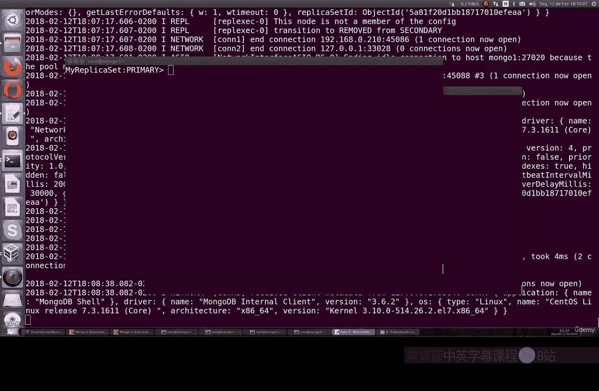

2.  **验证新的主服务器**：在任一服务器上运行 `rs.status()` 命令来查看复制集的状态。
    ```bash
    rs.status()
    ```
    通过查看输出，你可以确认成员的角色已经发生了变化。

## 验证切换结果

执行上述操作后，你会发现服务器的角色已经成功互换。

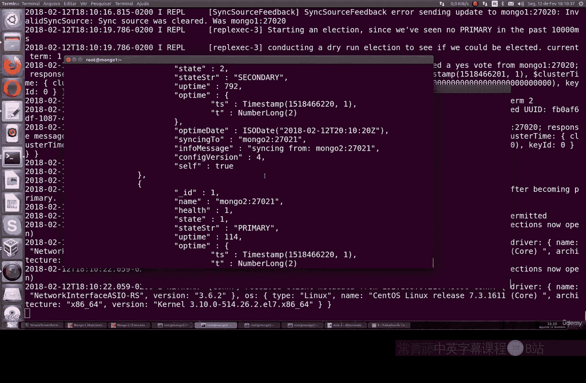

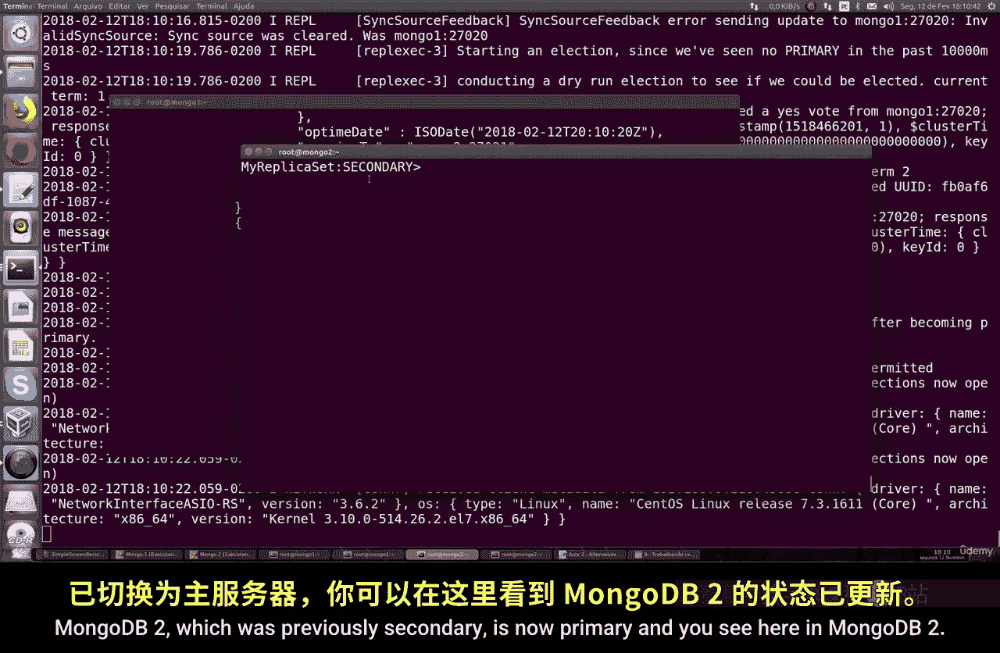

*   原先的从服务器 `MongoDB2` 现在显示为 `PRIMARY`。
*   原先的主服务器 `MongoDB1` 现在显示为 `SECONDARY`。

成员名称保持不变，但它们的角色状态已经更新。这是一个非常直观且实用的方法，用于在需要时在两台机器之间切换主从关系。

## 重要注意事项

请记住，你无法手动将 MongoDB 的数据类型从主节点类型更改为从节点类型。当你进行角色切换时，数据会自动从主服务器复制到从服务器，反之亦然。这个过程确保了数据的一致性。

## 总结

本节课中，我们一起学习了如何在 MongoDB 复制集中交换主服务器和从服务器的角色。操作的核心是使用 `rs.stepDown()` 命令让主服务器主动退位，然后系统会自动选举出新的主服务器。这是一个简单但重要的维护操作，所有相关代码都已提供供你参考和实践。接下来，让我们继续下一节 MongoDB 课程。