# 134：服务器优先级与高级配置 🎯

在本节课中，我们将学习 MongoDB 复制集中关于服务器优先级、隐藏成员和延迟复制的配置方法。这些设置对于管理高可用性架构和数据安全至关重要。

## 复制集成员优先级设置

上一节我们介绍了复制集的基本概念，本节中我们来看看如何通过优先级来指定哪个节点成为主节点。

优先级决定了在选举中哪个节点更可能成为主服务器。其值范围从 `0` 到 `1000`。默认值为 `1`。如果优先级设置为 `0`，则该节点永远不会成为主服务器。

以下是优先级配置的核心命令格式：

```javascript
rs.reconfig({
    "_id" : "replicaSetName",
    "version" : versionNumber,
    "members" : [
        { "_id" : 0, "host" : "hostname:port", "priority" : priorityValue },
        { "_id" : 1, "host" : "hostname:port", "priority" : priorityValue },
        // ... 其他成员
    ]
})
```

假设我们有一个包含三个节点的复制集：`mongo1` (ID0)、`mongo2` (ID1) 和 `mongo3` (ID2)。默认情况下，所有节点的优先级都是 `1`。

如果我们希望 `mongo1` 始终是主节点，可以将其优先级设置为最高，例如 `5.1`，同时将其他节点的优先级设置得较低。

配置完成后，复制集会重新选举，优先级最高的节点将成为新的主节点。可以通过 `rs.config()` 命令查看当前的配置状态。

## 配置永不成为主节点的成员

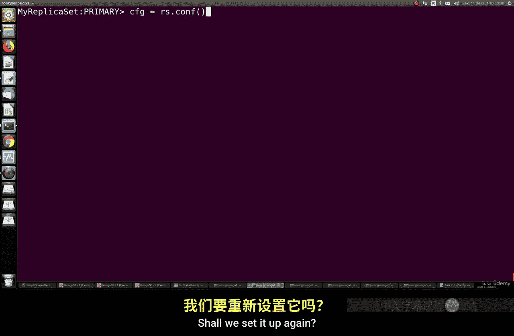

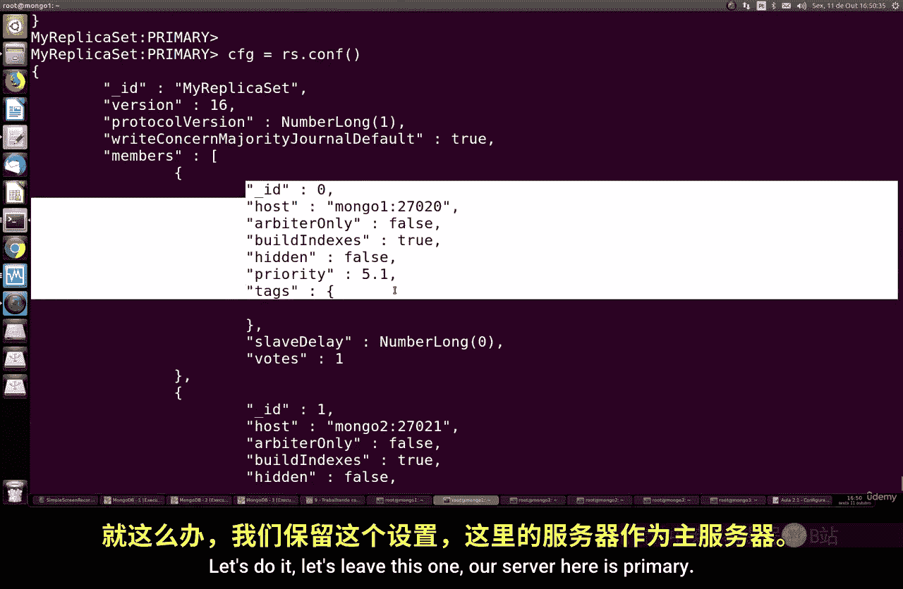

在某些场景下，你可能希望某个节点仅作为数据副本，永远不参与主节点选举。这可以通过将其优先级设置为 `0` 来实现。

以下是配置步骤：
1.  连接到当前的主节点。
2.  使用 `rs.reconfig()` 命令，将目标成员的 `priority` 字段设置为 `0`。
3.  提交配置更改。

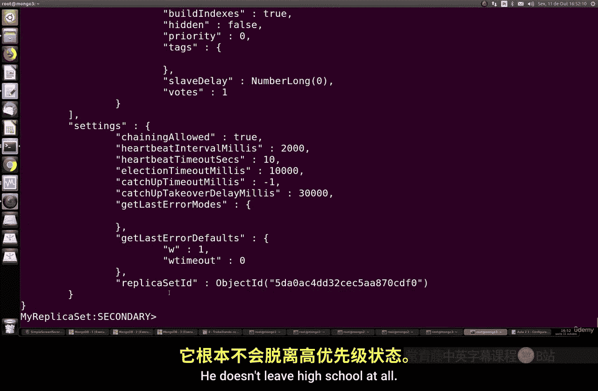

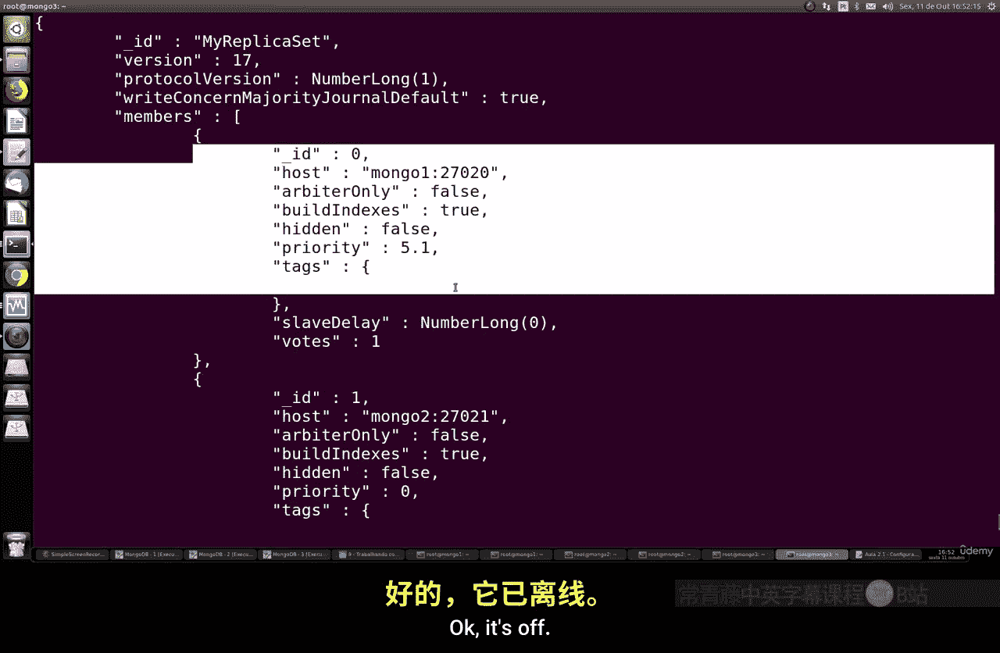

例如，将 `mongo1` (ID0) 和 `mongo2` (ID1) 的优先级都设为 `0`，只留 `mongo3` (ID2) 有资格成为主节点。这样，即使 `mongo3` 宕机，`mongo1` 和 `mongo2` 也不会自动提升为主节点，从而实现了对特定节点角色的严格控制。

## 配置隐藏成员

隐藏成员是复制集中对客户端不可见的节点。它们不处理客户端的读请求，也不会出现在 `rs.status()` 等管理命令的输出中，但它们仍然参与数据复制和选举投票。

配置隐藏成员有两个必要条件：
1.  该成员的优先级必须为 `0`。
2.  将其 `hidden` 属性设置为 `true`。

以下是配置隐藏成员的示例命令片段：

```javascript
{
    "_id" : 2,
    "host" : "mongo3:27017",
    "priority" : 0,
    "hidden" : true
}
```

隐藏成员通常用于执行备份、运行分析查询等后台任务，避免这些操作影响面向客户端的生产节点性能。

## 配置延迟复制成员

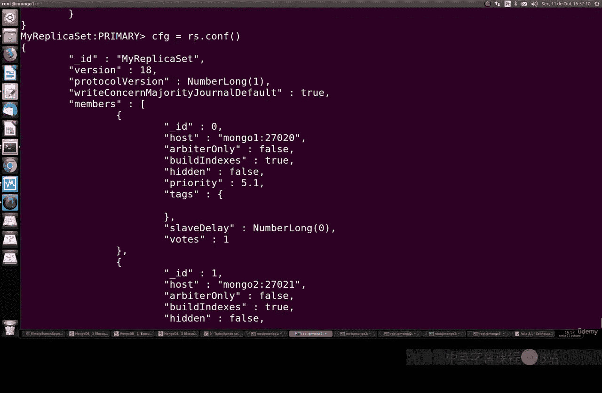

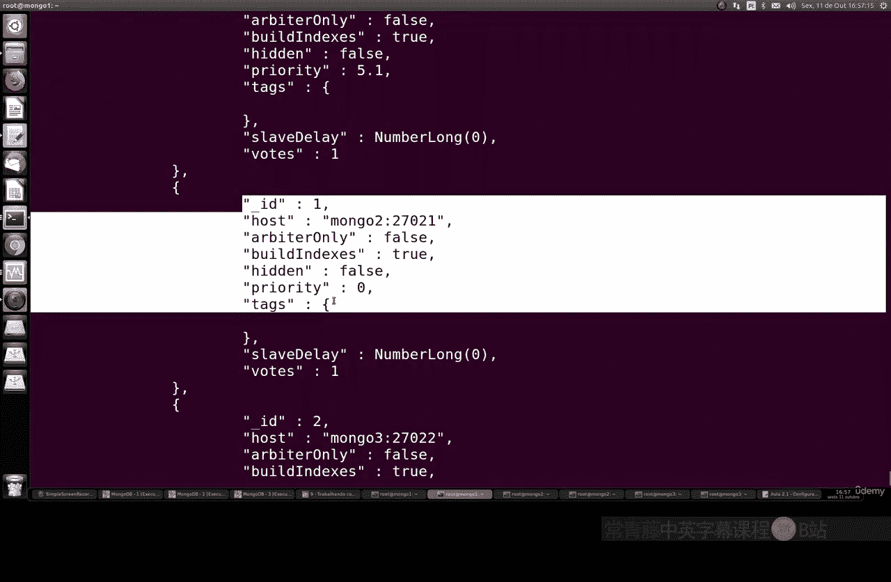

延迟复制成员是数据保护的重要策略。它会在一定时间延迟后才从主节点同步数据操作，这为防止人为误操作（如误删数据库）提供了“缓冲期”。

配置延迟复制成员有三个关键要求：
1.  优先级必须为 `0`。
2.  通常应配置为隐藏成员。
3.  设置 `slaveDelay` 字段，单位为秒。

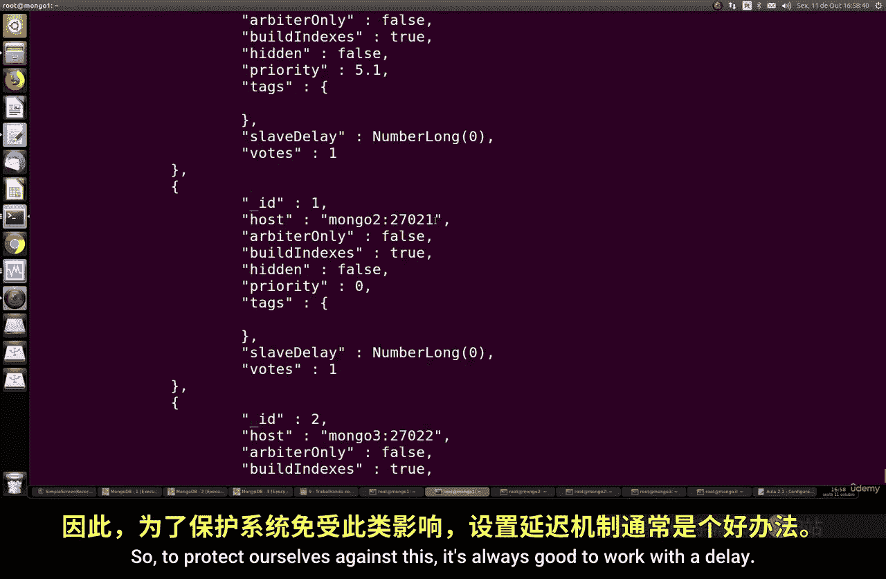

例如，要配置一个延迟2小时（7200秒）的成员，配置如下：

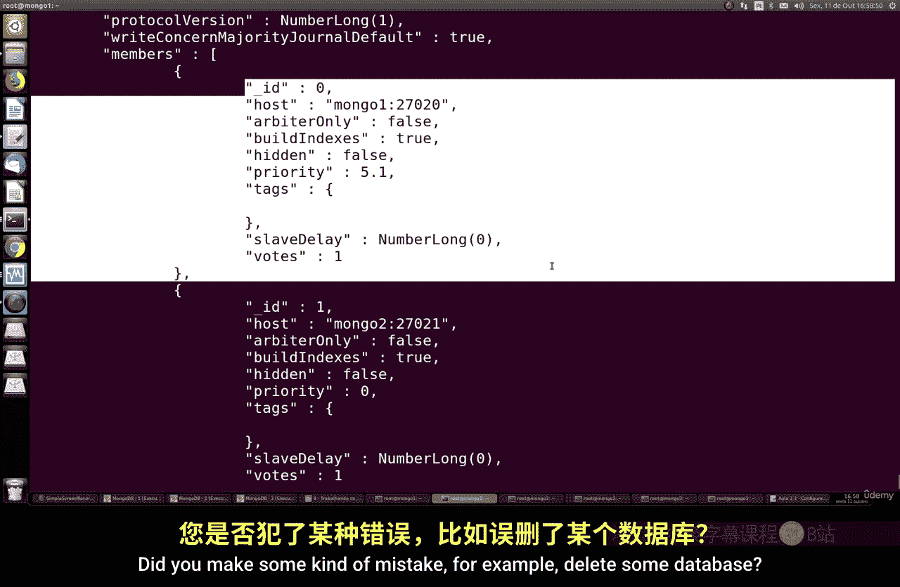

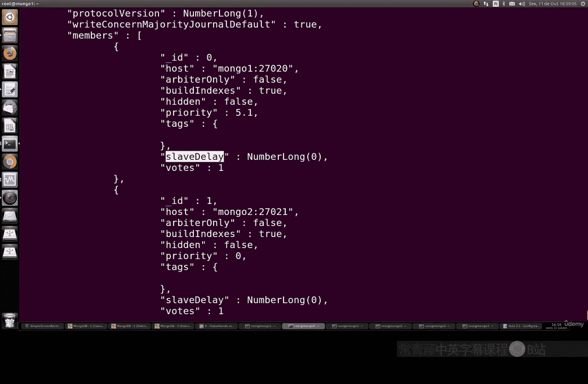

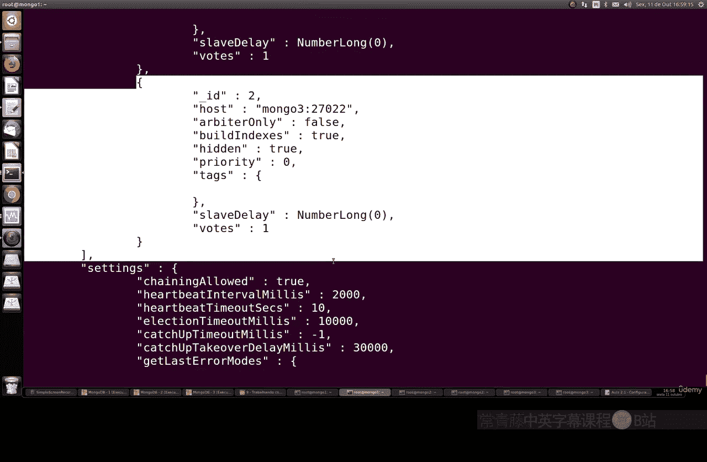

```javascript
{
    "_id" : 2,
    "host" : "mongo3:27017",
    "priority" : 0,
    "hidden" : true,
    "slaveDelay" : 7200
}
```

这样，当在主节点上执行了错误操作时，在延迟时间窗口内，你可以在延迟节点上找回未受影响的数据。

## 生产环境最佳实践建议

在配置和管理 MongoDB 复制集时，请遵循以下最佳实践以确保稳定与安全：
*   **物理隔离**：尽可能将复制集成员部署在独立的物理服务器上。
*   **网络验证**：如果使用虚拟机，确保网络正确配置且成员间可以互通。
*   **防火墙策略**：使用防火墙限制对 MongoDB 端口（默认 27017）的访问，仅允许必要的 IP 地址。
*   **传输加密**：如果复制集成员需要通过互联网通信，务必使用 VPN 来加密数据传输通道。

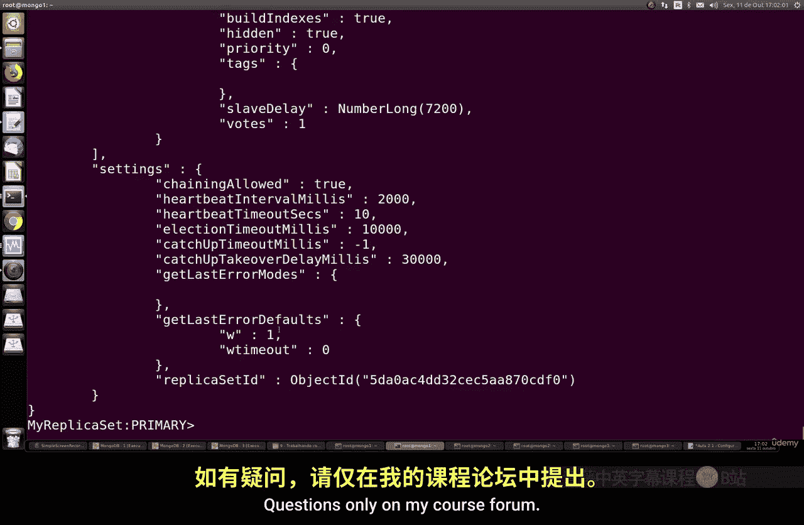

本节课中我们一起学习了 MongoDB 复制集的高级管理技巧，包括通过优先级控制主节点选举、设置永不升主的节点、配置对客户端隐藏的成员以及建立具有数据保护作用的延迟复制节点。合理运用这些配置，可以构建出更健壮、更安全、更符合业务需求的数据库架构。