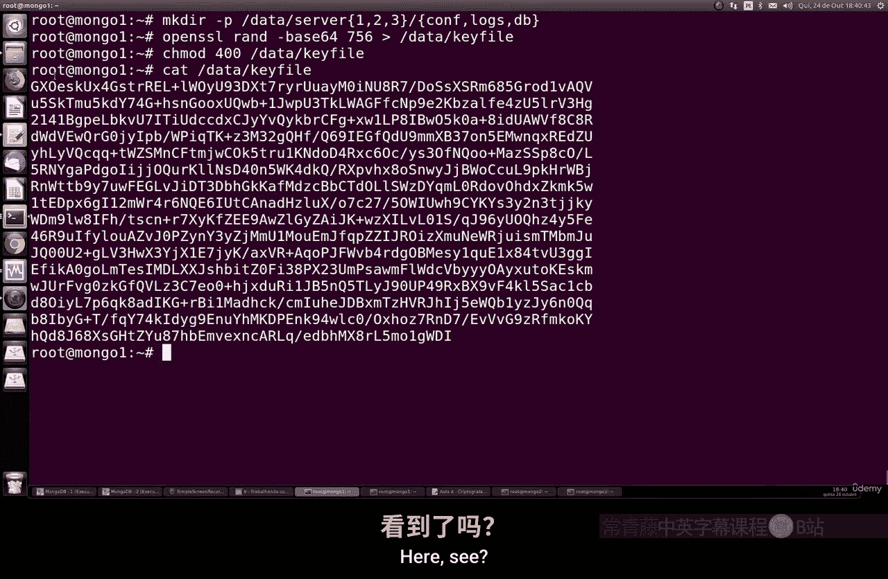
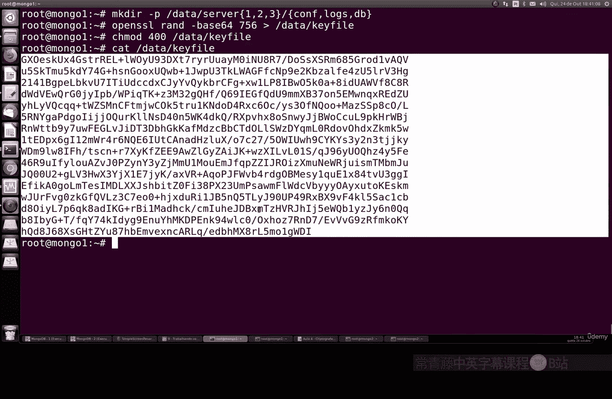
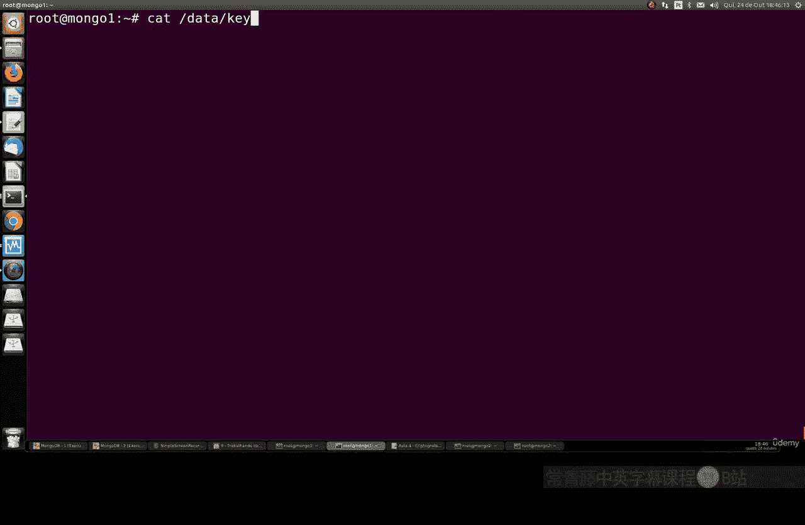
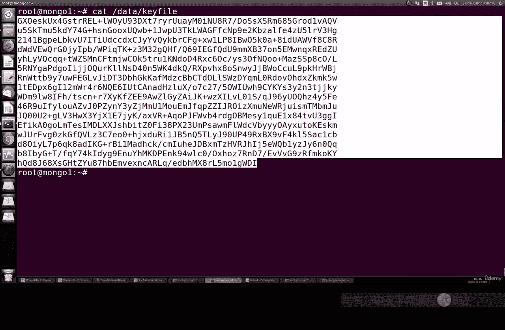
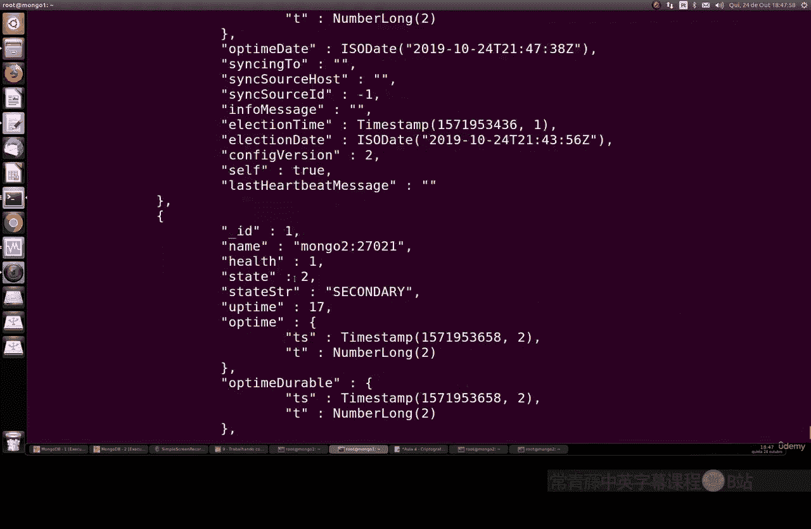
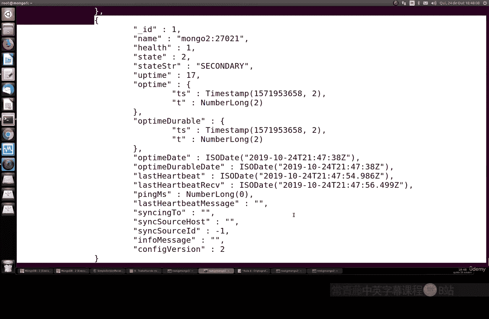
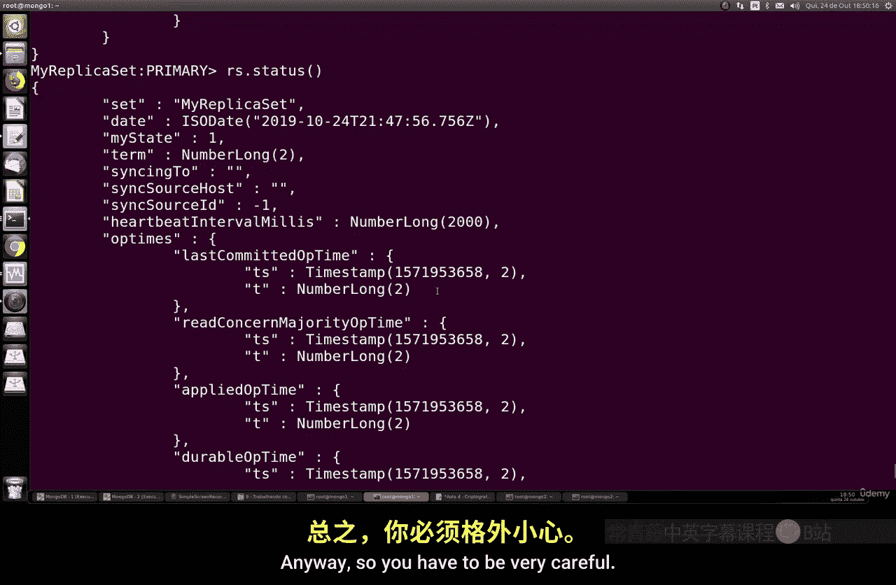

# 136：配置加密副本集 🔐

在本节课中，我们将学习如何为 MongoDB 副本集配置加密连接，以增强数据通信的安全性。我们将使用两个 MongoDB 实例，并确保它们之间的所有通信都经过加密。

---

## 准备工作

上一节我们介绍了副本集的基本概念，本节中我们来看看如何为副本集添加加密层。

首先，我们需要准备两个 MongoDB 实例。请确保它们已安装并可以运行。我们将分别称它们为 `mongo1` 和 `mongo2`。

**注意**：在开始之前，请备份所有现有数据。由于本教程仅为学习目的，我们将直接操作。



---



## 步骤一：清理与初始化配置

首先，我们需要清理两个实例上的任何现有数据，并重新创建配置文件。

以下是需要执行的命令：

1.  停止 MongoDB 服务。
2.  删除数据目录（例如 `/var/lib/mongodb`）。
3.  创建新的配置文件，指定副本集名称和端口。

例如，`mongo1` 的配置文件 (`mongod1.conf`) 可能包含：
```yaml
storage:
  dbPath: /data/db1
net:
  port: 27017
  bindIp: 0.0.0.0
replication:
  replSetName: rs0
```

`mongo2` 的配置文件 (`mongod2.conf`) 类似，但 `dbPath` 和 `port` 不同。

---

## 步骤二：生成并配置加密密钥

加密通信的核心是使用一个共享的密钥文件。所有副本集成员必须使用相同的密钥。

以下是生成和配置密钥的步骤：

1.  使用 `openssl` 生成一个随机的 Base64 编码密钥文件：
    ```bash
    openssl rand -base64 756 > /path/to/mongodb-keyfile
    ```
2.  设置密钥文件的权限，确保只有所有者可读：
    ```bash
    chmod 400 /path/to/mongodb-keyfile
    ```
3.  将生成的密钥文件复制到所有副本集成员服务器的相同路径下。可以使用 `scp` 命令：
    ```bash
    scp /path/to/mongodb-keyfile user@mongo2-host:/path/to/mongodb-keyfile
    ```
4.  在每个实例的 MongoDB 配置文件中，添加以下配置以启用密钥文件认证：
    ```yaml
    security:
      keyFile: /path/to/mongodb-keyfile
    ```

---

## 步骤三：启动实例并初始化副本集

配置好密钥文件后，启动 MongoDB 实例。

1.  使用指定配置文件启动 `mongo1`：
    ```bash
    mongod --config /etc/mongod1.conf
    ```
2.  连接到 `mongo1` 实例，并初始化副本集：
    ```javascript
    rs.initiate({
      _id: "rs0",
      members: [ { _id: 0, host: "mongo1-host:27017" } ]
    })
    ```
3.  检查副本集状态，确认 `mongo1` 已成为主节点：
    ```javascript
    rs.status()
    ```
    在输出信息中，可以找到安全签名相关的字段，这表明加密已启用。



---



## 步骤四：创建管理员用户并启用访问控制

为了进一步安全，我们需要创建用户并启用身份验证。

1.  在主节点 `mongo1` 上，切换到 `admin` 数据库并创建根用户：
    ```javascript
    use admin
    db.createUser({
      user: "admin",
      pwd: "yourStrongPassword123",
      roles: [ { role: "root", db: "admin" } ]
    })
    ```
2.  退出 MongoDB Shell，停止 `mongo1` 实例。
3.  在 `mongo1` 的配置文件中，启用访问控制：
    ```yaml
    security:
      keyFile: /path/to/mongodb-keyfile
      authorization: enabled
    ```
4.  重新启动 `mongo1` 实例。
5.  现在，连接时需要指定用户名和密码：
    ```bash
    mongo --host mongo1-host --port 27017 -u admin -p 'yourStrongPassword123' --authenticationDatabase admin
    ```

---



## 步骤五：添加加密的副本集成员



现在，我们将配置并添加第二个加密的成员 `mongo2`。

1.  确保 `mongo2` 的配置文件中已设置相同的 `keyFile` 路径并启用了 `authorization`。
2.  启动 `mongo2` 实例：
    ```bash
    mongod --config /etc/mongod2.conf
    ```
3.  从已认证连接的主节点 `mongo1`，将 `mongo2` 添加到副本集：
    ```javascript
    rs.add("mongo2-host:27018")
    ```
4.  再次检查 `rs.status()`。在成员列表中，`mongo2` 应显示为 `SECONDARY` 状态，并且其配置中应包含相同的安全签名信息。
5.  在 `mongo2` 上，使用相同的管理员凭据进行连接验证。

---

## 验证与总结

本节课中我们一起学习了如何为 MongoDB 副本集配置加密连接。

通过执行以下关键步骤，我们建立了一个安全的副本集环境：
1.  生成并分发共享的密钥文件。
2.  在配置中启用密钥文件认证和访问控制。
3.  创建管理员用户。
4.  将加密配置的节点加入副本集。



配置成功后，副本集成员间的所有通信都将被加密，并且需要身份验证才能访问，这极大地提升了数据库在生产环境中的安全性。请务必记住，在处理真实数据时，始终启用加密和访问控制。