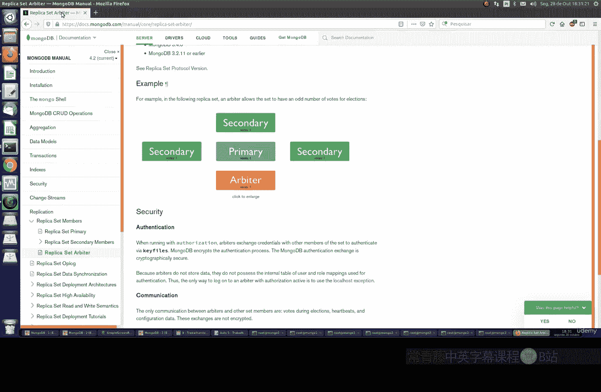
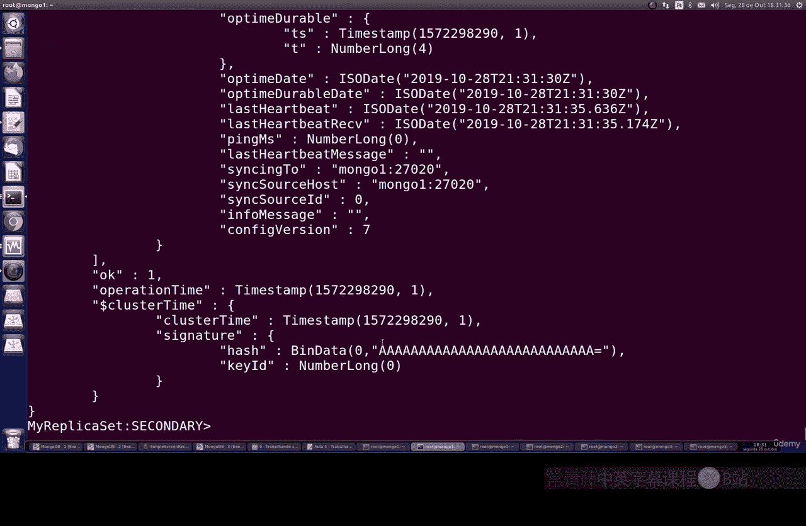
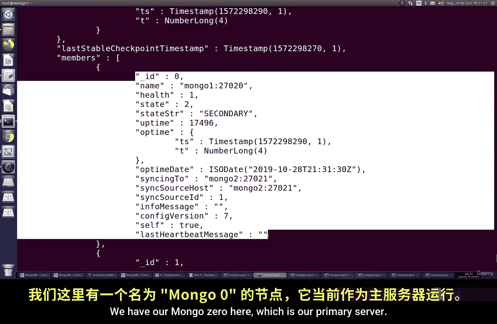
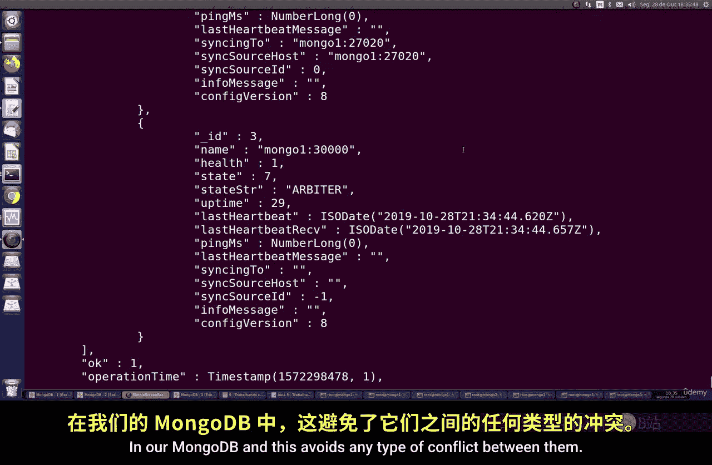

# 137：使用裁判节点 🧑‍⚖️

在本节课中，我们将学习如何在MongoDB副本集中配置和使用一个特殊的节点——裁判节点。裁判节点不存储任何数据，它的唯一作用是参与投票，以确保在主节点故障时，副本集能够快速、无冲突地选举出新的主节点。

## 什么是裁判节点？

上一节我们介绍了MongoDB副本集的基本概念。本节中，我们来看看一个特殊的成员类型：裁判节点。

裁判节点是一个不存储任何数据副本的MongoDB实例。它不保存数据库、配置或日志。它的唯一功能是在副本集选举中参与投票。当主节点宕机时，副本集需要选举一个新的主节点。如果副本集成员数量为偶数，可能会出现投票平局的情况。裁判节点的加入可以确保总投票成员数为奇数，从而避免选举冲突，使选举过程更快、更稳定。

**核心概念**：裁判节点 = 仅投票成员。其状态在`rs.status()`中显示为 `ARBITER`。

## 裁判节点的工作原理



理解了裁判节点的定义后，我们来看看它是如何工作的。



假设我们有一个副本集，包含一个主节点（有一票）和两个从节点（各有一票）。此时总共有三个投票成员。如果主节点宕机，剩下的两个从节点可以进行选举。但如果副本集有四个从节点（偶数），选举就可能出现平局。加入一个裁判节点（有一票）可以使总票数变为奇数，确保选举总能产生结果。



裁判节点不参与数据存储和复制，它只存在于配置中，用于提供决定性的一票。

## 如何配置裁判节点

了解了原理，接下来我们进行实战配置。以下是配置裁判节点的具体步骤。

**前提条件**：你已经有一个正在运行的MongoDB副本集。

1.  **为裁判节点创建数据目录**：在计划运行裁判节点实例的服务器上，为其创建一个专属的数据目录（尽管它不存数据，但启动需要）。
    ```bash
    mkdir /path/to/arbiter_data
    ```

2.  **启动裁判节点实例**：使用`mongod`命令启动一个新的MongoDB实例，指定其端口和数据目录，并通过`--replSet`参数将其关联到现有副本集。
    ```bash
    mongod --port 30000 --dbpath /path/to/arbiter_data --replSet yourReplicaSetName
    ```

3.  **将实例添加为裁判节点**：连接到副本集的**主节点**，使用`rs.addArb()`命令将新启动的实例添加为裁判节点。
    ```javascript
    rs.addArb("hostname:30000")
    ```

## 验证配置

配置完成后，我们需要确认裁判节点已成功加入并处于正确状态。

连接到主节点，运行`rs.status()`命令。在输出的成员列表中，找到对应主机和端口（例如 `hostname:30000`）的成员。其 `stateStr` 字段应显示为 `ARBITER`，并且 `health` 字段应为 `1`（健康）。这表示裁判节点已配置成功，正在履行其投票职责。

## 总结




本节课中，我们一起学习了MongoDB裁判节点的作用与配置方法。我们了解到，裁判节点是一个不存储数据的特殊成员，它的核心价值在于为副本集选举提供关键一票，防止在偶数个数据节点时出现投票僵局，从而提升集群的可用性和选举效率。记住，在部署大型副本集时，合理使用裁判节点是一种优化选举过程的有效策略。