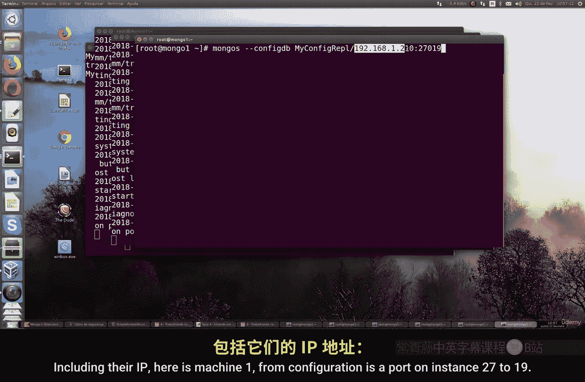
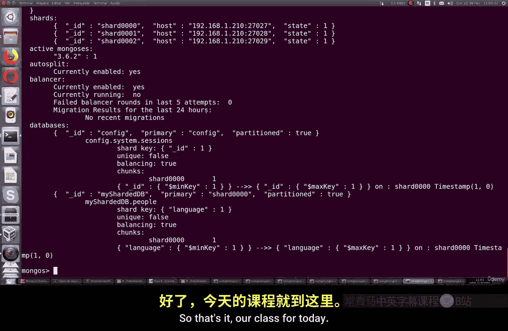

# 139：创建分片集群 🚀

在本节课中，我们将学习如何在 MongoDB 中创建一个分片集群。我们将从基本概念讲起，然后通过一个模拟多实例的实践步骤，演示如何在一台机器上搭建一个完整的分片集群环境。

## 概述

分片是 MongoDB 用于水平扩展数据库的一种技术，它将数据分布到多个服务器上。在生产环境中，这通常意味着使用多台独立的物理或虚拟机器。为了便于学习和测试，我们将在单台机器上通过启动多个 MongoDB 实例（监听不同端口）来模拟多机环境。

上一节我们介绍了分片集群的基本概念，本节中我们来看看如何一步步搭建它。

## 准备工作

在开始搭建之前，需要进行一些环境准备。

以下是需要完成的前置步骤：
1.  **禁用防火墙**：如果您的系统（如基于 Debian/Ubuntu 的 Linux）启用了防火墙，请确保允许 MongoDB 实例之间通信所需的端口，或临时禁用防火墙以进行测试。
2.  **创建数据目录**：我们需要为集群中的每个成员创建独立的数据存储目录。

## 搭建配置服务器

配置服务器存储着集群的元数据。我们首先启动它。

1.  为配置服务器创建数据目录，例如 `data/configdb`。
2.  在终端中，使用以下命令启动配置服务器实例，指定端口为 `27019`：
    ```bash
    mongod --configsvr --dbpath data/configdb --port 27019 --replSet configReplSet
    ```
3.  打开一个新的终端，连接到这个配置服务器实例：
    ```bash
    mongo --port 27019
    ```
4.  在 MongoDB Shell 中，初始化这个副本集作为配置服务器：
    ```javascript
    rs.initiate({_id: "configReplSet", configsvr: true, members: [{_id: 0, host: "localhost:27019"}]})
    ```
5.  使用 `rs.status()` 命令检查状态，确认其类型为 `configsvr`。

现在，我们的配置服务器已经准备就绪。

## 搭建分片服务器

分片服务器是实际存储数据的节点。我们将创建三个分片实例来模拟三个独立机器。



以下是创建三个分片服务器的步骤。每个实例都需要不同的端口和数据目录。

1.  **启动分片服务器 1**：
    ```bash
    mongod --shardsvr --dbpath data/shard1 --port 27027
    ```
2.  **启动分片服务器 2**：
    ```bash
    mongod --shardsvr --dbpath data/shard2 --port 27028
    ```
3.  **启动分片服务器 3**：
    ```bash
    mongod --shardsvr --dbpath data/shard3 --port 27029
    ```

请确保为每个命令打开独立的终端窗口，或者以后台方式运行。现在，三个分片服务器都在运行并等待连接。

## 启动并配置查询路由器

查询路由器是应用程序连接的人口，它负责将查询路由到正确的分片。我们将启动 `mongos` 进程。

1.  回到配置服务器所在的机器（或终端），启动 `mongos` 进程，并指定配置服务器的地址：
    ```bash
    mongos --configdb configReplSet/localhost:27019 --port 27017
    ```
    > **注意**：如果默认的 MongoDB 实例（端口 27017）正在运行，您需要先停止它，否则会出现端口冲突。

2.  打开一个新的终端，连接到这个 `mongos` 实例：
    ```bash
    mongo --port 27017
    ```
3.  在 `mongos` 的 Shell 中，依次将三个分片服务器添加到集群中：
    ```javascript
    sh.addShard("localhost:27027")
    sh.addShard("localhost:27028")
    sh.addShard("localhost:27029")
    ```
4.  使用 `sh.status()` 命令验证所有分片已成功添加。输出应显示三个分片及其状态。

## 启用分片并测试

集群搭建完成后，我们需要创建一个数据库和集合，并为其启用分片。

1.  在 `mongos` Shell 中，创建一个测试数据库 `shardDB` 和一个集合 `people`：
    ```javascript
    use shardDB
    db.createCollection("people")
    ```
2.  为数据库启用分片：
    ```javascript
    sh.enableSharding("shardDB")
    ```
3.  为 `people` 集合选择一个分片键（例如 `language` 字段）并基于此键对集合进行分片：
    ```javascript
    sh.shardCollection("shardDB.people", { "language": 1 })
    ```
4.  再次使用 `sh.status()` 查看，确认数据库和集合已处于分片状态。

## 导入数据并验证

最后，我们可以向已分片的集合中导入数据，并验证数据是否被正确分布。

1.  准备一个 CSV 格式的数据文件（例如 `people.csv`）。
2.  在终端中使用 `mongoimport` 命令将数据导入到分片集群中：
    ```bash
    mongoimport --port 27017 --db shardDB --collection people --type csv --file people.csv --headerline
    ```
3.  回到 `mongos` Shell，查询数据并查看执行计划，以确认查询被路由到了具体的分片：
    ```javascript
    db.people.find().explain()
    ```
    在输出结果中，您可以观察到 `shardName` 字段，它指明了数据来自哪个分片。
4.  执行 `sh.status()` 可以更清晰地看到数据在各个分片上的分布是否均衡。

## 总结

本节课中我们一起学习了 MongoDB 分片集群的搭建过程。我们从配置服务器开始，然后启动了多个分片服务器实例，接着通过 `mongos` 查询路由器将它们整合成一个集群，最后启用分片、导入数据并验证了分布效果。



请记住，本教程为学习目的在单机模拟。在实际生产环境中，您应将配置服务器、每个分片以及 `mongos` 路由器部署在独立的硬件或虚拟机上，并确保网络互通且防火墙规则允许相关端口通信。