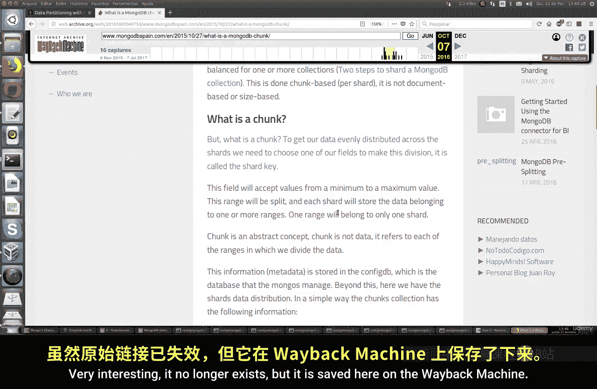
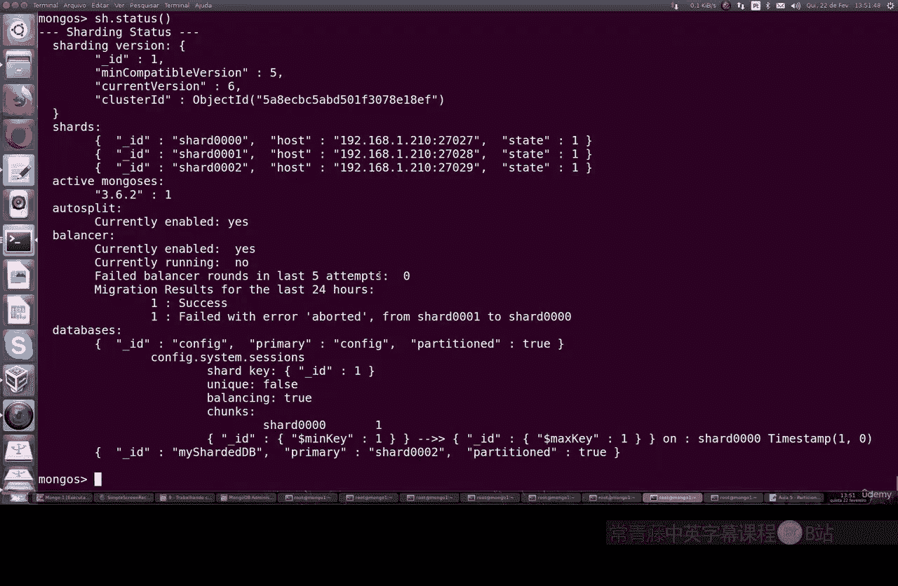

# 140：使用块进行数据分区 🧩

## 概述
在本节课中，我们将深入学习MongoDB分片集群中的核心概念——“块”。我们将探讨数据如何在多个服务器间被均匀分割，以及如何管理和操作这些数据块。

## 什么是数据块？
上一节我们介绍了MongoDB集群的基本概念，本节中我们来看看数据分区的具体单元——“块”。

块是MongoDB用于在分片服务器间均匀分配数据的逻辑单元。数据并非以单个文档为单位存储，而是被划分为多个连续的区间，每个区间称为一个“块”。

以下是关于块的核心要点：
*   块代表数据被分割后的每个区间。
*   每个块基于一个选定的字段（分片键）的值范围来定义。
*   每个块被分配并存储在一个特定的分片服务器上。

## 块的工作原理
理解了块的定义后，我们来看看它在集群中是如何运作的。

当我们为一个空集合启用分片时，MongoDB会创建一个初始块，并将其分配给该集合所属数据库的某个分片。分片键字段必须能够接受一个最小值和最大值，数据根据这些值形成的区间被分割。

例如，假设我们有一个基于`age`字段的分片集合。数据可能被这样划分：
*   **块1**：存储 `age` 在 `[最小值, 25)` 区间的文档，位于分片服务器 `shard0000`。
*   **块2**：存储 `age` 在 `[25, 75)` 区间的文档，位于分片服务器 `shard0001`。
*   **块3**：存储 `age` 在 `[75, 最大值]` 区间的文档，位于分片服务器 `shard0002`。

这种划分确保了数据在集群中的平衡分布。

## 实践：查看与管理数据块
理论部分已经介绍完毕，现在让我们通过实际操作来查看和管理数据块。

首先，我们进入MongoDB Shell，并切换到分片集群的环境。



```bash
# 连接到mongos路由实例
mongo --port 27017
```

接着，我们使用一个分片数据库并进行数据导入。

```bash
# 使用分片数据库
use sharedDB

# 删除并重新创建数据库（演示用）
db.dropDatabase()
sh.enableSharding("sharedDB")

# 导入示例数据到users集合
mongoimport --host localhost:27017 --db sharedDB --collection users --type csv --file mock_data2.csv --headerline
```

数据导入后，我们可以检查分片状态。

```bash
# 查看分片状态
sh.status()
```

命令输出会显示所有数据库的分片情况。对于我们的`sharedDB`数据库和`users`集合，可以看到类似以下信息：
*   集合`sharedDB.users`的分片键是`_id`。
*   列出了多个块（chunks），每个块关联一个分片服务器（如`shard0000`），并显示其键值范围（如`{ "_id" : { "$minKey" : 1 } }` 到 `{ "_id" : { "$maxKey" : 1 } }`）。
*   初始状态下，数据可能集中在一个分片上。

## 平衡器与块迁移
如果数据分布不均，MongoDB的平衡器会自动在后台迁移块，以实现集群的负载均衡。

我们可以手动触发或管理块迁移。例如，如果发现某个分片负载过高，可以将特定范围的块移动到其他分片。

以下是管理平衡器和块迁移的常用命令：

```bash
# 1. 检查平衡器状态
sh.getBalancerState()

# 2. 手动移动一个块
# 语法：sh.moveChunk(<namespace>, <query>, <destination>)
sh.moveChunk("sharedDB.users", { age: 50 }, "shard0001")

# 3. 停止平衡器（在进行维护时）
sh.stopBalancer()

# 4. 重新启动平衡器
sh.startBalancer()
```

执行`sh.status()`可以再次查看状态，确认块是否已按预期迁移，以及集群是否恢复平衡（`"balanced" : true`）。输出还会显示最近24小时内是否有迁移错误或活动。



## 总结
本节课中我们一起学习了MongoDB分片集群中“块”的核心概念与实践操作。我们了解到块是数据分区的基本单位，基于分片键的值范围定义，并分布在不同的分片服务器上。通过`sh.status()`命令，我们可以监控数据分布和集群平衡状态。同时，我们也学习了如何使用平衡器以及手动命令来管理块的迁移，从而优化集群性能和存储分布。掌握这些知识对于管理和维护一个高效的MongoDB分片集群至关重要。