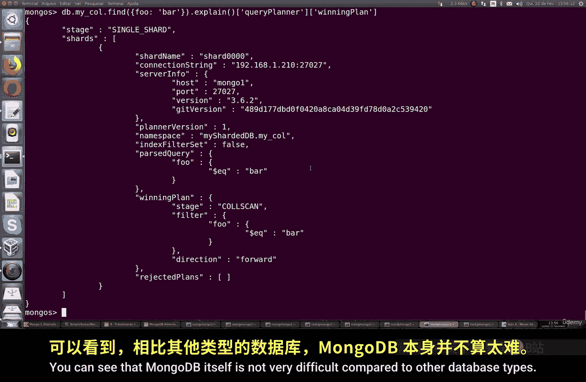

# 141：将非分片数据迁移到分片数据库 🚚

在本节课中，我们将学习如何将非分片集合中的数据迁移到已配置好的分片集群中。这个过程对于整合现有数据到分片环境、优化数据分布和提升性能至关重要。

## 概述

上一节我们介绍了MongoDB分片集群的搭建。本节中，我们来看看如何将已经存在于非分片环境（即未启用分片的集合）中的数据，迁移并整合到分片集群中，使其能够享受分片带来的负载均衡和扩展性优势。

## 前提条件

开始本教程前，你需要确保已经完成以下步骤：
*   已经成功创建并运行着一个MongoDB分片集群。
*   分片集群的各个服务器运行正常。

你可以通过 `sh.status()` 命令来验证集群状态。如下图所示，我的环境中运行着三个分片服务器和一个配置服务器，共计四个服务器实例。


## 操作步骤

以下是迁移非分片集合到分片集群的具体步骤。

### 1. 连接到MongoDB Shell

首先，你需要使用 `mongosh` 连接到你的MongoDB路由服务器（`mongos`）。

### 2. 创建或定位非分片集合

我们将在 `testDB` 数据库中操作。你可以创建一个新的集合，或使用一个已有的、尚未启用分片的集合。
```javascript
use testDB
db.myCollection.insertOne({ name: "示例数据" })
```
执行 `sh.status()` 命令，可以查看当前集群的分片状态。你会发现 `testDB.myCollection` 这个集合目前可能位于某个特定的分片上（例如 `shard002`），并且其 `sharded` 状态为 `false`，表明它尚未被分片。


### 3. 对数据库启用分片

要对一个集合进行分片，必须先对其所属的数据库启用分片功能。切换到 `admin` 数据库并执行以下命令：
```javascript
use admin
db.adminCommand({ enableSharding: "testDB" })
```
此命令会返回 `{ "ok" : 1 }` 表示成功。

### 4. 对目标集合启用分片

现在，我们可以对具体的集合启用分片。你需要选择一个分片键。分片键的选择非常重要，它决定了数据在集群中的分布方式。这里我们以 `_id` 字段为例：
```javascript
db.adminCommand({ shardCollection: "testDB.myCollection", key: { _id: "hashed" } })
```
这条命令的含义是：对数据库 `testDB` 中的集合 `myCollection` 启用分片，并指定 `_id` 字段的哈希值作为分片键。

### 5. 验证迁移结果

命令执行成功后，再次运行 `sh.status()` 来查看变化。
*   你会发现 `testDB.myCollection` 的 `sharded` 状态现在变为 `true`。
*   集合的数据会根据分片键自动平衡并分布到各个分片上（例如从原来的 `shard002` 分散到 `shard000` 等多个分片）。

这个过程由MongoDB的平衡器自动完成。它将一个未平衡的集合，迁移并整合到一个已平衡的分片环境中。

## 总结




本节课中，我们一起学习了将非分片数据迁移到MongoDB分片集群的完整流程。关键步骤包括：验证集群状态、对目标数据库启用分片、选择合适的分片键并对集合启用分片。通过此操作，你可以将原本孤立的数据纳入分片管理体系，从而获得更好的连接稳定性、读写性能以及横向扩展能力。MongoDB的这套分片机制，相较于其他数据库，提供了清晰且相对简单的横向扩展方案。