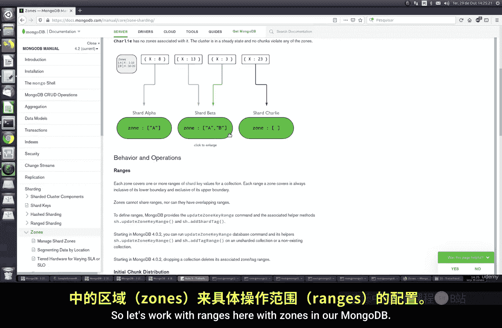
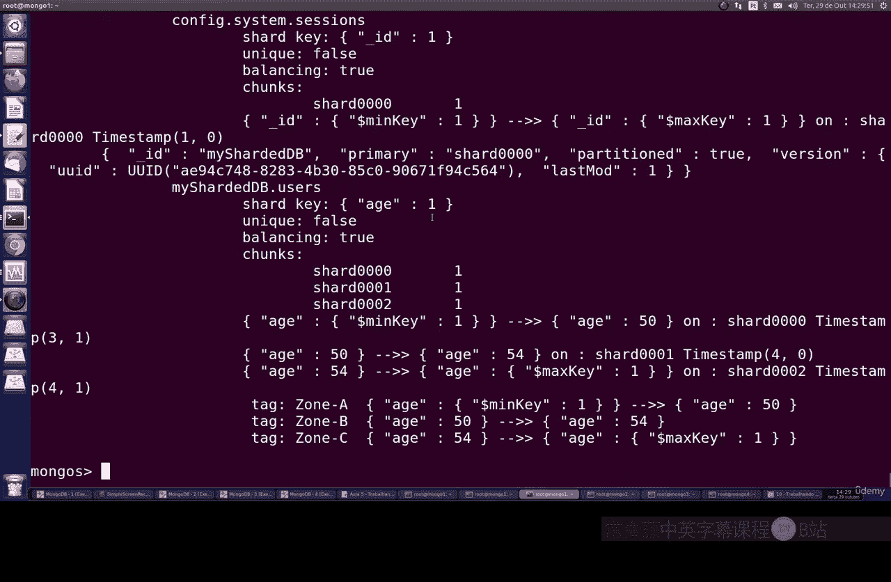

# 142：使用分片区域 🗺️

在本节课中，我们将学习如何在MongoDB分片集群中配置和使用“区域”。区域是一种高级配置，它允许我们根据文档的特定字段值（如年龄或地理位置），将数据读写操作定向到集群中指定的分片上。这对于优化数据分布、降低延迟或满足地理合规性要求非常有用。

上一节我们介绍了分片集群的基本概念和块的管理，本节中我们来看看如何通过区域来更精细地控制数据分布。

## 什么是分片区域？

在MongoDB中，区域配置本质上是一种基于标签的数据分布策略。它将分片集群中的分片与一个或多个“区域”标签关联起来。然后，我们可以定义一些规则，指定具有特定字段值范围的文档属于哪个区域。最终，属于某个区域的所有文档的读写操作，都会在其对应的分片上执行。

例如，我们可以定义一个区域规则：所有`age`字段值在0到10之间的文档属于“Zone A”。那么，这些文档就会被存储在标记为“Zone A”的分片上。这种机制可以用于多种场景：
*   **地理分布式应用**：确保用户的数据存储在离他们地理位置更近的分片上，以降低访问延迟。
*   **混合硬件架构**：将需要低延迟访问的“热数据”分配到高性能硬件（SSD）的分片上（高层），而将“冷数据”分配到成本更低、延迟稍高的硬件（HDD）的分片上（低层）。

## 如何配置分片区域？

为了更好地理解，让我们通过一个具体的例子来演示如何为分片配置区域。假设我们有一个基于`age`字段进行分片的集合，并且有三个分片：`shard000`、`shard001`和`shard002`。

### 第一步：为分片添加区域标签

首先，我们需要为每个分片打上代表其所属区域的标签。



以下是添加区域标签的命令：

```bash
# 为分片 shard000 添加标签 “ZoneA”
sh.addShardTag("shard000", "ZoneA")

# 为分片 shard001 添加标签 “ZoneB”
sh.addShardTag("shard001", "ZoneB")

# 为分片 shard002 添加标签 “ZoneC”
sh.addShardTag("shard002", "ZoneC")
```

执行后，我们可以通过 `sh.status()` 命令查看状态，确认每个分片都已正确标记其所属区域。

### 第二步：定义区域范围规则

接下来，我们需要定义分片键（这里是`age`字段）的值范围与区域标签之间的映射关系。这告诉MongoDB，哪些数据应该去到哪个区域。

以下是添加区域范围规则的命令：

```bash
# 规则1：age值在 [1, 50) 区间的文档属于 ZoneA
sh.addTagRange(
  "数据库名.集合名",
  { "age": 1 },
  { "age": 50 },
  "ZoneA"
)

# 规则2：age值在 [50, 54) 区间的文档属于 ZoneB
sh.addTagRange(
  "数据库名.集合名",
  { "age": 50 },
  { "age": 54 },
  "ZoneB"
)

# 规则3：age值在 [54, MaxKey) 区间的文档属于 ZoneC
# MaxKey 表示最大值
sh.addTagRange(
  "数据库名.集合名",
  { "age": 54 },
  { "age": MaxKey },
  "ZoneC"
)
```

**关键点说明：**
*   `{ “age”: 1 }` 表示范围的起始值（包含）。
*   `{ “age”: 50 }` 表示范围的结束值（不包含）。因此，`[1, 50)` 表示包含1，但不包含50。
*   `MaxKey` 是一个特殊值，代表分片键可能的最大值。

### 第三步：验证配置结果

配置完成后，再次运行 `sh.status()`。你将在输出中看到清晰的分片标签信息以及已定义的区域范围规则。平衡器会根据这些规则，自动将现有的数据块移动到正确的分片上，并确保新插入的数据也遵循这些分布规则。

## 配置的灵活性与高级用法

区域配置非常灵活，一个分片可以属于多个区域，一个区域也可以包含多个分片。

例如，你可以进行如下配置：
*   让 `shard000` 同时属于 `ZoneA` 和 `ZoneB`。这样，`ZoneA` 和 `ZoneB` 的数据都可能存储在这个分片上，平衡器会在它们之间进行负载均衡。
*   这对于创建冗余、实现更复杂的数据分布策略（如主-从热备区域）非常有用。

你可以根据应用程序的实际需求，反复调整标签和范围规则，直到集群的数据分布达到最佳状态。

---

本节课中我们一起学习了MongoDB分片集群中的区域功能。我们了解了区域的概念，它如何通过标签和范围规则将数据定向到特定分片，并逐步实践了为分片添加标签、定义区域范围的全过程。通过合理使用区域，你可以构建一个更智能、性能更优且符合业务需求的分布式数据库架构。



如有疑问，请在课程论坛中提出。