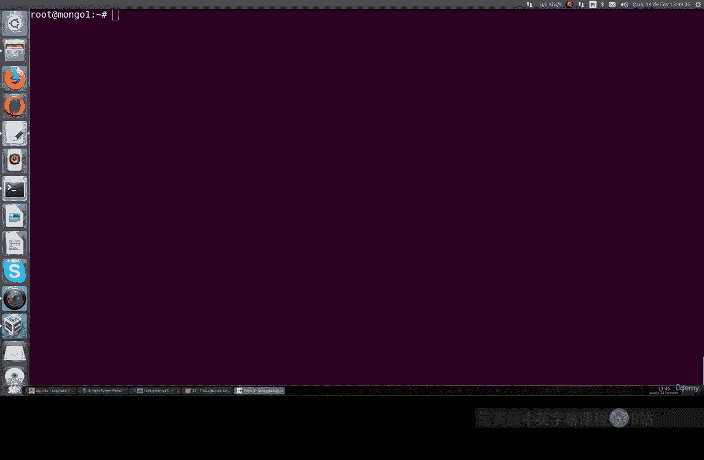
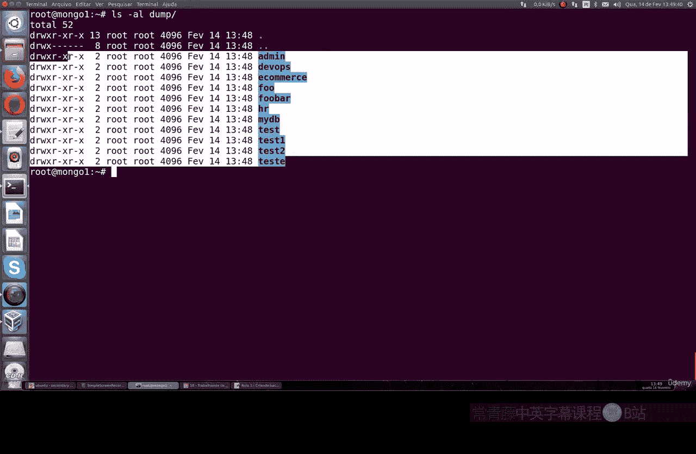
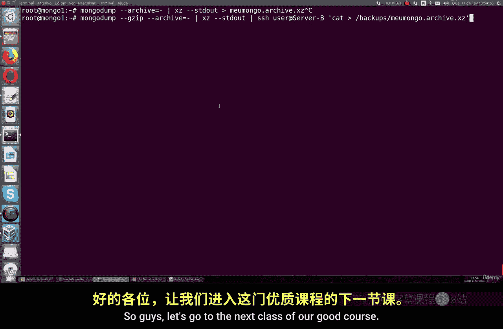

# 143：使用mongodump创建备份 📂

在本节课中，我们将学习如何使用 `mongodump` 工具为MongoDB数据库创建备份。这是一个基础但至关重要的操作，能帮助我们安全地保存所有数据库、集合和文档。

## 概述


`mongodump` 是一个命令行工具，功能类似于MySQL的 `mysqldump`。它可以为MongoDB实例创建完整的逻辑备份。本节将指导你完成创建备份目录、执行备份、查看备份内容以及使用压缩选项来节省存储空间的完整流程。

## 创建备份目录

首先，为了有条理地管理备份文件，我们创建一个专用的备份目录。你可以选择任何位置，但为了示例清晰，我们将在Linux的根目录下创建。

运行以下命令：
```bash
mkdir /backups
```
这个命令在根目录下创建了一个名为 `backups` 的文件夹。你可以根据自己的喜好选择其他目录，这不是强制要求。

## 执行完整备份





创建好目录后，就可以运行 `mongodump` 命令来备份整个MongoDB实例了。

基本的备份命令如下：
```bash
mongodump --out /backups
```
这个命令会将所有数据库、集合和文档备份到 `/backups` 目录中。

**重要提示**：如果你的MongoDB实例启用了身份验证（需要用户名和密码），你需要在命令中指定凭据。请使用你的管理员（admin）用户名和密码。
```bash
mongodump --username <你的用户名> --password <你的密码> --authenticationDatabase admin --out /backups
```
命令执行成功后，`mongodump` 会显示已保存的文档数量、索引等信息。所有操作都由MongoDB自动完成，过程非常简单。

## 查看备份内容

备份完成后，我们可以进入备份目录查看生成的文件。

使用 `cd` 命令进入目录并列出内容：
```bash
cd /backups
ls -la
```
这个 `ls -la` 命令会显示所有备份的数据库文件夹，以及它们的详细权限信息（所有者、组、读写执行权限）。检查这些权限对于确保备份安全非常重要。

如果你想查看某个特定数据库（例如 `test` 数据库）的备份详情，可以使用：
```bash
ls -lh /backups/test
```
这个命令会以人类可读的格式（如KB、MB）显示 `test` 数据库中所有集合的备份文件。这些文件是BSON（二进制JSON）格式，并会显示每个文件的大小。

## 使用压缩备份以节省空间

默认的备份可能会占用较多磁盘空间，特别是对于大型数据库。`mongodump` 支持使用 `--gzip` 选项进行压缩。

以下是创建压缩备份的命令：
```bash
mongodump --gzip --out /backups
```
压缩过程需要更多的CPU处理时间，因此执行速度会比未压缩的备份慢一些，但这能显著减少备份文件占用的硬盘空间。压缩后，你可以再次使用 `ls -lh` 命令对比文件大小，会发现文件体积大幅减小。

## 高级用法与技巧

除了完整备份，`mongodump` 还支持许多有用的选项：

以下是几个常用示例：
*   **备份单个数据库**：使用 `--db` 选项指定数据库名。
    ```bash
    mongodump --db myDatabase --out /backups
    ```
*   **备份到压缩归档文件**：结合 `--archive` 和 `--gzip` 选项，将备份输出到单个压缩文件。
    ```bash
    mongodump --archive=/backups/myBackup.gz --gzip
    ```
*   **通过SSH将备份直接发送到远程服务器**：这需要预先设置好SSH密钥认证。
    ```bash
    mongodump --archive --gzip | ssh user@remote-server “cat > /remote/backup.gz”
    ```
    压缩文件在需要通过网络传输备份时尤其有用，虽然会消耗更多处理资源，但能节省带宽和存储空间。

## 总结



本节课我们一起学习了MongoDB备份的基础知识。我们介绍了如何使用 `mongodump` 工具创建完整备份，如何查看和管理备份文件，以及如何使用压缩功能来优化存储空间。掌握这些基础操作是确保数据安全的第一步。在后续课程中，我们将探讨更详细的备份策略和恢复方法。